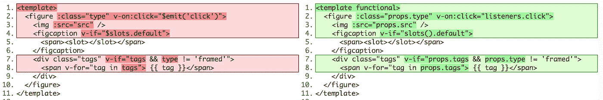

# Vue.js 中的功能组件是怎么处理的？

> 原文：<https://itnext.io/whats-the-deal-with-functional-components-in-vue-js-513a31eb72b0?source=collection_archive---------1----------------------->

## 弄清楚 Vue.js 功能组件的内容、原因、时间和方式。

我花了几天时间试图理解 Vue.js 中的功能组件。也许对于具有 React 或 Angular 背景的人来说，它们是一种熟悉的模式，但我发现即使是一些基本问题的答案，例如:

*   什么是功能组件？
*   我为什么要在乎？
*   我应该什么时候使用它们？

有点难以捉摸。所以，我花了很多时间在 Vue 文档的这个页面和其他一些分散的资源上，以弄清事情的真相。

# 什么是功能组件？

我最初被这个名字吸引住了:“**功能性**组件。”我天真地认为这听起来像是一个用来做某事的组件，而不是 UI 的一部分。虽然这是功能组件的一种类型(委托或修饰其他组件的“高级组件”或“包装组件”)，但还有另一种更简单的类型:哑组件。我称它们是哑的，因为它们没有自己的数据(它们是*无状态*)，也没有自己的方法，甚至没有实例(意思是没有`this`，也没有生命周期)。

# 我为什么要在乎？

使用功能组件，您可以获得组件的组织性、干燥的好处，而没有 Vue 的反应系统的开销。这可以提高你的应用程序的性能。

# 什么时候应该使用功能组件？

任何时候你的应用程序不需要自己的反应数据，也不需要拥有任何方法，但是你仍然想要一个组件提供的可重用的、隔离的代码块的便利，考虑一个功能组件。

所以，在回答了这些基本问题之后，我开始了一个更复杂的问题:

# 我如何构建功能组件？

为了深入了解这一点，我决定以 4 种不同的方式构建相同的组件:

*   标准的普通单文件组件(SFC)
*   用渲染函数(RF)而不是模板构建的标准组件
*   用渲染函数构建的功能组件
*   一个功能单一的文件组件(在模板上使用`functional`关键字)

我的示例有些做作，目的是探索各种常见组件功能，包括:

*   触发事件
*   使用插槽
*   使用道具
*   带 v-if 和 v-for 的逻辑

每个组件将:

*   输出一个包含一个`img`和一个`figcaption`以及一组标签的`figure`。
*   接受一个“类型”属性，它将决定一个类/样式和不同的标记。
*   发出 click 事件，该事件将触发组件节点上指定的方法。

[最终结果看起来像这样](http://norabrowndesign.com/vue/functional/):

下面是 App.vue 文件的代码:

它非常标准，包括:

1.  使用 4 个组件中每一个组件的模板
2.  一个脚本块，它导入组件，并用这些组件和一些方法实例化 App Vue 实例
3.  一个样式块(我在样式上走得太远了，参见 Github 上的[完整源代码)。)](https://github.com/nabrown/vue-functional-examples/blob/master/src/App.vue)

## 首先:一个标准的单个文件组件

组件的第一个版本是标准的[单文件组件](https://vuejs.org/v2/guide/single-file-components.html):

第一个版本是标准的单个文件组件

我们正在指定我们想要的标记，并使用我们传入的属性，我们已经定义了一些验证。唯一值得注意的是使用`v-on:click="$emit('click’)"`来发出一个点击事件(因为我们希望被触发的方法存在于 App 组件上，而不是这个子组件上)，并使用`v-if="$slots.default"`来检测是否有任何东西(在我们的例子中，是一个标题)被传递来填充默认槽([参见](https://vuejs.org/v2/api/#vm-slots) `[vm.$slots](https://vuejs.org/v2/api/#vm-slots)` [文档](https://vuejs.org/v2/api/#vm-slots))。如果不是，我们不显示包装默认槽的`figcaption`标记。

## 接下来:使用渲染函数的标准组件

下一种方法是使用渲染函数而不是模板的标准组件。

虽然功能组件和渲染功能的概念实际上是完全分开的，但它们在 Vue.js 文档中是紧密相关的(功能组件的解释嵌套在[‘渲染功能&JSX’页面](https://vuejs.org/v2/guide/render-function.html)中)，我在那里看到的功能组件与传统模板的例子非常少。所以，我们最好也弄清楚渲染函数。

代码如下:

第二个版本，使用渲染函数的标准组件

最大的变化显然是模板不见了，取而代之的是一个渲染属性。它的值是`render(createElement){}`函数。`createElement`是我们可以在 render 函数中使用的函数，用来构建虚拟 DOM 节点树(VNodes ),最终由 Vue 添加到实际的 DOM 中。

`[createElement](https://vuejs.org/v2/guide/render-function.html#createElement-Arguments)` [函数有 3 个参数](https://vuejs.org/v2/guide/render-function.html#createElement-Arguments):

1.  要创建的 html 元素的字符串
2.  一个`data`对象，指定 VNode 的所有不同属性
3.  以及将由创建的元素包装的字符串数组(用于文本节点)或其他 VNodes。

你可以在上面的渲染函数中看到，创建一棵相对较小的树也是一个非常痛苦的过程。在本例中，我们:

1.  创建`img`元素
2.  如果缺省槽中有内容，则创建`figcaption`元素
3.  如果标签作为属性传递，则创建标签标记
4.  将上述所有内容以数组形式作为第三个参数传递给我们对`createElement`的最后一个调用，该调用返回包装`figure`元素的 VNode。

咻。

因为这只是一个标准组件，它有一个实例，我们可以使用`this`来访问我们的`props`和`$slots`。为了从我们的模板中实现`v-if`的行为，我们手动检查`this.$slots.default`，如果它不存在就返回一个空字符串。我们在模板中使用了`v-for`，这里我们使用`Array.map`为每个标签返回一个单独的`span` VNode。*累死人*，老实说。

您可以使用 JSX 重新引入类似模板的语法，这看起来有点疯狂，但在某些情况下可能是有意义的。

## 第三:使用渲染函数的功能组件

第三个版本是我们的第一个功能组件，您可以通过`functional: true`属性看出:

第三个版本，使用渲染函数的功能组件

这个组件还使用了一个 render 函数，它看起来与前一个类似，但是有一些重要的区别。我们不使用`this`，而是使用提供给渲染函数的第二个参数`context`。使用[对象析构](https://developer.mozilla.org/en-US/docs/Web/JavaScript/Reference/Operators/Destructuring_assignment#Unpacking_fields_from_objects_passed_as_function_parameter)，我们从`context`对象中取出我们需要的属性:`props`、`listeners`和`slots`。

`Slots`是一个函数，它返回一个带有不同插槽的对象，所以之前我们使用了`$slots.default`，现在我们可以使用`slots().default`。

关于`context`对象的两个属性，有一些深奥的东西需要注意。一、`children`和`slots()`给你类似，但略有不同的东西。[在这里阅读区别](https://vuejs.org/v2/guide/render-function.html#slots-vs-children)。二、`listeners`是`data.on`的别名。

## 最后的最佳:一个功能性的单文件组件

最后一个版本也是一个单文件组件，但是这次使用了`functional`关键字。这是最难挖掘信息的一个，但最终。文档中提到了`functional`关键字，但只是顺便提及，没有太多细节(太不符合角色性格了！).在 vue-loader 文档中有这个诱人的片段。

将其与第一个标准组件版本进行比较:

上一个版本是一个功能性的单文件组件

以下是并列的主要区别:

左边是标准单文件组件，右边是功能性单文件组件。

差异的产生是因为功能组件的无实例性。没有实例，我们就不能简单地使用我们的专有名称，或`$slots`，这是一个实例属性。但是，和上面的版本 3 一样，我们可以访问 render `context`对象，正如我们之前看到的，它有一个`props`对象、一个`listeners`对象和一个`slots()`函数。

对于大多数哑组件，这种语法可能是最容易编写和理解的。您仍然有一个相当简单的、类似 html 的模板，如果稍微详细一点的话，并且顶部的`functional`关键字立刻标识了这个组件。因此，您可以获得单个文件组件的优势，而没有成熟的 Vue 组件的开销。#胜利。

# 结论

事实证明，我一直在开发的应用程序充满了愚蠢组件的候选:小但经常重复的部分，如按钮、表单输入、徽章。对于任何您希望可重用但不需要自己的反应数据的部分，带有`functional`关键字的 sfc 是一个不错的选择。使用功能组件可以提高应用程序的性能，将它们编写为单个文件组件可以使它们易于阅读，并与其他组件更加一致。

但是，如果您需要的控制级别在普通模板中是不可用的(或者更有可能是非常冗长的)，那么 render 函数可能是解决方案。我见过的大多数例子都涉及基于大量条件逻辑的 html 输出，这将是重复的，很难以模板形式阅读。

**思想？**留下善意的评论。既然你已经走了这么远，不如鼓掌一两下吧？

## 有用的链接

*   [Github 上的所有代码](https://github.com/nabrown/vue-functional-examples)
*   [最终结果](http://norabrowndesign.com/vue/functional/)
*   [Dan Aprahamian 关于渲染功能的视频](https://www.youtube.com/watch?v=KS4eizPXRCQ)。
*   [埃里克·汉切特的另一封信](https://www.youtube.com/watch?v=8vp5OXcbM34)
*   [在 Vue.js 上渲染函数](https://vuejs.org/v2/guide/render-function.html)
*   [vue . js 上的功能组件](https://vuejs.org/v2/guide/render-function.html#Functional-Components)(同上)
*   [关于功能组件的 Alligator.io 文章](https://alligator.io/vuejs/functional-components/)