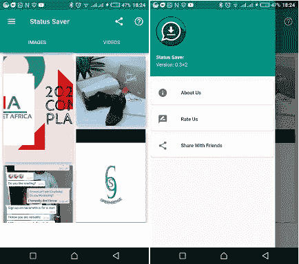

# 使用 Flutter 的 WhatsApp 状态保护程序/下载器

> 原文：<https://itnext.io/whatsapp-status-saver-downloader-using-flutter-ff5ff897e56?source=collection_archive---------2----------------------->

## 你好，今天我将带你了解如何在没有任何额外知识的情况下使用 Flutter 创建一个 WhatsApp 状态保护程序。


对于那些需要完整代码并且对阅读整篇文章不感兴趣的人来说，Github repo 的链接在本文的底部。

所以最近一直在学习 flutter，决定分享一下这个。我假设你知道关于颤振的基本知识，但最终，我们都是学习者。

# 文件结构

```
Lib
    -ui
	  - aboutScreen.dart
	  - dashboard.dart
	  - imageScreen.dart
	  - mydrawer.dart
	  - settingScreen.dart
	  - videoScreen.dart
	  - viewphotos.dart
    -utils
	  - video_controller.dart
	  - video_play.dart
    -main.dart
```

使用的插件:

```
Plugins
share: // to handle sharing of application
url_launcher: // to open links from the app
permission_handler: // to handle storage permissions
flutter_staggered_grid_view: // to display images in a grid 
path_provider: // to get path from storage device
image_gallery_saver: // save images to gallery
flutter_fab_dialer: // floating action button dialer
thumbnails:
chewie:
video_player:
```

上面已经提到了使用的插件。您可以在 pubspec.yaml 文件中看到所有插件。现在，我将把 pubspec.yaml 文件放在这里。

```
name: wa_status_saver
description: A new Flutter application.

environment:
  sdk: ">=2.1.0 <3.0.0"

dependencies:
  flutter:
    sdk: fluttercupertino_icons: ^0.1.2
  share: ^0.6.3+5
  url_launcher: ^5.4.1
  permission_handler: ^4.0.0
  flutter_staggered_grid_view: ^0.3.0
  path_provider: ^1.5.1
  image_gallery_saver: ^1.2.2
  flutter_html: ^0.11.1
  flutter_fab_dialer: ^0.1.1
  esys_flutter_share: ^1.0.2
  thumbnails: ^1.0.1
  chewie: ^0.9.8+1
  video_player: ^0.10.5+1

dev_dependencies:
  flutter_test:
    sdk: flutter
  flutter_launcher_icons: ^0.7.4

flutter_icons:
  android: "launcher_icon"
  ios: true
  image_path: "assets/images/logo.png"
 *# The following section is specific to Flutter.* flutter:uses-material-design: true
assets:
   - assets/images/logo.png
   - assets/images/video_loader.gif
```

应用程序是如何工作的？

查看上面的截图，更好地了解应用程序的外观。



android 设备上的应用外观

```
A user opens the application and has to grant the app access to storage of the device after which app is triggered.
-**Dashboard**
  -Photo Status
    - List of WhatsApp Photo Status from user device.
      - View Specific photo (on click)
        - Download Photo. 
  -Video Status
    - List of WhatsApp Video Status from user device.
      - View Specific Video (on click)
        - Download Video.
        - Play Video.
**-Navigation Drawer** -About us 
  -Share with Friends
  -Rate and Review
```

所以我们来看代码。这个故事似乎很无聊，对吗？

首先，我们需要用户设备文件存储的权限，以便访问保存所有状态的 WhatsApp 目录。状态保存在一个隐藏的目录中(。这就是为什么状态似乎没有出现在文件管理器中。

我们将使用 permission_handler 插件从用户那里获得存储权限。我将在 main.dart 文件中添加权限代码，因为我想在用户第一次打开应用程序时向他请求权限。

main . dart[代码已用 dartfmt 格式化，以便于阅读]

```
import 'package:flutter/material.dart';
import 'package:wa_status_saver/ui/dashboard.dart';
import 'package:wa_status_saver/ui/mydrawer.dart';
import 'package:share/share.dart';
import 'package:permission_handler/permission_handler.dart';
import 'package:flutter_html/flutter_html.dart';

final GlobalKey<ScaffoldState> _scaffoldKey = new GlobalKey<ScaffoldState>();

void main() {
  runApp(new MaterialApp(
    debugShowCheckedModeBanner: false,
    home: new MyApp(),
  ));
}

class MyApp extends StatefulWidget {
  @override
  MyAppState createState() => new MyAppState();
}

class MyAppState extends State<MyApp> {
  int _storagePermissionCheck;
  Future<int> _storagePermissionChecker;

  Future<int> checkStoragePermission() async {
    // bool result = await SimplePermissions.checkPermission(Permission.ReadExternalStorage);
    PermissionStatus result = await PermissionHandler()
        .checkPermissionStatus(PermissionGroup.*storage*);
    print("Checking Storage Permission " + result.toString());
    setState(() {
      _storagePermissionCheck = 1;
    });
    if (result.toString() == 'PermissionStatus.denied') {
      return 0;
    } else if (result.toString() == 'PermissionStatus.granted') {
      return 1;
    } else {
      return 0;
    }
  }

  Future<int> requestStoragePermission() async {
    // PermissionStatus result = await SimplePermissions.requestPermission(Permission.ReadExternalStorage);
    Map<PermissionGroup, PermissionStatus> result =
        await PermissionHandler().requestPermissions([PermissionGroup.*storage*]);
    if (result.toString() == 'PermissionStatus.denied') {
      return 1;
    } else if (result.toString() == 'PermissionStatus.granted') {
      return 2;
    } else {
      return 1;
    }
  }

  @override
  void initState() {
    super.initState();
    _storagePermissionChecker = (() async {
      int storagePermissionCheckInt;
      int finalPermission;

      print("Initial Values of $_storagePermissionCheck");
      if (_storagePermissionCheck == null || _storagePermissionCheck == 0) {
        _storagePermissionCheck = await checkStoragePermission();
      } else {
        _storagePermissionCheck = 1;
      }
      if (_storagePermissionCheck == 1) {
        storagePermissionCheckInt = 1;
      } else {
        storagePermissionCheckInt = 0;
      }

      if (storagePermissionCheckInt == 1) {
        finalPermission = 1;
      } else {
        finalPermission = 0;
      }

      return finalPermission;
    })();
  }

  @override
  Widget build(BuildContext context) {
    return MaterialApp(
      debugShowCheckedModeBanner: false,
      title: 'Savvy',
      theme: ThemeData(
        brightness: Brightness.light,
        primaryColor: Colors.*teal*,
      ),
      home: DefaultTabController(
        length: 2,
        child: FutureBuilder(
          future: _storagePermissionChecker,
          builder: (context, status) {
            if (status.connectionState == ConnectionState.done) {
              if (status.hasData) {
                if (status.data == 1) {
                  return MyHome();
                } else {
                  return Scaffold(
                    body: Container(
                      decoration: BoxDecoration(
                          gradient: LinearGradient(
                        begin: Alignment.*bottomLeft*,
                        end: Alignment.*topRight*,
                        colors: [
                          Colors.*lightBlue*[100],
                          Colors.*lightBlue*[200],
                          Colors.*lightBlue*[300],
                          Colors.*lightBlue*[200],
                          Colors.*lightBlue*[100],
                        ],
                      )),
                      child: Center(
                        child: Column(
                          mainAxisAlignment: MainAxisAlignment.center,
                          crossAxisAlignment: CrossAxisAlignment.center,
                          children: [
                            Padding(
                              padding: const EdgeInsets.all(20.0),
                              child: Text(
                                "Storage Permission Required",
                                style: TextStyle(fontSize: 20.0),
                              ),
                            ),
                            FlatButton(
                              padding: EdgeInsets.all(15.0),
                              child: Text(
                                "Allow Storage Permission",
                                style: TextStyle(fontSize: 20.0),
                              ),
                              color: Colors.*indigo*,
                              textColor: Colors.*white*,
                              onPressed: () {
                                setState(() {
                                  _storagePermissionChecker =
                                      requestStoragePermission();
                                });
                              },
                            )
                          ],
                        ),
                      ),
                    ),
                  );
                }
              } else {
                return Scaffold(
                  body: Container(
                    decoration: BoxDecoration(
                        gradient: LinearGradient(
                      begin: Alignment.*bottomLeft*,
                      end: Alignment.*topRight*,
                      colors: [
                        Colors.*lightBlue*[100],
                        Colors.*lightBlue*[200],
                        Colors.*lightBlue*[300],
                        Colors.*lightBlue*[200],
                        Colors.*lightBlue*[100],
                      ],
                    )),
                    child: Center(
                      child: Column(
                        mainAxisAlignment: MainAxisAlignment.center,
                        crossAxisAlignment: CrossAxisAlignment.center,
                        children: [
                          Padding(
                            padding: const EdgeInsets.all(20.0),
                            child: Text(
                              "Something went wrong.. Please uninstall and Install Again.",
                              style: TextStyle(fontSize: 20.0),
                            ),
                          ),
                        ],
                      ),
                    ),
                  ),
                );
              }
            } else {
              return Scaffold(
                body: Container(
                  child: Center(
                    child: CircularProgressIndicator(),
                  ),
                ),
              );
            }
          },
        ),
      ),
    );
  }
}

class MyHome extends StatefulWidget {
  @override
  _MyHomeState createState() => _MyHomeState();
}

class _MyHomeState extends State<MyHome> {
  var html =
      "<h3><b>How To Use?</b></h3><p>- Check the Desired Status/Story...</p><p>- Come Back to App, Click on any Image or Video to View...</p><p>- Click the Save Button...<br />The Image/Video is Instantly saved to your Galery :)</p><p>- You can also Use Multiple Saving. [to do]</p>";

  @override
  Widget build(BuildContext context) {
    return Scaffold(
      key: _scaffoldKey,
      appBar: AppBar(
        leading: IconButton(
            icon: Icon(Icons.*menu*),
            onPressed: () => _scaffoldKey.currentState.openDrawer()),
        title: Text('Status Saver'),
        backgroundColor: Colors.*teal*,
        actions: <Widget>[
          IconButton(
              icon: Icon(Icons.*share*),
              onPressed: () {
                Share.*share*(
                    'check out my wa status downloader https://github.com/mastersam07/wa_status_saver',
                    subject: 'Look what I made!');
              }),
          IconButton(
              icon: Icon(Icons.*help_outline*),
              onPressed: () {
                showDialog(
                    context: context,
                    builder: (BuildContext context) {
                      return Dialog(
                        child: Container(
                          height: 400,
                          child: Padding(
                            padding: const EdgeInsets.all(12.0),
                            child: Column(
                              mainAxisAlignment: MainAxisAlignment.start,
                              crossAxisAlignment: CrossAxisAlignment.start,
                              children: [
                                Html(data: html),
                                Expanded(
                                  child: new Align(
                                    alignment: Alignment.*bottomRight*,
                                    child: FlatButton(
                                      child: Text(
                                        'OK!',
                                        style: TextStyle(color: Colors.*green*),
                                      ),
                                      onPressed: () {
                                        Navigator.*of*(context).pop();
                                      },
                                    ),
                                  ),
                                ),
                              ],
                            ),
                          ),
                        ),
                      );
                    });
              })
        ],
        bottom: TabBar(tabs: [
          Container(
            height: 30.0,
            child: Text(
              'IMAGES',
            ),
          ),
          Container(
            height: 30.0,
            child: Text(
              'VIDEOS',
            ),
          ),
        ]),
      ),
      body: Dashboard(),
      backgroundColor: Colors.*white*,
      drawer: Drawer(
        child: MyNavigationDrawer(),
      ),
    );
  }
}
```

代码组织良好，易于阅读。很容易看到 checkStoragePermission()用于检查存储权限，而 requestStoragePermission()用于向用户请求存储权限。

逻辑很简单。我们检查许可是否被授予。如果许可没有被授予，那么我们请求它。当我们现在拥有存储权限时，我们只是运行 MyHome()来触发一个带有一些 appBar 的 Scaffold，Dashboard()是位于 ui/dashboard.dart 文件内的主体，以及一个位于 ui/mydrawer.dart 文件内的 drawer MyNavigationDrawer()。

我们继续到仪表板，它是 ui/dashboard.dart 文件。这很简单，因为它在选项卡式视图中调用 image screen(ui/image screen . dart 文件)和 video screen(ui/video screen . dart 文件)。

```
import 'package:flutter/material.dart';
import 'package:wa_status_saver/ui/imageScreen.dart';
import 'package:wa_status_saver/ui/videoScreen.dart';

class Dashboard extends StatefulWidget {
  @override
  DashboardState createState() => new DashboardState();
}

class DashboardState extends State<Dashboard> {
  @override
  Widget build(BuildContext context) {
    // *TODO: implement build* return Container(
      child: TabBarView(
        children: [
          ImageScreen(),
          VideoScreen(),
        ],
      ),
    );
  }
}
```

我将在这里停止这篇文章，因为它太长了，我不想让你厌烦，但正如我所承诺的，这里是 Github 回购的链接。[https://github.com/mastersam07/wa_status_saver](https://github.com/mastersam07/wa_status_saver)

我将在另一篇文章中继续这个应用，我们将从图像屏幕开始。敬请关注。