# 当 AVD 成为 OutSystems 最好的朋友

> 原文：<https://itnext.io/when-avd-becomes-outsystems-best-friend-2af96fe5d031?source=collection_archive---------2----------------------->

你好。所以我将以一个免责声明开始，基于我 8 年前在脸书上发表的一篇文章，大概是这样的:

***警告:这些都是未经训练的专业人士在工作。不要在家里尝试这个。***

现在，说真的，在这篇文章的最后，我真的希望你在家里尝试一下，并取得成功——更好的是:甚至对你有一些用处。

好吧，所以我几乎放弃了标题中的一切。我们将讨论 Android 虚拟设备(AVD)和外部系统。是的，我们还将讨论它的移动开发部分。

最近，为了成为一名认证培训师，我去了 OutSystems 的培训师训练营。其中一个练习是，作为一名培训生，我们必须展示一个来自网络或移动课程的模块，这些模块可以在 OutSystems 的网页上找到。

那么，我做了什么？我决定展示类固醇*的原生应用生成。为什么要用类固醇？保持冷静，坚持下去。

我遇到过那些只发生在某些设备上，或者发生在某些特定操作系统上的愚蠢错误。我们这些 OutSystems 开发人员中，谁没有听说过有人说:“它不能在 Android/iOS/Internet Explorer/Safari/<insert any="" system="" here="">上运行”？我肯定我有！所以我问他们:“如果有人走近你，对你说:‘这在 Android 上不能用’，你会怎么做？”</insert>

同事 : *“我去服务中心查一下日志。”*

**Me** : *“日志无显示。现在怎么办？”*

**同事** : *“我会检查是否是插件问题…”*

**Me** : *“这是一个 Android 专用插件。现在怎么办？”*

最终，我逼到了这种地步，你可能会试图从你的老板或同事那里得到一个 Android 设备。“嘿<insert boss="" name="" here="">，我有这个问题，我需要一个 Android 设备。”为了戏剧效果，我假装是老板:“不，你不会有设备。”</insert>

所以考虑到我会展示一些如此“平庸”的东西，我决定拿出 Android Studio 和一个 AVD 来展示你可以用它来进行系统外调试。有些人会说:*什么？你能做到吗？*

答案是肯定的，可以那么做！

出于本教程的考虑，我将使用运行 Windows 10 Pro 的机器。请注意，运行 AVD 是一项非常繁重/昂贵的任务。确保你的机器符合规格——基本规格是英特尔处理器(锐龙也可以，尽管需要一个变通办法), 16 GB 内存(你可以只管理 8 GB，尽管我建议不要这样)和 SSD——不是强制性的，但有句话说:一旦你变得坚实，就不会再旋转了。

关于 RAM，有一点需要注意:我们讨论的是虚拟设备。与真实设备一样，虚拟设备也需要资源。因此，你将有主机，所有的应用程序打开(服务工作室，Android 工作室，YouTube 观看神奇的超越代码播客，等等)。)加上虚拟设备。根据经验，越多越好。至少这是我被问及为什么我的系统*透支了*时使用的借口… \_(ツ)_/

现在，回到主题，您需要做的第一件事是在机器上安装 Service Studio(原因很明显)。一旦完成，去 https://developer.android.com/studio[下载 Android Studio。](https://developer.android.com/studio)

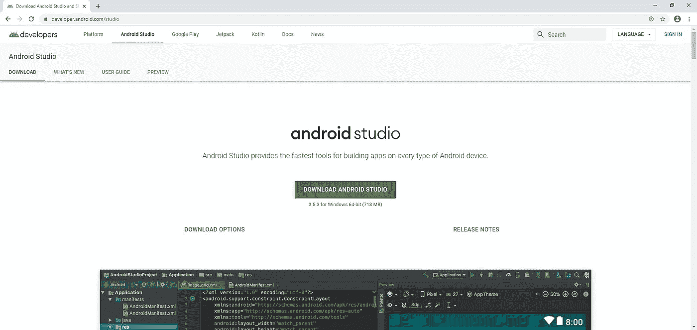

下载并执行该文件。[点击运行](https://www.youtube.com/watch?v=jEK89ZhTVes)。

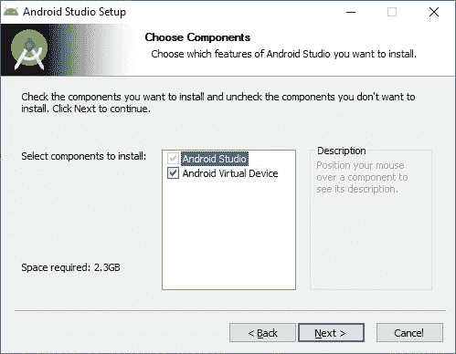

有没有 Android 虚拟设备都可以安装。这只是一个预先配置好的设备，随时可以使用。完成安装并启动 Android Studio。

**注意:**如果你运行 Android Studio，它说需要更新(在事件气球中)，这是正常的。别担心。

在“欢迎使用 Android Studio”窗口的底部，选择配置。你可以选择 AVD 管理器。点击它。

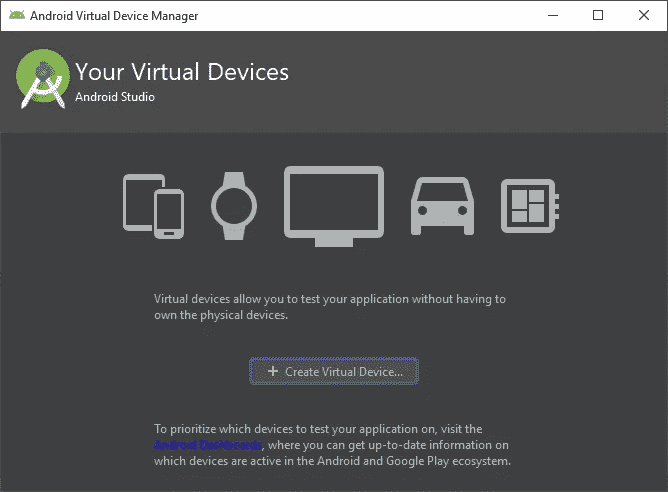

由于您还没有任何设备，您将看到一个欢迎窗口来创建虚拟设备。点击+创建虚拟设备。将出现一个新窗口，供您选择硬件:

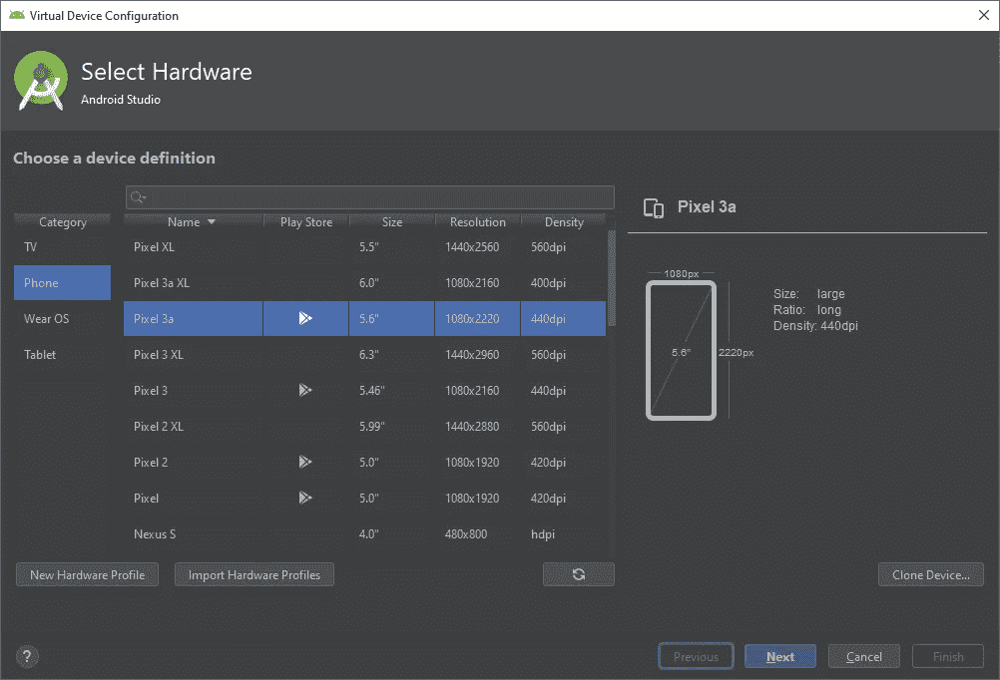

选择您想要的任何选项。理想情况下，你会想在游戏商店里使用带有标志的游戏。为什么？假设您想要测试脸书积分。您可以使用 play store 安装脸书应用程序。

我们将选择像素 3a。单击“下一步”后，系统会提示您选择要使用的系统映像。系统镜像无非就是 Android 版本，如你所见:

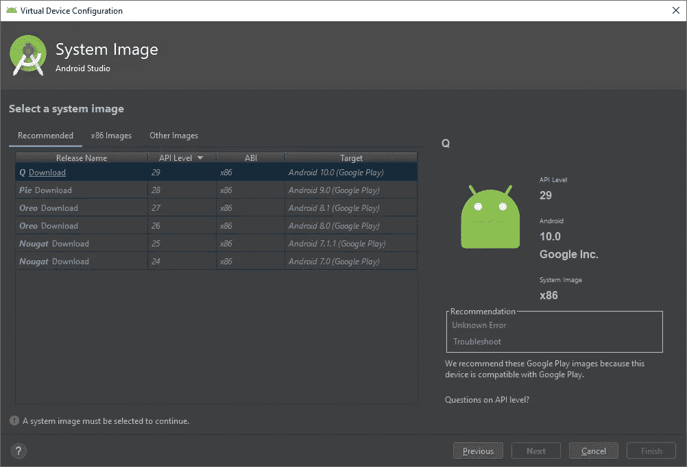

对于这个演示，我们将下载 Android Q(eue)。在下载的同时，看看[这个链接](https://success.outsystems.com/Support/Release_Notes/Mobile_Apps_Build_Service_Versions)，在这里你可以看到你需要使用哪个特定的 MABS 版本来支持你想要的场景。这是一个非常方便的链接，可惜似乎很难找到。

下载完成！我们继续吧。是时候配置你的模拟器了。选择您希望在虚拟设备中使用的 RAM 数量。使用推荐的设置总是可取的——除非您的 RAM 比您需要的多。

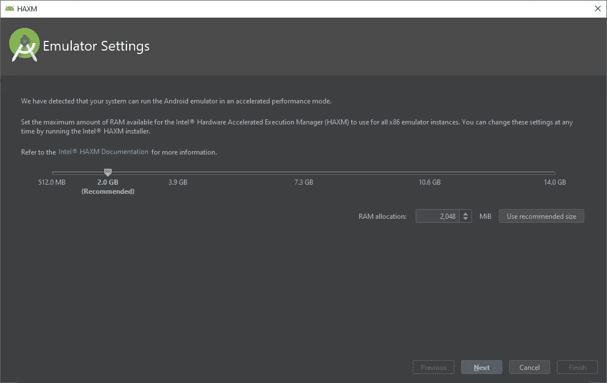

是时候等待了。又来了。

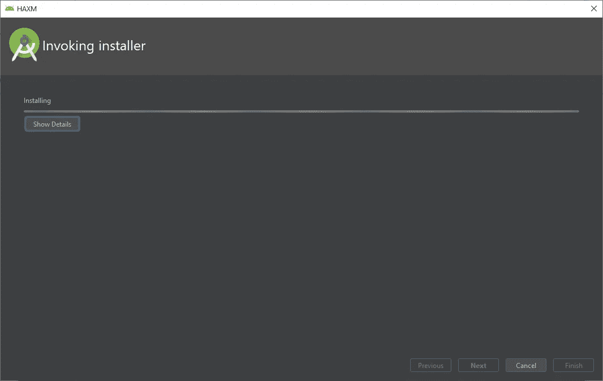

好吧，如果你在 AMD 平台上运行(锐龙万岁)，你会得到一个错误，因为，嗯…想象一下:我们不能安装英特尔 HAXM！谁能想到呢？

对于 AMD 用户，请执行以下操作:

开始菜单；搜索“打开或关闭 Windows 功能”并**确保禁用以下选项**:

*   **Windows 虚拟机管理程序平台**
*   **Hyper-V**

如果这两个被禁用，**只需启用 Windows Hypervisor 平台并重启**。**如果启用了这些选项中的任何一个，而它不是用于此目的，请禁用这两个选项，重新启动，启用 Windows 虚拟机管理程序平台，重新启动。**

希望在这个过程结束时，您应该能够启动您的虚拟设备，它应该看起来类似于下图。

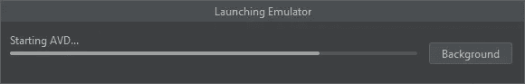

好吧，那么，我们的设备正在运行！我们如何知道我们的设备被正确检测到？首先，启动一个命令行实例并键入 **adb devices。**你从主机上得到的答案是(击鼓声):

*‘ADB’不被识别为内部或外部命令，
可操作程序或批处理文件。*

哈！是时候施展我们的魔法了！还记得您选择 AVD 管理器的图像吗？嗯，它还有另一个选项叫做 **SDK 管理器**。选择该选项，将弹出一个新窗口。在它的顶部，你应该有你的 Android SDK 的位置。我的位置是 C:\Development\AndroidSDK，考虑到路径中没有任何空格，这是一个不错的位置。我还没有遇到问题，但在安装过程中，这是劝阻。

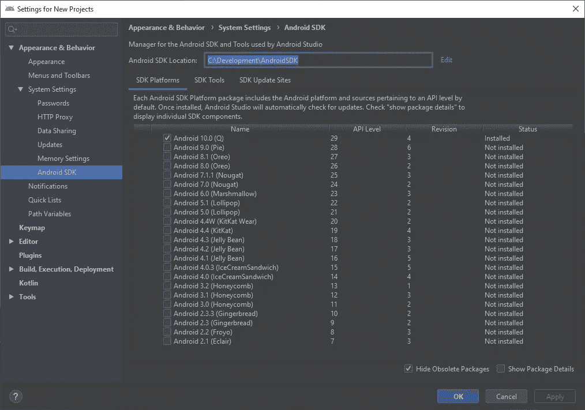

打开该文件夹，然后进入平台工具文件夹。在里面你应该会找到几个文件，特别是一个名为“ *adb* ”的文件。**复制文件夹位置**(在我的例子中，*C:\ Development \ AndroidSDK \ platform-tools*)并转到控制面板、系统和安全、系统。在左边，你应该有一个高级系统设置的链接。

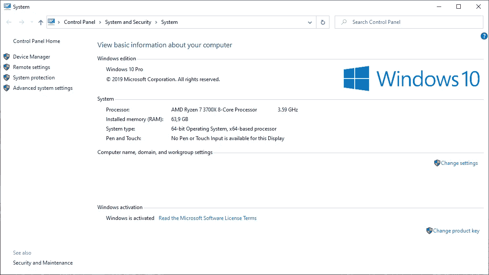

一旦你点击链接，你会看到一个和下面一样的窗口。

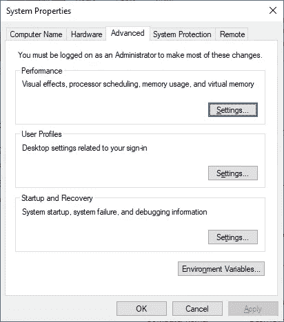

点击“环境变量…”为您的用户选择**路径**变量，点击编辑，弹出一个新窗口。然后，选择新建并键入您之前复制的文件夹路径(平台-工具文件夹位置)，然后单击确定。再单击几次“确定”,直到所有内容都关闭，然后在打开的控制台窗口中重试。它会再次失败。别担心，它正在按预期工作。当我们重新启动实例时，控制台将只读取新的路径变量。因此，关闭它并再次启动它。一旦重启，输入 **adb** 。你会得到这样的结果:

*Android 调试桥版本 1.0.41
版本 29 . 0 . 5–5949299
安装为 C:\ Development \ Android SDK \ platform-tools \ ADB . exe*

好，再来看那个具体的命令: *adb 设备*。它应该会返回如下内容:

*附加设备列表
仿真器-5554 设备*

好的，快速回顾一下:我们的 AVD 正在运行，Android Debug Bridge (adb)工具可以从 Path 变量访问，Service Studio 已经安装。下一步？生成一个 Android 应用程序——如果你没有的话。在本次演示中，我将使用 OutSystems Mobile training 的[原生应用生成](https://www.outsystems.com/learn/learn_lesson_view.aspx?lessonid=1824&lessonname=native-app-generation-exercise&learningpathid=0)课程中提供的 ToDo 应用。安装它，刷新参考，我们就可以开始行动了！

现在，转到服务中心中的应用程序，打开 Native 选项卡并生成 Android 版本。任何标识符都可以。

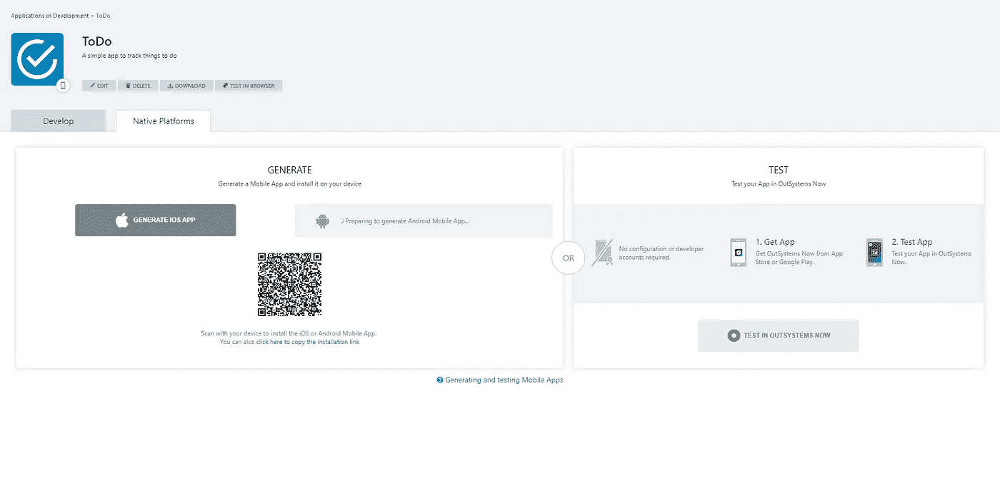

完成后，复制安装链接并将其粘贴到虚拟设备中的 Chrome 浏览器中。

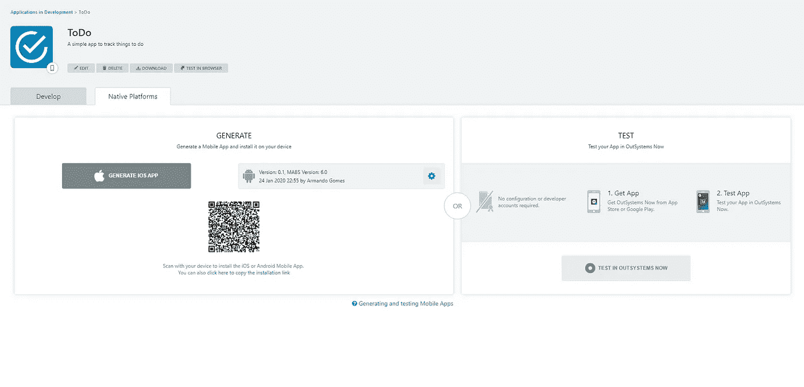

最后，它会加载网页，你就可以下载 *APK* 文件了。

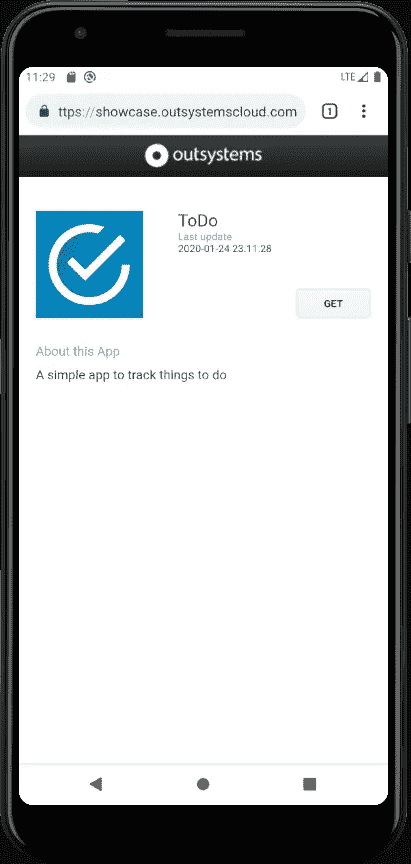

安装完成后，让我们启动调试器。

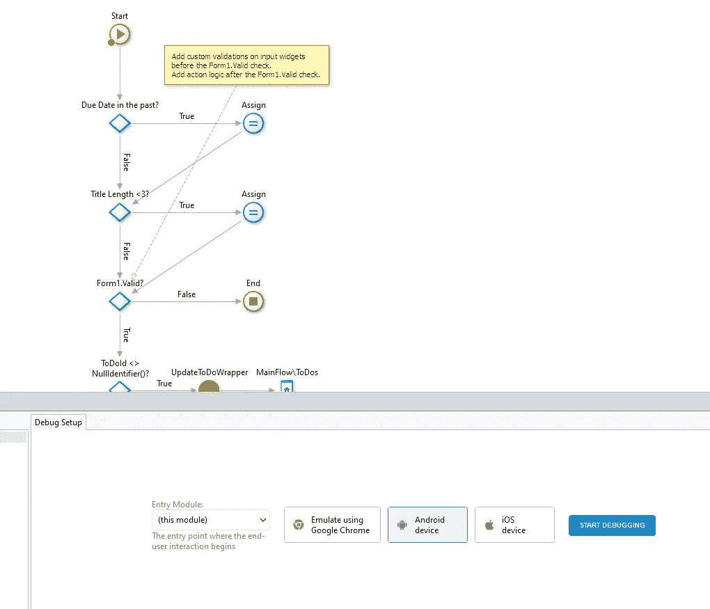

我们等待，等待，再等待…

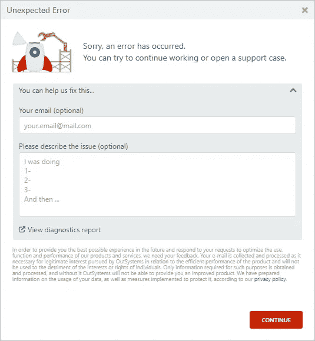

休斯顿，我们有一个错误。

***“但是我看到它在你的机器上工作，我到底做错了什么？？？?"***

嗯，我可以在这里盖上“它在我的机器上有效”的印章——我只是在找借口这么做。虽然这很有趣，因为这是真的，但事实上这对你没有任何好处。这里的目标是让你也能在你的机器上这样做。所以，让我们更深入地研究这个问题——因为当我试图在我的桌面上安装它时，完全相同的事情发生在我身上。

所以，它能在我的笔记本电脑上运行，但不能在我的台式机上运行。相同的 Service Studio 版本(测试版)，相同的构建，不同的行为。为什么？原因很简单——老实说，我相信以前没有人想过这个问题。

如果你去*C:\ Program Files \ out systems \ Service Studio 11 Beta \ Service Studio \ Plugins \ Service Studio \ ChromeBrowserAdapterResources \ ADB*(或者你电脑里类似这样的东西)，你会看到四个不同的文件:adb.exe、adbwinapi.dll、adbwinusb.dll 和一个通知文本文件。如果在这个文件夹下启动一个终端，可以执行“adb”，它会列出版本:Android Debug Bridge 版本 1.0.39，版本 27 . 0 . 0–4455170。现在，在任何其他文件夹中打开一个终端窗口，并执行相同的命令。版本一样吗？不，不是——女士们先生们，这就是问题所在。

我查看了我的笔记本电脑的路径亚行的版本，它是 1.0.40，28 . 0 . 2–5303910。我看了看我的桌面版，是 1.0.41，29 . 0 . 5–5949299。这是问题所在吗？

简而言之:是的。

长回答:好像 Service Studio 在调用 ADB 可执行文件的时候，得到的是 PATH 变量中的版本，而不是*ChromeBrowserAdapterResources*文件夹内的文件。

因为我们不能从 PATH 变量中删除 adb 否则我们就不能从我们的虚拟设备中获取日志——直到 OutSystems 的人解决了这个问题(最终，据说),我们最好的办法是“降级”版本“outside”service studio(该文件夹被添加到相同的路径 variable)⁴.

完成后，重启 Service Studio，让我们再次启动调试器:

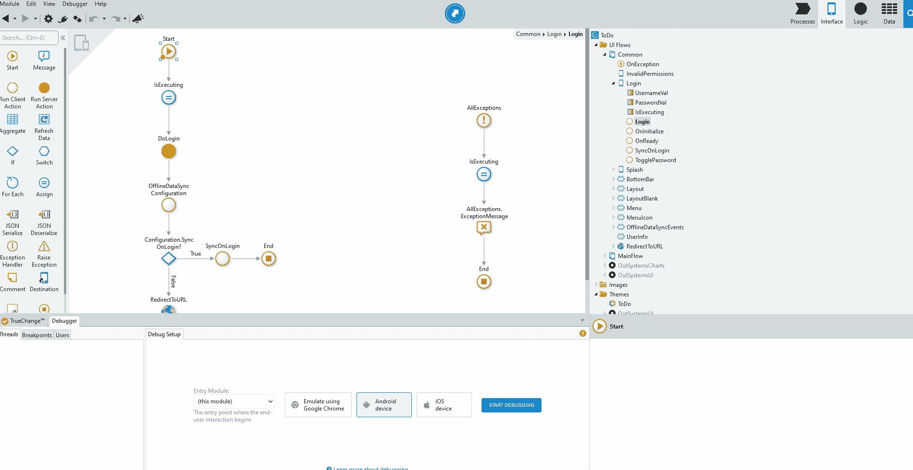

单击添加了断点的 login，我们将让我们的调试程序捕捉请求！你知道接下来会发生什么，对吧？该是我们…

**胜利之舞！**

那么，今天就到此为止。希望你和你一样喜欢这个旅程——非常感谢 Yuri 提出调试器的问题——请调试愉快！

如果你有任何问题，评论或者只是想对生命的意义和一切大声疾呼，请在下面给我留言或者通过 [hello@armandogom.es](mailto:hello@armandogom.es) ！

保重，下次见！

— — — — — — — — — — — — — — — — — — — — — — — — — — — — — — —

我准备好单飞了。呜哇！

正如您所想，这是假设 AVD 正在运行。

所以我和一些来自外部系统的人谈过，他们意识到了这个问题。他们正在为这个问题提供一个修复程序。与此同时，他们欢迎我提出的解决问题的建议。

⁴将*chromebrowseradapterresources*文件夹添加到 PATH 变量中也是一种可能，尽管我强烈认为这将引发一场维护地狱。