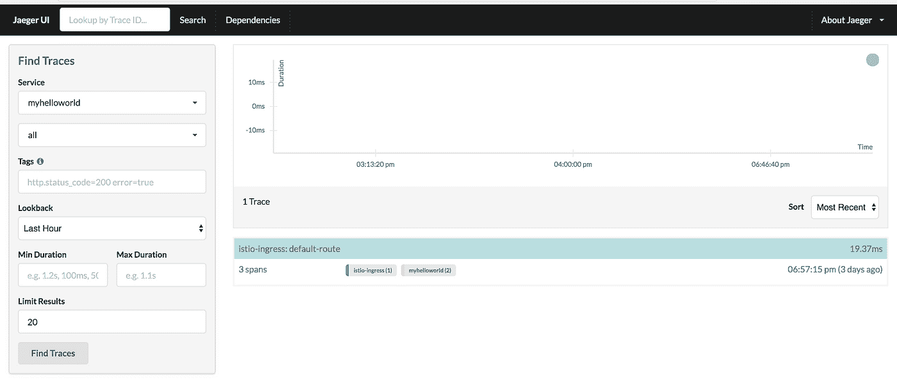
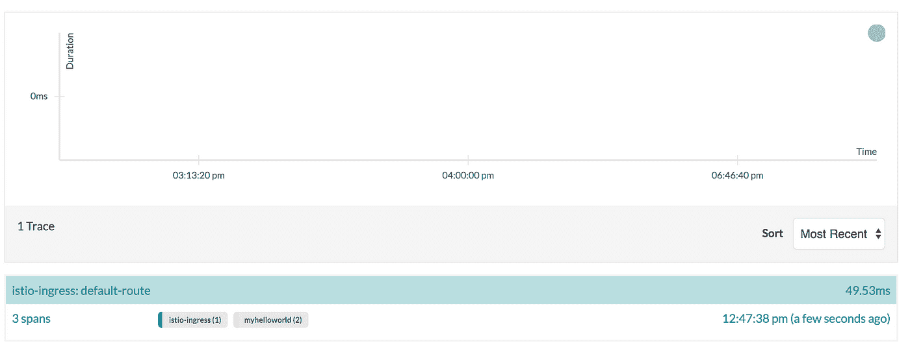
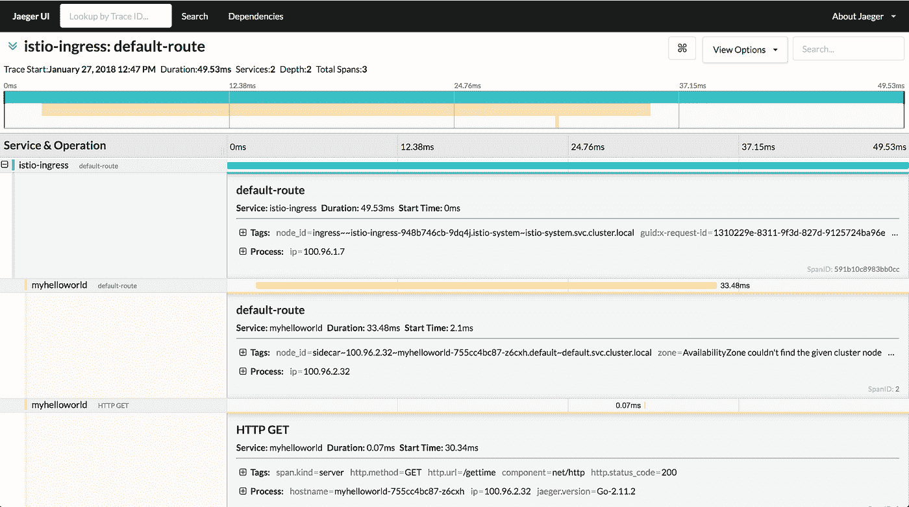

# 当 Istio 遇到 Jaeger——一个端到端分布式追踪的例子

> 原文：<https://itnext.io/when-istio-meets-jaeger-an-example-of-end-to-end-distributed-tracing-2c136eb335eb?source=collection_archive---------2----------------------->


[*点击这里在 LinkedIn 上分享这篇文章*](https://www.linkedin.com/cws/share?url=https%3A%2F%2Fitnext.io%2Fwhen-istio-meets-jaeger-an-example-of-end-to-end-distributed-tracing-2c136eb335eb)

Kubernetes 太棒了！它帮助许多工程团队实现了 SOA(面向服务的架构)的梦想。很长一段时间以来，我们围绕着整体思维的概念来构建我们的应用程序，这实质上是让一个大型计算实例运行应用程序中提供的所有服务。账户管理、计费、报告生成等都是从共享资源中运行的。在 SOA 出现并承诺给我们一个更加光明的未来之前，这一切都运转得很好。通过将应用程序分解成更小的组件，并让它们使用 REST 或 gRPC 相互通信。我们希望事情只会从那里变得更好，但只会意识到一系列新的挑战在等待着我们。跨服务交流怎么样？日志或寻迹等微服务之间的可观测性如何？这篇文章演示了如何在 Kubernetes 集群中设置 OpenTracing，以支持服务之间的端到端跟踪，以及使用正确的工具在服务内部进行跟踪。

# Kubernetes 集群设置

首先，我们需要一个可以使用的 Kubernetes 集群。我在 AWS 上使用 [kops](https://github.com/kubernetes/kops) ，因为它提供了一系列自动化集群操作，如升级、扩展/缩小和多个实例组。除了方便的集群操作之外，kops 团队一直密切关注最新的 Kubernetes 版本，以提供最新的集群体验。我发现非常酷的:D

要让 kops 运行起来，需要遵循一些步骤。

# 创建集群

在 AWS 上用 kops 创建 Kubernetes 集群可能像一个[集群创建命令](https://github.com/kubernetes/kops/blob/master/docs/cli/kops_create_cluster.md)一样简单。

```
kops create cluster \ 
--name steven.buffer-k8s.com \ 
--cloud aws \ 
--master-size t2.medium \ 
--master-zones=us-east-1b \ 
--node-size m5.large \ 
--zones=us-east-1a,us-east-1b,us-east-1c,us-east-1d,us-east-1e,us-east-1f \ 
--node-count=2 \ 
--kubernetes-version=1.8.6 \ 
--vpc=vpc-1234567a \ 
--network-cidr=10.0.0.0/16 \ 
--networking=flannel \ 
--authorization=RBAC \ 
--ssh-public-key="~/.ssh/kube_aws_rsa.pub" \ 
--yes
```

这个命令告诉 AWS 使用 CIDR `10.0.0.0/16`在 VPC `1234567a`的`us-east-1`创建一个 Kubernetes 集群，其中有 1 个主节点和 2 个 minion (worker)节点。大约需要 10 分钟，群集才能启动并准备就绪。同时，您可以使用`watch kubectl get nodes`来监控进度。

一旦完成，我们应该准备好在新的 Kubernetes 集群上安装 [Istio](https://istio.io/) 。它是一个服务网格，管理在同一个集群上运行的服务之间的流量。由于这一特性，它使 Istio 成为跨服务跟踪请求的完美候选。

# 安装 Istio

从他们的 [GitHub repo](https://github.com/istio/istio/releases/tag/0.4.0) 下载 Istio。

从下载的 Istio 目录中，您可以使用以下命令将 Istio 安装到 Kubernetes 集群中

`kubectl apply -f install/kubernetes/istio.yaml`

现在 Istio 应该已经在集群上启动并运行了。它还创建了一个接受外部请求的 Nginx 入口控制器。我们将在后面介绍如何设置 ip。

# 安装 Jaeger

Jaeger 和 Instio 携手提供跨服务的追踪。您可以用这个命令安装 Jaeger

`kubectl create -n istio-system -f [https://raw.githubusercontent.com/jaegertracing/jaeger-kubernetes/master/all-in-one/jaeger-all-in-one-template.yml](https://raw.githubusercontent.com/jaegertracing/jaeger-kubernetes/master/all-in-one/jaeger-all-in-one-template.yml)`

完成后，您应该能够访问 Jaeger 用户界面。维奥拉。



# 仪器代码

安装 Jaeger 和 Istio 后，你将能够自动看到跨服务的痕迹！这是因为 Istio 注入的 Envoy sidecars 处理服务间流量，而部署的应用程序只与分配的 sidecars 对话。

你可以用一个小的示例应用程序找到我的 [GitHub repo](https://github.com/stevenc81/jaeger-tracing-example) 。

`main.go`看起来是这样的

在第 28–30 行，我们创建了一个 Zipkin 传播器，告诉 Jaeger 从请求头中捕获 OpenZipkin 上下文。您可能会问，这些头首先是如何到达请求的？还记得我说过 Istio sidecar 处理服务通信，而您的应用程序只与它对话吗？是的，你可能已经猜到了。为了让 Istio 跟踪服务之间的请求，当请求进入集群时，Istio 的入口控制器会注入一组头。然后它得到了一个和特使边车的传播，每个边车向耶格报告相关的跨度。这有助于将跨度连接到单个轨迹。我们的应用程序代码利用这些头来折叠服务间和服务内的跨度。

下面是 Istio 入口控制器注入的 OpenZipkin 头列表

```
x-request-id
x-b3-traceid
x-b3-spanid
x-b3-parentspanid
x-b3-sampled
x-b3-flags
x-ot-span-context
```

要部署示例应用程序，您可以使用这个 yaml 文件

# 部署

`kubectl apply -f <(istioctl kube-inject -f myhelloword.yaml)`

请注意，bin `istioctl`可以在 bin 文件夹下的 Istio repo 中找到。

是时候收获利润了！当我们向 Istio 入口控制器发送请求时，它将在服务之间以及应用程序内部被跟踪。从截图中我们可以看到从不同地方报道的 3 个跨度

*   入口控制器
*   申请特使边车
*   应用代码



展开跟踪(显示 3 个跨度)并查看我们将:D 的端到端跟踪



# 结束语

*   SOA 带来了一系列新问题，尤其是围绕服务可观察性的问题
*   Istio + Jager 集成解决了服务对服务级别的问题
*   在 Jaeger 中使用 OpenZipkin prapagator 可以实现真正的端到端跟踪

*原载于【gist.github.com】[](https://gist.github.com/stevenc81/2c6840784c6223cdbd62cdd1563a4811)**。***