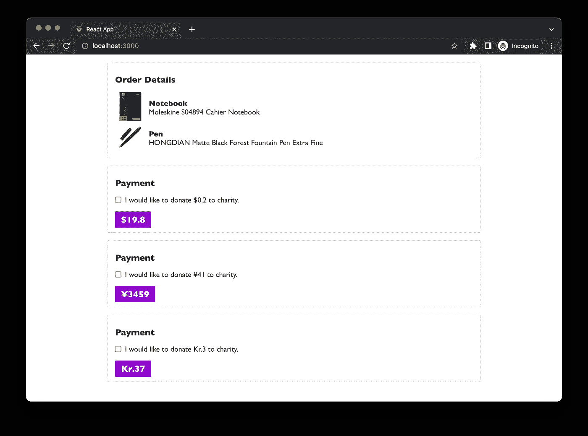
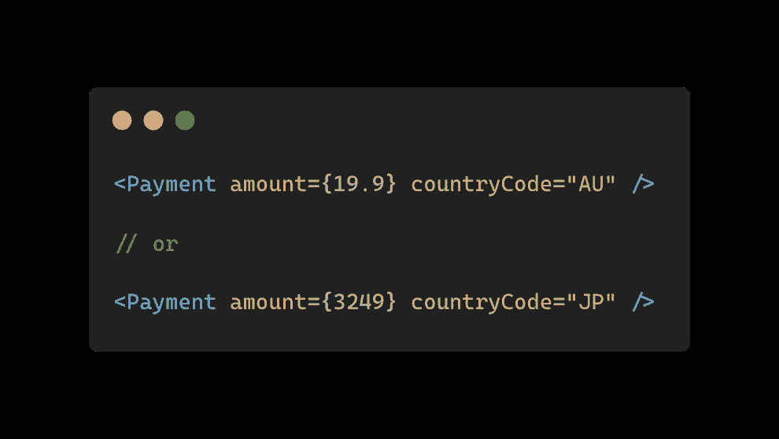
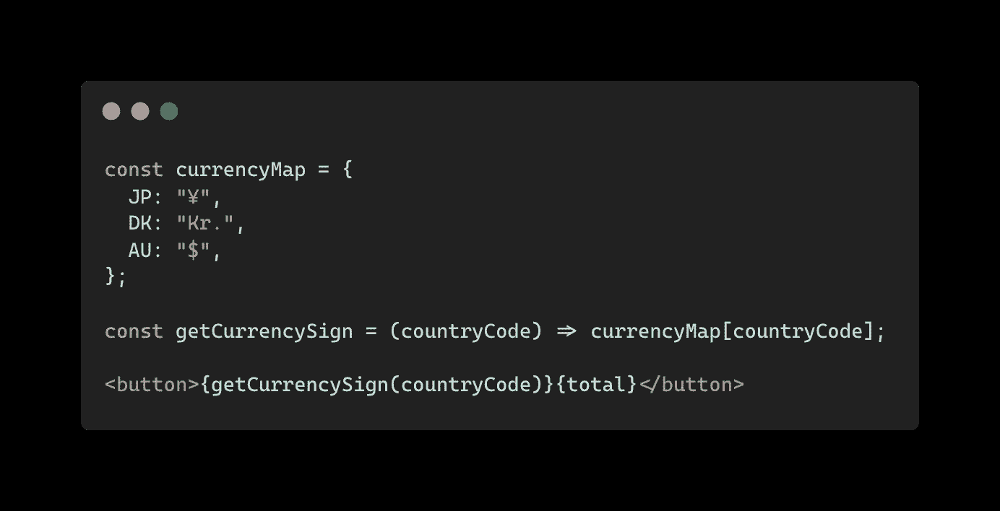
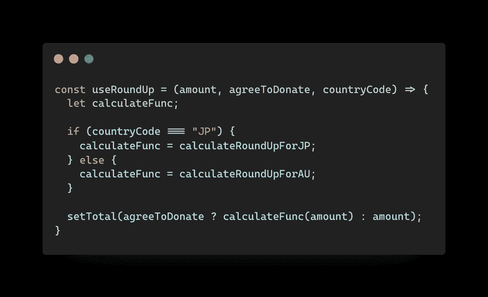
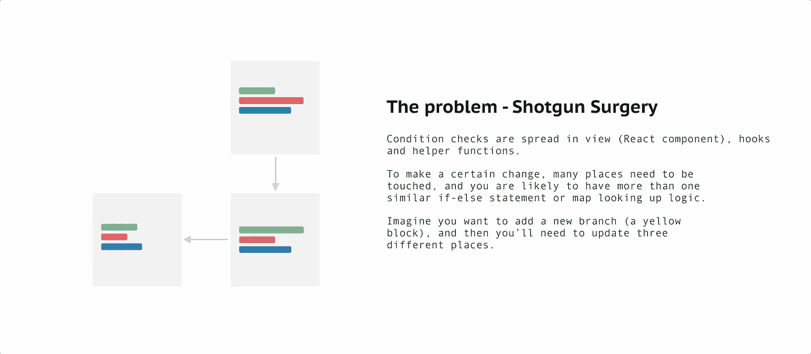
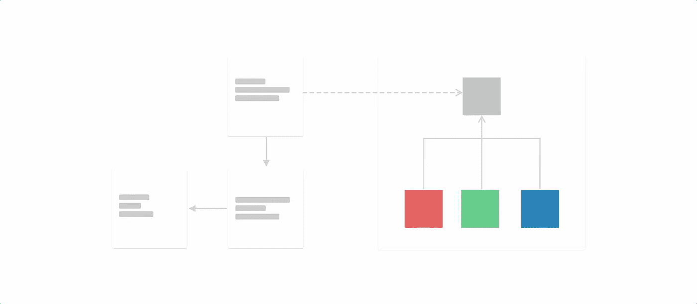
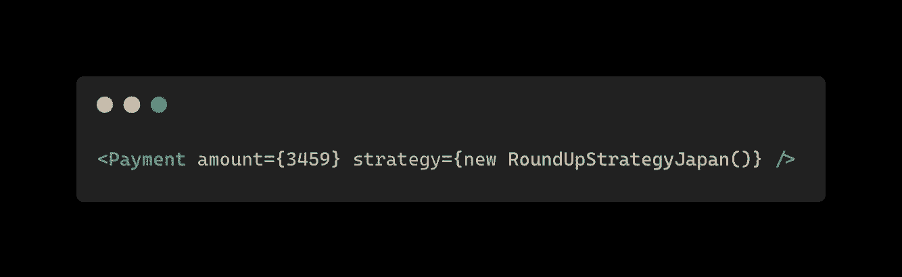
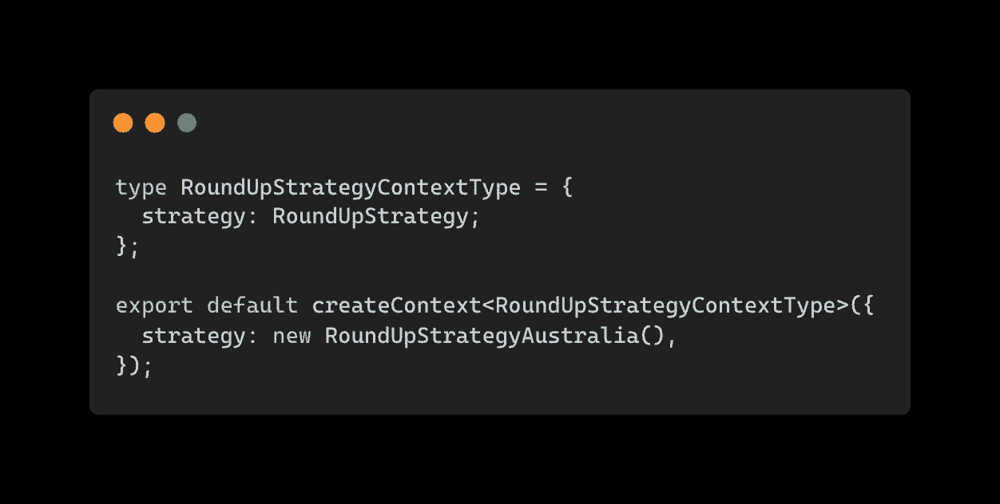
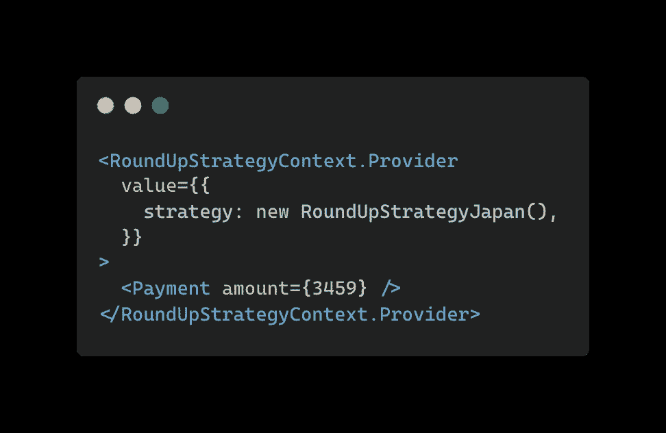
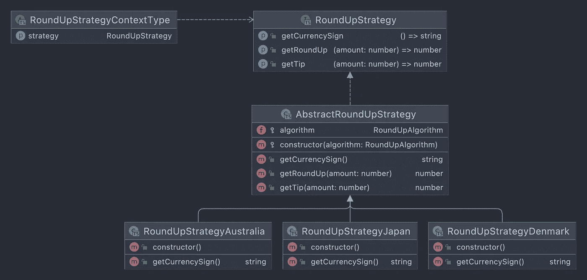

# 当 React 遇到 OOP 时

> 原文：<https://itnext.io/when-react-meets-oop-7b2d89258b94?source=collection_archive---------0----------------------->

在本文中，我将讨论一个混合面向对象编程和 React(函数式编程)的案例研究，并演示它如何提高可读性和可扩展性。

没有一种通用的方式来编写和形成你的 React 应用程序，但是我确实看到一些人鼓励人们在 React 中编写更多函数式编程风格的代码，而另一些人将所有东西都放在`view`中，我相信我们应该应用在其他软件领域中已经被证明的东西(特别是在这种情况下的设计模式和 OOP ),我认为这些实践也可以有益于 React 代码。

如果你喜欢看而不是读，我也有一个视频版本

***【更新 11。现在整个系列都完成了，我在 leanpub 上为它创作了一本书*******。用*** [***这个链接可以获得一份 7 折***](https://leanpub.com/react-clean-code/c/mYXp686cMFw1) ***。****

# *背景*

*几个月前，我发表了两篇博文，总结了我在这个项目的重构之旅中的发现。我从 origin 项目中提取了一些有趣的事实，并去除了所有的噪音，从本质上讲，该功能完全是关于不同市场中的舍入逻辑，以及围绕该需求，作为开发人员，我们如何将代码重构为易于采用任何新市场或新舍入算法的状态。*

**

*web 应用程序中的支付屏幕*

*例如，在澳大利亚市场，当订单是 19.9 美元时，通常会问用户是否愿意捐赠 0.1 美元。但同样的逻辑在日本市场并不适用，因为 0.1 日元实际上什么都不是。我们需要四舍五入到最接近的百，对于丹麦，我们需要四舍五入到最接近的十。*

*理论到此为止。最近，当我把这些放在一起作为视频教程时，我发现了一些有趣的事情。我最初的计划是将这些博客帖子复制到一个视频中，这对于喜欢通过观看视频来学习的人来说更容易，但是由于我已经在很多情况下完成了这个特定的案例，在录制之后，我被另一个想法击中[(我相信如果我第一次这样做就不会发生这种情况)——这个场景类似于我的后端项目功能之一，我想知道如果我也可以在我的 React 代码中应用相同的设计模式会怎么样？](https://www.youtube.com/watch?v=j-VHE62zfjQ)*

*更具体地说，在我的 React 代码中，我需要在 props 中公开一个`countryCode`:*

**

*道具中的国家代码*

*正如您所猜测的，我需要在`Payment`中使用一些逻辑来格式化标签并计算取整金额:*

**

*使用货币映射获得正确的符号*

*我还需要在我的自定义钩子中为不同的国家切换到不同的算法:*

**

*useRoundUp 挂钩中的类似逻辑*

*(我知道你想说什么，但是别担心，上面的代码是简化的，我根本不用`let`。*

# *问题是*

*这里的问题是，每当一个新的国家代码被添加到系统中时，我需要更改一些地方。格式化逻辑(针对货币符号)、取整逻辑(到整数、十或百)和一些帮助函数。*

*这差不多就是人们所说的猎枪手术。基本上，你必须修改很多地方来实现一个小的需求变化。*

**

*猎枪手术的味道*

# *战略模式*

*现在是时候介绍我想在本文中讨论的主要内容了:策略模式。这是我第二喜欢的模式(第一个当然是观察者模式)。本质上，策略模式是有一些策略实现一个公共接口，并且该接口有方法可以替换之前在代码中传播的这些`if-else`检查(或映射查找)。*

*通常在 OO 语言中，我们使用多态性在运行时使用不同的接口实例。*

*例如，在上面的图像中，不同颜色的条代表类似于`if(countryCode === 'JP')`的支票，所以与其这样做，不如想象我们有一个专门针对日本的类，在该类中，它有一个类似于`getCurrencySign`的方法，该方法返回`¥`。同时，我们有一个兄弟类，如果在这个类上调用了`getCurrencySign`，它将返回`$`。*

**

*使用策略模式*

*这意味着我们只有一个地方可以为澳大利亚、日本或新市场拓展的任何地方改变任何东西！*

# *反应上下文是锦上添花*

*回到我们的 React 应用程序，一旦我提取了三个类`RoundUpStrategyAustraliaRoundUpStrategyDenmark`和`RoundUpStrategyJapan`。我唯一需要传进去的是:*

**

*将策略作为一个整体对象传入*

*当我向妻子展示(实际上是炫耀)我所做的工作时，我很快意识到我可以用 React Context 做得更干净。*

**

*在上下文中定义策略*

*我可以把付款包在`RoundUpStrategyContext`周围，就像:*

**

*用上下文包装支付——然后你可以动态切换*

*对于`Payment`本身来说，它差不多就是我的初始版本。唯一的依赖是超级抽象的`RoundUpStrategy`接口。*

# *类图*

*最后，我制作了一个 UML 图来展示 React 代码旁边的内容。*

**

*支付应用程序的类图*

# *利益*

*我认为这种 OOP + React 方法有很多好处，但我在这里只列举几个:*

*   *视图和业务逻辑之间更清晰的界限*
*   *视图和类(或算法)的可测试性*
*   *我们可以将提取的类完全推到后端，而无需修改一行代码*

# *摘要*

*尽管在 React 中很少提到面向对象编程，但这并不意味着我们应该忽略软件开发的其他领域中已被证实的模式和概念，尤其是当它们修复我们的问题时。*

*在 React 中使用接口、类和上下文，我们可以从我们的`view`和`hooks`中显著简化大量复杂的逻辑，同时保持高水平的可读性和可测试性。*

*如果你想了解更多关于这个话题的内容，我在 leanpub 也有一本关于它的书。*