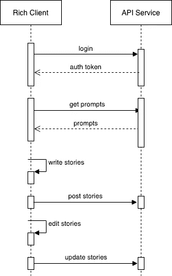
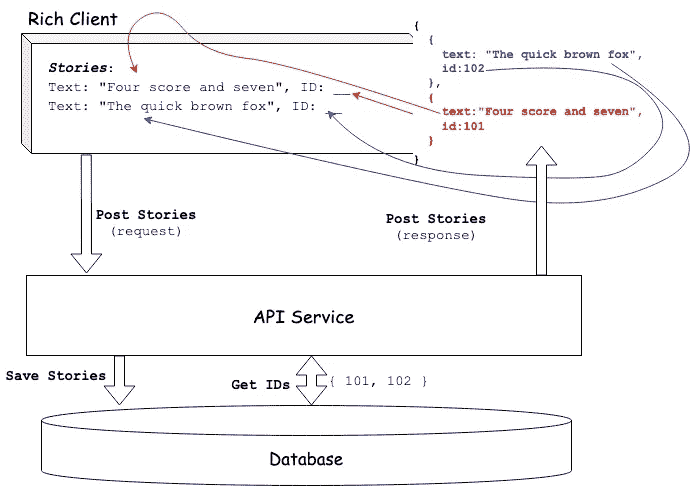
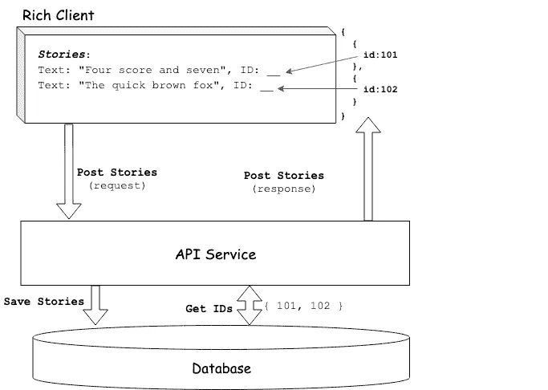
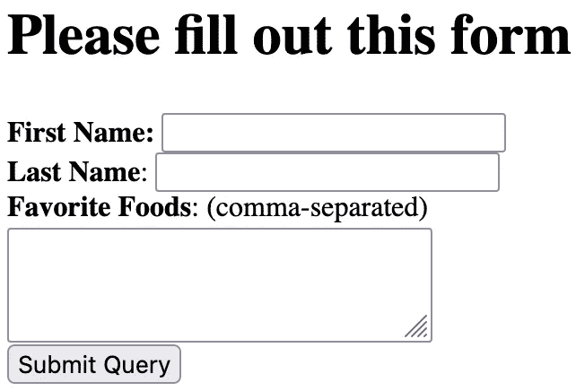
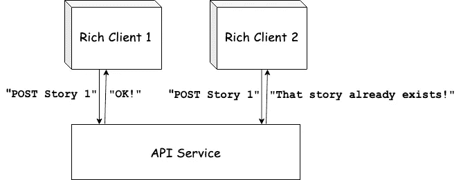
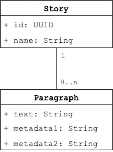

# 什么时候应该给实体分配 id？

> 原文：<https://itnext.io/when-should-you-assign-ids-to-your-entities-ae17454376dd?source=collection_archive---------3----------------------->

## 答案是“一旦你的实体被创建”…但是真的那么简单吗？


布雷特·乔丹在 [Unsplash](https://unsplash.com?utm_source=medium&utm_medium=referral) 上的照片

不久前，我和一位同事讨论我们正在构建的一个应用程序的技术设计。在这种情况下，我们的富客户端生成一段数据，并通过 ReST API 发布它。这些数据代表一个离散的实体；因此，需要给它分配一个 ID。所以问题出现了:实体的 ID 应该在哪里生成？

当我们讨论我们的选择时，我的同事评论道，“戴上我的 DBA 帽子，我认为数据库应该自动生成实体的 ID，然后将该 ID 传递回客户端。”

事实上，这是一种常见的模式。但在这种情况下，跟随它似乎有些令人畏缩。

给实体分配 id 的想法本身并不总是让我满意。毕竟，我们通常对真实世界的对象进行建模。我们通常不是通过一些 ID，而是通过它们过多的特征来识别现实世界的物体。例如，我们认识到我们最喜欢的椅子，不是 T4 椅，而是蓝色转椅，有带软垫的扶手，中间凹陷，我们可以直接折叠进去。

说了这么多，我们的车型简单来说就是:*车型*。尽管我们可能会尝试，但我们无法用一个数据模型捕捉真实世界对象的所有细微差别。此外，许多现实世界的物体*都被*分配了 id。汽车有 vin。包裹有追踪号码。就连人都有身份证号。事实上，我的嫂子可以证明，当催收机构不看一个人的 SSN，而是看他们的名字是“玛丽·马丁”并住在特定城市的特定公寓时，一个人的信用评分会发生什么。

回到手头的问题。我们的特定用例有些不典型，但却是一个很好的例子。我们的领域包括*用户*、*提示*和*故事*。用户很简单——他们代表注册使用我们服务的人。*提示*是发送给每个用户的预先写好的问题(即每个用户将收到相同的提示)。*故事*就是用户登录并阅读提示后产生的东西。

所以一个典型的交互应该是这样的:

*   用户登录我们的富应用程序，下载一系列提示。
*   然后，用户为每个提示写下一个故事。
*   这些故事然后被提交给我们的后端 API 并持久化。
*   用户继续与故事进行交互，提供附加信息，该附加信息又被提交并与他们已经保存的故事相关联。



然后，我们的讨论集中在何时以及如何为那些持久存储在后端 API 上的故事生成 id。正如我的同事所调侃的那样，传统上我们会让数据库在保存故事时分配 ID——通常通过一个由序列支持的自动递增列。

那么，为什么这是传统的、规范的方法呢？(至少)有两个主要原因:

*   **易用性**。大多数关系数据库都有生成和跟踪数字序列的内置机制，这在我们这边几乎不需要做什么工作。
*   **集中序列管理**。我们的数据库已经是管理数据的集中位置，因此将它用作管理数字序列的集中位置是有意义的。

然而，问题是，一个故事在被插入数据库之前就已经存在了。具体来说，它在应用程序中创作的那一刻就存在了。这可能看起来是吹毛求疵。但在我们的案例中，故事不仅仅是在应用程序中创建，然后就被遗忘了。相反，故事提交给 API 后，仍然驻留在应用程序中，用户仍然与它们交互。随着故事更新的提交，我们将一次又一次地需要这些 id。

那么我们有什么选择呢？当然，我们可以在 HTTP 响应中返回数据库生成的 id，并将每个 id 附加到应用程序中相应的故事。事实上，ReST 模式告诉我们这是首选的方法:向服务器发送一个资源，让服务器生成 ID，并在响应中反映新的资源——充满了服务器生成的 ID。

太好了。但是我们如何找到正确的故事来附加新的 ID 呢？我们*可以*在响应中返回完整的故事对象，然后使用用户输入的文本将返回的故事与内存中的故事进行匹配。



API 服务返回所有新故事的列表，包括它们的新 id。由客户机执行字符串匹配来确定哪个内存中的故事被分配了哪个 ID。

这在理论上可行，但做起来效率不高(而且可能是一种相当脆弱的方法)。

我们考虑的另一个选择是依靠订购。我们将最初的故事集合作为有序列表提交，然后以相同的顺序返回结果 id。



API 服务将生成的故事 id 作为有序列表返回。由客户端决定是否遍历该列表及其故事列表，并在每次迭代中将一个 ID 与一个故事相关联。

这在理论上也行得通，但似乎有点太脆弱了。如果未来的任何更新以任何方式打破了排序，我们将会把故事与错误的 ID 关联起来。

实际上，即使在使用传统方法的简单案例中也会出现同样的问题。让我们跳回到几十年前，用简单的形式构建一个简单的网页。该表单将要求用户输入他们的名和姓，以及他们最喜欢的食物的逗号分隔列表:



还记得以前 HTML 表单是这样的吗？

每当有人提交表单时，我们将在我们的`USER`表中创建一条记录，并在我们的`FAVORITE_FOOD`表中创建 *n* 条相关记录。我们的伪 PHP-ASP-JSP-XYZP 代码可能如下所示:

```
<?
$fname = $form['fname'];
$lname = $form['lname'];
$foods = explode($form['foods'], ',');$db.execute(
  'INSERT INTO USER (FNAME, LNAME) VALUES($fname, $lname)');
// remember, this was a few decades ago
// before we'd learned about SQL injection 😄$uid = db_get_last_id();
foreach ($f in $foods) {
  $db.execute(
    'INSERT INTO FAVORITE_FOOD (USER_ID, FOOD) VALUES($uid, $f)');
}?>
```

根据我们使用的数据库和驱动程序，我们可能有类似于`db_get_last_id()`调用的功能来查找新插入行的 ID。但是事情是这样的:*这不是靠魔法*起作用的。在幕后，驱动程序正在做一些我们之前描述过的事情；也就是说，它对数据库进行后续查询以找到该 ID。虽然在处理单次插入时，这在历史上相当简单，但对于批量插入，这很快就会变得棘手(例如，Google "*SQL how to retrieve id of batch insert*")。

回到当前的问题上来。我们认为，最好的解决方案是应用程序本身在故事创建后立即为每个故事生成一个 ID。

从表面上看，这似乎是一个问题。前面，我们讨论了数据库生成的 IDs 如何为我们提供了一种维护数字序列的集中机制。如果我们让我们的单个应用程序实例维护它们自己的序列，那么我们就会遇到唯一性的问题。因此，不同的应用程序会很快开始用相互冲突的 id 发布故事。



第一个发布 ID 为 *1 的故事的客户端将会成功；其余的将失败*

但是我们应该问自己:我们需要用数值作为 id 吗？例如，我们可以将应用内计数器值与代表应用实例的某个唯一值(例如，设备的 MAC 地址)结合起来。见鬼，我们甚至可以创建一个 API 端点，每个应用程序只调用一次，然后返回一个应用程序可以使用的有保证的唯一 int。因此我们的 id 可以采用`<app-specific-int>-1`、`<app-specific-int>-2`等形式。

然而，更常见的方法是简单地使用[uuid](https://www.techtarget.com/searchapparchitecture/definition/UUID-Universal-Unique-Identifier)。UUIDs 是 128 位标识符(通常表示为 32 个十六进制数字)，几乎可以在任何计算平台上轻松生成，并且几乎保证是唯一的。一个样本 UUID(从[在线 UUID 生成器](https://www.uuidgenerator.net/)获得)是`4ea8c548-fb4b-4b55–9ca9–01d3ba9cd3c9`。值得注意的是，UUIDs 有几种不同的版本；这意味着我们可以生成针对安全性/随机性、索引性能等进行优化的 UUIDs。

因此，我们可以使用字符串类型来表示我们的实体 id。有些人实际上使用 UUID 数据类型本身，尽管我不喜欢在跨网络边界反序列化这些值时需要考虑的固有错误处理。

这里有一点需要注意。这些实体最终将被存储在底层数据库中。根据所使用的数据库(以及其他因素，比如我们使用的 UUID 版本)，与使用数值相比，使用 uuid 或其他类似的字符串/varchar 时，我们的数据库索引的性能可能会更差。

## 我们在修理没坏的东西吗？

有人可能会说，我们让数据库分配 id 已经很多年了——如果不是几十年的话——这个解决方案基本上是可行的。这是一个有效的观点。但是有时候这种模式会崩溃，让事情变得困难。早些时候，我将我的*故事*用例描述为有点不典型，这可能是事实。但是还有无数其他的例子。

这里有一个例子。不久前，我的公司已经确定，在我们的用户注册过程中的任何下降都将花费我们大量的金钱。所以我们的任务是让这个过程更有弹性。一个计划是应用[隔板模式](https://medium.com/geekculture/bulkhead-pattern-microservice-design-pattern-9e30d414a0fd)。这是一种微服务模式，旨在限制给定操作(在我们的例子中是注册过程)中涉及的服务范围。此外，我们希望建立一个“最坏情况”机制，在服务中断期间，我们仍然可以收集一些用户信息，并将准系统用户帐户保存到一个文本文件中，使我们至少能够在以后联系这些用户。

不幸的是，要做到这一点，我们仍然需要生成唯一的用户 id，这就需要调用“UserAccount”微服务(它反过来管理我们用来生成 id 的数据库)。如果我们允许 onboarding web 应用程序生成用户 id，我们的问题就已经解决了。不幸的是，我们的整个架构假设用户 ID 是长的而不是字符串，所以我们只能依赖单一的中央数据库来跟踪我们的用户 ID 索引。

其他更阴险的例子出现时，我们的假设，一个单一的集中 ID 序列被证明是错误的。这种情况通常发生在我们需要合并数据的时候。假设我们收购了另一家公司，需要合并我们的产品或用户数据库。当然，这绝不是一项容易的任务。但是，如果这些数据库中的用户 id 或产品 id 是分别由它们自己的数据库管理序列生成的，那就变得更加困难了。

您看，当每个数据库中的数据生成时，假设所有的 id 都由一个序列管理。但是由于这两个数据集现在需要合并，这个假设不再有效。我们现在有一个数据集，它的 id 是由两个不同的序列生成的。毫无疑问，我们会发现许多相互冲突的 id。唯一的解决方案是为其中一个数据集生成新的 id，这项任务可能是简单的(例如，如果 id 完全包含在原始数据库中)，也可能是可怕的(例如，如果 id 从原始数据库中泄露出去)。

但是，如果这两个数据库使用 UUIDs 作为实体 id，那么这个问题就可以完全避免。

我们可以原谅将这些例子贴上过于复杂的标签，并认为大多数用例要简单得多。那可能是真的。但是我们应该问自己:即使是最简单的表单处理 web 应用程序，仅仅为了生成一个 ID 就需要将一个实体插入到数据库中，这不是很尴尬吗？

## 所以我们应该立即为每一位数据生成一个 ID？

所有这些并不是说，我们应该在创建每个离散数据时就为其生成一个 UUID。相反，我们应该将我们的实体建模为[集合](https://betterprogramming.pub/why-your-microservices-architecture-needs-aggregates-342b16dd9b6d)。这样，我们通常只需要为聚合根生成一个 UUID。我们可以让底层存储机制处理关联聚合的值对象的机制。

以前面的例子为例，假设一个故事由一组段落组成，其中一个段落由一些文本和一些元数据字段组成。



一个故事包含多个段落

应用程序不需要为段落创建 id。这是因为它不需要从其母故事中单独跟踪单个段落。当用户更新一个现有的故事时，应用程序会将整个故事(包含所有段落)推送到 API 服务器。将由服务器及其数据存储库来存储故事旁边的段落。

例如，API 服务器可能将故事保存在关系数据库中。数据库可能有一个由一个`STORY`表和一个`PARAGRAPH`表组成的模式，从后者到前者有一个外键引用。

或者，API 服务器可以将故事保存在文档数据库中(毕竟，“故事”和“文档”在某种程度上是同义词)。在这种情况下，文章将以如下格式存储:

```
{
  "id": "5afc4f69-b67c-40b6-9ec8-fdb7a6eb2be7",
  "name": "My Story",
  "paragraphs": [
    {
      "text": "Four score and seven years ago",
      "metadata1": 0,
      "metadata2": "foo"
    },
    {
      "text": "The quick brown fox jumps over the lazy dog",
      "metadata1": 1,
      "metadata2": "bar"
    }
  ]
}
```

## 每个实体多个 id？

我们可能会问的一个问题是:这会对 URL 产生什么影响？当构造直接链接到实体的 URL 时，我们通常包括实体的 ID。所以我们会从类似

`https://my.domain.com/stories/1234`

类似于

`https://my.domain.com/stories/5afc4f69-b67c-40b6–9ec8-fdb7a6eb2be7`

有人可能会说这可能会使 URL 更麻烦，更不方便用户使用。毕竟，虽然 URL 主要用于支持超链接，但它们经常被我们的用户阅读和打印出来。从这个角度来看，从用户的角度来看，上面的第二个 URL 更难处理。

不过，事情是这样的。以前的 URL 有一些固有的缺点。首先，它暴露了这样一个事实，即我们正在使用(或者很可能使用)一个数据库序列来形成标识符。此外，恶意(或者只是好奇)用户很容易插入其他 id 来查看发生了什么。

例如，如果我点击一个带我去`https://my.domain.com/stories/1234`的链接，那么也许我会试着编辑到`https://my.domain.com/stories/1235`的 URL，看看我是否能访问一些我不应该能访问的东西。毕竟，`1235`很可能代表一个有效的实体 id。(当然，我们应该有适当的授权来防止这种情况发生。但是我们想尽可能地提供多层次的安全保护。)

但是，有时我们希望用户以 URL 之外的方式与实体 id 进行交互。例如，财务帐户通常在报表和各种其他文档中列出帐户 id。我们的用户可能需要呼叫客户支持，并读出他们呼叫的实体的 ID。在这些情况下，生成第二个 ID 并不罕见，这是专门为人类消费而设计的。这种 ID 的目标是:

*   提供用户易于阅读的标识符
*   采用一种使用户很难看到一个这样的标识符并猜出另一个有效标识符的机制

这种方案可能会使用固定数量的随机生成的字母。确切的数字取决于我们特定实体集的基数。例如，如果我们的用户数量相对较少，每个用户拥有一个帐户，那么我们的 id 长度可以是四到五个字符。更大的客户群和/或更大的实体集将需要更多的字符，可能是 10-12 个。

我们将使用字母而不是数字，因为这将增加可能的 id 的范围。例如，允许重复的字母，四个字符的 id 会给我们 456，976 个可能的 id，而四位数的 id 只会给我们 9999 个选项。当然，为了减少我们的成员猜测其他有效 id 的能力，我们希望确保我们实际上使用了我们可能的 id 范围中的一小部分。虽然我们可能不打算使用数字，但明智的做法是避免像`I`或`O`这样容易与数字混淆的字母(当然，我们可以决定将数字 2-9 添加到组合中，从而增加我们潜在 id 的范围)。

为了生成这样一个 ID，我们可能会回到依赖一个专门的中央服务来随机分配唯一的值。然而，这些以用户为中心的 ID 通常可以在实体生命周期的后期生成，从而减少或消除与中央 ID 生成服务相关的问题。

## 最后一个音符

完成所有这些之后，您可能会决定，对于您的用例，使用您的数据库来生成 id 是最好的方法。那很好。只要确保你是故意这样做的，而不仅仅是因为“每个人都是这样做的。”确保你考虑了所有的用例——现在的和未来的——这样你就不会把自己画在一个角落里。

*觉得这个故事有用吗？想多读点？只需* [*订阅此处*](https://dt-23597.medium.com/subscribe) *即可将我的最新故事直接发送到您的收件箱。*

*你也可以通过* [*成为今天的*](https://dt-23597.medium.com/membership) *灵媒会员来支持我和我的写作，并获得无限量的故事。*