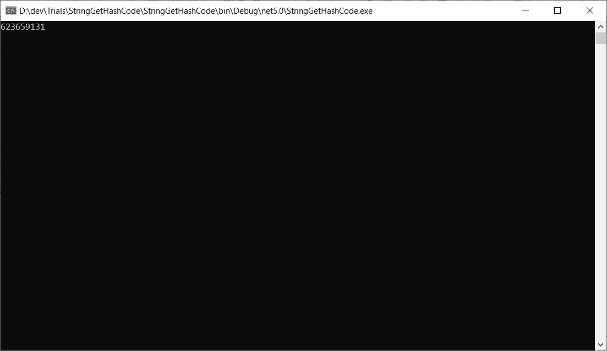
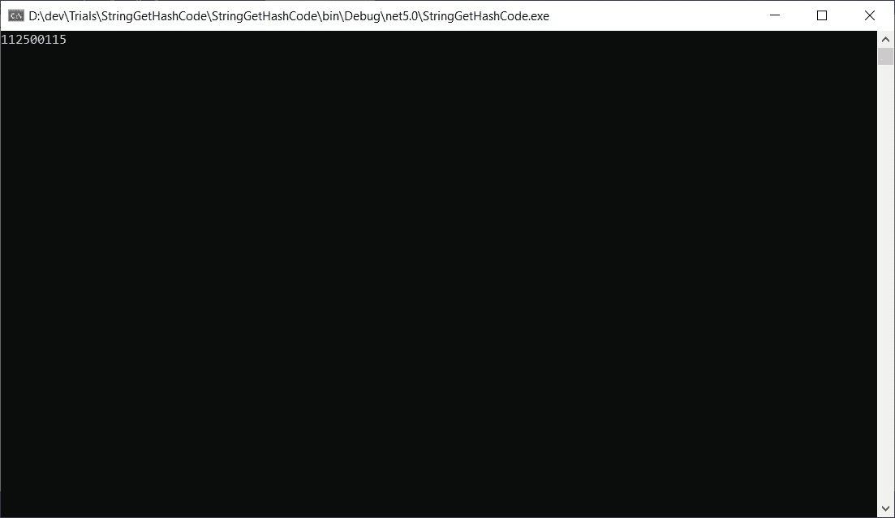

# 当字符串。中的 GetHashCode()。NET C#让你抓狂

> 原文：<https://itnext.io/when-string-gethashcode-in-net-c-drives-you-crazy-c97ac7507d7b?source=collection_archive---------2----------------------->

## 提示和技巧

## 知道什么时候依赖字符串。中的 GetHashCode()。NET C#，而当不是。

在 [Unsplash](https://unsplash.com/?utm_source=unsplash&utm_medium=referral&utm_content=creditCopyText) 上由[Bozhin karivanov](https://unsplash.com/@bkaraivanov?utm_source=unsplash&utm_medium=referral&utm_content=creditCopyText)拍摄的照片

# 故事

我正在做一个辅助项目，是一个帮助我日常工作的工具。在一个模块中，我需要跟踪一些可以在工具运行之间执行的事务。换句话说，当我关闭和打开工具时，这些事务应该在那里。

对于存储，我使用了 SQLite 数据库，其中保存了表示我的事务类的实体的哈希代码。我依赖于这个哈希代码，因为在某个时候，该工具会生成一个新的哈希代码，并将其与数据库中已经保存的哈希代码进行比较。

所以，在设置好一切之后，我启动了这个工具，试了一下，是的…它工作了。我关闭了工具，做了一些事情，然后尝试测试另一个东西，现在它不能正常工作了！！

我一直试图理解这是怎么回事，最终我明白了。哈希代码比较不太好。在工具的同一个运行会话中，比较工作正常。然而，当我关闭和打开该工具时，新生成的哈希代码——对于相同的事务——与保存在数据库中的代码不同。

我上网搜了一下，发现确实如此。据[微软](https://docs.microsoft.com/en-us/dotnet/api/system.string.gethashcode?view=net-6.0):

> 哈希代码本身不能保证是稳定的。相同字符串的哈希代码可以不同。NET 实现，跨。NET 版本，以及跨。NET 平台(如 32 位和 64 位)的单一版本。在某些情况下，它们甚至可以因应用程序域而异。这意味着同一程序的两次后续运行可能会返回不同的哈希代码。
> 
> 因此，哈希代码决不能在创建它们的应用程序域之外使用，决不能用作集合中的键字段，也决不能持久化。
> 
> 最后，如果您需要一个加密的强哈希，不要使用哈希代码来代替加密哈希函数返回的值。对于加密散列，使用从[系统派生的类。security . cryptography . hash algorithm](https://docs.microsoft.com/en-us/dotnet/api/system.security.cryptography.hashalgorithm?view=net-6.0)或[系统。security . cryptography . keyedhashalgorithm](https://docs.microsoft.com/en-us/dotnet/api/system.security.cryptography.keyedhashalgorithm?view=net-6.0)类。
> 
> 有关散列码的更多信息，参见[对象。GetHashCode](https://docs.microsoft.com/en-us/dotnet/api/system.object.gethashcode?view=net-6.0) 。

因此，我现在与你分享这个，我将告诉你如何以一种好的方式克服它。

 [## 订阅艾哈迈德的时事通讯？

### 订阅艾哈迈德的时事通讯📰直接获得最佳实践、教程、提示、技巧和许多其他很酷的东西…

medium.com](https://medium.com/subscribe/@eng_ahmed.tarek) 

照片由[布雷特·乔丹](https://unsplash.com/@brett_jordan?utm_source=unsplash&utm_medium=referral&utm_content=creditCopyText)在 [Unsplash](https://unsplash.com/?utm_source=unsplash&utm_medium=referral&utm_content=creditCopyText) 上拍摄

# 让我们试一试

用下面的代码创建一个控制台应用程序。

一个简单的类`Employee`和一个简单的接口实现`IEquatable<Employee>`。

请注意`GetHashCode`方法是如何实现的。

运行应用程序时，我们会得到以下结果:

图片由[艾哈迈德·塔里克](https://medium.com/@eng_ahmed.tarek)拍摄

现在，停止应用程序，并再次运行它。这是我们得到的结果:

图片由[艾哈迈德·塔里克](https://medium.com/@eng_ahmed.tarek)拍摄

看，两个结果不一样。

照片由[沃尔坎·奥尔梅斯](https://unsplash.com/@volkanolmez?utm_source=unsplash&utm_medium=referral&utm_content=creditCopyText)在 [Unsplash](https://unsplash.com/?utm_source=unsplash&utm_medium=referral&utm_content=creditCopyText) 上拍摄

# 解决这个问题的正确方法

## 数组质量比较器

## 严格的延伸

## 固定雇员

运行应用程序时，我们会得到以下结果:

图片由[艾哈迈德·塔里克](https://medium.com/@eng_ahmed.tarek)拍摄

现在，停止应用程序，并再次运行它。这是我们得到的结果:

图片由[艾哈迈德·塔里克](https://medium.com/@eng_ahmed.tarek)拍摄

看，两个结果是一样的。

照片由[MIO·伊藤](https://unsplash.com/@mioitophotography?utm_source=unsplash&utm_medium=referral&utm_content=creditCopyText)在 [Unsplash](https://unsplash.com/?utm_source=unsplash&utm_medium=referral&utm_content=creditCopyText) 拍摄

# 摘要

如果您需要`String.GetHashCode()`的结果在您的应用程序运行会话之间保持不变，您将需要遵循这种方式或另一种类似的方式。否则，每次停止并运行应用程序时，您都会得到一个新的结果。

就这样，希望你觉得读这个故事和我写它一样有趣。

# 希望这些内容对你有用。如果您想支持:

如果您还不是**媒介**会员，您可以使用 [**我的推荐链接**](https://medium.com/@eng_ahmed.tarek/membership) ，这样我就可以从**媒介**中获得您的一部分费用，您无需支付任何额外费用。
▎订阅 [**我的简讯**](https://medium.com/subscribe/@eng_ahmed.tarek) 将最佳实践、教程、提示、技巧和许多其他很酷的东西直接发送到您的收件箱。

# 其他资源

这些是你可能会发现有用的其他资源。

 [## 中更好地增强了存储库模式的实现。NET C#

### 了解如何通过增强的设计来实现存储库模式以满足扩展的需求。

levelup.gitconnected.com](https://levelup.gitconnected.com/better-enhanced-repository-pattern-implementation-in-net-c-4e6f4bbe48a9)  [## 如何全面覆盖。带有单元测试的. NET C#控制台应用程序

### 知道什么吗？又是怎么做到的？使用 TDD、DI 和 IoC 完全覆盖您的控制台应用程序。

itnext.io](/how-to-fully-cover-net-c-console-application-with-unit-tests-446927a4a793)