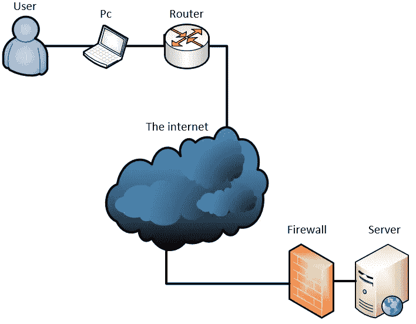
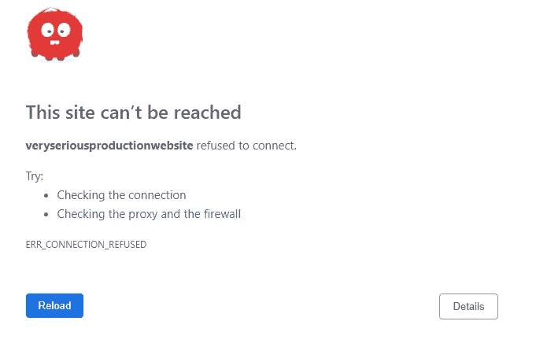
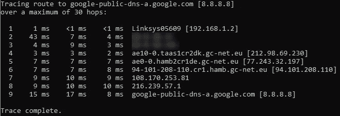
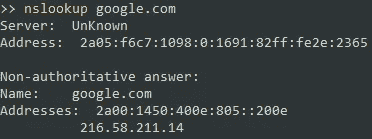

# 当网络是你的问题(开发者版)。

> 原文：<https://itnext.io/when-the-network-is-your-problem-developer-edition-bbdfe563fd3b?source=collection_archive---------11----------------------->

*   [拓扑](#b241)
*   [问题](#c50c)
*   [平](#1e1d)(可达性)
*   [Tracert (traceroute)](#a363) (可达性 2.0)
*   [Telnet](#c5f3) (端口/防火墙测试)
*   [Nslookup](#77c0) (DNS 测试)

我见过许多初级甚至高级开发人员努力找出问题在网络拓扑中的位置。开发人员需要知道如何对网络相关问题进行故障诊断，不一定要修复它们，但最重要的是帮助找出问题所在。

这篇文章将介绍基本的工具，以及如何使用它们来找出问题所在。

# 拓扑结构

这篇文章假设了一些关于互联网如何连接的知识，一个好的入门可以在这里找到

我将把所有的例子都建立在以下非常通用的拓扑结构上，至少在某种程度上，它应该与大多数设置相似。



非常普通的网络拓扑。

# 问题是

你试着去你正在做的网站，你被击中了



无法访问网站(chrome 版)

S#！%…好的，放松…呼吸…

首先要注意的是，我们没有从服务器得到任何类型的响应。

**任何类型的响应都意味着网络正在工作，问题出在 web 服务器(IIS、Apache 等)。)，与代码或文件系统相关。**


可以访问 web 服务器，但在此地址找不到网站。

或者

您尝试连接到服务器上的 RPC 服务，但它没有响应。

无论哪种情况，问题都是一样的。

# 砰

[Ping](https://en.wikipedia.org/wiki/Ping_(networking_utility)) 是一个实用程序，它向给定的 IP 地址发送 [ICMP](https://en.wikipedia.org/wiki/Internet_Control_Message_Protocol) echo 请求，并返回到达该目的地所用的时间。ICMP 是它自己的协议，没有端口的概念。因此，您只是在测试服务器是否响应 ICMPs。

## 使用

```
ping {IP}
```


平 8.8.8.8

## 赞成的意见

*   测试从客户端到服务器的整个链。
*   可以设置为 ping，直到停止(这有利于检查服务器何时重新启动)

## 骗局

*   可以在生产防火墙中被阻止。
*   如果失败了，我们通常不知道原因或地点。这可能是客户端和外部的失败。
*   不测试 DNS。

## **测试链—成功**

ping 成功后，我们知道客户端可以通过 ICMP 到达服务器。
问题可能是**端口**或 **DNS**


## 测试链—故障

如果失败了，我们真的不知道在哪里或如何失败。您可以从这里开始从客户机输出/服务器输入 ping——或者尝试使用 tracert。


# Tracert(跟踪路线)

接下来自然要从平说起。Traceroute 也利用 ICMP 请求，但是返回每一跳的响应时间，这意味着该实用程序可以显示数据包到达目的地所经过的路线。

这有助于找出路由中的任何瓶颈，以及通信在哪个端点停止。

**举例**；服务器的本地防火墙阻止了所有连接。使用 tracert 时，我们可以看到一切，但服务器响应。故障排除现在可以在服务器上继续，因为我们知道网络是好的。

## 使用

```
tracert {IP}
```



特勒特·8.8.8.8

## **优点**

*   测试从客户端到服务器的整个链。
*   可以在到达目的地的途中看到各个 hit 端点。

## 骗局

*   仍然使用 ICMP，可能被生产防火墙/服务器阻止。
*   不测试 DNS。
*   作为开发人员，我们对路由问题无能为力，只能在适当的时候报告它们。

## **测试链—成功**

如果输出看起来很好，并且有“预期的”跳数，我们知道客户端可以通过 ICMP 到达服务器。
问题可能是**端口**或 **DNS**


## 测试链—故障

如果它在某个点后超时，我们知道我们至少可以到达那个点。—调查应从故障点继续，之前的一切通常都可以排除(除非还出现其他问题)


# 用于远程联接服务的标准协议或者实现此协议的软件(可为动词)

[Telnet](https://en.wikipedia.org/wiki/Telnet) 用于建立 TCP/IP 连接。在故障排除场景中，我们可以使用它来测试远程服务器上的给定端口是否打开并可访问。

当您连接到网站时，您的浏览器会在该服务器的端口 80/443 上建立 TCP/IP 连接。

您可以运行一个类似的 powershell 命令，它做同样的事情，如果连接失败，它会执行 ping 命令，并尝试进行名称解析。

## 用法 Telnet

```
telnet {IP/FQDN} {PORT}
```

如果您得到一个空白屏幕或任何输出-连接已经建立。


## 使用测试-网络连接

```
Test-NetConnection {IP/FQDN} -Port {PORT}
```


测试-网络连接 google.com-端口 443

## 赞成的意见

*   可以直接告诉我们，或端口是否打开—任何端口。
*   测试-网络连接测试；TCP，PING 和 DNS 与上述命令。(使用`| select -property *`获取所有属性)

## 骗局

*   在较新版本的 windows 中默认不安装(安全)(可以作为一项功能安装)(或者只使用 Test-NetConnection)
*   Telnet 不测试 DNS，Test-NetConnection 测试。

## 测试链—成功

如果建立了连接，我们就知道网络状况良好，并且服务器在正确的端口上响应。—错误出现在有问题的实际服务器上。或者可能是负载平衡器的问题(同样，需要告诉相应的团队)


## 测试链—故障

如果我们已经知道我们可以 ping 或 DNS 是正确的，但我们不能连接到有问题的端口，我们现在知道该端口要么是服务器上的**关闭了**，要么是防火墙阻止了**。**

****

# **Nslookup(摘要)**

**[Nslookup](https://en.wikipedia.org/wiki/Nslookup) 或 linux 上的 dig，用于检查 DNS 记录。通常，DNS 的问题是记录的传播时间和 TTL。**

**一般的问题是要么；**

1.  **DNS 条目中的 IP/主机名错误**
2.  **客户端上的陈旧记录**

## **使用**

```
nslookup {FQDN}
```

****

**nslookup google.com 响应**

## **赞成的意见**

*   **检查 DNS 方面的情况，如果名称与您期望的地址匹配，则一切正常(可能)
    DNS 需要一段时间来传播，因此 DNS 可能在互联网的某些部分工作，而在其他部分可能不工作。一般来说，最多 24 小时(通常在一小时左右)**

## **骗局**

*   **仅检查 DNS**