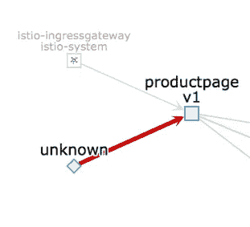

# Istio 中的‘未知’流量从何而来(更新)？

> 原文：<https://itnext.io/where-does-the-unknown-taffic-in-istio-come-from-4a9a7e4454c3?source=collection_archive---------4----------------------->

(根据我的同事 [Joel](http://twitter.com/jotak) 的评论和发现更新)

当您使用 [Istio](https://istio.io/) 并可能安装了 [Kiali](https://www.kiali.io/) 时，您可能会发现有时数据来自“未知”:



不要担心，这不是黑客向您的服务发送数据。最有可能的情况是，Istio 记录的服务和工作负载的流量不是来自部署了 Envoy 代理的源 pod，因此不是网格的一部分。

**入口流量**

Istio 希望流量通过*入口网关*。当您看到“未知”流量时，可以简单地使用标准 Kubernetes 入口或 OpenShift 路由将流量从外部发送到 Istio。

您可能认为这不是问题，因为流量到达您的服务，然后从那里也是网格的一部分。这多半是真的。

但是你也错过了流量控制、报头重写、入口网关和服务之间的相互 TLS 的机会。

**内部流量**

“未知”流量的另一个来源是(Kubernetes)集群内的(正常)pod，它们没有部署 Envoy sidecar，因此不属于网状网络。

例如，从 kubelet 或 Prometheus 调用您的应用程序中的/health 或/metrics 可能会引发这种情况。

您可以通过调整 match 子句来修改 Istio-config 规则，从而过滤掉此流量(根据 Istio 版本，关于 kube-probe 的部分可能已经存在:

```
$ kubectl edit rules.config.istio.io promhttp -n istio-system

[...]
**match**: (context.protocol == "http" || context.protocol == "grpc") &&
 (match((request.useragent | "-"), "kube-probe*") == false) &&   
 (match((request.useragent | "-"), "Prometheus*")  == false)
```

这上面有一个针对 Istio 的[公开的 PR。](https://github.com/istio/istio/pull/12251)

**处理“未知”流量**

随着时间的推移，您希望将所有服务迁移到网格上。如果您担心这种未知流量，您还可以使用 [Istio 规则将该流量列入黑名单](https://istio.io/docs/tasks/policy-enforcement/denial-and-list/#simple-denials)。