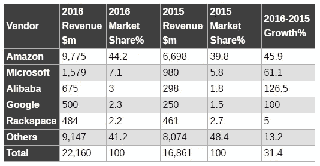
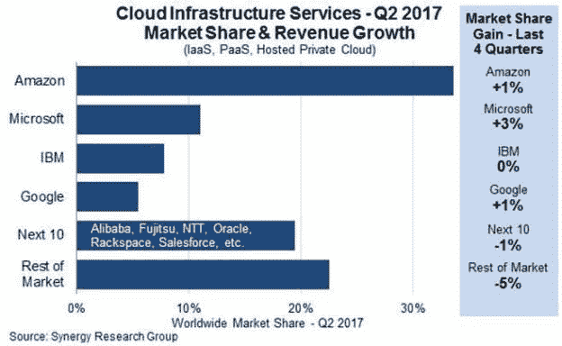
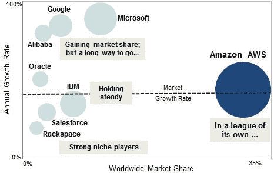
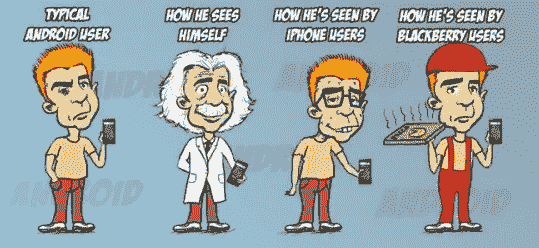
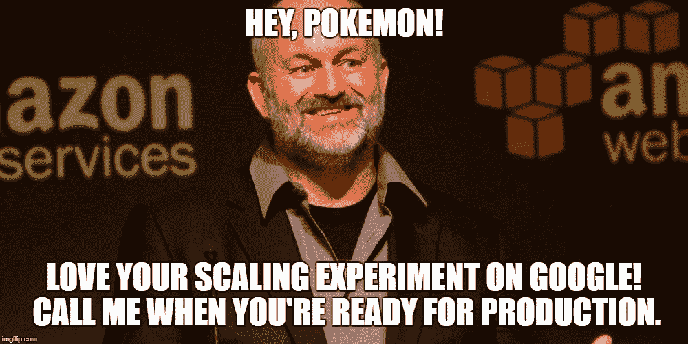
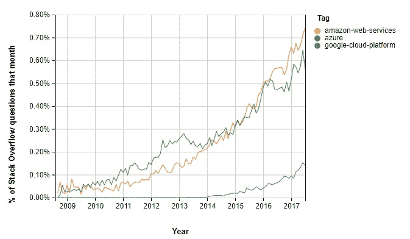
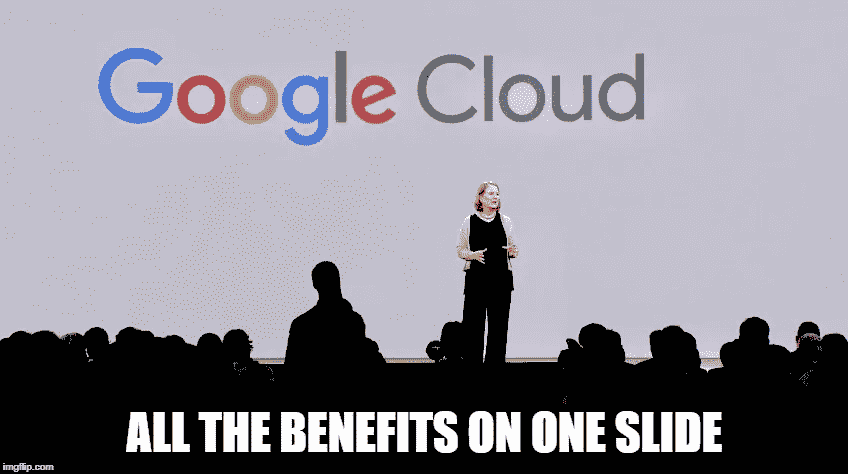
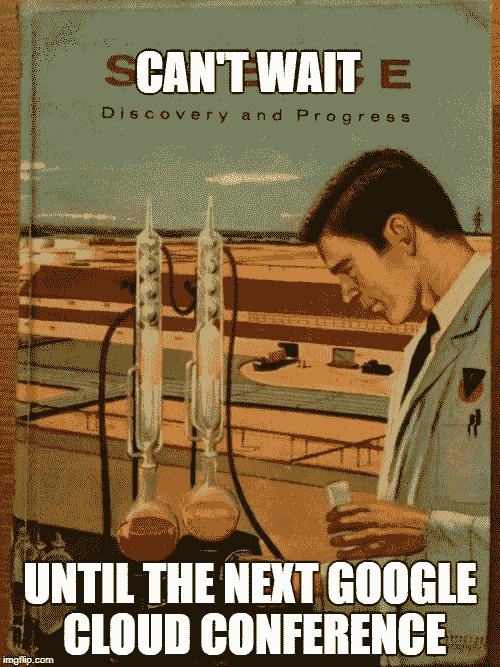

# 谷歌云哪里出问题了？

> 原文：<https://itnext.io/where-google-cloud-is-going-wrong-729e78f6c160?source=collection_archive---------0----------------------->

尽管提供了可靠的产品，谷歌云平台仍在努力寻找受众。

比较三大云提供商就像测量高性能跑车——你可以争论各种车型的微妙之处，但最终它们与丰田完全不同。

在这些云巨头中，虽然 AWS 已经加速奔向遥远的未来，但对第二名和第三名的争夺也很激烈——这是一场谷歌目前正在输掉的比赛。

从表面上看，这张表让我的论点看起来毫无根据——GCP 在 2016 年增长了 100%。但是百分比比较只有在大小大致相似时才有效。这是一个正在爆炸的 220 亿美元的市场，而谷歌只有其中的 5 亿美元。微软是它的 3 倍，亚马逊是 T2 的 20 倍。甚至阿里巴巴(他们有云！)在收入份额方面已经取代了谷歌。

对 2017 年数据的一瞥也应该让谷歌人感到担忧:

规模较小的公司正在萎缩。当亚马逊的存在如此巨大时，很难比较它们的百分比，但在其他公司中，微软显然正在争夺云领域的第二名。

在这个巨大的市场中，云领域的亚军是一件大事。有一些公司根本不会使用亚马逊，主要是因为它被视为竞争对手，或者其他云可能更适合现有的工具集。微软已经在“除了亚马逊以外的任何人”领域发起了强大的全面进攻，取得了惊人的成功，而谷歌坦率地说正在拖延。

谷歌是最初的全球规模、高可用性平台——它应该*轻松*在这个行业中摘得桂冠。除了图表，我还从客户和其他云从业者那里听到了对他们是否会继续使用 GCP 越来越悲观的看法。那么，哪里出了问题？

# 谷歌不够企业化。

早在 2010 年，我是谷歌应用套件的超级粉丝，花了很多时间说服公司放弃 Office，转而使用浏览器。我甚至写了一本关于 Google Apps 的怪异的书,在对 Google Apps 如何很快在所有电子邮件和生产力方面超越微软的愤怒中。

我盲目乐观地认为，与 Office 相比，谷歌在应用领域取得辉煌胜利的原因显而易见:

*   基于浏览器，独立于操作系统，自我更新。
*   突破性的实时编辑与在线集成相结合。
*   Gmail 对 Outlook 就像打字机对石碑。
*   廉价。

天哪，我错了！人们看着我，好像我疯了一样。谷歌应用程序从未真正站稳脚跟。几年后，微软对 Apps 窃取了个位数的市场份额感到有些恼火，并以 Office 365 击败了它，Office 365 现在是 SaaS office 使用的最大份额。

那是怎么发生的*？如果你有幸使用过 Office 365，它结合了 Outlook 最糟糕的一面，Office 功能集的大幅缩减，而且没有谷歌应用程序的任何酷东西。然而，企业用户已经蜂拥而至。*

当我问公司高管为什么选择微软时，答案总是一样的——365 提供了一条自然的升级路径，是对用户的一次进化，不需要为现有的许可证支付任何费用，并且得到了他们 it 部门的支持。简而言之，这是一次企业升级，潜在的基调是谷歌并不是真正的*企业。*

简而言之，这是谷歌云的同样问题。如果你去参加会议，看看营销材料，看看合作伙伴生态系统，他们根本没有有效地针对企业受众。它是技术性的，它是书呆子，它是学术性的，它是深奥的，无论他们在竞争中有什么技术优势，都被大型采用者完全忽视，并被竞争对手超越。

有关系吗？*断然*，是的。你需要大型企业客户的数量、收入、规模，以及最终为你带来更多大客户的信誉。

企业 IT 提供商？或者托儿所？

# 谷歌需要停止淘汰产品。

我 100%确定 DynamoDB 在未来 10 年内不会消失。但老实说，我一点也不确定 FireBase 是否会在下一季度出现。这是我从很多公司那里听到的一个真正普遍的担忧:“是的，谷歌<插入产品名称>很棒，但是他们真的承诺了吗？”

这是近年来过于激进的退休的直接副作用，从没人使用的伟大想法(Google Wave)到每个人都使用的不错的软件(Google Reader)和人们围绕其建立业务的关键软件(Insights for Search)。即使是奇思妙想的产品，十年也没有发展(谷歌语音)。iGoogle、Google Talk、Google Health、Picnik、Google Buzz——全都消失了，消失了，消失了。这是一个虚拟的墓地。

“这是未来”和“不，我们会杀死它”之间的加速已经达到了一个点，很快他们将在同一个句子中启动和退休。“我们很高兴地宣布我们的新测试版，您可以在 12 月关闭前下载您的数据。”

然后就是僵尸产品问题，如 Google+所示。它是死的，活的还是什么？谷歌高管的官方说法相互矛盾，称他们正在[关闭](https://www.inc.com/john-brandon/the-long-painful-road-to-finally-end-the-google-misery.html)……不，现在将是“[更加专注](https://www.google.com/url?sa=t&rct=j&q=&esrc=s&source=web&cd=5&cad=rja&uact=8&ved=0ahUKEwiEguve7OHYAhUPyVMKHcxqAsMQFghIMAQ&url=https%3A%2F%2Fwww.nbcnews.com%2Ftech%2Finternet%2Fgoogle-admits-google-confusing-n399581&usg=AOvVaw2Iyaz-LihzmAOC3eCS14kr)”——等等，我们[还没有放弃](https://www.google.com/url?sa=t&rct=j&q=&esrc=s&source=web&cd=4&cad=rja&uact=8&ved=0ahUKEwiEguve7OHYAhUPyVMKHcxqAsMQFghCMAM&url=https%3A%2F%2Fwww.cio.com%2Farticle%2F3161292%2Fsocial-networking%2Fwhy-google-still-isnt-giving-up-on-google.html&usg=AOvVaw2GNsl_sIlwIUgkfxVpL0Md)，它还在。这是对待一个正式推出与脸书竞争的平台的方式吗？甚至还有关于如何在不影响 Gmail 的情况下删除你的 Google+账户的文章，这就是问题的症结所在。

谷歌的核心是一个重大的产品管理问题，这直接影响了它对云的采用。当你不可预测地关闭服务时，公司不会对你的平台做出承诺。亚马逊和微软都明白这一点，并拥有支持其云产品的良好记录。

谷歌臭名昭著的退休“战略”让每件产品看起来都像是一种爱好。(如果你认为这有些言过其实，只要问问围绕 [Google Realtime API](https://www.programmableweb.com/news/google-realtime-api-retiring/brief/2017/11/29) 开发软件的人就知道了。)

# 谷歌不是销售公司。

谷歌拥有世界上最成功的广告平台，但如果你曾经使用过 AdWords，你会发现它是由开发者而非营销者设计的。普通公司很难推出 AdWords 活动，也很难使用几乎每个人都想要的核心谷歌产品，以至于谷歌曾经推出 AdWords Express 来解决这个问题(但没有)。

另一方面，脸书展示了如何向非技术人员销售几乎相同的产品，并建立了一个普通公司都可以使用的非常成功的平台。谷歌错过了这个巨大的机会，因为它不是一家销售公司，我在各种发布会上一再看到这一点。

例证:去年的谷歌 Next 大会是我见过的唯一一次随着日期临近而变得更便宜的科技大会。你可以提前六个月买一张 1500 美元的票，或者等到两周前再买一张同样的 500 美元的票(不可否认，这是一个广泛分布的供应商折扣)。从航空公司到音乐会，没有人这样操作。它没有为这次活动制造任何轰动效应，并且公然违背了市场营销的稀缺模式。(为了比较，试着找一张 re:Invent 的打折券。)

同样的情况也发生在高级和标准网络层的定价混乱上。谷歌网络主干不是作为高级升级推出的，而是(奇怪地)作为标准网络选项*降级*。你不会相信有多少人认为谷歌提高了网络服务的价格，却不明白这是什么。这就像 AWS 宣布了 Glacier，但给客户留下了这样的印象:现在你为你立即需要的数据付费。

在云中，AWS 和 Azure 有企业级的销售工作，整个供应商生态系统随时准备为他们销售。至少从销售的角度来看，与这些公司打交道，看起来和闻起来都只是打电话给过去的大型科技公司，并在一定规模上，瞄准熟悉的客户。一切都是新的，但感觉还是一样。相比之下，谷歌的销售努力充其量是业余的。

# 谷歌不是一家支持公司。

谷歌实际上创造了软件不需要支持的理念——Gmail 没有 1800 号码，它也不需要，因为它使用简单，而且总是有效。人们很容易忘记，在谷歌出现之前，软件几乎总是附带支持。不幸的是，这种方法不适用于云计算。

与许多谷歌产品一样，他们的免费(即开发者)云支持往往集中在谷歌工程师很少访问的贡献微薄的用户论坛上。有几次我为了工作项目冒险去 GCP，当我遇到神秘的障碍时(比如幻影[数据库断开问题](https://cloud.google.com/sql/docs/mysql/diagnose-issues)，我很快意识到我永远不会得到答案，于是跑回 AWS。

我知道，我知道，所有的云供应商都有糟糕的文档和参差不齐的支持。但是当我转向开发者的官方灭火器，堆栈溢出，你可以看到那里也没有太多对 GCP 的支持，这只是放大了谷歌提供更多支持的需要。

# 谷歌云不知道自己做什么更好。

谷歌云在许多事情上比微软或亚马逊做得更好，但不要指望谷歌会告诉你它们是什么。

再一次，Google Next(他们的云会议)坚定地停留在“云不是很棒吗？”这是五年前的对话，而与会者应该睁开眼睛，被洗脑到他们的人工智能发电站的威严中。相反，听众听到的是硅谷历史上最糟糕的科技主题演讲之一，我完全不记得其中有任何内容。

说真的，谷歌的人工智能和深度学习工具绝对摧毁了竞争，那么为什么这不是我们听到的主要信息呢？“我们现在有了按秒计费，”他们[温顺地宣布](http://www.businessinsider.com/google-cloud-matches-amazon-web-services-with-per-second-billing-2017-9)——几天前亚马逊抢先了一步(谷歌实际上实施得更快，但输掉了公关战)。说真的，低价虚拟服务器的竞争到底有什么价值呢？该死，给我们看看你的酷玩具！

甚至像 FireBase 这样简单的工具也没有被提升为竞争优势。在 AWS 中构建 FireBase 的等价物并不简单(为什么要这么做？).一个云专家关于[建立一个视频分享网站](https://acloud.guru/learn/serverless-for-beginners)的教程展示了使用 Firebase 是多么简单。这是一款非常非常棒的产品，用途广泛。但是我经常听到的是太贵了(真的吗？)和去年大规模的意外价格变化[搞砸了一些 dev](https://startupsventurecapital.com/firebase-costs-increased-by-7-000-81dc0a27271d)。

# 谷歌云的下一步是什么？

我曾经与一位前谷歌高管共事，他说该公司很难专注于收入排行榜首页以外的任何东西，我认为这解释了它对云的漫不经心的态度。鉴于广告占整个公司收入的 90%以上，当他们的云销售额如此之低时，这可能是有意义的。

但是作为一个超级谷歌粉丝，看到这一点让我很痛苦。亚马逊没有忽视 AWS，因为它的真正重点是零售，微软也没有因为 Windows 和 Office 而让 Azure 成为一个次要项目。这些障碍应该是可以克服的，因为技术是好的，基础设施也是有的。

不幸的是，我不抱希望。人们对 AWS 感到兴奋，关于 Azure 的讨论也越来越多。吹嘘谷歌云认证的人在哪里？谁等不及 Google Next 2018 发布会了？GCP 有一种利基供应商的感觉，在主要云以闪电般的速度迭代功能的时候，它正在倒退。

我很不情愿地发现自己暂停了与谷歌的合作，更多地在任何事情上使用 AWS。由于学习新工具的时间有限，而且客户需要可靠的企业级解决方案，所以我不再经常谈论这个平台。但是我希望——只是希望——谷歌证明我是错的，因为我仍然是他们的头号粉丝。