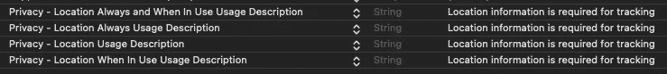
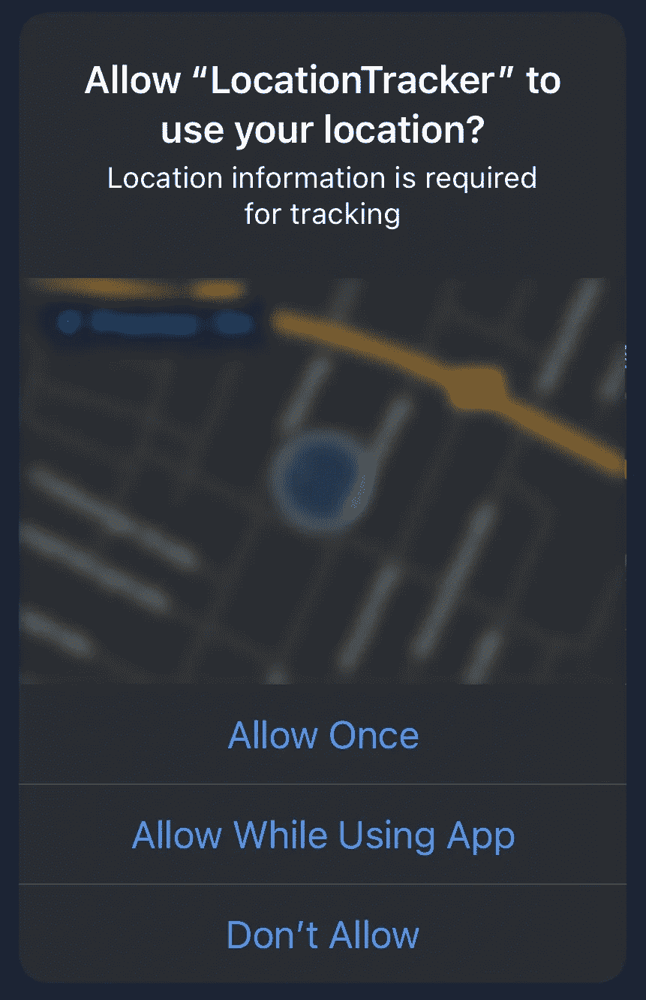

# 我的 iPhone 在哪里？

> 原文：<https://itnext.io/where-is-my-iphone-fb75e5bd380?source=collection_archive---------5----------------------->

## 核心定位教程


[西尔维娅·巴蒂泽尔](https://unsplash.com/@sylwiabartyzel?utm_source=medium&utm_medium=referral)在 [Unsplash](https://unsplash.com?utm_source=medium&utm_medium=referral) 拍摄的照片

这篇文章是关于如何使用苹果的 CoreLocation 框架检索 iPhone 或 iPad 的地理位置的教程。

我首先介绍了为设备位置的变化设置监听器的所有必要步骤。

在这篇文章的最后，我将把所有的东西打包成一个方便的联合发布器。

如果你喜欢这篇文章，请给我买杯咖啡。

## 位置管理器

完成所有工作的主类是`CLLocationManager`。我们来实例一个。

```
private let locationManager = CLLocationManager()
```

需要一个代理来接收位置更新。

```
self.locationManager.delegate = self
```

该委托需要实现以下函数。我只是做了一个简单的例子，打印接收到的经度和纬度。

```
func locationManager(_ manager: CLLocationManager, didUpdateLocations locations: [CLLocation]) {
    guard let location = locations.last else { return }
    print("Longitude: \(location.coordinate.longitude)")
    print("Latitude: \(location.coordinate.latitude)")
}
```

然后，我们设置所需的精度。有很多选项可以设置，我仍然需要弄清楚它们的行为。

```
self.locationManager.desiredAccuracy = kCLLocationAccuracyBest
```

准确性还与应用程序何时应该或允许跟踪位置有关。

以我的情况为例，我想跟踪位置，即使应用程序没有被积极使用。

应用程序必须为此请求。因此，我们必须进行以下调用。

```
self.locationManager.requestAlwaysAuthorization()
```

我们还需要在`Info.plist`中设置一些键。这些都是必需的，没有它们要跟踪根本就不可用。



配置

然后，当用户启动应用程序时，会提示她确认此请求。



请求授权

回到我们的代码，还需要一个步骤来实现这一切。

```
self.locationManager.startUpdatingLocation()
```

是的，就这些。我们完了。

## 包装它

正如开始时所承诺的，我已经将完整的代码放入了一个实现合并发布器的类中。

如果您不确定我在这里说的是什么，请查看文档末尾的参考资料部分，以便进一步阅读。

```
import Combine
import CoreLocation
import Foundation

class LocationPublisher: NSObject {

    typealias Output = (longitude: Double, latitude: Double)
    typealias Failure = Never

    private let wrapped = PassthroughSubject<(Output), Failure>()

    private let locationManager = CLLocationManager()

    override init() {
        super.init()
        self.locationManager.delegate = self
        self.locationManager.desiredAccuracy = kCLLocationAccuracyBest
        self.locationManager.requestAlwaysAuthorization()
        self.locationManager.startUpdatingLocation()
    }
}

extension LocationPublisher: CLLocationManagerDelegate {
    func locationManager(_ manager: CLLocationManager, didUpdateLocations locations: [CLLocation]) {
        guard let location = locations.last else { return }
        wrapped.send((longitude: location.coordinate.longitude, latitude: location.coordinate.latitude))
    }
}

extension LocationPublisher: Publisher {
    func receive<Downstream: Subscriber>(subscriber: Downstream) where Failure == Downstream.Failure, Output == Downstream.Input {
        wrapped.subscribe(subscriber)
    }
}
```

每当位置改变时，发布者将发出经度和纬度的元组。

我们只需要订阅这些变更来处理它们。

这可以通过调用`sink`并传递一个函数来实现。

```
let locationPublisher = LocationPublisher()
var cancellables = [AnyCancellable]()
locationPublisher.sink(receiveValue: doSomething).store(in: &cancellables)

func doSomething(location: (longitude: Double, latitude: Double)) {
    print("Longitude: \(longitude)")
    print("Latitude: \(latitude)")
}
```

今天到此为止。我希望你喜欢这篇文章，并发现它很有用。

如果你喜欢这篇文章，请给我买杯咖啡。。

## 资源

*   [向您的应用添加定位服务](https://developer.apple.com/documentation/corelocation/adding_location_services_to_your_app)
*   [选择位置服务授权请求](https://developer.apple.com/documentation/corelocation/choosing_the_location_services_authorization_to_request)
*   [联合收割机](https://developer.apple.com/documentation/combine)