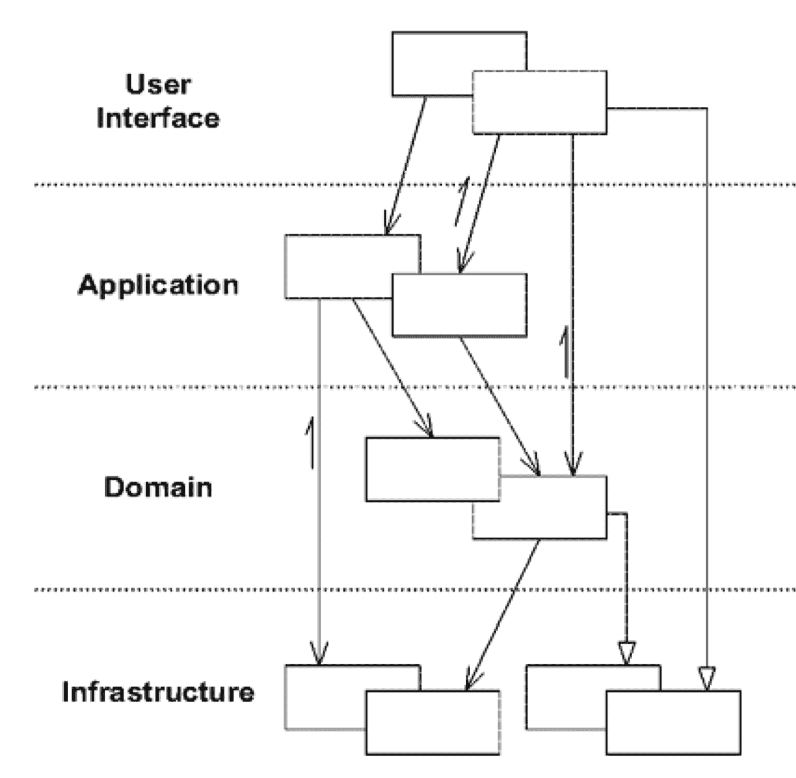
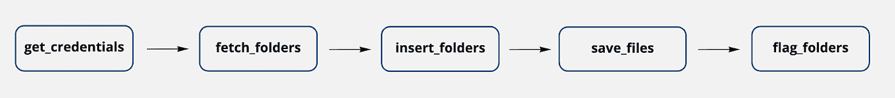
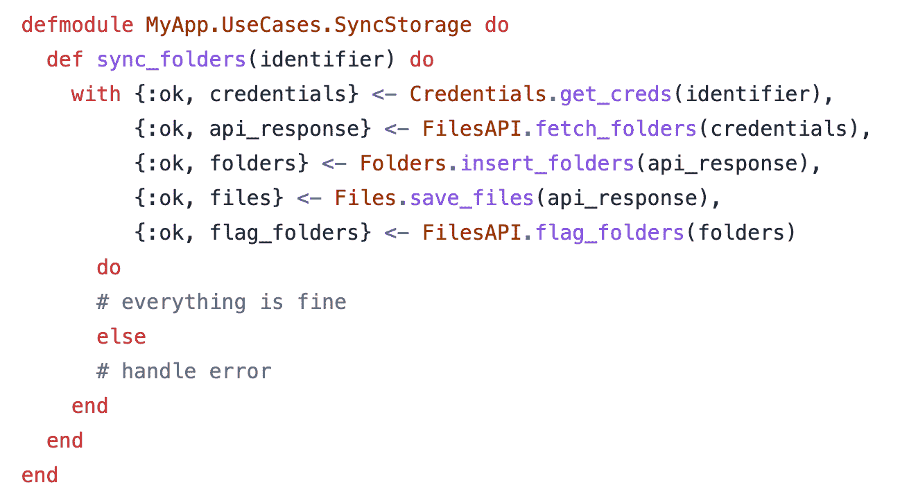
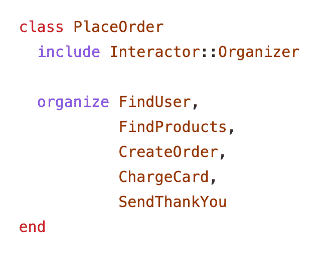
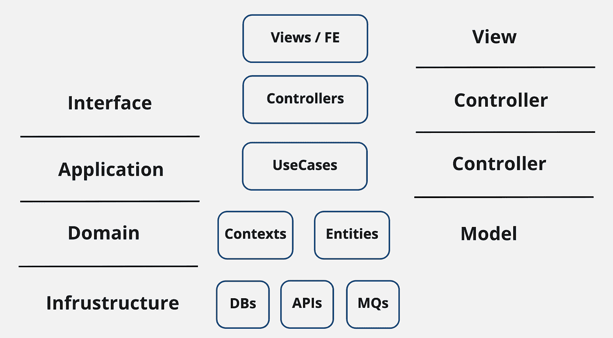

# 「应用层」在哪里？

> 原文：<https://itnext.io/where-is-the-application-layer-6c65a459543a?source=collection_archive---------2----------------------->

当我开始推广我的新项目 [ALF(应用层框架)](https://github.com/antonmi/ALF)时，我意识到许多人对“应用层”是什么以及为什么我们需要一个这样的框架有点困惑。我能理解这种困惑。我的许多朋友和同事使用 Ruby 和 Elixir 作为主要的编程语言，并用流行的框架编写他们的代码——分别是 Ruby on Rails 和 Phoenix。这些 MVC 框架没有对“应用层”进行适当的抽象，所以人们通常将领域和应用层逻辑混合成一堆相互连接的对象/功能。

在本文中，我将通过一个简单的例子来说明什么是应用层，以及如何通过清晰地将领域层逻辑与应用层逻辑分离来重构混乱的代码库。这也暗示了 MVC web 框架中缺少一个抽象。

# 分层架构

我会效仿经典作家埃里克·埃文斯，从他的《DDD》一书中引用几段话。

首先，我们为什么需要层次？

*“在面向对象的程序中，UI、数据库和其他支持代码通常被直接写入业务对象。额外的业务逻辑嵌入在 UI 小部件和数据库脚本的行为中。* ***发生这种情况是因为从短期来看，这是最容易让事情运转起来的方法。当与领域相关的代码分散在如此大量的其他代码中时，就变得非常难以理解和推理。”***

动机很明确——我们想让我们的程序更加简单明了，这样我们就可以轻松地引入变化和解决问题。

*“软件系统可以有各种各样的划分方式，但是根据经验和惯例，行业已经趋向于分层架构，特别是一些相当标准的层。分层的比喻应用如此广泛，以至于* ***对大多数开发者来说感觉很直观*** *。…基本原则是层的任何元素仅依赖于同一层中的其他元素或其下各层的元素。…当然，选择隔离最重要的内聚设计方面的层是至关重要的。”*

Eric 强调分层是“大多数开发人员的直觉”。我只能同意这一点。我甚至可以说，分层结构是我们的编程语言所强制的，因为对象/方法或模块/函数总是被放入树状结构中——一个函数调用另外两个函数，这两个函数又调用另外两个函数，以此类推。

*“同样，经验和惯例导致了一些趋同。尽管有许多变化，但是大多数成功的架构都使用了这四个概念层的一些版本:…"*

下面是书中的一张图片:

让我们一个一个的浏览这些层，但是不要按照上面图片中的顺序。

**界面层—** *“负责向用户展示信息，解释用户的命令。* ***外部行动者有时可能是另一个计算机系统而不是人类用户。***

因此，这一层包含一组程序的入口点(启动底层复杂业务逻辑的功能，通过这些功能可以将数据输入到系统中)，还包含一些出口点(通过这些出口点可以从应用程序中呈现/检索数据)。

**基础设施层—** *“提供支持更高层的通用技术能力:应用程序的消息发送、领域的持久性、UI 的绘图小部件，等等。* ***基础设施层也可以通过一个架构框架支持四层之间的交互模式。***

*这一层包含程序与外界交流所需的所有低级工具和库。当然，我们使用的框架也是软件工程师基础设施层的一部分。*

*应用层和域层是我们放置程序核心逻辑的地方。但是有什么区别，为什么我们需要两个？*

*这很简单，因为埃里克的书就是关于领域层的。*

**“负责表现业务概念、业务情况信息、业务规则。反映业务情况的状态在这里被控制和使用，即使存储它的技术细节被委托给基础设施。* ***这一层是商业软件的心脏。****

**所以，基本上，所有的业务逻辑都在这里。那么还剩下什么给**应用层**呢？**

****“定义软件应该做的工作，并指导表达域对象解决问题。这一层很薄。它不包含业务规则或知识，而只是协调任务，并将工作委托给下一层中的域对象的协作。”****

**它“定义工作”和“指导领域对象”，它“只协调任务和委派工作”。**

**我将使用 Eric 在 DDD 的书中广泛使用的语言隐喻，并按照以下方式区分领域层和应用层。**

**领域层定义了程序的语言——一组描述程序实体、它们之间的关系以及它们可以执行的动作的“单词”，而应用层则是由这些单词组成的句子。这是一个你用领域语言讲述的故事。**

**这说起来容易，但实际上，在某种意义上，每个功能都“定义作业”和“指导域对象”(数据)。从某种意义上来说，每个功能都“负责表现业务的概念”。最后，我们使用相同的编程语言为两层编写代码。在编程语言中，我们只是将数据和函数组合成树状结构，并用模块命名。**

# **一个例子**

**出于教育目的，让我们看看用 Elixir 编写的一段逻辑，并尝试确定功能的每个部分属于哪一层(域或应用程序)。我不会提供代码本身，但我认为提供“函数调用图”(在我们的例子中是树)会更好——一个显示函数和它们之间关系的图。它是从第三方“存储”中获取“文件”的代码的一部分，这些“文件”带有属于“客户”的“文件夹”，因此系统的“用户”可以使用客户的文件。**

****

**流程从接收存储器的“标识符”的“Storage.sync_folders”函数开始。该函数调用“get_credentials”从数据库获取“credentials ”,然后调用“sync _ folders`.`sync _ folders”使用“FilesAPI”服务获取文件夹，然后调用“insert_folders_and_files”函数(通过“handle_response”。然后它调用“get_customer”、“build_folders ”,等等。“DB”标签标记了与数据库交互的功能，“TpAPI”显示了与云上其他应用的交互(获取文件夹、存储文件、标记文件夹)。绿色省略号表示每个级别上使用的数据(实体):从存储标识符开始，然后出现凭证，然后是 api_response、文件夹、用户、客户、文件。**

**这里有很多东西，逻辑有点混乱。但是这是一个很好的例子，一些功能在几年内被几个工程师修改了，但是还没有被适当地重构。从常见的“最佳实践”的角度来看，代码没有什么特别的问题:功能很小，责任有限，功能的简单接口，隐藏了实现细节。唯一的问题是，为了了解正在发生的事情，一个人应该遍历整棵树，“只见树木不见森林”。**

**我建议通过识别能够呈现神秘的应用层的函数来正确地重构它。“故事”这个比喻会帮助我们。我们将要讲述的故事应该没有技术细节和工程术语。这应该是一个产品人员能够理解的故事(“无处不在的语言”——DDD 书中的核心思想)。**

**首先，我们必须确定故事中的演员是谁。这些是我们的业务实体，由相应的数据结构表示。所以我们的故事是关于用户、文件夹和里面的文件，加上一些额外的数据结构，比如凭证、客户、api_response。然后，代码对实体执行的操作有:获取数据、插入数据库等。**

**这个故事的一个变体是:“有了存储标识符，首先我们**从数据库中获取凭证记录**。然后我们**获取文件夹并将它们存储在数据库**中。然后我们**将文件**保存在云端，并将**标记文件夹**保存为已处理”。人们可能会对这里的低级技术抽象感到疑惑，比如“数据库”和“云”。你选择的语言也取决于产品经理的知识。如果业务人员了解什么是数据以及它们存储在哪里，那么用您的通用语言进行这样的抽象是可以的。或者您可以选择更抽象的术语，如“存储库”,以避免暴露实现细节。**

**这个故事非常简单，只提到了 5 个动作，它们一个接一个。因此，我会将应用层呈现为 5 个功能的序列。**

****

**当然，可能会有变化。例如，在初始代码中，“folders . insert _ and _ assign_users”函数首先调用“insert_folders”，然后调用“assign _ users”，因此为它单独添加一个步骤是有意义的。此外，还可以提到一些附加步骤，例如“为 FoldersAPI 准备参数”、“获取客户”等。因此，应用层中的功能数量可以很容易地增加到 10 个。在哪里停止没有简单的规则，但是在这个例子中我宁愿用 5 来停止。**

**现在，我只想使用强大的“with”宏将这 5 个函数调用到一个单独的函数中:**

****

**我将该功能放在一个单独的模块中，并使用了“用例”抽象。此外,` get_creds `、` fetch_folders '和其他函数在负责的上下文模块的范围内被调用:凭证、文件 API、文件夹、文件。**

**我想再次强调，你定义这些核心功能的方式取决于你的领域的复杂性。例如,“插入文件夹”可以是一个简单的数据库操作，因此可以与“获取文件夹”组合成类似“处理文件夹”的东西。或者相反，“insert_folders”可能有一个如何处理原始数据的复杂逻辑，其中包含大量的附加业务规则。在这种情况下，您可以添加一个额外的步骤，如“folders . build _ folders _ from _ response”。**

**因此，我们不仅展平了“函数调用树”，还突出了“森林”！现在，人们可以很容易地看到逻辑中的顶级功能是什么，以及这些功能操作的实体是什么。这就是所谓的“应用层”逻辑。**

**看看重构后的函数调用图。**

****

# **我们的 MVC 框架中缺少了什么？**

**MVC 框架在 web 开发人员中非常流行。在 Elixir 中，我们有 Phoenix，在 Ruby 中——Ruby on Rails，其他编程语言有它们自己的替代品。就分层架构而言，似乎“控制器”应该是放置应用层逻辑的地方。但这不是真的。在我们的框架中，控制器不仅调用特定的业务逻辑，还负责呈现，这种责任实际上是框架本身强加的。控制器知道如何处理 HTTP 动作、头、参数，它们还为“视图”层呈现特定的数据。已经有很多责任了。**

**这就是为什么我们从一开始就被教导应该保持控制器瘦，我们通常做的只是调用顶级函数(如“SyncStorage.sync_folders”)，从而将所有业务逻辑委托给“模型”层。由于下面只有一个(“模型”)层，我们通常构建一个非常奇怪的树结构，而没有明确的“应用层”。(Phoenix 框架有上下文和模式，但这两种抽象都属于模型层。)**

**几年前，当我在一个由几个 Ruby-on-Rails 应用程序组成的系统上工作时，我们使用了一个很酷的小库—“[interactor](https://github.com/collectiveidea/interactor)”。它建议将部分逻辑放入实现“call”方法的独立“interactor”类中，然后在“organizer”抽象中逐个执行 interactor。看起来像是:**

****

**每个“组织者”都有“上下文”对象——一个可以从每个交互者那里访问的简单数据结构，因此他们可以分配和读取所有必要的数据。用一行代码在特定的控制器动作内部调用“组织者”,然后呈现结果。**

**这就是我们如何解决 Ruby-on-Rails 框架中缺失层的问题。**

**同样的问题也存在于 Phoenix 框架中。是的，我们有“上下文”抽象，但是这个抽象是“领域”抽象。正如文档所说:“上下文是公开和分组相关功能的专用模块。”它帮助我们将逻辑的“功能”部分从“数据相关”部分中分离出来。我们有包含所有变更集、验证等的模式，以及操作这些模式的上下文。**

**许多工程师担心丢失的部分。关于这一点有两个很好的讨论。[第一个](https://www.youtube.com/watch?v=pRYLgQYQ_1I)来自我以前的同事 Yevhenii Kurtov，他认为“MVC 是不够的”。[另一个](https://www.youtube.com/watch?v=vr-qhHrN5_4)来自珍妮·施，她用了[罗伯特。C. Martin 分层方法](https://blog.cleancoder.com/uncle-bob/2012/08/13/the-clean-architecture.html)并引入了“用例”抽象来编排领域逻辑。**

**我也支持他们的想法，并希望看到类似“用例”或“操作”或“组织者”或任何我可以放置应用层逻辑的地方。**

**因此，我希望有类似 MCCV —模型—控制器—控制器—视图的东西，而不是(MVC ),其中第一个控制器层是用于控制领域逻辑的层，而第二个是用于表示层(我们目前拥有的)。下图总结了这个想法。**

****

**中间是凤凰抽象，左边是相应的层，右边是与我建议的 MCCV 模式相关的抽象。也许对于与用例相关的“控制器”可能有另一个词，但是我有一个理由来支持这个名字。让我们检查一下控制器在建议 MVC 模式的[原始文章中是如何定义的](https://folk.universitetetioslo.no/trygver/2007/MVC_Originals.pdf)。请记住，那是 1979 年，远在网络时代之前。**

***“控制器是用户和系统之间的纽带。它通过安排相关视图在屏幕* *的适当位置呈现自己* ***来为用户提供输入。它通过向用户呈现菜单或其他给出命令和数据的方式来提供用户输出的方式。控制器接收这样的用户输出，将其翻译成适当的消息，并将这些消息传递到一个或多个视图***。”******

**Trygve Reenskaug 提到了**几个** **的地方**和**的景色**。控制器协调(在一般情况下)几个“视图”组件——向它们发送数据并触发逻辑。这非常类似于“用例”所做的——协调几个执行领域逻辑的底层组件。这种对称性是我建议使用“控制器”一词的唯一支持。当然，有许多不同之处，特别是如果我们考虑一下与视图相关的控制器在 Phoenix(或 Rails) web 框架中做了什么——它们获取底层逻辑的参数并序列化输出以将 JSON 响应发送到 views/FE。所以命名可能会受到质疑。**

**我希望你喜欢阅读。让我知道你的想法！**