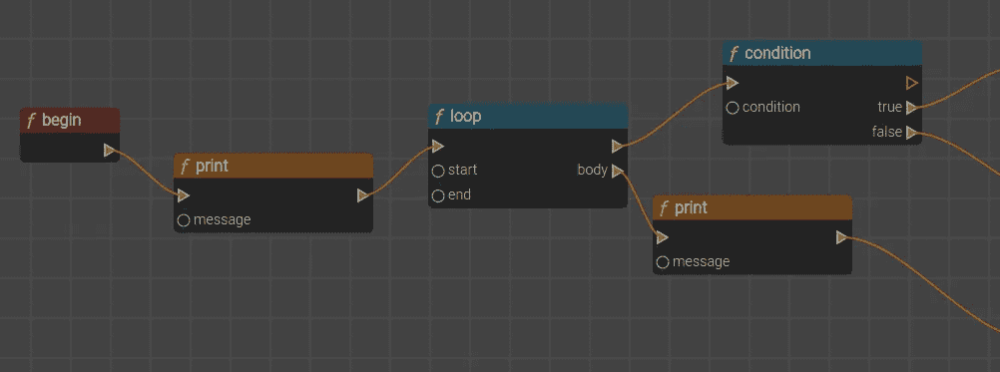
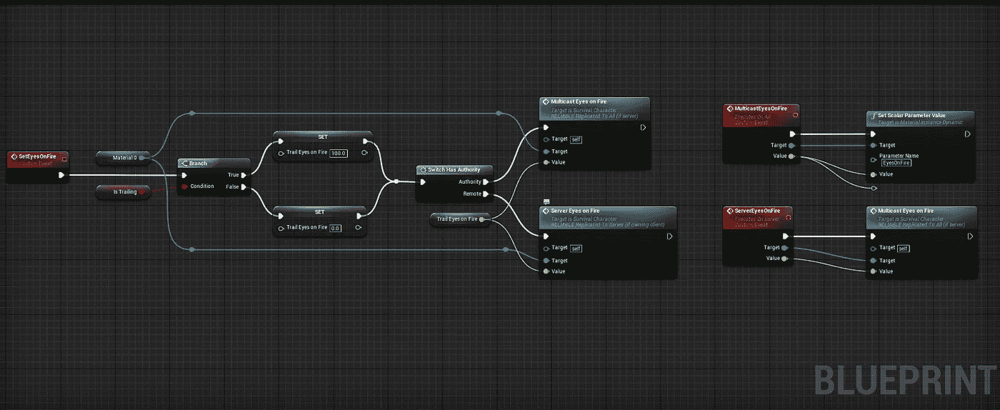
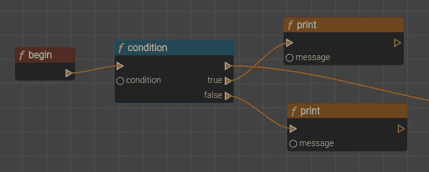
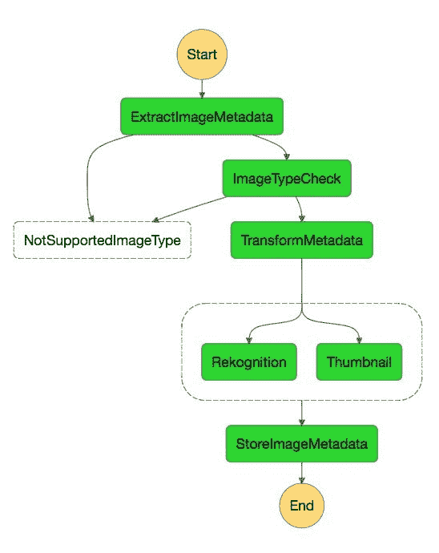

# 可视化脚本在哪里？

> 原文：<https://itnext.io/where-is-visual-scripting-a7ce046bf2bb?source=collection_archive---------0----------------------->

作为一名软件工程师，我经常幻想自己的工作在 10 年、20 年或 30 年后会是什么样子。可视化脚本能成为未来生产软件的主导形式吗？

语言进步的方式通常是要么达到更高的抽象层次，要么引发范式转换。

是什么让一种语言比另一种语言更抽象？简单地从开发人员手中拿走一些责任，并以一种适用于几乎所有用例的方式将其自动化。抽象的一个最好的例子是垃圾收集(GC)。总会有一两个领域需要手动管理内存，就像在游戏行业一样，但是对于绝大多数用例，GC 会为您处理它。

# 迄今为止的进展

1947 年，汇编语言问世了。目标仅仅是将人类可读的单词(缩写)分配给原始的 CPU 指令。汇编非常依赖于硬件，因为不同的 CPU 可以有不同的指令集，所以如果没有某种翻译层，为一种型号编写的程序不一定适用于另一种型号。

从那以后，语言主要以两种方式发展:跳到另一个抽象层次或者在编写代码的方式上引入范式转换。

通过进一步的抽象，过程语言变得越来越接近人类可读的语言，比如 C 语言，它更加冗长，但是仍然需要你手动管理内存。像 Java 这样的托管语言抽象掉了(几乎)任何考虑内存分配的需要，让你越来越关注程序本身，而不是让它工作的技术。高级语言现在允许我们完全忘记类型。今天，用 python 写一行代码可以转化成用 c 写更多行代码。

除了发明抽象，语言还经历了多次范式转换。OOP(面向对象编程)使得复杂业务领域的建模更容易，更接近于人类在头脑中对世界建模的方式。更多的例子包括函数式、偶数驱动式等等。

我们将何去何从？想弄清楚下一个抽象层次或范式转变会是什么样子变得非常困难。我们不能简单地扣除一个系列中的下一个元素，因为级别之间的跳跃是非线性的。这可能会让人觉得我们已经走到了尽头，似乎现有的语言已经抽象到了极限，但是在另一个想法推动我们前进之前，这种感觉已经一次又一次地出现了。让我们探索其中一个潜在的想法。

# 可视化脚本

其思想是通过图形模型来表示代码，图形模型由盒子和连接组成，每个盒子表示一个对象、一个功能或事件，每个连接表示它们之间的链接。这个概念并不新鲜，但是它仍然是游戏开发等特定用例的一个非常特殊的特性。虚幻引擎从 1998 年开始使用可视化脚本。

理论上，这看起来很理想。正如他们所说，一张图片胜过千言万语，在这种情况下，它似乎是非常真实的。相当多的信息可以通过几个相互连接的盒子来传输，否则这些信息可能会分散在多行文本中，可能在不同的文件中。此外，每个抽象级别都可以单独可视化，这意味着在每个盒子中可能有许多更低的抽象，有数百或数百万个其他盒子和连接，每个都在自己的抽象层中，让我们一次只关注一层，不受干扰。大脑处理颜色和形状也比阅读文本更容易、更快。

但是，它仍然局限于少数利基应用领域是有原因的。

首先，对于一个有经验的开发者来说，借助一个好的 IDE 写代码还是比较快的。想象一下高级用户用终端而不是图形界面浏览文件系统。

第二，我们今天所知道的那种编程被改编和发展成用于文本。反过来，视觉脚本试图适应视觉上笨拙和不自然的做事方式。这就像用螺丝刀的手柄代替锤子钉木头一样。处理指针、泛型、多态、重载等…很难可视化建模，这就是为什么图表被用于设计，但之后它们仍然需要被写入代码。

这让我想到，可视化脚本不适合表示和模仿任何现有的编程语言。相反，它需要成为自己的语言，生活在一个更高的抽象层面上，足够聪明地抽象出许多编程概念，否则这些概念是留给开发人员的。我们可能还不具备构建这样一个系统的技术，但我有一种感觉，机器学习将在这方面发挥重要作用，越来越多的编程概念可能会由人工智能而不是开发人员进行优化。

尽管如此，我们确实需要一个好的理由和动力来转变成一种全新的思考和看待软件的方式。可视化脚本能够带来的是代码生成方式的**一致性**，通过利用我们的视觉思维而不是阅读文本的**清晰性**，以及通过放弃较低抽象细节的**效率**，从而降低非开发人员构建逻辑系统的可访问性门槛。

为了让这种转变成为主流，主要的云和软件服务提供商将需要提供支持，例如，我们已经开始看到 AWS step 函数正在发生这种情况，它越来越接近可视化脚本的全部内容。

AWS step functions 允许我们使用条件、循环、重试等来构建逻辑。虽然目前开发人员必须构建和维护 step functions 使用的单个任务，但我希望将来会形成这种任务的标准库，就像编程语言中存在的标准实用程序库一样。

AWS 阶跃函数

# 结束语

没有人知道未来生产软件会是什么样子，特别是随着机器学习技术的进步，但我期待有一天能够以可视化方式而不是长文本文件来表示逻辑系统和交互。

对于那些对可视化脚本感兴趣的人，我正在开发一个可视化脚本 UI 的原型，它可以实时地一次生成多种语言的代码(标题图片是该项目的截图)。感兴趣的话随时联系我！