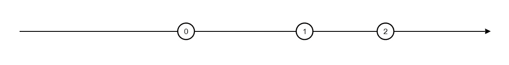
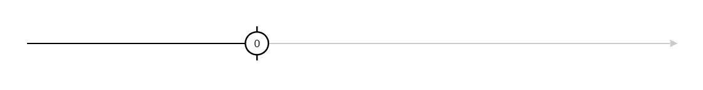

# RxJs 算子取哪里(1)？

> 原文：<https://itnext.io/where-to-place-rxjs-operator-take-1-39a8a00f65cb?source=collection_archive---------2----------------------->

我们把`take(1)`放在可见链的开头还是结尾有关系吗？

看看下面两个(伪)RxJs 可观测链的例子，我们把`take`运算符放在哪里有关系吗？

## 案例 1:

在 switchMap 运算符之前使用 take 运算符的可观察链的代码片段

## 案例二:

在 switchMap 运算符后使用 take 运算符的可观察链的代码段。

> 在**和**两种情况下**会结束**可观察的 **链**(退订)吗？
> 
> 在第一个**和第二个**的情况下，我们会得到多少**和多少**的排放量？

简而言之，我们在第一种情况下得到多次发射，在第二种情况下得到一次发射。所以为了让`take`在 **1 发射**后**完成**可观测链，需要把**放在最后！**

案例 1:我们得到多重排放——见例子[https://rxviz.com/v/zopr69mJ](https://rxviz.com/v/zopr69mJ)

案例 2:我们获得一次排放并完成—参见示例[https://rxviz.com/v/B8ZnLPn8](https://rxviz.com/v/B8ZnLPn8)

为了更详细地回答这些问题，让我们看一下 Stackblitz(或者如果 Stackblitz 对您来说是不可访问的，则看下面的要点)。

显示在“switchMap”之前和之后放置“take”运算符的结果的代码段

*   两种情况**完成**回调触发，因此`take`操作员**完成其工作**并且**取消订阅***
*   在第一种情况下(`take`之后的`switchMap`)，我们在完全回调触发之前得到**多次发射**，而在另一种情况下得到**一次发射**

对于取消订阅的逻辑，在这里看一下`take`操作符[的源代码](https://github.com/ReactiveX/rxjs/blob/338b1746e11247bbdc6d617b634fab900717288f/src/internal/operators/take.ts#L92-L96)。简而言之:

github 中显示取消订阅逻辑的“take.ts”源代码片段。一旦数量达到给定值，就会完成“获取”并取消订阅。

**实际上在第一种情况下 complete fires 是因为我们使用了另一个* `*take*` *运算符来结束后 3 项。*

**情况 2**:(`switchMap`后`take`):take 运算符逻辑负责完成并取消订阅第一次发射后`switchMap`产生的可观察值。

**案例 1**:`switchMap`前的`take`)`destination`是`switchMap`运算符的输入。因此`take`在第一个值之后停止发射，但是`switchMap`产生的可观测值正在发射，因此整个可观测值持续到完成。