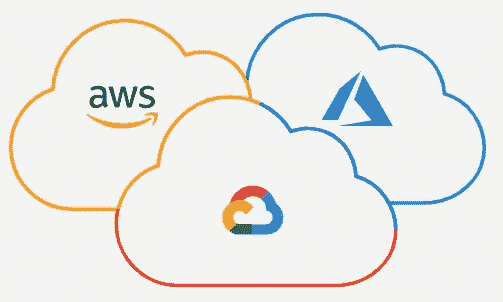

# 哪种云部署模式适合您的企业？

> 原文：<https://itnext.io/which-cloud-deployment-model-is-right-for-your-business-96e191684d9d?source=collection_archive---------3----------------------->

## 公共云、私有云、混合云、多云还是社区云？

## 了解云部署模型

在本文中，我们将讨论不同的云部署模型，看看如何根据您的需求选择最适合您业务的模型，并研究每个模型的优缺点。

云部署模型本质上定义了部署的基础架构位于何处，并确定了谁拥有该基础架构的所有权和控制权。它还决定了云的性质和目的。

由 [Unsplash](https://unsplash.com/s/photos/cloud-tech?utm_source=unsplash&utm_medium=referral&utm_content=creditCopyText) 上的 [CHUTTERSNAP](https://unsplash.com/es/@chuttersnap?utm_source=unsplash&utm_medium=referral&utm_content=creditCopyText) 拍摄

每个组织在进行转变或开始云计算之旅时都会有自己的要求。为了避免成本高昂且耗时的糟糕决策，在踏上云计算之旅之前了解组织需求至关重要。在规划阶段做出正确的决策可以帮助您的企业加速发展，帮助您实现业务目标，并保持竞争力。

2022 年，大多数企业将已经在云中存在，例如通常利用 SaaS(软件即服务)产品的组合，如 Azure Active Directory、Office 365、Gmail 或 IaaS(基础设施即服务)产品，如在微软 Azure 或亚马逊网络服务(AWS)中托管基础设施。在初始阶段不正确的规划可能会使您在竞争对手面前处于劣势，因为他们可能在云之旅中处于更成熟的阶段。随着员工在家连接到资源，新冠肺炎疫情加快了企业的云计算之旅。在此过程中，必须考虑不同的云部署模型，采用速度通常是许多企业的头等大事。

对于任何寻求采用云服务的组织来说，首先要做的就是了解可用的部署模型。一旦理解了这些，就可以对企业应该采取的路线做出更好的决策。每个模型在治理、可伸缩性、安全性、灵活性、成本和管理等方面都有优点和缺点。

大体上，部署模型可以分为 5 类:

*   **公有云**
*   **私有云**
*   **混合云**
*   **多云**
*   **社区云**

让我们更详细地看一下每个模型。

## 公共云

公共云是一种普遍采用的云模式，云服务提供商拥有基础架构，并公开提供对基础架构的访问，供公众使用。

由于服务提供商拥有硬件和支持网络基础设施，因此它完全受服务提供商的控制。服务提供商负责基础架构所在数据中心的物理安全、维护和管理。因此，底层基础设施不在客户的控制范围内，也远离客户的物理位置。

云服务提供商将在多个客户之间共享基础设施，同时保持数据分离和隔离，在这种情况下提供多层安全控制。如果需要，一些服务可以托管在专用或隔离的硬件上，通常需要额外付费。云提供商竭尽全力确保物理数据中心极其安全，并且是高度监管的环境，几乎总是超过客户自己能够达到的标准。

基础设施主要使用 web 浏览器进行管理，但也可以使用 API、命令行或使用 Terraform 等基础设施即代码工具进行操作。

常用的公有云有微软 Azure、亚马逊 AWS、谷歌云、甲骨文云、阿里云等。

*   +低初始资本成本(从资本支出转移到运营支出)
*   +高灵活性
*   +高可扩展性(几乎无限制)
*   +高可靠性
*   +低维护成本
*   -严格监管企业的数据安全问题

## 私有云

私有云可以被视为完全由单个租户拥有和管理的环境。选择此选项通常是为了缓解公共云产品可能存在的任何数据安全问题。任何严格的治理要求也可以更容易地遵守，私有云可以更容易地定制。对硬件的完全控制可以带来更高的性能。客户通常会在自己的建筑物内(内部)运行私有云，或者购买数据中心的机架空间来托管其基础架构。

但是，管理基础架构的责任也落在了客户身上，这就需要更多具备更广泛技能的员工，并增加了成本。购买所需的硬件可能还需要大量的初始投资。

*   +提高安全性和控制力
*   +专用硬件可以提高性能
*   +高灵活性
*   -高成本
*   -更高的管理费用

## 混合云

混合模式结合了公共云和私有云部署模式，提供单一云基础架构，旨在为企业增加灵活性和部署选项。例如，具有严格治理和数据安全要求的应用程序可以托管在企业私有云，而没有这些问题的应用程序需要按需扩展，可以托管在公共云中。公共云和私有云的优点都可以实现，但也有一些缺点，如增加的管理开销和设置混合基础架构的初始挑战。一旦实现，应用程序可以在公共云和私有云托管的基础架构之间移动，从而提高灵活性和容错能力。

通常情况下，企业可能会在内部部署一些硬件，如果企业已经拥有该硬件，那么利用该硬件直到它在私有云中的生命周期结束可能是一个有吸引力的选择。在混合模式中，这可以用来构成私有云的一部分。大多数企业努力减轻现有基础架构的负担，尽可能迁移到公共云，在迁移期间有效利用混合部署模式。

*   +改进的可扩展性
*   +高控制
*   +高度可扩展
*   +高容错能力
*   +经济高效
*   -设置挑战
*   -高管理开销

## 多云

多云部署模式通常是指使用多个公共云提供商来增加灵活性和容错能力，例如使用微软 Azure、亚马逊 AWS 和谷歌云。私有云也可以融入其中，以提供额外的可靠性和灵活性。

在经过业务评估后，某些服务在某个云上可能比在另一个云上更受青睐。例如，托管在谷歌云上的 GKE(谷歌 Kubernetes 引擎)可能比 Azure 上的类似产品更受欢迎，如 AKS (Azure Kubernetes 服务)或亚马逊 EKS (Elastic Kubernetes 服务)。可以有选择地分配工作负载。采用多个云为开发团队提供了更广泛的选择，并且实际上可以帮助开发人员的工作流程。一些类似的服务可能比其他服务更便宜，因此在某些情况下可能更受欢迎，例如，AWS 可用于生产，Google Cloud 可用于测试。

具有关键工作负载的企业，如政府机构或金融公司，也经常使用多云。如果一个云平台遇到服务中断，在多个云提供商之间传播数据和基础设施可以提高容错能力。当企业制定灾难恢复和业务连续性计划时，也可以利用多云模式的优势。

然而，随着每个选项的引入，管理变得更加复杂，员工需要更多的技能来充分实现多云部署模式的优势。根据业务目标，如果目标是提高容错能力，那么多云有可能降低成本或提高成本。与 it 中的任何事情一样，应该权衡应用程序需求和预算之间的权衡。在云之旅中走得更远的较大企业通常适合于多云模式，因为通常企业会采用单一公共云，并在业务需求合理时采用另一种公共云。

*   +非常高的可靠性
*   +非常高的灵活性
*   -管理复杂性增加
*   -需要提高员工技能

了解更多关于[云计算优势和最佳实践](https://spacelift.io/blog/multi-cloud-infrastructure-strategy)的信息。

## 社区云

社区云是一种鲜为人知且较少采用的部署模式，它将共享的基础架构集合在一起，并由共享特定计算需求的特定组织的多个组织共同访问。例如，教育部门可以利用社区云让一群学者和学生共享学术内容，让联合研究变得更加容易。

*   +共享基础设施降低成本
*   -安全性降低
*   -不适用于大多数中小企业(中小型企业)

## 摘要

了解可用的云部署模型是定位您的企业取得成功的关键。

在现实世界中，新企业和初创公司通常会选择尽可能完全采用公共云。大多数现有企业将在内部部署一些现有的基础架构，因此将其引入私有云并采用混合模式可能更有意义。私有云是一种高成本的选择，具有很高的开销，但有时在数据安全监管或对数据主权的担忧非常重要的情况下，这是一种要求。在关注高可靠性的情况下，例如在金融行业，可以考虑使用多云。

干杯！🍻

 [## Jack Roper 正在 Azure、Azure DevOps、Terraform、Kubernetes 和 Cloud tech 上写博客！

### 希望我的博客能帮到你，你会喜欢它的内容！我真的很喜欢写技术内容和分享…

www.buymeacoffee.com](https://www.buymeacoffee.com/jackwesleyroper) 

*原载于*[*space lift . io*](http://spacelift.io/)*。*