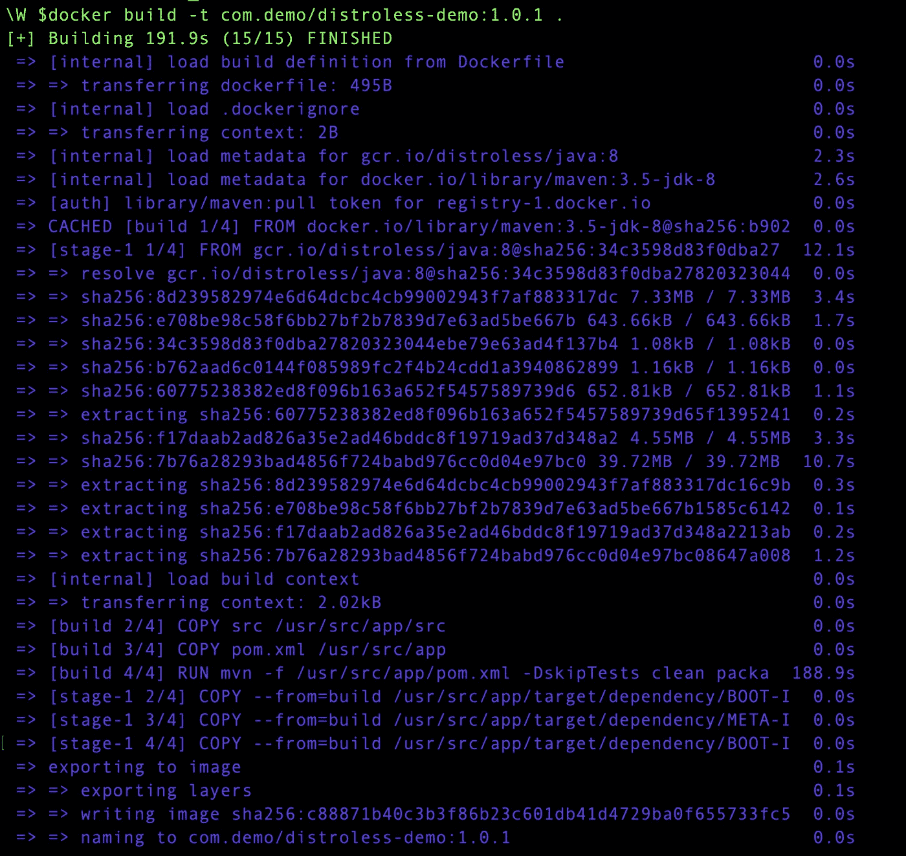
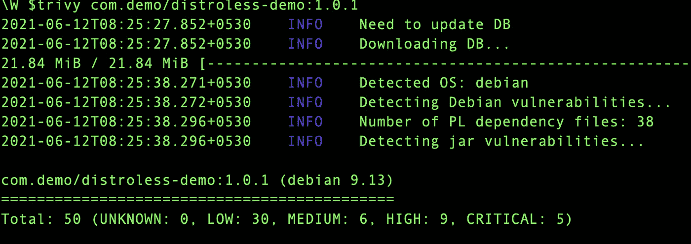
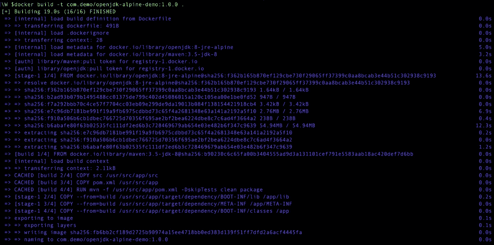
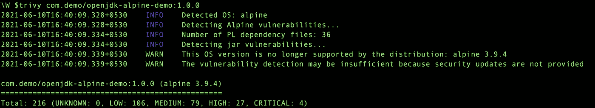

# 使用哪个容器图像—distroles 还是 Alpine？

> 原文：<https://itnext.io/which-container-images-to-use-distroless-or-alpine-96e3dab43a22?source=collection_archive---------0----------------------->

## 这里有一个实验来更好地理解这一点


[伊恩·泰勒](https://unsplash.com/@carrier_lost?utm_source=unsplash&utm_medium=referral&utm_content=creditCopyText)在 [Unsplash](https://unsplash.com/s/photos/docker-container?utm_source=unsplash&utm_medium=referral&utm_content=creditCopyText) 上拍照

如今，使用容器进行应用程序开发和部署非常普遍。

虽然容器确实带来了很多价值，但它们也带来了一些挑战，比如—

*   更大的图像意味着构建时间的增加，以及成本的增加
*   映像中包含的更多库可以扩大漏洞扫描工具的范围
*   等等。

这个问题最常见的解决方案是——使用更小的发行版！

使用像 Alpine 这样的轻量级发行版是开发人员避免容器映像变得庞大的一种非常常见的技术。即使您可以实现这一点，也总是存在由底层库导致的公开漏洞的风险。

谷歌通过引入无发行版图像解决了这个问题。

> “发行版”映像只包含您的应用程序及其运行时依赖项。它们不包含包管理器、shells 或任何其他您期望在标准 Linux 发行版中找到的程序。

在阅读了 Gaurav Agarwal 关于如何用 Distroless Docker 镜像来加固你的容器的故事后，我决定尝试一下，获得第一手经验。

在本文中，我将使用 Distroless 和 Alpine image 创建一个 Java 应用程序容器，对两者运行漏洞扫描，并比较构建时间、映像大小等。

所以让我们开始吧。

## 使用发行版图像

我为这个实验创建了一个简单的 Hello World Spring Boot Java 应用程序。

首先，我用 Distroless 图像创建了一个`Dockerfile`，如下所示

```
FROM maven:3.5-jdk-8 AS buildCOPY src /usr/src/app/srcCOPY pom.xml /usr/src/appRUN mvn -f /usr/src/app/pom.xml clean packageFROM gcr.io/distroless/java:8ARG DEPENDENCY=/usr/src/app/target/dependencyCOPY --from=build ${DEPENDENCY}/BOOT-INF/lib /app/libCOPY --from=build ${DEPENDENCY}/META-INF /app/META-INFCOPY --from=build ${DEPENDENCY}/BOOT-INF/classes /appENTRYPOINT ["java","-cp","app:app/lib/*","DemoApplication.Application"]
```

构建完成了，如下所示—



然后我用 [Trivy](https://github.com/aquasecurity/trivy) 运行了一个图像扫描。结果如下所示—



## 使用阿尔卑斯山图像

接下来，我用阿尔卑斯山的图像重复了这个实验。本实验的`Dockerfile`如下所示—

```
FROM maven:3.5-jdk-8 AS buildCOPY src /usr/src/app/srcCOPY pom.xml /usr/src/appRUN mvn -f /usr/src/app/pom.xml clean packageFROM openjdk:8-jre-alpineARG DEPENDENCY=/usr/src/app/target/dependencyCOPY --from=build ${DEPENDENCY}/BOOT-INF/lib /app/libCOPY --from=build ${DEPENDENCY}/META-INF /app/META-INFCOPY --from=build ${DEPENDENCY}/BOOT-INF/classes /appENTRYPOINT ["java","-cp","app:app/lib/*","DemoApplication.Application"]
```

建造成功完成——



然后我对这张图片进行了一次简单的扫描，得到了以下结果



## 面对面比较

基于这个实验，这是我在我的环境中观察到的—

*   **图像大小** —使用 Alpine base 图像编译的图像为 **93.5 MB** ，而 distroless 图像为 **139 MB** 。所以阿尔卑斯山的图像比 distroless 的图像要亮。
*   **漏洞数量** — Alpine image 共有: **216 个**漏洞(未知:0，低:106，中:79，高:27，严重:4)，而 Distroless Image 共有: **50 个**漏洞(未知:0，低:30，中:6，高:9，严重:5)

> 总之，如果你更关心安全性，那么当然推荐使用无发行版映像。如果你担心大小，那么阿尔卑斯山可能是一个更好的选择。

你可以在这里找到这个实验的完整代码—

[](https://github.com/deshpandetanmay/distroless) [## deshpendatanmay/distroles

### 在 GitHub 上创建一个帐户，为 deshpendanmay/distrolles 的发展做出贡献。

github.com](https://github.com/deshpandetanmay/distroless) 

# 嘿，如果你喜欢这个故事，看看[中级会员](https://deshpandetanmay.medium.com/membership)！只要 5 美元/月！

*你的会员费直接支持我和你看的其他作家。你也可以在媒体上看到所有的故事。*

# [现在就成为中等会员吧！](https://deshpandetanmay.medium.com/membership)