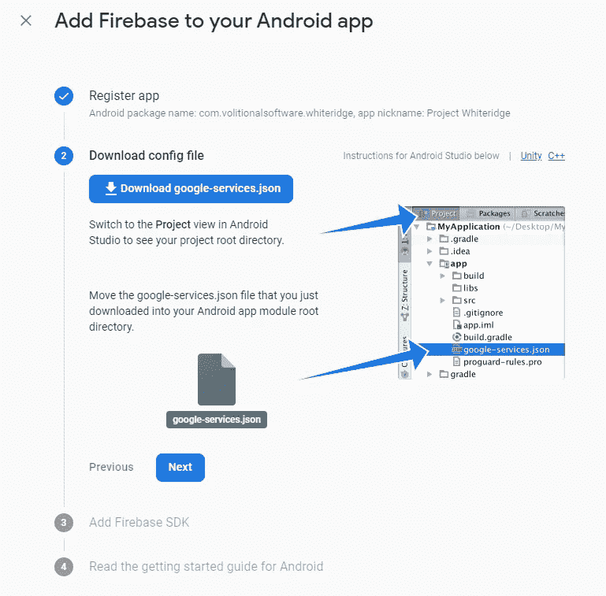
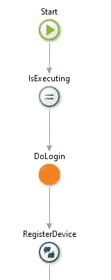
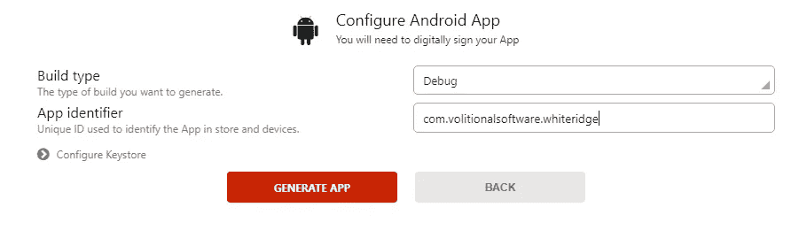
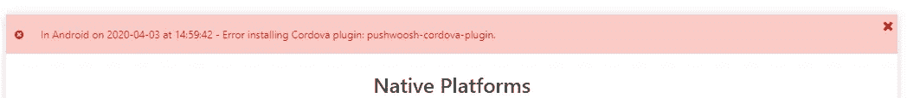
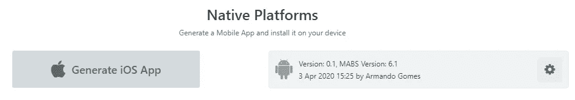
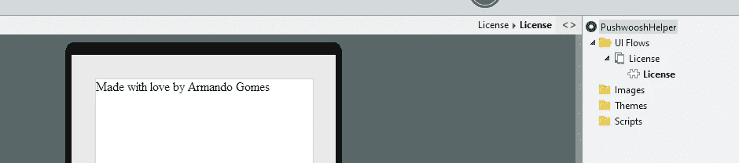
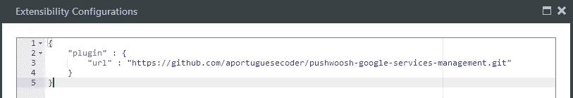
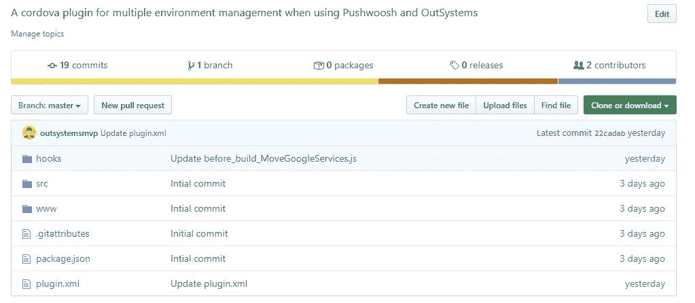
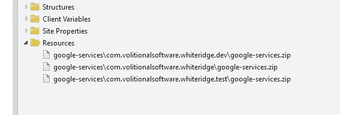
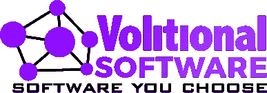

# 这是什么环境？—或者让 Pushwoosh 变得“智能”。

> 原文：<https://itnext.io/which-environment-is-this-or-making-pushwoosh-intelligent-b319739fca26?source=collection_archive---------2----------------------->


你好。你在那里过得怎么样？我们生活在困难时期，但我们需要相信一切都会迎刃而解。如果可以，请#StayAtHome。如果你不能，那么…祝你好运，谢谢你的服务！是的，我假设你离开家是因为你需要提供一项基本服务。

## 闲聊

*aaaaahhh*，自从我上一篇文章以来，发生了这么多事情！我去了比利时，为一家使用 Adyen 的在线商店部署了一个全功能的支付网关——我的个人资料中有几篇关于这方面的文章，但 Adyen 从那以后发生了一些变化(我自己注意:也许会写新的)——然后去了纽约度假。在世界开启“疯狂模式”之前。

现在，斗争是真实的:一些公司不知道没有业务他们将如何生存。其他公司都在尽最大努力，所以我们不会错过任何重要的东西。裁员、失业、财政削减……艰难的时刻即将到来。但是，希望一切都会迎刃而解。

**你在家吗，想找些有趣的事情做吗？**前往 outsystems.com/learn看看一些课程和引导路径，这样你就可以进入低代码世界了！不用担心，这不是一个附属链接——但是因为我是 OutSystems 的 MVP，所以我建议它是有意义的，对吗？

鉴于当前的事件，我将帮助世界各地的一些人/公司。因此，**如果你有兴趣和我进行一次免费的会话，这样我们就可以讨论一些与 OutSystems 生态系统相关的东西，请访问**[**https://www.volitionalsoftware.com/StayAtHome**](https://www.volitionalsoftware.com/StayAtHome)**。是的，我说的免费就是免费。没有附加条件。检查链接，自己看看它应该如何工作。**

此外，OutSystems 将在 4 月 15 日前免费发放认证券。有关更多信息，请访问上面的 OutSystems 网站。不过，要知道:“在家工作”、裁员等等已经影响到了每个人，包括监考公司。[预计在获得响应方面会有延迟](https://www.outsystems.com/forums/discussion/59325/covid-19-free-certificate-offer-no-respoonse/#Post226293)。

既然我们已经进行了一些很酷的闲聊，是时候进入有趣的部分了。

## 环境和更多的环境！

大约在 2019 年的某个时候，对 Pushwoosh 插件(嗯，不完全是插件)进行了更改，要求如下:您的 Android 应用程序需要有一个“google-services.zip ”,其中包含 google-services 目标目录中的 google-services.json 文件。迷惑？嗯，没那么多。



你需要做的第一件事是在 Firebase 控制台中创建一个项目，然后将其添加到“一个 android 应用程序”中。你填写细节，然后它会给你一个下载 google-services.json 文件的选项。这个文件包含关于你的应用的信息，比如包名(非常非常重要)。为什么包名很重要？因为如果它不匹配你的应用标识符，**就不会编译**。或者建造。或者生成。我说编译是因为没有一个软件工程师说过“它正在生成”或“它正在构建”。它已经并将永远是“它正在编译”。


在我的例子中，包名是 com . volitionalsoftware . whiteridge，为什么是 white ridge？大家都知道曼哈顿计划。当我在写硕士论文的时候，我想给我的 git 库起一个很酷的名字。所以我最有可能去找一个名字生成器，比如[这个](http://www.codenamegenerator.com/)，名字就出来了。因此，Project Whiteridge 是 OutSystems 平台中单元测试生成的自动化工具。



好了，回到正题。让我们创建一个移动应用程序作为我们的基线。我们将使用 Pushwoosh 插件，并且只在我们的登录逻辑中使用 RegisterUser 客户端动作。我们发布模块(没有任何资源)，让我们尝试生成一个 Android 应用程序。猜猜会发生什么？如果你的猜测是 BADABOOOOOOOOOM！，你是对的！

这些是我们生成应用程序的设置:



如你所料，它失败了。让我们来看看构建日志。这里有两个 ***突起*** :

*   在进入 OutSystems 论坛——或者几乎任何人——寻求帮助之前，先检查一下构建日志。我们——在论坛中提供帮助的人——OutSystems support 或几乎任何人肯定会要求这样做。大多数情况下，Service Studio 中显示的错误消息并没有反映出问题背后的真正原因，因此您(和我们)不查看日志就无法发现问题。
*   (Advanced protip)如果您的插件代码出现问题，而您不知道“为什么”,您可以使用著名的 *console.log* 函数在构建过程中写入构建日志。那是我的救世主。



嘣！让我们来看看构建日志。如果您不知道在哪里可以找到它，请转到服务中心，搜索有问题的应用程序，并在其中检查本机选项卡。你会有一个“文件”图标，你可以下载它。

我将把它拆成最相关的部分，所以请耐心听我说:

```
[2020–04–03T13:58:52.071Z] [INFO] Plugin Id: [https://github.com/OutSystems/pushwoosh-phonegap-plugin.git#7.17.1-OS1](https://github.com/OutSystems/pushwoosh-phonegap-plugin.git#7.17.1-OS1)
[2020–04–03T13:58:52.073Z] [INFO] Plugin Action: add
```

一切从添加插件开始。

```
Installing “pushwoosh-cordova-plugin” for android
```

我们从存储库中获得了代码，现在是时候将它安装到我们的应用程序中了。

```
Failed to install ‘pushwoosh-cordova-plugin’: undefined
Error: Failed to install Pushwoosh plugin. Reason: Configuration zip file not found.
```

这是我们的错误消息。我们的应用程序在所需的目录中没有文件作为资源，因此无法构建。

```
[2020–04–03T13:59:00.982Z] [ERROR] Build failed with the following error: Error installing Cordova plugin: pushwoosh-cordova-plugin.
```

这是您在 Service Studio 中看到的错误。它讲述了整个故事吗？嗯，不。鉴于 Pushwoosh 是一个受支持的插件，你的第一个猜测可能是“那我们开一个支持票吧”。记住，总是检查构建日志！

现在让我们按照[文档](https://success.outsystems.com/Documentation/How-to_Guides/Integrations/How_to_Use_Push_Notifications_with_Pushwoosh)中的说明添加我们的 google-services.zip，然后再试一次。



哦，看那个。有用！但这不是我写这些的原因。我写这封信是为了回答最有可能的后续问题，即:

> “好的，这很公平。但是我有一个从开发到 QA 再到生产的应用程序。我该如何解决这个问题？”

当您将代码从环境 A 部署到环境 B 时，resources 文件夹也将被部署。因此，您可以:

1.  对 3+环境(至少是开发、测试和生产)使用相同的应用程序标识符，或者
2.  部署代码，然后手动更新文件，这样您就可以正确地生成应用程序。

这有用吗？是的。够好吗？对我来说不是。

## 别人是做什么的？

我联系了负责维护 Pushwoosh 插件的团队成员，询问他们如何处理这种情况。

他们的回答是，他们在部署后进行手动文件上传，他们知道这不是一个非常愉快的体验。但是，目前，这是他们所拥有的。

## 跨环境管理应用

嗯，有几种方法可以跨环境管理应用程序，但我通常只对不同的环境使用不同的标识符。对于这个例子，一种可能性是:

*   发展:`com.volitionalsoftware.whiteridge.**dev**`
*   测试:`com.volitionalsoftware.whiteridge.**test**`
*   生产:`com.volitionalsoftware.whiteridge`

这意味着我可以同时在我的设备中保留这三种环境，这很有用。我也对 Pushwoosh 做了同样的事情——N 个不同环境下的不同 Pushwoosh 应用程序。虽然这并不意味着您需要为 N 个环境准备 N 个 Pushwoosh 应用程序，但是我强烈建议您至少准备一个“生产”应用程序和一个非生产应用程序。你不想给你的用户发送不想要的通知，对吗？

如果您相当清楚生存期部署是如何工作的，那么您不能指定资源的版本，也不能让它们是动态的。因此，假设我们需要在安装 Pushwoosh 插件时，在给定的目录中有正确的 *google-services.zip* 文件，我们如何实现自动化呢？

## 亲爱的读者，来见见胡克斯。

OutSystems 移动应用程序运行在 Cordova 之上，Cordova 有一个叫做“钩子”的东西。[来自他们的文档](https://cordova.apache.org/docs/en/latest/guide/appdev/hooks/):

> cordova 钩子代表特殊的脚本，可以由应用程序和插件开发者添加，甚至可以由你自己的构建系统定制 Cordova 命令。
> 
> cordova 钩子允许你在 Cordova 命令周围执行特殊的活动。例如，您可能有一个自定义工具来检查 javascript 文件中的代码格式。而且，您希望在每次构建之前运行这个工具。在这种情况下，您可以使用“before_build”挂钩，并指示 cordova 运行时在每次构建之前运行要调用的自定义工具。

所以，有两种方法可以运行钩子:要么把它放在应用程序的钩子文件夹中，要么使用一个插件。我们走第二条路(插件),因为第一条路不容易实现。下面你可以看到添加了 android 平台的 Cordova 项目的文件夹结构:

```
├── hooks
├── platforms
│   └── android
│       ├── cordova
│       └── platform_www
├── plugins
├── res
├── www
└── config.xml
```

如你所见(感谢 joo！)，钩子文件夹和`www`文件夹在同一层。我们放入 OutSystems 应用程序的资源中的任何东西，以及我们部署到给定的目标目录中的任何东西，都会部署到`www/<target directory>/filename.extension`中。因此，无法使用应用程序的 hooks 文件夹。

所以还是走外挂路线吧，一个空的。你知道如何创建一个包含两个平台(android 和 iOS)所需的所有东西的空插件吗？没有吗？别担心，我们是来帮助你的。前往 timbotnik 的 [cordova-plugin-empty](https://github.com/timbotnik/cordova-plugin-empty) 并将其分叉或克隆。如果你克隆它，确保你把它放入你控制的存储库中——如果你想走那条路的话。在 OutSystems 中使用原生插件还有其他可能性,但是对于本文，我们将使用公共 git 库。

关于“本地”代码的结果可以在[https://github . com/aportuguesecoder/pushwoosh-Google-services-management](https://github.com/aportuguesecoder/pushwoosh-google-services-management)上看到。我决定称之为 Pushwoosh 谷歌服务管理，因为，嗯…这就是我们想要做的，对不对？我们将为正确的环境管理 google-services 文件。

在我们深入研究插件本身之前，让我们先看一下这个实现的外部系统部分。



我们的插件只有一个公共 web 块——所以我们可以引用它，并确保插件的代码包含在生成的二进制文件中——并按照 OutSystems 的要求定义可扩展性配置:



这就是外部系统部分。很快，是吧？

现在让我们进入插件部分。如果您查看了上面的链接，您应该会看到类似这样的内容:



忘记 *src* 和 *www* 文件夹。也忘记了 *package.json* 文件。我们只是真正关心 *plugin.xml* 文件和`hooks`文件夹。让我们先进入 *plugin.xml* 文件。

根据 Cordova 的文档， *Plugin.xml 文件定义了插件所需的结构和设置。它有几个元素来提供关于你的插件的细节。*

您可以查看整个 plugin.xml 文件的细节，但是现在，让我们只关注(最)相关的部分。下面是我们将要分析的摘录:

```
<js-module src="www/GoogleServices.js" name="GoogleServices">
 <clobbers target="plugins.GoogleServices" />
</js-module>
<platform name='android'>
 <config-file target="res/xml/config.xml" parent="/*">
  <feature name="GoogleServices">
    <param name="android-package" value="com.armandogomes.cordova.plugin.GoogleServices" />
  </feature>
 </config-file>
  <source-file src="src/android/GoogleServices.java" target-dir="src/com/armandogomes/cordova/plugin" />
  <hook type="before_plugin_add" src="hooks/before_build_MoveGoogleServices.js" />
</platform>
```

js-module 入口指向我们的“代码”文件，该文件可以在我们的外部系统应用程序中使用。这需要匹配本地文件，否则，它不会工作。除此之外，它在这里只是一个占位符。

这里我们需要看到的是`<platform name=’android'>`元素下的`<hook>`元素。您可能已经猜到了，不同的钩子可以应用于不同的平台。鉴于我们只需要在 android 上这样做，没有必要在 iOS 上使用相同的钩子。

我们的钩子是做什么的？

我们的钩子有一个非常明确的目标:确保我们能够构建我们的应用程序。为此，我们将工作分为三个阶段:

1.  获取我们的应用程序的 config.xml 文件。
2.  处理 config.xml 文件，搜索正在生成的应用程序的标识符。
3.  将正确的文件复制到最终文件夹。

**步骤 1 —获取 config.xml 文件**

```
// determine appId (read it from config.xml)
var configFile = "config.xml";
var xmlData = fs.readFileSync(configFile).toString('utf8');
```

如果您还记得前面显示的文件夹结构，config.xml 文件将位于生成的 Cordova 项目的根目录下。虽然我似乎没有找到任何文档资料指出——而且我对这个“完整的 Cordova”世界还是有点陌生——但是钩子似乎运行在项目的根目录下，因此允许我们直接调用 config.xml 文件，而不是试图找出路径。

**(如果你愿意，可以跳过这一段)**如果我可以推断正在发生什么，我会说所有 plugin.xml 文件的内容都将“嵌入”在一个“master config.xml”文件中，然后该文件将按照所需的顺序执行钩子。也许我需要做一些测试来找出答案——或者只是问一些有知识的人。

我们从文件系统节点模块调用 fs.readFileSync 函数，这样我们可以同步读取它。为什么同步？因为我们希望确保脚本的其余部分按预期执行，所以当脚本的其余部分需要它们的“饮料”时，“[将有饮料](https://www.youtube.com/watch?v=hI0Q7IPWjOk)”！啊，我想念 Kimi。#Bwoah

`toString('utf8')`函数只是获取可读字符串形式的输出。我们可以在 readFileSync 函数中传递编码，但这将在这个钩子的 v2.0 中完成，同时还会有更多的变化。有人曾经说过，如果你看着 6 个月前的代码，你仍然做着同样的事情，你就没有进步。

**步骤 2 —识别应用程序的标识符**

所以我们现在有了 config.xml 文件的全部内容。[如果我们看一下 Cordova 的文档](https://cordova.apache.org/docs/en/latest/config_ref/index.html)，我们可以看到根元素 widget 有一个名为 **id** 的属性，它指定了反向域标识符。鉴于这是我们想要的——因为这唯一地标识了正在构建的应用程序——我们将在文本中进行简单的搜索来检索它。我们能把 config.xml 映射到一个对象吗？很有可能。

```
var n = xmlData.search(" id=\"");
if(n > 0) {  
  n += 5;  
  var count = 0;  
  var cont = true;  
  while(cont) {    
    if(xmlData[n+count] == "\"") {
      cont = false;
    } else {
      count++;
    }
  }
  appId = xmlData.substring(n, n+count);
  console.log("[PUSHWOOSH HELPER] App Identifier detected: " + appId);
}
```

所以我们知道这个属性被命名为 **id** 。我们该怎么办？搜索一下。搜索函数将返回搜索文本开始的字符串中的索引。如果仔细观察，您会发现在 id**和 id** 之前有一个空格。这意味着获得仅 id 属性。如果我们在我们想要的 id 属性前有一个，比如说，“somethingid=”，这将是匹配——是的，又是 badaboom。

由于我们搜索的是“ **id=\"** ”(回退是转义字符，所以不计入字符数)，我们知道返回的索引将是空格的起点。我们还知道我们的搜索字符串有五个字符的长度，所以我们可以在索引中增加五个字符(用 n 表示)。然后，用最有效、最漂亮的方式去做——绝对不行！——我们只是迭代字符串搜索下一个 **"** 字符，这意味着属性的值已经结束——我们为此使用了一个 while 循环。最后，一旦找到了 **"** ，我们只需将 substring 函数从 n(第一个 **"** 之后，标识符开始的地方)应用到 **n + count** ，其中 count 是标识符的长度。哦，我们会记录我们发现的问题，因此这些问题会显示在您可以在服务中心获得的构建日志中。

第三步——复制这该死的文件！

```
function copyGoogleServicesFile() {
  var srcFile = path.join(
    "www/google-services", appId, "google-services.zip");
  console.log("[PUSHWOOSH HELPER] Source file path: " + srcFile);
  if(fs.existsSync(srcFile)) {
    var buildPath = "platforms/android/app/src/main/assets/www/google-services";
    fs.mkdirSync(buildPath, { recursive: true });
    console.log("[PUSHWOOSH HELPER] File exists.");
    fs.createReadStream(srcFile).pipe(
      fs.createWriteStream(path.join(
        buildPath, "google-services.zip")
      )
    );
    console.log("[PUSHWOOSH HELPER] File was copied into " +
      path.join(buildPath, "google-services.zip") + ".");
  }
};
```

准备好我们的可识别标识符后，我们可以进入这个过程的最后一步:将适当的文件从给定的源文件夹复制到正确的(最终的)文件夹中。

当你试图构建一个 Cordova 项目时会发生什么，请稍微解释一下(就像我 18 岁时一样):在之前显示的树结构中，我们有一个`www` 文件夹和一个`platform_www`文件夹(`platforms/android`的嵌套元素)。当我们准备应用程序时(构建过程的步骤之一— `cordova build` build 是`cordova prepare` + `cordova compile`的快捷方式)，www 目录的内容被复制到`platforms/android/platform_www`文件夹中。总而言之，你在`www`目录中的任何改变都会影响所有的平台。你在`platforms/<platform>/platform_www`做的任何事情都只会影响那个特定的平台。预计会被覆盖，因此请谨慎操作。

当我们在 OutSystems 中添加一个新资源时，我们说它应该被部署到目标目录，这与说“部署到`www/<target directory>/filename.extension`”是一样的。所以，在编译时，Cordova 会将文件复制到`platforms/android/platform_www/<target directory>/filename.extension`中。

回到代码部分。我们要做的第一件事是确保我们想要的文件存在。我们通过检查 `www/<application identifier>/google-services.json`是否存在来实现。如果文件存在，我们将文件复制到`platforms/android/app/src/main/assets/www/google-services`中。

**为什么是这个文件夹？**我试着复制到`platforms/android/platform_www`中，但是很明显，由于 Pushwoosh 插件找不到文件，它没有被及时发送。一些“面向打印的调试”之后，我发现文件夹做的把戏。

**步骤 4 —在 Service Studio 中组织文件**

这是最后一步，它不是插件本身的一部分，但我们需要这样做——否则，我们所做的就没有任何意义。我们需要确保我们的文件符合我们期望的命名约定。因此，三个环境的管道应该是这样的:



瞧，我们的“即时文件管理”成功了，现在 Pushwoosh 构建成功了。

## 这是最后的倒计时！

嗯，这里有太多需要改进的地方了！错误管理，代码“美化”，提高性能等等。这个插件的第一个版本将在未来几天内发布，正如你可能已经猜到的，它只适用于移动应用。

如果您在使用它时遇到任何问题，请通过 forge 组件支持标签让我知道，这样我(或社区的任何其他成员)就可以回复您的帮助请求。



在结束之前，你可能会想:为什么他要从这个“意志软件”公司推广免费咨询？事实是，我有点厌倦了独自工作，鉴于外部系统生态系统的性质，你只能做这么多。因此，我决定接受新的挑战，并创建了意志软件。我仍在构建它——我认为从现在开始这是一项不间断的工作——但请随时联系我们，让我们讨论如何合作。请在[volitionalsoftware.com](https://www.volitionalsoftware.com)访问我们，或者在 hello@ < ourdomain >留言(这样我们就不会收到太多垃圾邮件)。

非常感谢你和我一起拥抱这个旅程。很高兴能和你分享这一切，和往常一样，如果你有任何问题或建议，请告诉我。

保重，呆在家里！