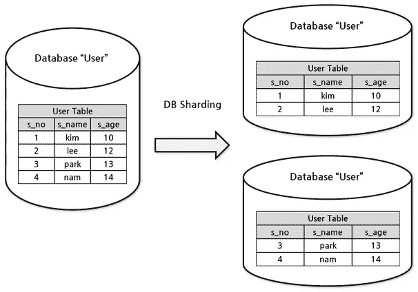
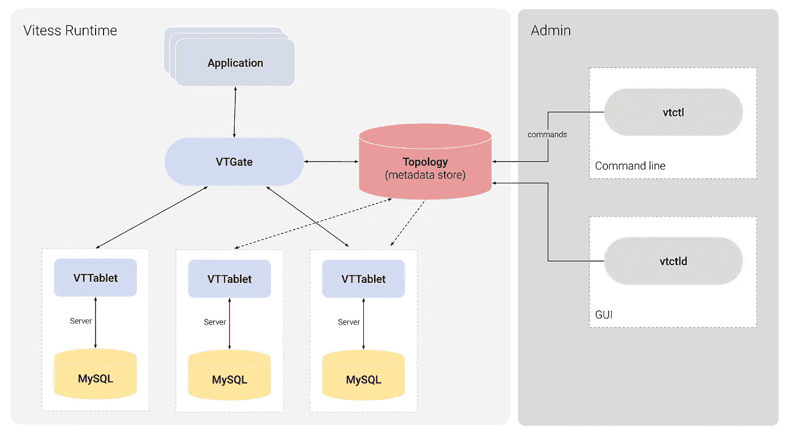
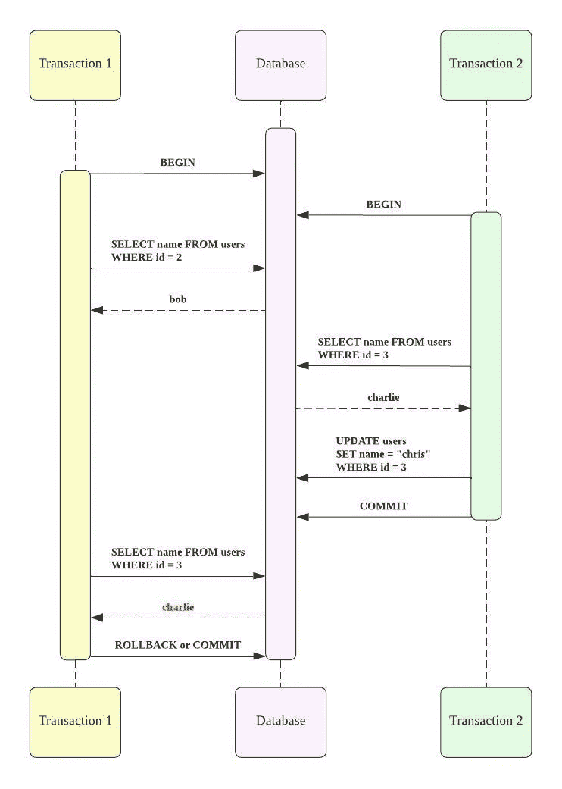
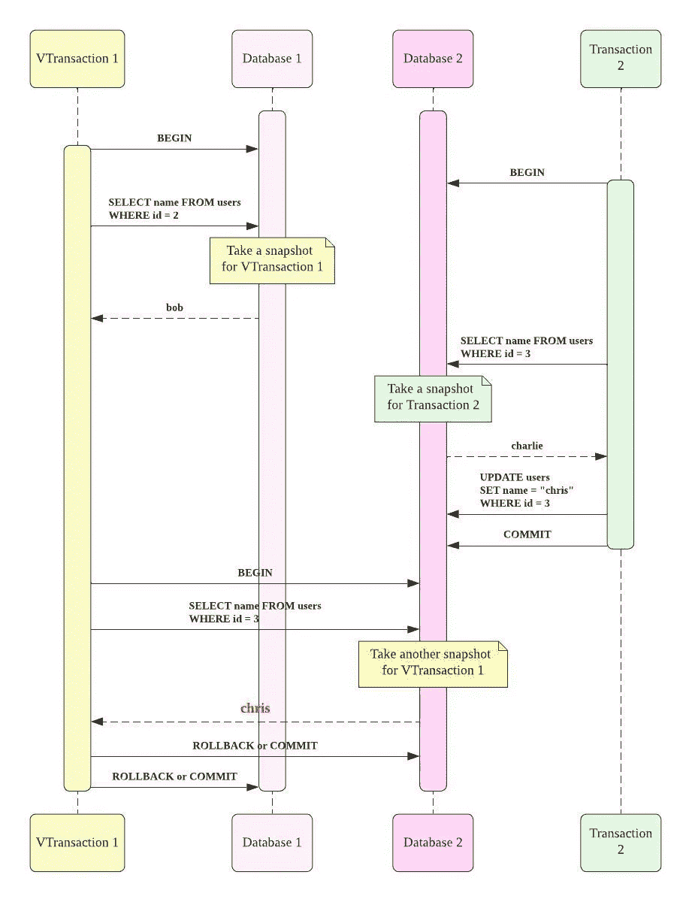

# 在分片的 MySQL 中使用哪个隔离级别

> 原文：<https://itnext.io/which-isolation-level-to-use-in-sharded-mysql-on-vitess-ff8d77486281?source=collection_archive---------0----------------------->

一旦您的服务起飞并快速增长，您必须为主 *MySQL* 引入一个横向扩展解决方案。最常见且久经考验的方法是分片。



参考文献。[https://nadermedhatthoughts . medium . com/understand-database-sharding-the-good-and-ugly-868 aa 1 CBC 94 c](https://nadermedhatthoughts.medium.com/understand-database-sharding-the-good-and-ugly-868aa1cbc94c)

[由于我们已经观察到写流量上升趋势](https://parallel.chat/)有一段时间了，我们的工程团队开始研究实施分片的各种选项。经过一些简单的研究，Vitess 对于我们构建在 Rails 上的系统来说看起来不错。你真幸运！Vitess 是一个位于 web 服务器和 MySQL 集群之间的中间件，因此您不必自己编写分片逻辑。



参考文献。[https://vitess.io/docs/14.0/overview/architecture/](https://vitess.io/docs/14.0/overview/architecture/)

好了，现在是时候仔细阅读官方文档，评估将我们的独立主 MySQL ( *InnoDB* )调整为在 *Vitess* 上的主 MySQL 集群的可行性了。在这个过程中，我发现了一个神秘的兼容性警告如下。

> [Vitess 在执行跨分片查询时提供了 READ COMMITTED 语义。这与 MySQL 不同，MySQL 默认为可重复读取。](https://vitess.io/docs/13.0/reference/compatibility/mysql-compatibility/)

乍看之下，我把这种单挑当成小事丢弃了。但后来，我同事的以下问题引起了我的注意，因为它值得仔细了解:

> **到底什么是*读提交的*语义？**和我们熟悉的*读提交*隔离级别或者*可重复读*隔离级别有区别吗？

对于不了解最新数据库的应用程序开发人员来说，要回答这个看似高度相关的问题，我将介绍:

*   **被迫使用低于*可重复读取*的保证的可能后果**。您的应用程序可能会无意中依赖于此默认隔离级别。
*   **观察由 *READ COMMITTED* 语义引起的**变化，同时比较一个分片 MySQL 集群和一个独立 MySQL。
*   **在引入像 Vitess 这样的分片中间件之前和之后，决定使用哪个隔离级别**。

# 为什么隔离级别很重要？

事务隔离就是缩写 [*酸*](https://dev.mysql.com/doc/refman/8.0/en/glossary.html#glos_acid) 中的 *I* 。通过锁定机制，事务在进行过程中不会相互干扰。

隔离级别是为了提高性能而牺牲较少保证的设置。 *SQL:1992* 标准定义了四个隔离级别:*未提交读、提交读、可重复读、*和*可序列化*。一般来说， *READ UNCOMMITTED* 被认为保障太少，反之， *SERIALIZABLE* 被认为过于严格。这就是为什么 PostgreSQL 和 MySQL (InnoDB)的默认隔离级别分别是*提交读取和*可重复读取。

***READ COMMITTED* 隔离级别保证事务看到数据库的最新提交视图**。与 *READ UNCOMMITTED* 隔离级别不同，您不会读取可能稍后回滚的数据。

假设我们有一个用户表。

```
**CREATE TABLE** `users` (
  `id` int(2) NOT NULL AUTO_INCREMENT,
  `name` varchar(25) COLLATE utf8mb4_unicode_ci NOT NULL,
   PRIMARY KEY (`id`)) 
ENGINE=InnoDB DEFAULT CHARSET=utf8mb4 COLLATE=utf8mb4_unicode_ci;
```

两个并发事务访问同一个表。

```
// Transaction 1
ActiveRecord::Base.transaction
  user2 = User.find(2) // <- Transaction 2 updated the user3 from charlie to chris at    
  // this point user3 = User.find(3) // charlie or chris?
end
```

在下图中，并发事务看到另一个事务所做的实时更改。*事务 1* 获得*克里斯*作为最新提交的名称，即使*事务 2* 在*事务 1 之后开始。*


读取时序图表中提交的视图

***可重复读取*隔离级别保证事务看到第一次读取所获得的数据库快照的提交视图。**与*提交读取*隔离级别不同，在事务中的某一点读取的数据与在事务中的另一点读取的数据相同。

让我们再次尝试之前的场景，但是将隔离级别更改为*可重复读取*。并发事务看到在每个事务内拍摄的快照的提交视图。*事务 1* 得到*查理，*而不是*克里斯，*因为*事务 1* 在*事务 2 之前开始。*换句话说，这两个并发事务是串行执行的。



时序图表中的可重复读取视图

**请注意，快照是由表拍摄的，而不是由行或数据库拍摄的。**对表的第一次读取会创建一个新的表快照。如上图所示，*事务 1* 在发出*SELECT name FROM users WHERE id = 2*时，创建了 *users* 表的快照。事务结束后，快照将被删除。

在许多情况下，由快照读取特性支持的一致读取使我们的生活更加轻松。假设您添加了一个新的 API 端点，用户可以通过它加入一个特定的聊天组。下面的代码显示了 *check_in* API 创建了一个新的 *chat_group_user* 并返回了 *chat_group* ，包括其所有的 *chat_group_users* 。

```
def check_in
  // Transaction 1
  ActiveRecord::Base.transaction
    chat_group_user = [@chat_group](http://twitter.com/chat_group_room).chat_group_users.build(user: 
    current_user)
    chat_group_user.save! // <- Transaction 2 forcefully checked out the chat_group_user 
    // at this point. It can happen due to the sudden disconnection. render json: [@chat_group](http://twitter.com/chat_group_room), serializer: ChatGroupSerializer, 
    include:[:chat_group_users]
  end
end
```

> 我们最近在生产中遇到的困难引出了这个例子。我们期望响应将请求者作为新的 chat_group_user，因为 check_in API 刚刚成功返回 200。但是，这取决于你的隔离级别。

有了*可重复读取*，一旦找到了 chat_group_user，就不用担心事务内的删除了。您的 API 的逻辑和响应是一致的，就好像没有并发删除一样。使用提交的*读取*，API 逻辑可能基于数据的存在，而 API 响应可能基于数据的移除。尽管这种不一致反映了实际情况，但它却是一个令人讨厌的小故障，因为这种罕见的不一致在开发过程中不值得注意。

**改变隔离级别会导致不同的后果。**虽然将*提交读取*升级为*可重复读取*意味着性能降低，但将*可重复读取*降级为*提交读取*会导致保证降低。考虑到成熟的应用程序可能会无意中依赖于快照读取特性，您最好在降级之前为意外行为做好准备。

# Vitess 提供了什么读提交语义？

这是否意味着 *Vitess* 在每个 MySQL 数据库上隐式地将您的隔离级别设置为 *READ COMMITTED* ？

> 我的同事 [cou929](https://github.com/cou929) 对此进行了调查，发现 *Vitess* 并不会改变隔离级别。

那么，文档是不是错了，因为在引入了 *Vitess* 之后，我们仍然有一堆*可重复读取的* MySQL 数据库？嗯…

当我重读这句话时，我注意到文档提到了条件“*当执行跨分片查询*时。”这意味着 *Vitess* 不会改变行为，除非是跨片查询。

> [Vitess 在执行跨分片查询时提供读提交语义。](https://vitess.io/docs/13.0/reference/compatibility/mysql-compatibility/)

当目标数据存储在多个名为*碎片*的 MySQL 数据库中时，我们需要执行跨碎片查询。我们如何实现碎片快照的一致视图，就好像碎片是一个 MySQL 数据库一样？仅仅通过水平排列 MySQL 数据库来创建一致的视图是不可能的，即使每个 MySQL 的隔离级别都是*可重复读取*。这是因为每个快照都是在不同的时间拍摄的。

让我们观察事务在一个点从一个碎片读取，在另一个点从另一个碎片读取。*Vitess* 允许你运行如下相同的应用程序代码，即使你把一个表分成两个部分表。

```
// Virtual Transaction 1
ActiveRecord::Base.transaction
  user2 = User.find(2) // <- Transaction 2 updated the user3 in Database 2 from charlie 
  // to chris at this point user3 = User.find(3) // charlie or chris
end
```

虽然这是一个方便的抽象，但是您应该知道 V *虚拟事务 1* 包含两个物理事务，分别指向*数据库 1* 和*数据库 2* 中的每个*用户*表。因此，上面的代码实际上是以如下方式执行的:

```
// Transaction 1 in Database 1
ActiveRecord::Base.transaction
  user2 = User.find(2) // <- Transaction 2 updated the user3 in Database 2 from    
  // charlie to chris at this point

  // Transaction 1 in Database 2
  ActiveRecord::Base.connected_to(role: :database2) do  
    user3 = User.find(3)
  end
end
```

如下图所示，事务会看到每个分片的最新提交视图，直到分片在第一次读取时获取其快照。



时序图表中的读取提交语义+可重复读取视图

***READ COMMITTED* 语义代表了碎片的不一致视图。**结合*可重复读取*隔离级别，事务看到的是碎片快照的不一致视图。此外，值得注意的是，这个例子的结果( *chris* ，而不是 *charlie* )与独立 MySQL 设置为 *READ COMMITTED* 隔离级别的情况相同。

# 对分片使用哪种隔离级别？

没有一种适合所有分布式隔离级别的解决方案，因为即使一个数据库也有四种隔离级别。您的里程可能会有所不同。

当您的应用程序对 *READ COMMITTED* 隔离级别感到满意时，您是幸运的。从理论上讲，*读提交的*语义不会使*读提交的*事务的保证更少。你最好坚持下去。

当您的应用依赖于*可重复读取*隔离级别时，您需要做好准备。*读提交*语义使得*可重复读*事务的保证更少。但是，怎么不那么有保障呢？这取决于你的应用程序的用途。

**不太有保证的*可重复读取*仍然可以防止大部分的不一致，**比如 API 逻辑和串行化器之间的不一致，正如我之前提到的。最后，只要逻辑部分在碎片上创建所有快照，序列化部分稍后引用这些快照，就不会有不一致。

另一方面，你的报告功能可能会打折扣。假设您想通过批处理脚本连接 order 表和 item_info 表来报告订购商品的统计数据。如果在创建报告时更新了 item_info 表，该怎么办？如果没有分片，为报告而运行的事务看不到最新的更改，因此报告结果是一致的，就好像更新是在报告之后执行的一样，这意味着两个并发事务被序列化。一旦 item_info 表被分成 item_info_1 和 item_info_2 表，您的批处理脚本就不能像以前一样访问 item_info 表的整个快照。可以根据旧的项目信息和新的信息混合来制作您的报告。

```
// Transaction 1
ActiveRecord::Base.transaction
  orders = Order.where(created_at: [@report_begin](http://twitter.com/report_begin)..[@report_end](http://twitter.com/report_end))
  orders.each do |order|
    items = ItemInfo.where(id: order.item_ids)
    // <- Transaction 2 can change some item_info before 
    // Transaction 1 takes a snapshot in shards
  end
end
```

**当您有时间进行分片前的准备时，在特定会话** **内，将您的单个 MySQL 数据库降级为 *READ COMMITTED* 隔离级别，并将其更改为 *REPEATABLE READ* 隔离级别** [**会更安全。**您可以采取这一步骤，在分割之前减轻和控制风险。此外，在分片之前将级别设置为 *READ COMMITTED* 让您有机会发现您的应用程序真正需要的级别。](https://dev.mysql.com/doc/refman/8.0/en/set-transaction.html)

如果您的应用程序不能容忍这种不太可靠的隔离级别，该怎么办？如果一个更高的层次，简称为*可重复读取*语义，是您的应用程序的严格要求，您应该考虑 NewSQL。对于一个流行的 MySQL 兼容数据库， [TiDB 支持*可重复读取*语义](https://docs.pingcap.com/tidb/dev/transaction-isolation-levels)。

# 包扎

分片数据库不能保证*可重复读取*隔离级别作为一个整体，即使每个数据库都被设置为相同的级别。Vitess 称之为不太有保证的隔离级别*读提交*语义。

我通过重温关于隔离级别的 *SQL:1992* 标准，观察发出跨分片查询的事务，并检查与您的应用程序需求相对应的隔离级别，揭示了这种后果的规模。