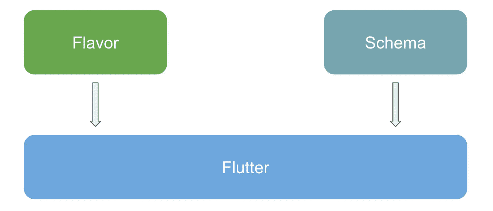
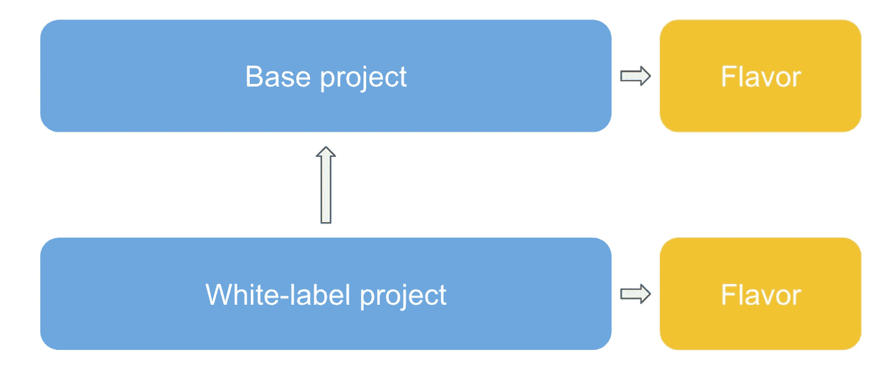

# Flutter 中的白牌应用

> 原文：<https://itnext.io/white-label-apps-in-flutter-613b2d0a80ce?source=collection_archive---------0----------------------->

图片由 [Rodion Kutsaev](https://unsplash.com/@frostroomhead) 在 [Unsplash](https://unsplash.com/photos/VKfqHv7qjNs) 上拍摄

*在 Flutter 中，各种风格在不同的环境下都能很好地工作，但是如果我们想要为不同的客户提供一个带有白色标签变体的公共代码库呢？*

如今，白色标签是一个常见的主题，至少这是我们作为一家移动代理商在 [Pinch](https://pinch.nl/en) 所经历的。为什么不应该呢？作为一家拥有多个品牌的公司，很容易为每个品牌推出应用程序，同时共享相同的代码库:对开发人员来说效率更高，对客户来说成本更低！但是，尽管在 iOS & Android 等原生环境中的路径非常清晰，但目前还没有针对 Flutter 的真正解决方案。我们可以在代码中多样化，但是我们如何保持一切整洁？我们如何保持我们的主要代码库的整洁，而不是用特定风格的代码把它弄得乱七八糟，或者把一种风格的资产从另一种风格中分离出来，而不是在创建发布版本时把每个资产都拉进我们的应用程序，以缩小应用程序的规模？🤔

# 那么，问题是什么？

在深入更技术性的东西之前，让我们后退一步，看看这里的实际问题。原生 Android 和 iOS 应用中的白色标签是通过产品风格和模式完成的。在这方面有足够多的东西可以找到，但我们在这里处理的是 Flutter 应用程序，而不仅仅是本机应用程序。这意味着如果我们想要创建合适的白标签应用程序，我们实际上有 2 层要处理:本地和 Flutter。

**原生**层包含应用图标、应用 ID &和应用名称等内容。 **Flutter** 包含图像、字符串、字体等其他东西&主题化。

记住这一点，让我们先看看最显而易见的解决方案，看看为什么它不能真正满足我的需求。

# 风味飘动

所以，当你开始谷歌搜索时，你会发现的第一件事显然是 [Flutter 文档](https://flutter.dev/docs/deployment/flavors)。这里有多篇文章描述了如何在 Flutter 中实现 flavors。简而言之，您将利用本机变体来指定您的口味:iOS 中 Android &模式中的产品口味。之后，您可以检查 Dart 代码中的味道，并从那时起对它做任何您想做的事情。

它完成了任务，而且效果很好。我们已经在一些应用中使用类似的设置来分离开发和生产环境。我们在 Android 中指定了产品风格，在 iOS 中指定了模式，然后使用一个`FlavorConfig`类根据风格初始化它的值(它使用一个`MethodChannel`从本机获取)。

到目前为止一切顺利，但是如果我们把白色标签加入其中会发生什么呢？看到我们希望每个白标有 2 个环境，事情可能会在代码中变得很难控制。在每个需要特定风格代码的地方，都需要有 switch-case 和/或 if-else 语句。

不理想😅这是可行的，但是可维护性和可读性确实受到了影响。除此之外，当创建发布版本时，我们基本上是将所有的代码&所有的资产都拉入到版本中。实际上，可能会出现更多的问题，但(幸运的是)我们从来没有到那一步。

理想情况下，我们希望将所有与风味相关的东西彼此分开，并与主代码库分开。是的，这正是我在即将推出的解决方案中试图实现的目标！

# 解决方案:依赖！

> 旁注:如果您想直接跳到实现，只需向前滚动到下一部分👌

我想要实现的是为每一种口味都有单独的目录，所以我们保持一切都很好并且包含在内。添加新的白标应该像复制粘贴现有的白标并调整值以适应新的白标一样简单。

对我来说，最有效和最清晰的方法是完全抛弃产品风格和模式。相反，我在我的基础项目中添加了一个本地`flavor`依赖项，其中包含了所有特定风格的 Flutter 东西:资产、字符串、主题化，甚至小部件。之后，我创建了第二个 Flutter 项目，它依赖于`base`项目。通过在那里添加一个本地`flavor`依赖项，但是实际上将其定义为一个依赖项覆盖，我们最终只使用了白标项目的`flavor`依赖项，所以我们放弃(或者更好地说:覆盖)了基础项目的`flavor`依赖项。接下来:白标项目的入口点(`main()`)将实际引用基础项目的入口点。那是什么意思？这意味着最后，我们利用基础项目中的 Flutter 代码，并结合白标项目的 flavor 目录中的内容。

最终，我们只会得到基础项目的 Flutter 代码和白标项目的 Flavor 目录的内容。

除了让 Flutter 端很好地包含在内，我们还保持了原生组件的分离。因为一个白标项目是它自己的 Flutter 项目，它有自己的 Android & iOS 文件夹。尽管这意味着一些样板文件，但它确实意味着我们将像应用程序图标、应用程序名称和应用程序 ID 这样的东西保留在白标项目中，而不是共享代码库中。

# 变得技术化

这在理论上听起来很棒，但实际上看起来如何呢？

我首先在我的(现有的)Flutter 项目的根目录下创建了一个名为`flavor`的目录。通过在该目录中添加一个`lib` 文件夹和一个`pubspec.yaml`文件，我们实际上可以把它看作一个(本地)依赖项:

现在，如果我们转到`base`项目的`pubspec.yaml`，我们可以简单地通过路径定义来添加本地`flavor`依赖项:

这就像正常添加依赖项一样，但是我们通过依赖项的路径来定义它的位置。

让我们在`flavor`目录中添加一些东西！首先，在名为`flavor_strings.dart`的`lib`文件夹中创建一个新的 Dart 类。我们将在其中输入一个字符串作为应用程序的名称:

现在，只需在您的应用程序中使用`FlavorStrings.flavorName`字符串！我们将在接下来的步骤中覆盖它🙂

> 旁注:因为`flavor`是一个本地依赖项，所以把它当作一个本地依赖项对待！相对导入是行不通的，所以一定要用全包导入。

**添加白标项目** 现在我们已经建立了我们的共享代码库，是时候为我们的第一个白标创建一个新的 Flutter 项目了。确保基础项目和白标项目在同一个文件夹中！当新项目启动并运行时，我们要做的第一件事是将`flavor`目录从基础项目复制粘贴到白标项目中。之后，让我们更改我们的白标项目中的`flavorName`字符串，这样我们就可以在以后验证一切都正常工作了！

不错！所以现在我们已经定义了我们的白标特定字符串，继续前进并跳转到白标项目的`pubspec.yaml`文件。我们将在这里向我们的共享代码库添加一个依赖项，并用我们的白标项目中的新目录覆盖基础项目的 flavor 目录:

还有一件事！进入白标项目的`main.dart`类。在这里导入基础项目的`main.dart`类，从白标项目的 main 函数中调用 main 函数:

相当简单，但我们在这里所做的就是确保当我们运行我们的白标项目时，它基本上会运行我们的共享代码库。

好东西！

> 我知道这可能需要通读一篇文章，所以要获得完整的项目概述，只需看一看[这个资源库](https://github.com/ThomasMiddel/flutter_whitelabel)

# 利弊

我首先要说的是，这不是灵丹妙药。来自 Android 的我想我可能有点被那里的处理方式宠坏了，但仍然:我认为这个解决方案总体上是非常清晰和可维护的。它对每个白标都有明确的划分，发布版本将只包含与我们正在构建的白标内容相结合的共享代码库。没有来自其他白色标签的内容或代码！

我现在遇到的主要缺点(仍有可能微调)是有一些样板文件，因为我们有 2 个 Flutter 项目用于 1 个 white-label，并且本机端的可维护性有点低。想想你放在`MainActivity`或`AppDelegate`中的逻辑，或者比如碰撞 minSdk 版本。这必须在每个白标中单独完成，而不是在共享代码库中一次完成。

*就是这样！我希望这篇文章能为你提供一些关于 Flutter 中白色标签的答案。我认为这个模板仍然有改进的空间，但它是一个很好的基础，让你有希望开始！保持安全，继续编码。🐦*