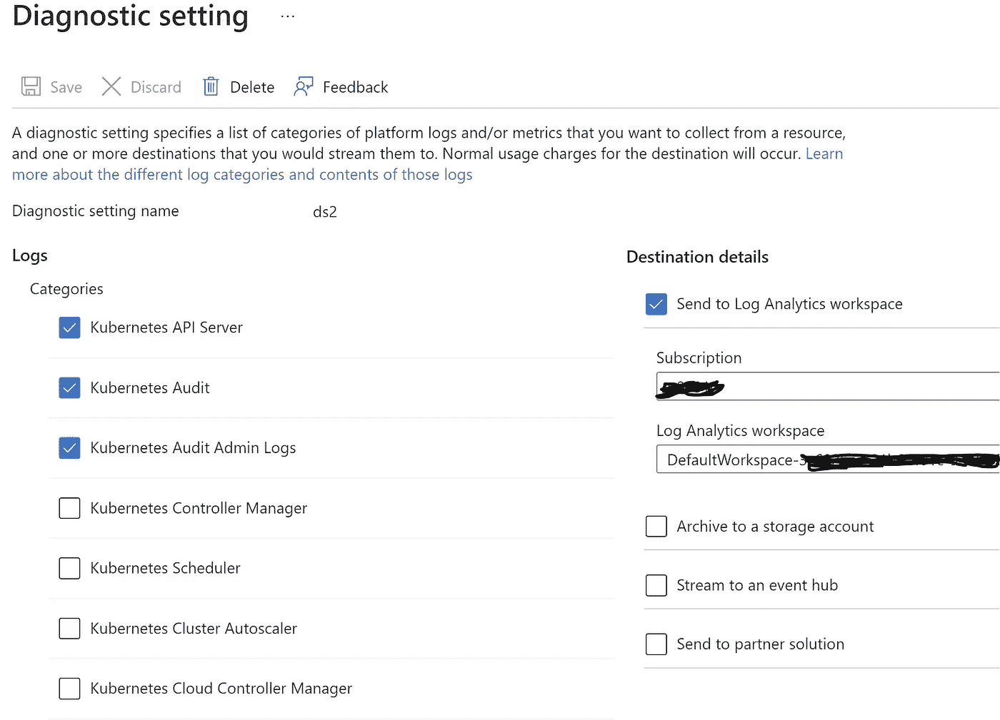
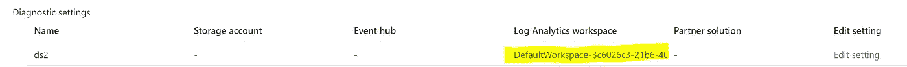
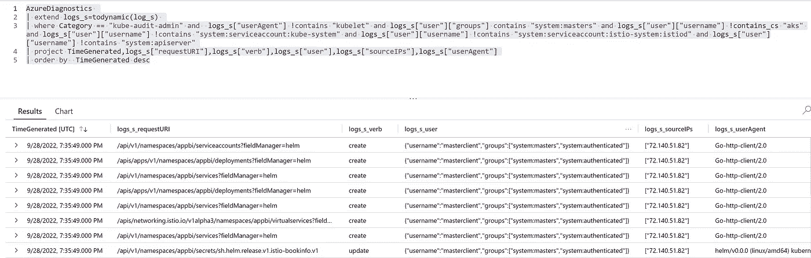
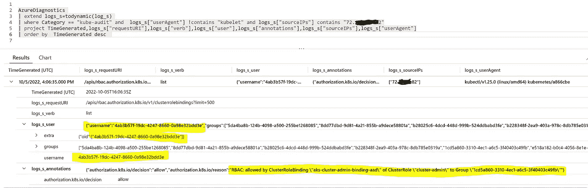
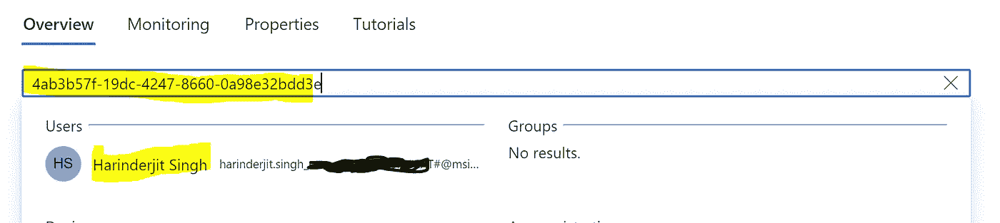

# 使用审计调查 AK 上的操作

> 原文：<https://itnext.io/whodunit-investigate-actions-on-aks-using-auditing-1db3ccf9ae86?source=collection_archive---------1----------------------->

## 这个博客的背景故事

那天，Oncaller 醒来时听到一个寻呼机警告“应用程序网关的后端主机不健康”。我们的客户将应用网关作为 [AKS 集群](https://learn.microsoft.com/en-us/azure/aks/intro-kubernetes)的入口控制器，因此 AKS 集群在这种情况下是后端。该警报实际上意味着 AKS 应用程序盒关闭、重启或缩减。因此，他查看了状态，并为 12 次部署中的每一次部署重新安排了时间。以下是团队 slack 频道上的留言。

```
I see new pods were created but not sure who requested it since in events as well it just mentions creating replica set destroying and creating pod.
```

所以很明显，这不是一个问题，而是一个没有通知的部署。

应用程序恢复正常，但出现了一些问题:

*   是谁做的，实际上是计划维修吗？
*   是有人做错了还是故意的？
*   什么时候开始和结束的？
*   行刑的地点是哪里？
*   使用了什么工具来完成它？

这些问题你都是怎么回答的？您首先想到的是查看**审计日志**。

尽管对于来自合法 CD 管道的请求，这很容易，因为您可以查看管道执行历史和由 CD 管道使用的 SPN 的 Azure AD 登录日志。由此，你可以知道是谁在何时执行的，这就是这里的情况。

管道执行的细节与客户端共享，并且**发现这是一个有计划的部署，但是 oncaller 没有得到通知。所以它**

这促使我思考，如果它不是来自一个 CD 管道，而有人使用 *kubectl* 或 *helm* 或直接 API 调用等手动执行它，会怎么样？？在这种情况下，审计日志非常有用。

## [Kubernetes 中的审计](https://kubernetes.io/docs/tasks/debug/debug-cluster/audit/)

作为任何生产级软件的标准特性，您可以在 Kubernetes 中启用审计。由于审计记录在 [kube-apiserver](https://kubernetes.io/docs/reference/command-line-tools-reference/kube-apiserver/) 组件中开始其生命周期，您应该能够管理 [kube-apiserver](https://kubernetes.io/docs/reference/command-line-tools-reference/kube-apiserver/) (在 [AKS](https://azure.microsoft.com/en-us/products/kubernetes-service/) 、 [EKS](https://aws.amazon.com/eks/) 和 [GKE](https://cloud.google.com/kubernetes-engine) 中不可能)。这里有一个[不错的视频](https://www.youtube.com/watch?v=RVcj1nJwhY4&t=1046s)解释了如何在 Kubernetes 集群(本地)中启用审计。

## Azure Kubernetes 服务中的审计

[使用 AKS 中的审计日志记录](https://learn.microsoft.com/en-us/azure/azure-monitor/containers/container-insights-log-query#resource-logs)来按时间顺序记录对 Kubernetes API 服务器的调用，调查可疑的 API 请求，收集统计数据，或者为不需要的 API 调用创建监控警报。AKS 控制平面组件的日志在 Azure 中被实现为[资源日志](https://learn.microsoft.com/en-us/azure/azure-monitor/essentials/resource-logs)。您可以通过启用[收集资源日志](https://learn.microsoft.com/en-us/azure/aks/monitor-aks#collect-resource-logs)的“诊断设置”中的审计选项来启用 AKS 审计。您可以将日志发送到[日志分析工作区](https://learn.microsoft.com/en-us/azure/azure-monitor/logs/quick-create-workspace?tabs=azure-portal)，将它们归档到存储帐户，将它们流式传输到事件中心，或者将它们发送到合作伙伴解决方案。对于分析、查询或根据查询创建警报，最佳解决方案是使用[日志分析工作区](https://learn.microsoft.com/en-us/azure/azure-monitor/logs/quick-create-workspace?tabs=azure-portal)。

你不需要装载容器的 Azure Monitor 来访问资源日志。是的，这有点令人困惑，因为门户上 AKS 集群左侧刀片的“监控”部分下的“日志”实际上指向 Azure Monitor for containers。

## **启用资源日志收集**

导航到 AKS 实例，然后在门户上 AKS 群集左侧的刀片“监控”部分下导航到“诊断设置”。点击“添加诊断设置”,为[选择适当的类别](https://learn.microsoft.com/en-us/azure/aks/monitor-aks-reference),并选择“发送至日志分析工作区”



保存并等待 5 分钟，然后日志开始传输到日志分析工作区。所选日志将被添加到“AzureDiagnostics”表中。

## **查询审计日志**

在诸如“背景故事”中的情况下，您可以使用 [KQL](https://learn.microsoft.com/en-us/azure/data-explorer/kusto/query/tutorial?source=recommendations&pivots=azuredataexplorer) 来查询并找出是谁做的。

导航到 AKS 实例，然后在门户上 AKS 群集左侧的刀片“监控”部分下导航到“诊断设置”。单击日志分析工作区链接。



单击门户上日志分析工作区实例左侧刀片“常规”部分下的“日志”。

选择时间范围后，运行以下查询

*   您只选择了类别“kube-audit-admin ”,该类别从日志中排除了获取和列出审计事件。
*   您已经排除了 userAgent 为“kubelet”的记录。
*   您已经排除了用户和组未被客户端实用程序使用的记录，如 *helm* 和 *kubectl* 。
*   同样，您可以根据自己的需求编写查询。

特定时间范围内上述查询的示例结果。



以上结果表明，有人用公共 IP 72.140.51.82 执行了“*头盔升级*”或“*头盔安装*”。它还显示了创建或更新了哪些资源，以及使用了哪些 Kubernetes RBAC 用户登录 API 服务器。您可以使用类似的 KQL 查询组合进行更多分析。您可以根据在“启用资源日志收集”中选择的类别过滤类别并查看它们。

如果它显示的是 10.241.0.55 这样的私有 IP(而使用的私有地址空间是 10.90.0.0/16，包括 VPN 地址空间)，跟踪真实用户就变得更加困难。**我观察到，对于每个 AKS 实例，源 IP 来自私有地址空间 10.241.0.0/24，并且 IP 对于每个实例都是唯一的**。看起来这些 IP 要么是我们完全看不见的 kube-apiserver 主节点的某种网关，要么是原始源 IP 指向这些 IP。这对跟踪活动没有帮助。如果这些 IP 是原始源 IP，将会很有帮助。这里**你既没有客户端的 IP 也没有用户名，因为你使用的是本地的 Kubernetes 账户。这使得审计变得毫无价值。**

**为了正确审计，必须禁用 Kubernetes 本地帐户，并且必须使用** [**AKS 管理的 Azure Active Directory 集成**](https://learn.microsoft.com/en-us/azure/aks/managed-aad) **。**

下面的例子显示了当 AKS 集成了 AAD 时，如何跟踪用户所做的操作。



您可以将上述查询中的用户名映射到 Azure AD 中的用户



## 一些关键点

*   我观察到**一些不一致的行为，AKS 资源日志有几天没有与日志分析工作区**同步。
*   你**不需要板载**[**Azure Monitor for containers**](https://learn.microsoft.com/en-us/azure/azure-monitor/containers/container-insights-overview)**(如果你使用的是 Datadog 或者 Dynatrace 等。用于监控)**访问日志分析工作区中的资源日志(审计日志)**。**
*   **将资源日志发送到工作区是有成本的，因此您应该只收集那些您打算使用的日志类别。**
*   **如果您需要保留信息，但不要求信息随时可用于分析，请将日志发送到 Azure 存储帐户以降低成本。**
*   **设置警报以确保资源日志始终流向日志分析工作区或存储帐户。**
*   ****避免使用“Kubernetes 本地账户”。对于 AK，尝试使用至少 Azure 广告认证与 Kubernetes RBAC。****

**请阅读我的其他文章，并分享您的反馈。如果你喜欢分享的内容，请点赞、评论并订阅新文章。**