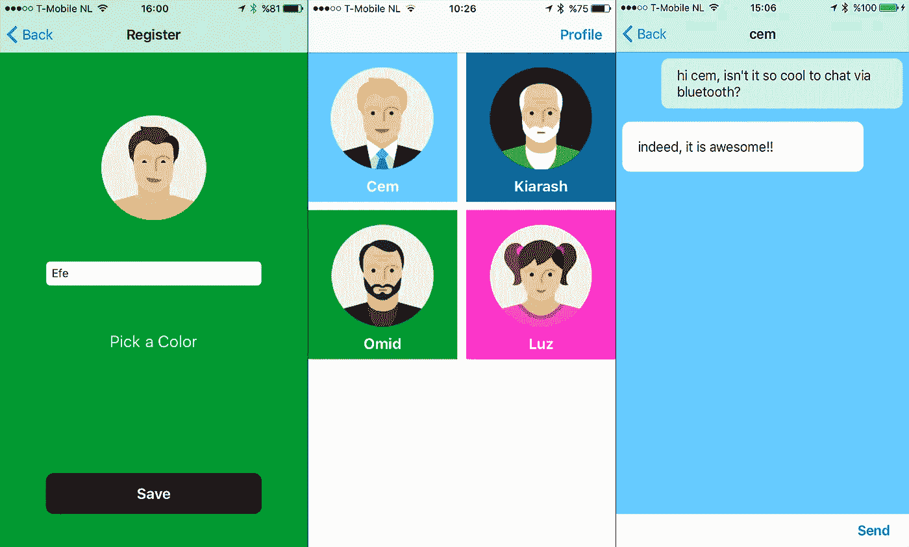
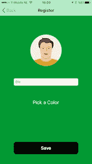
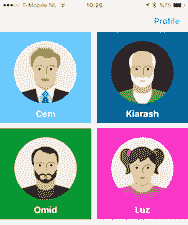
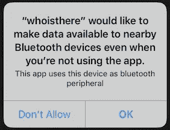

# “谁在那里”:用于与周围同事聊天的简单 Swift 应用程序

> 原文：<https://itnext.io/whos-there-simple-swift-app-for-chatting-with-colleagues-around-a88ff765736f?source=collection_archive---------1----------------------->



在熟悉了[核心蓝牙(CB)](https://developer.apple.com/documentation/corebluetooth) 框架之后，我们决定构建一个简单的 iOS( [Swift)](https://www.apple.com/swift/) app，提供附近设备之间的通信。虽然我们可以通过这个框架访问所有蓝牙低能耗(BLE)设备，但我们只对安装我们应用的设备感兴趣。

CB 框架遵循 BLE 协议和蓝牙 4.0 规范。有两个主要玩家作为**中央**和**外围。**在本教程中，每个设备都充当中央设备和外围设备。

您可以在下面找到源代码

[](https://github.com/LINKIT-Group/who-is-there) [## 联系小组/谁在那里

### Blutooth Low Energy 的游乐场，找到附近的同事并进行简单的交流

github.com](https://github.com/LINKIT-Group/who-is-there) 

**1。注册我们的设备**

这个应用程序从一个注册屏幕开始，在这里你可以选择一个头像，选择一种颜色并输入一个名字。这部分与核心蓝牙框架无关；这只是一个简单的收集一些信息的屏幕。在下面的屏幕中，我们将[将此信息作为**外围设备**和**进行广告**](https://developer.apple.com/documentation/corebluetooth/cbperipheralmanager/1393252-startadvertising)，作为**中央设备**扫描其他外围设备。



注册我们的用户

**2。将其他设备作为中心进行扫描**

因为我们的设备将既是**外围设备**又是**中心设备**，所以让我们在`viewDidLoad`方法中创建`CBCentralManager`和`CBPeripheralManager`。

```
centralManager = CBCentralManager(delegate: self, queue: DispatchQueue.main)peripheralManager = CBPeripheralManager(delegate: self, queue: nil)
```

如果我们用扩展定义必要的委托，可读性会更好。我们需要实现的第一个委托是`CBCentralManagerDelegate`。当调用`centralManagerDidUpdateState`方法时，我们需要检查状态是否为`.poweredOn`。在这里，我们将扫描其他外设。为此，我们使用一个特定于我们应用的 UUID 来过滤掉所有其他 BLE 设备。要生成一个随机的唯一 id，您可以在终端中运行`uuidgen`命令。

一旦发现一个外设，就调用`didDiscover`方法。我们通过键`CBAdvertisementDataLocalNameKey`读取由每个外围设备发送的广告数据，并列出所有可用的设备。



找到了附近的同事

**3。作为外设的广告信息**

我们需要实现的第二个委托是`CBPeripheralManagerDelegate`。类似于 centralManager，我们等待调用`peripheralManagerDidUpdateState`方法，并检查状态是否为`.poweredOn`。然后，我们开始宣传从注册屏幕上收集的信息。在公布数据时，我们还需要使用之前生成的相同的 UUID。

**3。背景模式**

与核心蓝牙框架相关的后台执行模式有两种，`bluetooth-central`和`bluetooth-peripheral`。当应用程序在后台时，我们对扫描蓝牙设备不感兴趣。所以我们只用`bluetooth-peripheral`。为了启用该模式，从项目导航器中单击您的项目名称，选择您的目标，在 Capabilities 下，滚动到后台模式并选择`Act as a Bluetooth LE accessory`。之后，打开你的。plist 文件并检查所需的后台模式键是否已经存在，如果没有，为键`Required background modes.`添加`App shares data using CoreBluetooth`



当用户使用应用程序时，他们会收到关于这种背景模式的通知。

关于在背景中做广告的一个障碍是，当外围设备在背景中时，我们不能做额外信息的广告。

来自[苹果文件](https://developer.apple.com/library/content/documentation/NetworkingInternetWeb/Conceptual/CoreBluetooth_concepts/CoreBluetoothBackgroundProcessingForIOSApps/PerformingTasksWhileYourAppIsInTheBackground.html):

> CBAdvertisementDataLocalNameKey 广告密钥被忽略，并且不广告外围设备的本地名称

因此，在后台我们只获得外围设备的 CBUUID。这也不是可靠的唯一 id，因为一旦设备的蓝牙被关闭并再次打开，这个 id 就不再是相同的了。解决这个问题超出了本教程的范围。

**4。与同事聊天**


最后一部分是给我们的同事发信息**。**如前所述，我们的设备既是**中央**又是**外围。**因此，对于两种角色，我们需要实现的东西是不同的。先说外围部分。

**初始化外围设备的服务和特性**

在`peripheralManagerDidUpdateState`方法上，在开始广告之前，我们初始化外围设备的服务和特性，以便将值从中央写入外围设备。同样，我们为这个特征生成一个随机 UUID。因此，当作为中心写入时，我们只写入这个特定的标识符。

```
let WR_UUID = CBUUID(string: "XXXXXXXX-XXXX-XXXX-XXXX-XXXXXXXXXXXX")
let WR_PROPERTIES: CBCharacteristicProperties = .write
let WR_PERMISSIONS: CBAttributePermissions = .writeable
```

`CBPeripheralManagerDelegate`的第二种方法是接收中央写的消息。将响应和成功结果一起发送回中心也是一个很好的做法。

**从中央写入数值**

在我们能够写出我们想要的东西之前，我们需要采取几个步骤。第一件事是连接到目标外设。在输入我们的消息并按下发送按钮后，我们尝试连接到外围设备。

```
centralManager?.connect(selectedPeripheral!, options: nil)
```

一旦`didConnect`方法被调用，我们就调用外设的`discoverServices`方法。从这一点，我们得到了`CBPeripheralDelegate`的方法。当调用`didDiscoverServices`方法时，操作链继续为每个服务调用`discoverCharacteristics`。最后，当我们在`didDiscoverCharacteristicsFor`方法中获得特性时，我们只为我们之前提到的特定特性将值写入目标外设。

**5。改进**

有一些可以改进的地方没有包含在本教程中，例如:

*   检索时缓存扫描的外围设备的信息，甚至当外围设备上的应用程序进入后台时也显示该信息
*   当应用程序在后台时向设备发送消息(目前，只有当两个应用程序都在前台时，才能从中央向外围设备写入值)
*   让此应用程序与 Android 设备通信

这个简短的介绍旨在探索我们可以通过核心蓝牙框架实现什么。我们希望本教程将是你进一步实现的一步。