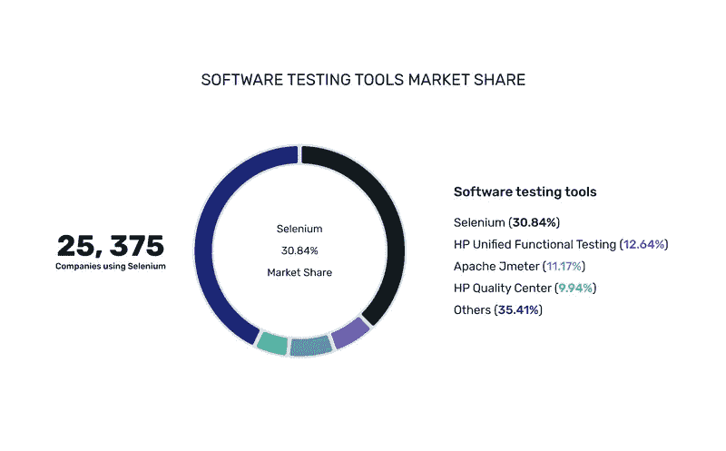
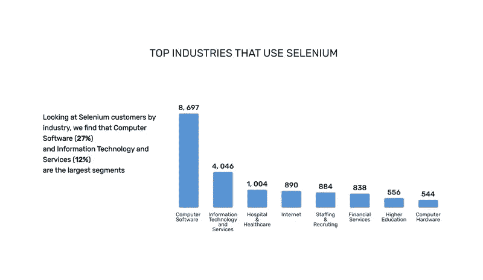
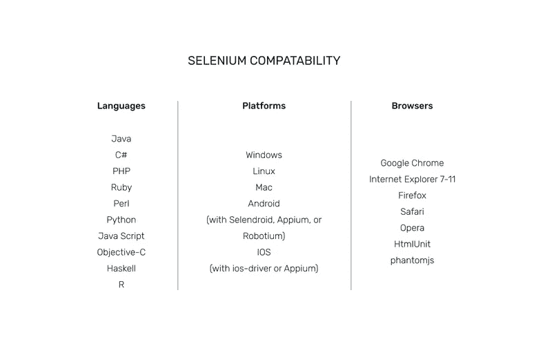

# 为什么所有真正的绝地武士都选择硒？(第二部分)

> 原文：<https://itnext.io/why-all-true-jedi-choose-selenium-part-2-85cc8756fdc3?source=collection_archive---------5----------------------->

在这里，我们继续赞美硒。我们提供了为什么我们完全喜欢这个工具的十大原因，尽管我们也提到了几个缺点。尽管如此，我们的结论是，至少在未来几十年内，人类应该仍然是测试背后的驱动力。

# 硒的优点。为什么它如此受全世界和我们的欢迎？

虽然我们已经提到了[我们有多爱硒](https://medium.com/@yellow/selenium-why-we-love-it-so-much-part-1-b1e05790d142)，但显然整个世界也是如此。下面是来自 [iDatalabs](https://idatalabs.com/tech/tech/products/selenium) 的一些统计数据，展示了 Selenium 在自动化测试市场上的受欢迎程度。首先，Selenium 占据了软件测试工具市场的最大份额。

第二，许多行业在其活动中使用硒。计算机软件(27%)和信息技术(12%)是使用 Selenium 的最大部分，但它在医疗保健、招聘、金融服务和高等教育中也很受欢迎。

# 那么，我们为什么如此推崇这种乐器呢？以下是我们热爱硒的 10 大理由。

## 1.硒是免费的

不，这不是玩笑。Selenium 是便携且开源的。您可以免费下载该工具，甚至获得免费的基于社区的客户支持。

## 2.硒很容易

Selenium 的界面是用户友好的；因此，运行测试非常容易。用户可以在所有浏览器中观察测试的执行。对测试结果的解释也很清楚。除此之外，由于 Selenium 的开源特性，用户可以编写自己的扩展并开发定制的操作。

## 3.硒放在套房里

selenium Suite——一套不同的测试工具——满足不同的测试需求和测试环境的要求。

## 4.Selenium 支持多种编程语言

特别是，Selenium 支持所有最常用的编程语言，比如 Java、Perl、Python、C#、Ruby、Groovy、JavaScript 等等。

## 5.Selenium 支持多种操作系统

除了传统的 Windows 和 Mac 之外，Selenium 仍然是操作和支持 Linux 的少数主流工具之一。此外，在 Selenium Suite 的帮助下，您可以在一个平台(例如，在 Windows 上)上创建测试用例，然后在另一个平台(例如，Linux)上运行它们。

## 6.Selenium 支持多个浏览器

Selenium 提供对 Internet Explorer、Chrome、Firefox、Opera、Safari 和其他不太知名的浏览器的支持。除此之外，Selenium IDE 可以用作 Firefox 的插件，自 2018 年起可以用作 Chrome 的插件。

## 7.Selenium 集成了各种开发平台

Selenium 很容易与各种开发平台集成，包括 Jenkins、Maven、TestNG、QMetry、SauceLabs 等。当开发人员使用 Selenium Grid 时，他们不需要通宵等待来接收测试反馈。

## 8.Selenium 支持移动测试

使用 Selenium，您还可以测试移动应用程序，尽管您需要额外的软件，如 Appium 或 selen droid——它们都基于 Selenium，都是开源的，并且有强大的社区。虽然 Appium 支持 iOS、Android 和 Windows 设备，但 Selendroid 只专注于 Android。

## 9.硒是不断更新的

Selenium 的社区提供技术支持以及不需要特定培训的持续更新。除此之外，Selenium 的社区非常活跃:许多 Coursera 资料以及数百个 YouTube 教程和 Quora 主题为新来者提供了大量支持。

## 10.Selenium 有很多插件

硒其实可以做的更多！一系列特定的插件，如 Appium 或 Selenoid，可能会扩展 Selenium 的标准功能。套件中的所有工具都有插件，包括 WebDriver、Grid 和 Selenium IDE。在后一种情况下，插件特别有用。

# 和一些 CONS…

事实上，我们从来不会说我们有多爱某个软件而不提及它的一些缺陷。不幸的是，Selenium 确实有一些缺陷，但是所有这些缺陷都可以通过第三方解决方案来解决。

## 1.Selenium 不支持无代码测试

今天，自动化测试朝着无代码测试的趋势发展，这允许没有广泛编程语言知识的人执行测试。一些测试工具已经为测试人员提供了一个选项来编写脚本和接收反馈，但是跳过编码部分。这种方法可能有助于公司将最好的程序员分配到更重要的任务中，并在自动化测试中雇佣技能较低的员工。这对 Selenium 不起作用，因为在专业水平上使用它的工具仍然需要深厚的编程语言知识。

## 2.Selenium 需要第三方软件来执行图像比较

为了在测试过程中进行图像比较，Selenium 需要第三方软件，不像其他一些测试工具。一个常见的选择仍然是 si kuli——一种基于图像的识别工具，与 Selenium 兼容。

## 3.Selenium 没有直接来自开发者的适当技术支持

尽管有大量的 Selenium 视频教程和论坛，但基本上是社区提供了持续的技术支持，而不是开发人员自己。因此，找到一个非常规问题的解决方案可能需要一些时间。万一社区找不到快速解决方案，你得联系服务公司，而 thas 不是免费的。

# 一锤定音

硒是开源的，多样的，容易处理。它为您节省了大量的软件购买和技术支持费用，为测试人员提供了从语言到操作系统的无限选择，并且仍然易于操作。Selenium 只需要一组基本的指令就可以自动化测试过程。因此，尽管经历了几次流动，Selenium 仍然主导着测试自动化市场。我们绝对热爱 Selenium，并向其他公司和创业公司强烈推荐这款工具。

同时，值得一提的是，尽管测试自动化服务在全球范围内增长，人类仍然是测试背后的驱动力，因为他们操纵测试工具并解释脚本。即使我们正在快速过渡到一个更加自动化的世界，所谓的“人性化”在软件测试行业仍然很重要，至少在未来几十年内是如此。

*原载于*[*https://yellow . systems*](https://yellow.systems/blog/selenium-why-we-love-it-so-much-part-2)*。*