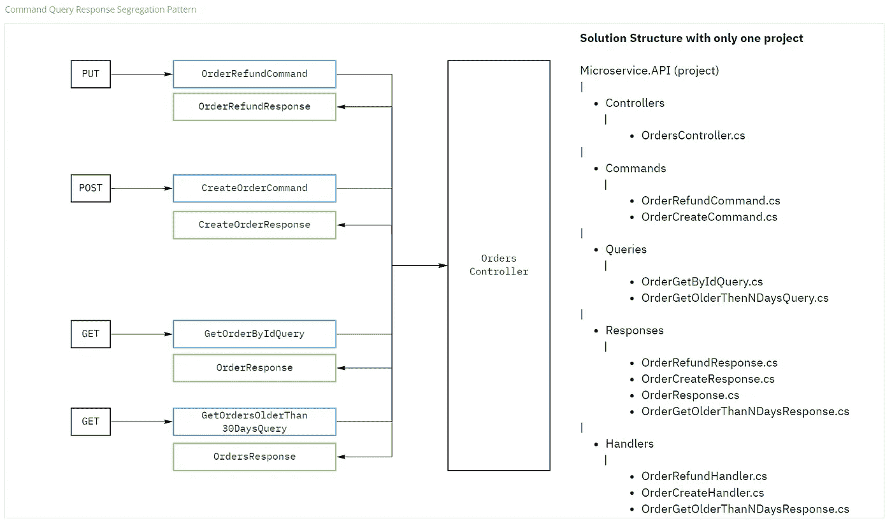
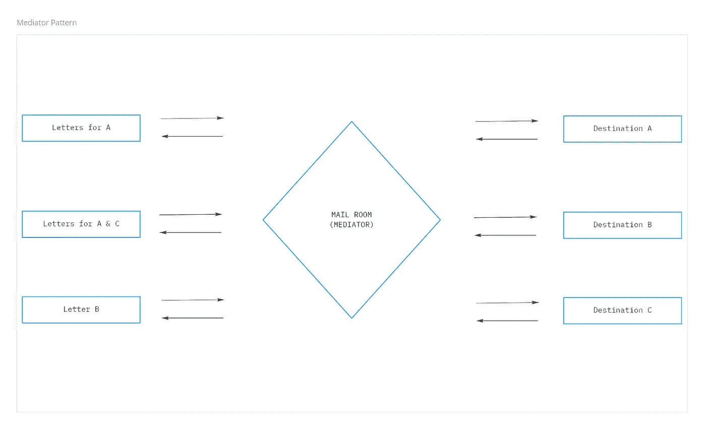
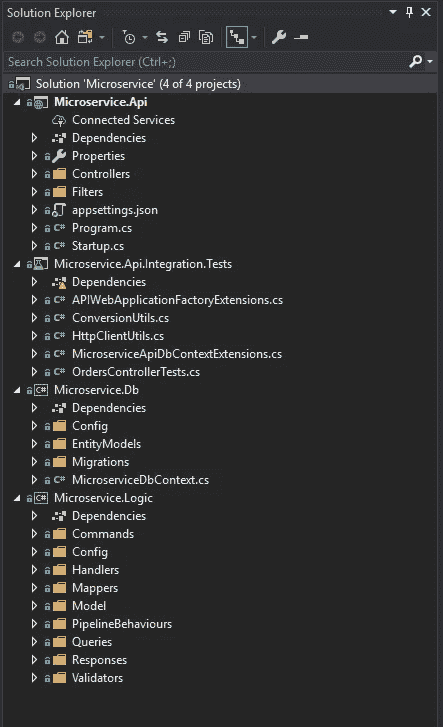
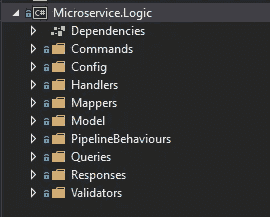

# CQRS 和仲裁者第 1 部分:为什么以及如何在微服务中实现 CQRS 和仲裁者模式

> 原文：<https://itnext.io/why-and-how-i-implemented-cqrs-and-mediator-patterns-in-a-microservice-b07034592b6d?source=collection_archive---------0----------------------->


> 这篇文章介绍了我为什么选择 CQRS 和中介模式，使用哪些库，多层项目结构，设置以及如何在微服务环境中应用它们。 [Git 回购](https://github.com/ArmandJ77/CQRSAndMediator-Microservice)

# 系列

*   [CQRS &中介器第 1 部分:
    为什么以及如何在微服务中实现 CQRS 和中介器模式](https://medium.com/@armandjordaan6/why-and-how-i-implemented-cqrs-and-mediator-patterns-in-a-microservice-b07034592b6d)
*   [CQRS &中介器第 2 部分:
    使用 Roslyn API 和 Dotnet CLI 的领域搭建](https://medium.com/@armandjordaan6/cqrs-mediator-part-2-domain-scaffolding-with-roslyn-api-and-dotnet-cli-7c99b5b011f)

# 语境

但是为什么我听到你问？在使用膨胀的域类(其中使用多个函数来修改状态和实现域规则)时，调试、扩展和审查变得越来越困难。我经常发现一个业务规则函数实现了多个子规则，这些子规则在领域中的某个地方重复出现。多个复杂的抽象层试图共享功能，或者多个开发人员实现了他们各自倡导不同模式和实践的策略。但是最大的挑战是代码库随着业务领域需求的不断变化而不断变化。

# 问题

一些服务以 CRUD 应用开始，但随着时间的推移，领域变得更加复杂，规则更多，但随后开发人员改变角色，新的开发人员决定要么重写服务，要么开始复杂的重构过程，这会进一步延迟交付。

膨胀的域管理器代码的气味之一是注入多个接口时不断增加的参数列表。

按领域关注分组的业务逻辑，例如一个订单管理器类，包含订单上可能的每个操作，其中一个函数会修改另一个管理器类的状态。

遵循业务规则的流程会导致您在没有明确的方法来解释确切意图的情况下，一步一步地通过多个管理人员和跨领域的功能。

当您只想测试一个新功能时，测试变得复杂，必须模拟多个接口。一些开发人员走捷径，认为庞大的 manger 测试类会在某个时候测试它，从而使测试不完整。

在 API 级别不对入站请求进行验证。相反，请求被允许通过中间件层、API 层，并且只在管理器的动作功能中被验证。在开始编写实际的域规则之前，这会导致臃肿的动作函数和大量的验证规则。
—这个又费时又烦人。

# 模式

鉴于上述情况，我研究了以下模式来重构服务。

**CQRS 模式**

简而言之，这种模式允许您将创建/更新操作(命令)与读取操作(查询)分开，每个操作返回它们的响应模型，以便清楚地分离每个操作。



CQRS 的一个单层工程的基本操作示例

这种模式可以应用于其他情况，其中 API 被分成两个独立的微服务，一个用于命令，另一个用于读取。

这超出了本文的范围，但是鼓励您查看这篇 [MSDN](https://docs.microsoft.com/en-us/azure/architecture/patterns/cqrs) 的文章以了解更多细节。

需要注意的是，在用一个处理函数将逻辑从一个集中的域对象转移到多个动作对象时，它确实会产生开销。但是这在你的领域中创建了一个标准，允许你在其上构建脚手架模板。

在后面的文章中，我将构建一个 dotnet CLI 工具，该工具将搭建出所需的类，从而让开发人员纯粹专注于解决业务问题。

**调解人模式**

通过促进松散耦合，该模式实现了一个中介对象，其中其他对象与其通信，而不是相互通信。

在给定的例子中，邮件收发室充当入站信件之间通信的中介，并将它们发送到正确的目的地。



中介模式的邮件收发室示例

我推荐这个[站点](https://sourcemaking.com/design_patterns/mediator)以获得详细的解释，它也是各种其他模式的快速参考指南。

例如，我们不会滚动我们的 mediator，相反，我们将使用 Jimmy Bogard 编写的[mediator](https://github.com/jbogard/MediatR)库，该库也因创建了 auto mapper 库而闻名。

# 解决办法

构建一个面向 3.1 的 dotnet 核心微服务来演示这些模式。由此我们走向一个更加垂直的架构，即将臃肿的控制器功能分解成一种 action 类，每个类实现一个称为 handler 的功能，并让 MediatR 库促进这些 handler 之间的通信。

我们将只关注 API 和域层，因为测试和数据库层是大多数 dotnet 核心应用程序中的标准实现。

## 结构:

对于更复杂的应用程序来说，将它们的服务分解到一个多层项目中可能是一种最佳实践。使用这种方法的最佳权衡之一是清晰的关注点分离，并且一层中的变化不应该导致另一层中的主要架构变化。推荐这个[演讲](https://youtu.be/5OtUm1BLmG0)来更广泛地概述清洁架构和罗伯特·c·马丁的[清洁代码](https://www.amazon.com/Clean-Code-Handbook-Software-Craftsmanship/dp/0132350882)



多层溶液结构

## API 层

API NuGet 包

**API 等级验证:**

```
Install-Package FluentValidation -Version 8.6.1
Install-Package FluentValidation.AspNetCore -Version 8.6.1
Install-Package FluentValidation.DependencyInjectionExtensions -Version 8.6.1
```

**中介:**

```
Install-Package MediatR -Version 8.0.0
Install-Package MediatR.Extensions.Microsoft.DependencyInjection -Version 8.0.0
```

**JsonPatch:**

```
Install-Package Microsoft.AspNetCore.JsonPatch -Version 3.1.0
Install-Package Microsoft.AspNetCore.Mvc.NewtonsoftJson -Version 3.1.0
```

**Setup.cs**

Setup.cs

第 16 行:
向 MVC 请求管道注册验证过滤器中间件。

第 18–21 行:
注册实现 AbstractValidator < T >类的 Fluent 验证类。

第 20 行:
配置 Fluent 验证从微服务加载。逻辑汇编。任何验证类都可以作为< T >传递。

第 26 行:
加载域设置和服务。

第 28 行:
注册实现 IRequest < T >和 IRequestHandlers < TRequest，TResponse >接口的类。

第 30 行:
在 MediatR 请求管道中添加验证中间件。它的工作原理和普通中间件一样。这将在从一个处理程序到另一个处理程序时提供域级验证，同时使用与 API 级验证相同的验证类。

**过滤器:**

Fluent 验证中间件类的标准实现，通过它我们检查请求的模型状态是否有效，提取错误消息，然后实例化自己定义的使用模型状态错误消息填充的*error response/error model*对象，然后用 *errorResponse* 实例化新的 *BadRequestObjectResult* 并返回。

验证过滤器. cs

验证过滤器. cs

如果入站模型包含任何无效属性，我们将在中间件级别返回，而无需支付在域管理器中验证请求的处理成本，并减少编写空检查和其他普通验证操作的持续需求。相反，我们只关注领域规则及其需求。

一旦进入领域层，我们将看看如何重用 Fluent 验证类，以确保在调用另一个处理程序时进行验证，即领域级验证。

**控制器:**

像你在网上找到的大多数例子一样，我们将从一个基本的 CRUD 实现开始，即 *OrdersController。在领域层，我将讨论如何利用更高级的特性，以及在哪里可以利用处理程序。*

OrdersController.cs

OrdersController.cs

第 15–20 行:
你会注意到的第一件事是，我们在这里注入的唯一依赖项是控制器方法用来传递命令和查询的 *IMediator* 接口。中介会将这些请求解析到域层中正确的处理程序。

第 25、33 和 48 行:
用请求参数初始化和实例化查询/命令对象。

第 26、34、41 和 49 行:
调用 *IMediator* 接口上的 send 函数，将命令/查询解析到相应的处理程序。

第 27、35、42 和 50 行:
格式化响应并返回结果。

## 逻辑/域层

你可以称之为逻辑层或领域层，这是一回事，所有领域规则都存在的地方，你的小时费率也是从这里产生的。老实说，不管您的服务实现了多少先进的模式和实践，赚钱的机会都在领域中，而不是在通信或基础设施设置中。

我认为这一层是时间和重构成本损失最大的地方。一个不是为变化而构建的领域，或者一个业务规则不断变化的领域，将导致代价高昂的重构和浪费上市时间。

我发现，在我看来，当开发人员在没有项目模板或核心开发支持团队的环境中工作时，他们往往会在初始阶段花费 70/30 的时间，更多地关注项目设置和基础设施，而不是初始的领域规则。

但是，为什么我需要一个项目模板或你所说的“核心团队”，作为一个服务所有者，我想从头开始构建一切，因为每个领域都是不同的，我需要在服务中完全自治？

很棒的问题！首先，核心团队的概念可能会在未来的文章中讨论，因为有各种各样的因素，如预算、个人/项目约束等。然而，我相信，包含结构、中间件设置和已安装的内部/外部 NuGet 包的结构良好的项目模板，在考虑扩展您的体系结构时，将极大地提高您的团队的效率，因为它给团队领导或架构师团队提供了某种程度上的监督，并确保大多数项目都以正确的方式开始。是的，在有些情况下，领域要么是未知的，要么是高度专门化的，项目模板会妨碍它们。然而，这些项目很可能由在该领域有经验的高级开发人员和架构师来处理。

但是足够的意见，让我们深入到域设置:

**获取软件包:**

```
Install-Package FluentValidation -Version 8.6.1
Install-Package MediatR -Version 8.0.0
Install-Package Microsoft.AspNetCore.JsonPatch -Version 3.1.0
```

**项目结构:**



畴结构

**注:**

*   在模型目录中，有一个不属于 CQRS 模式的 OrderPatch 模型。它在 Patch 函数中用于将入站更改应用于原始订单和新更改之间的比较。
*   至于对象映射策略，我已经对位于 *Mappers.OrderMapper.cs.* 中的 *Order* 实体使用了扩展函数。规则是在这里添加映射函数，该函数在多个处理程序中使用，否则在处理程序函数中实例化和初始化映射，因为它仅在那里使用。其他策略可能包括使用对象到对象的映射库，如[自动映射器](https://automapper.org)或定制实现。

**配置:**

configureservicecollectionextensions . cs

configureservicecollectionextensions . cs

**响应，命令&查询:**
两者都是标准类，每个都实现*mediator 的 I request<t Response>*接口，其中 *TResponse 是标准 C#* 类，即

订单响应. cs

订单响应. cs

GetOrderByIdQuery.cs

GetOrderByIdQuery.cs

**经手人:**

PatchOrdersHandler.cs

PatchOrdersHandler.cs

每个处理程序都实现了*IRequestHandler<t request，t response>接口。在这个例子中，处理程序将接受一个 *PatchOrderCommand* 并返回一个 *OrderResponse 对象*。*

此外，该示例实现了 *BaseHandler* 类，该类公开了 *DbContext* 和 *IMediator* 属性。

**域名级别验证:**

我之前提到过这一点，其实现方式是使用 MediatR 请求管道中的中间件和 Fluent 验证的*abstract validator<T>T*基类实现在*验证器*目录中

使用 MediatR 进行域级验证

# 结论

转向更垂直的架构的好处在于它的简单性，开发者在进行改变时可以一次完全专注于架构的一层。通过限制副作用，这个领域变得一片混乱，一个清晰的业务规则的意图浮现在脑海中。

最大的代价是对象创建的数量，这也是一个烦恼。在下一篇文章中，我将研究 Roslyn APIs，以构建一个 dotnet CLI 工具来构建一个新处理程序的所有细节，让开发人员专注于域实现，而不是被基础设施设置分散注意力。

# 资源

*   [垂直切片架构——吉米·博加德](https://youtu.be/SUiWfhAhgQw)
*   [采用 ASP.NET 酷睿 2.2 的清洁架构—贾森·泰勒](https://youtu.be/Zygw4UAxCdg)
*   [让建筑变得重要——马丁·福勒](https://youtu.be/DngAZyWMGR0)
*   [使用 MediatR 的管道行为和 FluentValidation | Clean 进行验证。网络核心——尼克·查普萨斯](https://youtu.be/2JzQuIvxIqk)
*   [使用联发科和 CQRS 清理 ASP.NET 核心 API 尼克·查普萨斯](https://youtu.be/YzOBrVlthMk)
*   [拥有 MediatR 和 AutoMapper 的 CQRS](https://lostechies.com/jimmybogard/2015/05/05/cqrs-with-mediatr-and-automapper/)
*   [使用 CQRS 模式与 mediator Part 1—Duc Ho](https://medium.com/@ducmeit/net-core-using-cqrs-pattern-with-mediatr-part-1-55557e90931b)
*   [使用 CQRS 模式和 MediatR 第 2 部分— Duc Ho](https://medium.com/@ducmeit/net-core-using-cqrs-pattern-with-mediatr-part-2-cc55763e83f0)