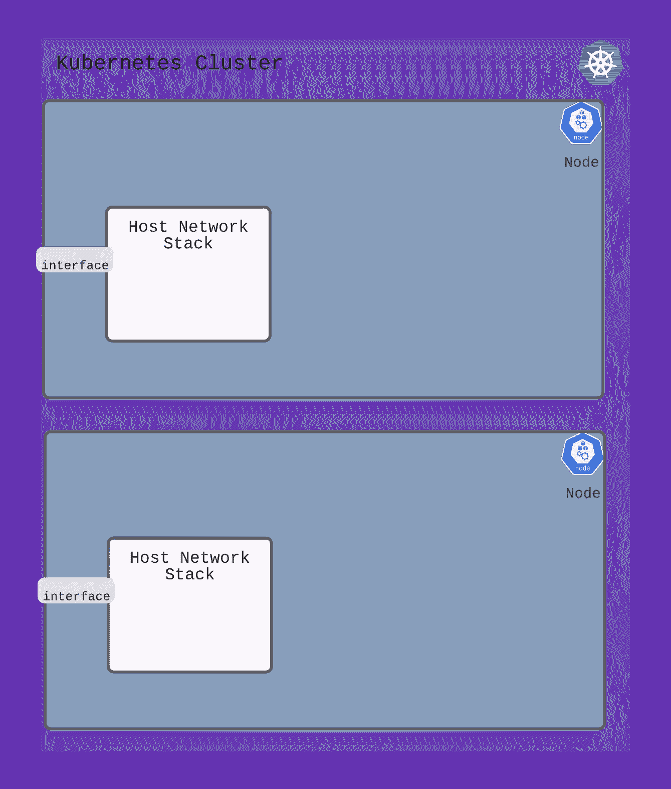
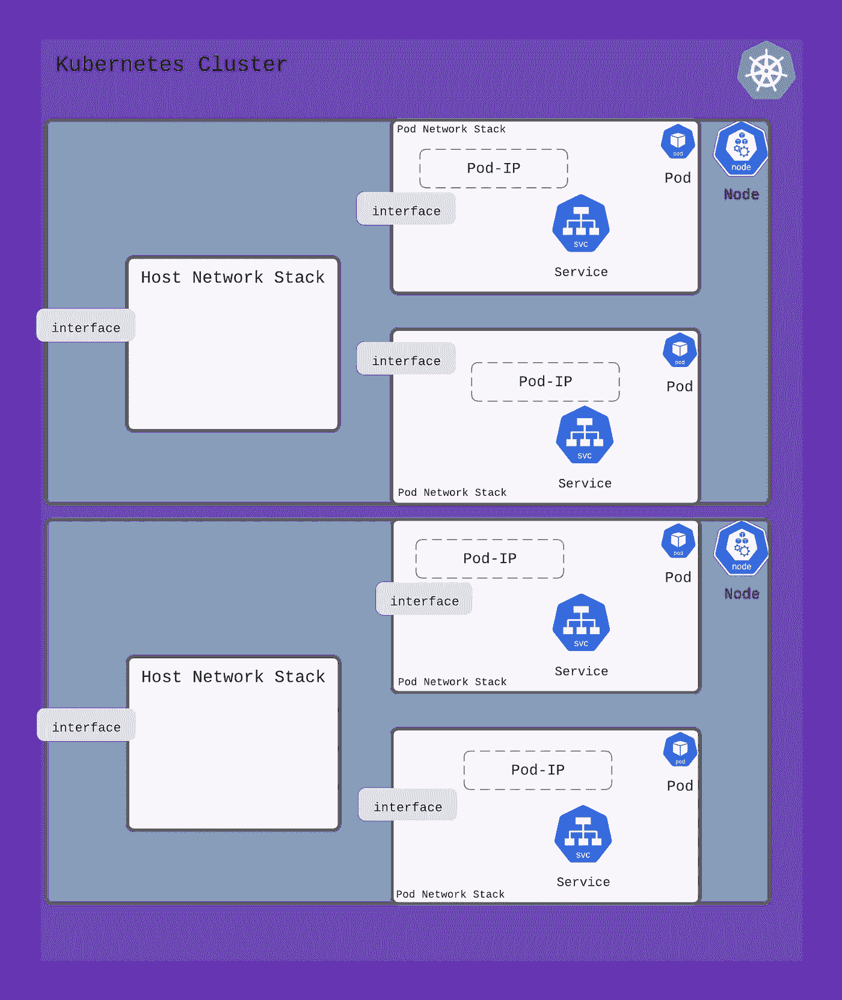
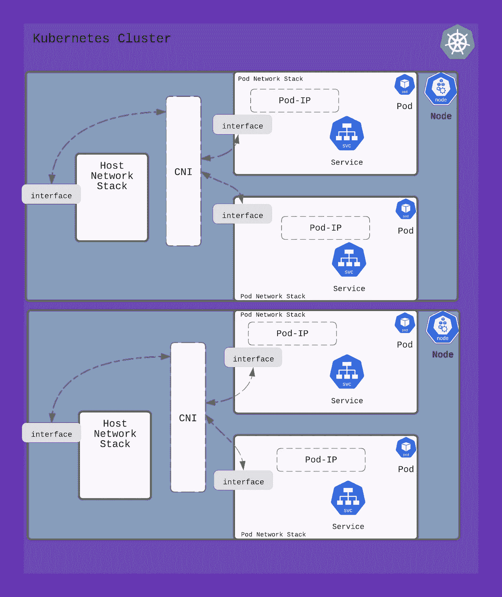
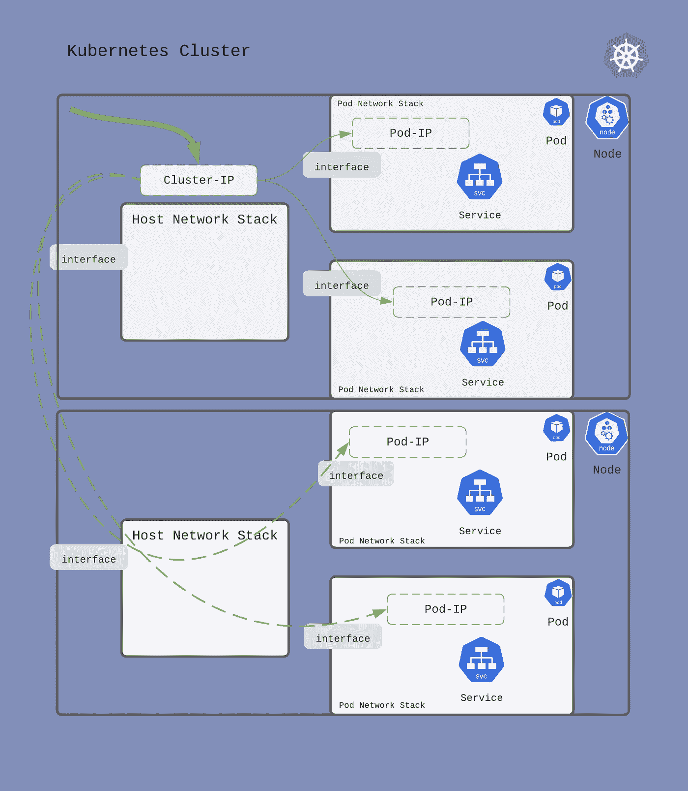
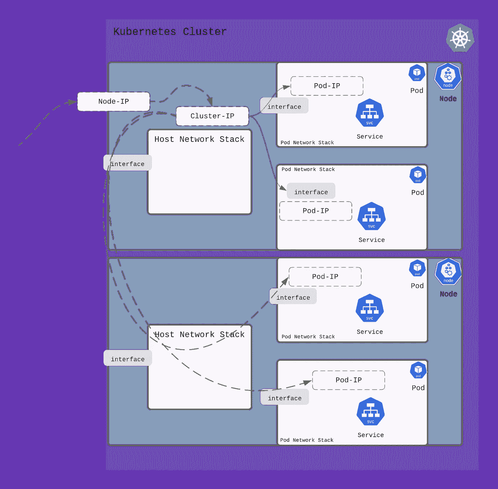
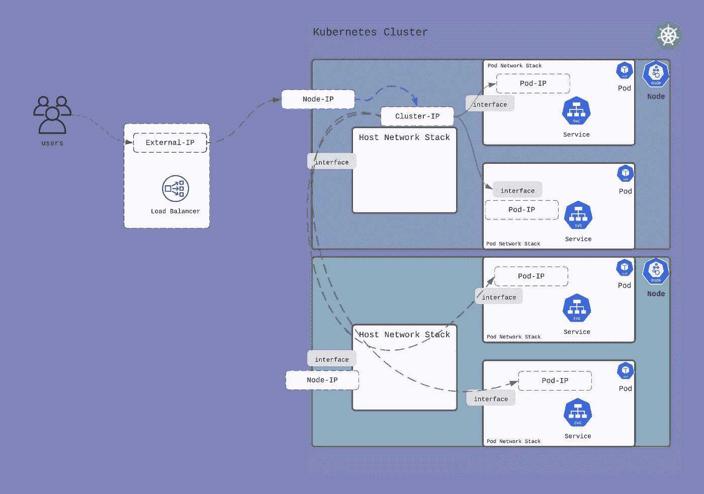
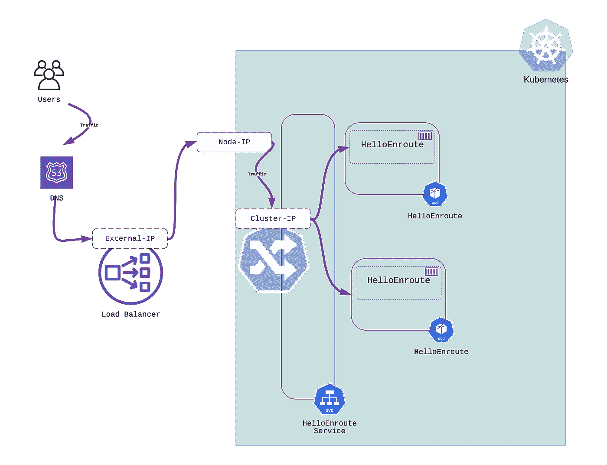
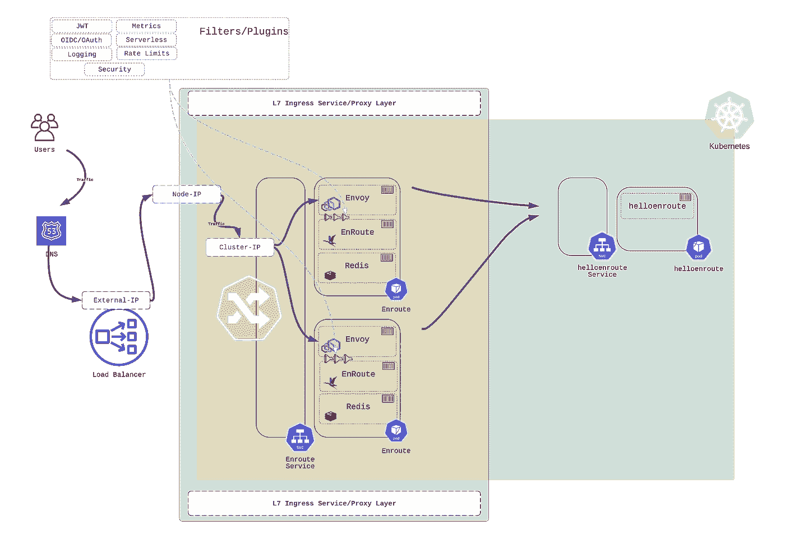

# Kubernetes Ingress(和联网)的原因和方式

> 原文：<https://itnext.io/why-and-how-of-kubernetes-ingress-and-networking-6cb308ca03d2?source=collection_archive---------3----------------------->

Kubernetes 上运行的服务无法在公共云或私有云上访问。这就是 Kubernetes 在设计时考虑服务安全性的方式。

要安全地允许访问集群外的服务，需要对网络的设置方式以及推动网络选择的不同需求有所了解。

我们首先简要探讨一下 Kubernetes 集群在服务隔离、服务扩展和服务交付方面的期望。一旦高层次的需求被列出，理解不同的构造和抽象的意义就变得容易了。

我们通过对比在 Kubernetes 内部运行的服务之前使用入口运行 L7 策略(或代理)层的优势得出结论。

# 了解 Kubernetes 网络方案

了解 Kubernetes Ingress 是运行微服务和安全访问这些服务的关键。这篇文章试图揭开 Kubernetes 网络是如何设置的。

我们在创建服务、创建不同的 Kubernetes 工件、满足不同需求所需的网络机器时会考虑网络。

我们还描述了不同类型 IP 的重要性，如外部 IP、节点 IP、集群 IP 和 Pod IP，并描述了流量如何通过其中的每一个。

从群集网络要求开始，我们有机会了解为什么要以这种方式设置网络。

## 集群网络要求

**Kubernetes 中的集群联网**有几个**要求**

*   **服务的安全性和隔离**
*   **pod 的连接、联网和 IP 分配**
*   **设置网络，从多个物理节点构建集群抽象**
*   **跨多个服务实例的流量负载平衡**
*   **控制对服务的外部访问**
*   **在公共云和私有云环境中使用 Kubernetes networking。**

为了理解 Kubernetes 网络的这些不同方面，我们首先描述当一个服务在一个 pod 中创建，一直到在公共和私有云中访问该服务时会发生什么。

我们强调了对 Ingress 的需求，以及它如何适应整个 Kubernetes 网络模型。

## Kubernetes Pods 中运行的服务的网络隔离

让我们考虑一个具有两个节点的简单 Kubernetes 集群

Kubernetes 编排容器或豆荚(这是一组容器)。**当 Kubernetes 创建一个 pod 时，它在自己的隔离网络中运行(使用网络名称空间)。**

下图显示了在每个节点上创建的两个窗格。

这对服务来说意味着什么？服务在 pod 网络中的 pod 内运行。**在此 pod 网络上分配的 IP 地址(用于服务)在 pod 外部不可访问。**

那么你如何获得这项服务呢？

## 使主机网络堆栈可以访问 Pod 中的服务

Kubernetes 在多个物理节点或机器上构建了一个集群的抽象。物理节点有自己的网络堆栈。Kubernetes 创建的 pod 为在 pod 内部运行的服务创建了一个隔离的网络堆栈。

为了到达该服务(或 pod 内的 IP 地址)，需要在 pod 网络和主机网络之间创建路径的路由/桥接。**容器网络接口或 CNI 设置与在节点和 pod 之间创建流量路径相关联的网络。CNI 流行的例子有印花布、纤毛、法兰绒等。**

当 Kubernetes 创建一个 pod 时，它调用 CNI 回调。这些回调导致调用 CNI 提供商服务来为 pod 设置 IP 地址，并将 pod 网络与主机网络连接起来。

## 使服务可以跨节点边界访问

一个服务驻留在一个或多个 pod 中。这些单元中的每一个都可以驻留在一个或多个物理节点上。例如，假设一个服务分布在驻留在两个物理节点上的两个 pod 上。

当流量的目的地是这个服务(分布在两个节点的两个 pod 上)时，Kubernetes 如何在它们之间负载平衡流量？

Kubernetes 使用集群 IP 的抽象。**任何发往集群 IP 的流量都会在 pod(服务在其中运行)之间实现负载平衡**。

为了对 pod 中的服务实例进行负载平衡，网络被设置为到达这些 pod 中的服务。这些 pod 可能运行在集群的不同物理节点上。为服务连接集群 IP 确保了发送到集群 IP 的流量可以发送到运行该服务的所有 pods 不管 pods 在哪个物理节点上运行。

集群 IP 的实施和实现是通过 kube-proxy 组件和类似 iptables、ipv 或用户空间流量导向的机制来实现的。

## 从集群外部访问服务

发往 ClusterIP 的流量在可能跨越多个物理节点的 pod 之间实现负载平衡。但是只能从集群中的节点访问 ClusterIP。或者，换句话说，**Kubernetes 中的联网确保了对 ClusterIP 的外部访问受到限制。**

在集群外部访问 ClusterIP 需要一个显式声明，以便在 Kubernetes 集群的节点外部访问它。这是`NodePort`

**Kubernetes 中的一个** `**NodePort**` **用 ClusterIP 连接一个节点 IP(和端口)。**

定义一个`NodePort`在本地网络上提供一个 IP 地址。**发送到此节点端口 IP(和端口)的流量随后被路由到 ClusterIP，并最终负载平衡到 pod(和服务)。**

## 在公共云上访问 Kubernetes 中的服务

一个`NodePort`使得一个服务可以在集群外部访问，但是 IP 地址只能在本地使用。`LoadBalancer`服务是一种将公共 IP(或 DNS)与`NodePort`服务相关联的方式。

当在 Kubernetes 集群中创建一个`LoadBalancer`类型的服务时，它会分配一个公共 IP 并在云提供商(如 AWS、GCP、OCI、Azure 等)上设置负载平衡器。).**云负载均衡器被配置为将发送到外部 IP 的流量输送到** `**NodePort**` **服务。**

## 在私有云上访问 Kubernetes 中的服务

当在私有云中运行时，创建一个`LoadBalancer`类型的服务需要一个 Kubernetes 控制器，它可以提供一个负载平衡器。一个这样的实现是 [MetalLB](https://metallb.universe.tf/) ，它分配一个 IP 来路由集群内部的外部流量。

# 通过或不通过入口访问公共云上的服务

有几种方法可以访问公共云上 Kubernetes 集群中运行的服务。在公共云上，当服务类型为`LoadBalancer`时，会为外部访问分配一个外部 IP。

*   **一个服务可以直接声明为** `**LoadBalancer**` **类型。**
*   **或者，控制和配置代理的入口服务可以声明为类型** `**LoadBalancer**` **。然后可以在这个入口服务上创建路由和策略，将外部流量路由到目标服务。**

像 Envoy/Nginx/HAProxy 这样的代理可以接收所有进入集群的外部流量，方法是将集群作为服务运行，并定义类型为`LoadBalancer`的服务。这些代理可以使用 L7 路由和安全规则进行配置。这些规则的集合形成了入口规则。

## 无入口—通过使服务成为类型`LoadBalancer`的服务来直接访问服务

**当服务被声明为类型** `**LoadBalancer**` **时，它直接从外部负载平衡器接收流量。**在下图中，服务`helloenroute`被声明为类型`LoadBalancer`。它直接从外部负载平衡器接收流量。

## 使用入口——将服务放在一个代理之后，该代理可通过`LoadBalancer`从外部访问

可以在服务之前放置一层 L7 代理，以应用 L7 路由和策略。为此，需要一个入口控制器。

**入口控制器是 Kubernetes 集群内部的一项服务，配置为类型** `**LoadBalancer**` **接收外部流量。入口控制器使用定义的 L7 路由规则和 L7 策略将流量路由到服务。**

在下面的示例中，`helloenroute`服务从路由入口控制器接收流量，该控制器从外部负载平衡器接收流量。

# 使用途中入口控制器代理的优势

运行入口控制器并在入口实施策略有几个明显的优势。

*   Ingress 提供了一种可移植的机制来在 Kubernetes 集群内部实施策略。在集群内部实施的策略更容易跨云移植。
*   多个代理可以使用 Kubernetes 服务伸缩进行水平伸缩。L7 面料的弹性使其更易于操作和缩放
*   L7 策略可以与服务一起托管在具有群集本机状态存储的群集中
*   让 L7 策略更接近服务简化了策略实施以及服务和 API 的故障排除。

## 用于细粒度流量控制的插件

EnRoute 使用 Envoy 作为底层代理来提供 L7 入口功能。EnRoute 有一个模块化的架构，很好地反映了 Envoy 的可扩展模型。

[插件/过滤器](https://getenroute.io/features/)可在路由级别或服务级别定义，以在入口实施 L7 策略。EnRoute 在社区版中提供了一个高级限速插件，完全免费，没有任何限制。[为您的 API 和微服务提供时钟](https://getenroute.io/blog/why-every-api-needs-a-clock/)使用深 L7 状态是一项关键需求，路由灵活的速率限制功能提供了巨大的灵活性，可匹配各种速率限制用例。

[EnRoute Enterprise](https://getenroute.io/features/) 包括支持和企业插件，有助于确保 Kubernetes 入口的流量安全。

*最初发布于*[*https://geten route . io*](https://getenroute.io/blog/ingress-controller-kubernetes-api-gateway-secure-service-jwt-oauth-oidc-network-namespace/)*。*