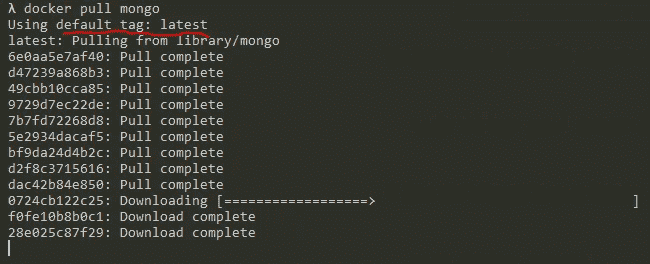
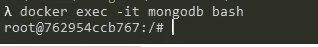

# 为什么以及如何使用 Docker 运行您的开发数据库

> 原文：<https://itnext.io/why-and-how-to-run-your-development-database-with-docker-2e0eab13b733?source=collection_archive---------4----------------------->


扬·安东宁·科拉尔在 [Unsplash](https://unsplash.com/?utm_source=unsplash&utm_medium=referral&utm_content=creditCopyText) 上拍摄的照片

作为开发人员，我们通常同时工作和管理多个应用程序，即使这些应用程序可能有相同的技术堆栈，它们也可能使用不同版本的技术。

在这种情况下，能够快速调整您的本地开发环境以适应您想要关注的应用程序变得至关重要。

从一个版本的编程语言或框架切换到另一个版本可能相对简单，但是对数据库做同样的事情就变得困难了。

但是，使用 Docker 在容器中运行数据库服务器，而不是将其直接安装在本地计算机上，可以轻松解决这个问题。

一般来说，docker 不是为有状态服务设计的，所以不建议在生产环境中运行 Docker 容器中的数据库。但是，我们将它用于本地开发，因此所有可能出现的关于数据完整性和持久性的问题都已消失，因为我们用于开发的数据是不相关的，对应用程序没有影响。

下面是在 Docker 容器中使用数据库的步骤。

# **带 Docker 的 MongoDB**

## 步骤 1 —创建卷

Docker 容器是短暂的，这意味着每次我们启动容器时，它都会重新开始，而在容器运行时创建的数据将会丢失。

为了解决这个问题并在运行之间持久化数据，我们需要为我们的容器创建一个卷。

```
docker volume create --name=mongodata
```

> **边注:**运行`docker volume ls`列出所有卷。

## 步骤 2 —下载 MongoDB 的 Docker 映像

```
docker pull mongo
```

该命令将下载最新版本。



要下载特定版本的 MongoDB，可以使用附加了 version 标记的相同命令。

```
docker pull mongo:X.Y.Z
```

其中`X.Y.Z`代表您想要下载的版本。

> **边注:**运行`*docker image ls*`列出所有下载的 docker 图片。

## 步骤 3 —创建并运行容器

```
docker run --name mongodb -v mongodata:/data/db -d -p 27017:27017 mongo
```

`--name`代表容器的名称；

`-v`是我们创建的卷，我们将其用于文件夹`/data/db`，这是 MongoDB 用来存储数据的文件夹；

`-d`以分离模式启动容器，作为后台进程；

`-p`指定如何映射端口，我们将本地端口 **27017** 映射到容器的端口 **27017** ，这是 MongoDB 将用来启动数据库服务器的端口

> **边注:**运行`*docker contaienr ls*`列出所有运行中的容器，`docker container ls -a`列出所有容器(运行或不运行)

## 步骤 4 —连接到容器

当容器作为一个分离的进程运行时，我们可以执行下面的命令来连接它并与数据库交互。

```
docker exec -it mongodb bash
```



在这里，我们可以运行`mongo`命令来启动 MongoDB shell，或者运行`exit`命令来关闭容器的终端。

## 步骤 5 —停止并重新启动数据库

如果我们想停止数据库容器，只需运行以下命令:

```
docker stop mongodb
```

开始吧:

`docker start mongodb`

# 结论

在 Docker 容器中使用数据库进行开发可以大大提高速度和生产率。

虽然本文是以 MongoDB 为例编写的，但它可以很容易地扩展到任何数据库，因为步骤是相同的。