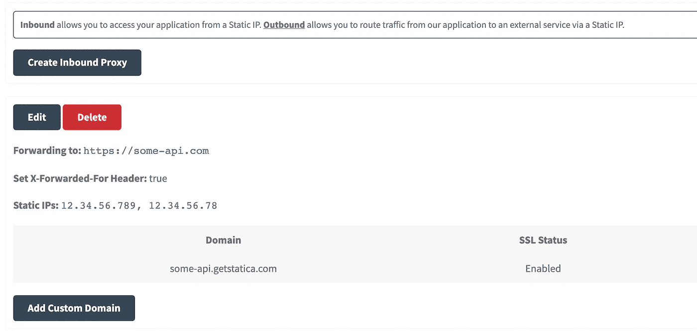

# 为什么以及如何在前端和后端使用静态 IP

> 原文：<https://itnext.io/why-and-how-to-use-static-ips-in-frontend-backend-4d1ed9a65eb8?source=collection_archive---------0----------------------->


安娜斯塔西娅·杜尔吉尔在 [Unsplash](https://unsplash.com?utm_source=medium&utm_medium=referral) 上的照片

一位测试版客户曾经找过我们，因为他无法登录我们的 Angular web 应用程序。页面正在加载，但是对我们 API 的任何 HTTP 请求都失败了。在与客户交谈后，我们发现他们的公司正在使用 IP 限制。因此，他想知道我们是否可以提供静态 IP，他们可以将这些 IP 添加到他们的产品中，以便在他们的公司中使用我们的应用程序。

不幸的是，我们选择的云平台([渲染](https://render.com))当时还没有直接支持这个特性。因此，我们无法提供一个绝对不会改变的 IP 列表。这就是为什么我们必须寻找一种可以提供静态 IP 的产品。改变我们的云平台是不可能的，因为直到今天我们对它还是很满意的。由于这是第一个提出要求的客户，我们现在也不想为此花太多钱。

幸运的是，我偶然发现了一个解决方案，它似乎提供了我现在需要的一切。 [QuotaGuard](https://www.quotaguard.com) 是一项服务，它自称为“*全球领先的分布式网络和基于云的应用的静态 IP 解决方案提供商*”。他们支持多种云平台，包括我们正在使用的平台，在我看来，价格是公平的。

在我们的例子中，我们只需要一个允许我们从静态 IP 访问应用程序的入站代理。如果我们希望通过静态 IP 将流量从我们的应用程序路由到外部服务，那么出站是必要的。

请记住，除了帐户注册之外，下面的步骤相当一般，因此它们也应该与替代解决方案一起使用。

## 如何创建入站代理以使用带有 QuotaGuard Static 的静态 IPs

1.  创建一个帐户
2.  创建入站代理。这需要您提供 API 的 URL。
3.  确保允许您的应用程序使用入站代理
4.  确保使用域 URL，而不是直接调用 API
5.  向您的客户提供所有静态 IP
6.  可选:仅对某些请求或客户使用入站代理，以不超过您的配额🤓

创建入站代理后，我们会看到静态 IP 和域 URL。我们应该向感兴趣的客户提供我们在这里看到的静态 IP。



创建入站代理

在我们的例子中，我们的 Angular web 应用程序使用 [JWT](/how-to-send-jwt-automatically-in-angular-http-requests-31c1fd060871) 进行认证。注意`whitelistedDomains`，它包含了我们的入站代理的新域名 URL。

```
// called on every request to retrieve the token
export function jwtOptionsFactory(tokenService: MyTokenService) {
  return {
    tokenGetter: () => tokenService.getToken(),
    whitelistedDomains: ['some-api.com', 'some-api.gestatica.com']
  };
}
// the actual module imports (simplified)
@NgModule({
  ...,
  imports: [JwtModule.forRoot({
      jwtOptionsProvider: {
        provide: JWT_OPTIONS,
        useFactory: jwtOptionsFactory,
        deps: [MyTokenService]
      }
    }),
  ...
}
```

剩下唯一要做的事情是:为 HTTP 请求使用正确的 URL。在我们的例子中，我们为此创建了一个特性标志。因此，只有需要这个特性的客户才会使用入站代理，而其他人会像往常一样直接使用 API。然而，在用户登录之前我们不知道这些信息，所以我们总是使用代理来处理登录请求。

```
getApiUrl(route: string, useStaticIps: boolean): string {
  if (!environment.production) {
   return 'https://some-api.com';
  } else {
   return useStaticIps || route.includes('authentication/login') ?
    'https://some-api.gestatica.com' :
    'https://some-api.com';
  }
 }
```

## 结论

感谢您阅读这篇关于使用 QuotaGuard 作为静态 IPs 解决方案的短文。如您所见，设置在几分钟内完成，每个人都可以再次访问我们的应用程序。如何在您的产品中使用静态 IP？请在评论中告诉我。