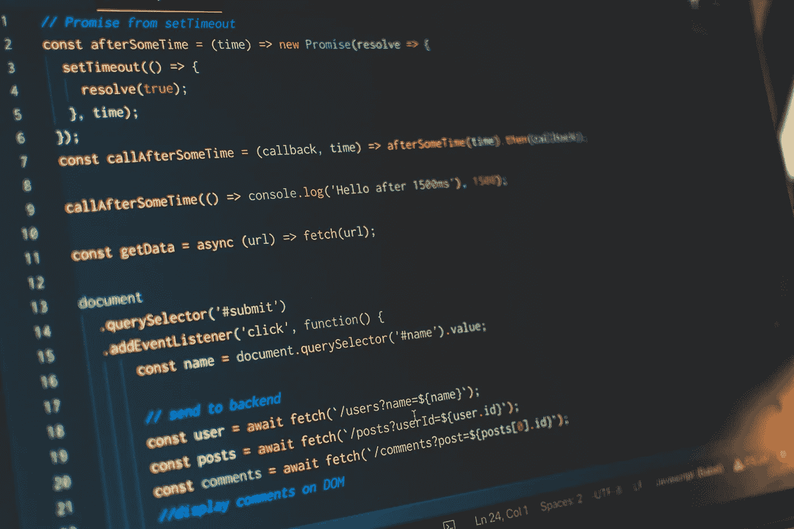
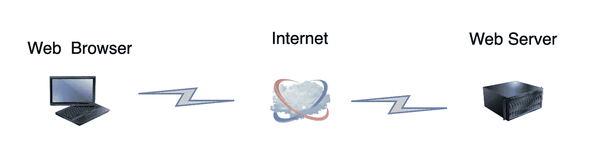
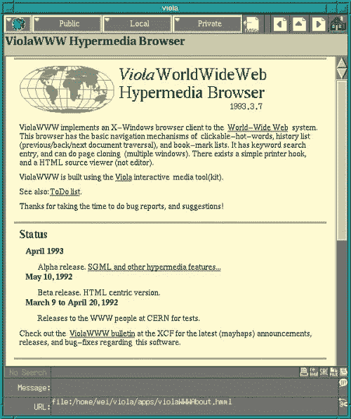

# 为什么我们要创建一个只有 JavaScript 的万维网？

> 原文：<https://itnext.io/why-are-we-creating-a-javascript-only-world-wide-web-db8c3a340b9?source=collection_archive---------0----------------------->

潘卡杰·帕特尔在 [Unsplash](https://unsplash.com/search/photos/javascript?utm_source=unsplash&utm_medium=referral&utm_content=creditCopyText) 上的照片

现在是 2019 年，绝大多数新网站都倾向于用 JavaScript 构建。它们通常需要在最终用户的 web 浏览器中运行 JavaScript 才能运行。如果你在浏览器中禁用 JavaScript(你可以这么做，但在这个时代，你需要真正的自虐才能尝试)，大多数网站根本无法工作。

不仅仅是真正的网络应用，如 Gmail、Google Docs 等。，需要 JavaScript 才能运行。甚至许多简单的基于内容的网站，如新闻网站、公司营销网站、博客等。，只需要 JavaScript 向您显示内容。但是网站并不总是这样创建的。

为什么 JavaScript 变得如此普遍？浏览器脚本语言是网络工作所必需的吗？JavaScript 为什么超越了其他脚本语言？为什么单一的脚本语言对整个网络至关重要？为什么 web 浏览器现在不能支持一种以上的语言？最后，未来的浏览器会是什么样子？我希望回答所有这些问题，但首先让我们通过快速浏览一切开始的地方，及时回到网络的起点，这样我们就可以了解我们是如何到达今天的位置的。

# 网络脚本的简史

## 1991 年——第一张网络🚼

1991 年，蒂姆·伯纳斯·李发明了万维网(WWW)，也就是今天通常所说的 Web，让世界各地的物理学家能够相互共享数据。第一个系统的整体架构是基于客户机-服务器的。蒂姆·伯纳斯·李创造了第一个[超文本传输协议(HTTP)](https://en.wikipedia.org/wiki/HyperText_Transfer_Protocol) 、[超文本标记语言(HTML)](https://en.wikipedia.org/wiki/HyperText_Markup_Language) 、第一个网络浏览器(称为 WorldWideWeb)和第一个网络服务器软件(后来称为 CERN httpd)。他将所有这些东西结合在一起，创建了第一个网站[，今天你可以在网上找到这个网站](http://info.cern.ch/hypertext/WWW/TheProject.html)。该解决方案的概念架构是基于客户端-服务器的，大致如下所示:

万维网第一版的体系结构

伯纳斯-李先生的万维网浏览器不支持任何类型的客户端脚本，但事实上它的功能非常丰富。该浏览器于 1994 年停产。

## 旁注—客户端-服务器架构

[客户机-服务器架构至少从 20 世纪 60 年代](https://en.wikipedia.org/wiki/Client%E2%80%93server_model#Early_history)就已经出现，今天仍然非常普遍。在客户机-服务器体系结构中，客户机通常运行在不同于服务器的机器上，在它们之间，它们分担分布式计算机程序的负载。在 Berners-Lee 最初的体系结构中，Web 浏览器作为客户机，Web 服务器作为服务器，服务器负责信息的集中存储，并与客户机共享这些信息。在高层次上，浏览器被构建为向服务器发出请求，等待响应，并且一旦接收到服务器响应，它将显示服务器的响应。服务器的职责是不断等待客户端浏览器的请求。一旦收到响应，服务器将完成准备和返回响应给 web 浏览器所需的所有繁重工作。

我喜欢把客户机-服务器体系结构比作一家餐馆。你作为餐馆的顾客是客户。餐厅就是服务者。餐馆是一个自我运作的单位。它不需要你这个赞助人来操作。然而，它确实需要你这个赞助人来支持它，以确保它的成功。从这个意义上说，大多数客户机-服务器体系结构是相似的。服务器的正常运行不需要客户端，但是服务器需要客户端来完成产品。

Berners-Lee 先生的客户-服务器架构让网络浏览器充当了一个“哑终端”。web 浏览器不具备运行任意程序代码的能力，但它能够从服务器请求数据，并以有意义的方式将这些数据呈现给最终用户。这种设计是相当静态的，最终用户可以阅读内容并请求阅读新的内容，但动态程序不能在网页上运行，用户除了选择阅读新的网页外，不能与网页进行交互。

## 1991/1992—voilaww，第一个可以执行脚本的浏览器

Berners-Lee 先生的超文本标记语言的美妙之处在于，它可以很容易地扩展，以支持将程序代码传递给网络浏览器。唯一的要求是 web 浏览器需要开发出能够读取和执行程序代码的能力。

所以在 1991/1992 年， [VoilaWWW](https://en.wikipedia.org/wiki/ViolaWWW) 浏览器作为第一个能够运行脚本语言的浏览器被开发出来。VoilaWWW 网络浏览器可以在最终用户的计算机上运行简单的程序，例如可以更新最终用户网络浏览器时间的自动更新时钟。

大约 1993 年的 ViolaWWW 浏览器(来自 https://www.viola.org/

voilaww 脚本在 voilaww 网络浏览器的范围内运行。VoilaWWW 认识到，需要能够在浏览器中安全地运行程序，以增强最终用户的体验，而不允许这些程序访问最终用户计算机上的文件或其他程序。

## 1995 年——网景浏览器 2.0 发布 JavaScript

1995 年，网景通信公司雇佣[布伦丹·艾希](https://en.wikipedia.org/wiki/Brendan_Eich)将 Scheme 语言嵌入网景导航器。1995 年 12 月，Netscape Navigator 2.0 beta 3 推出，支持运行 JavaScript。JavaScript 这个名字主要是为了营销目的而产生的。Java 是一种正在发展的、流行的编程语言，所以 Netscape Communication 公司利用了这一点，将他们的脚本语言命名为 JavaScript。

在 web 浏览器中运行脚本语言的能力在这一点上并不新鲜，但是有了 JavaScript，Netscape 极大地改善了在浏览器中编写代码的用户体验。代码更容易阅读、编写和维护，进入门槛非常低，因为通过简单地将 JavaScript 代码复制并粘贴到网页的 HTML 文件中，在网站中包含 JavaScript 代码非常容易。这使得进入门槛如此之低，以至于任何人，甚至那些非技术人员，都可以使用 JavaScript 来增强他们的网站。

JavaScript 与 Voila 脚本的比较。JavaScript 提高了编写浏览器脚本的可用性

## **旁注—服务器端【JavaScript**

也是在 1995 年，网景公司推出了网景企业服务器，这是一种能够运行 JavaScript 的网络服务器。1996 年，微软增加了在互联网信息服务(IIS)上运行他们自己版本的 JavaScript(称为 JScript)的能力，IIS 过去是，现在仍然是微软的 web 服务器软件。

今天，Node.js 还提供了在 web 浏览器之外运行 JavaScript 的能力，但这不是第一个！尽管如此，它已经成为最受欢迎的。它用于创建管理脚本、RESTful APIs、静态网站、流服务等。Node.js 开发已经在开发社区中真正认可了“企业级”JavaScript，并且有许多大型组织已经将 Node.js 用于他们的服务器端开发。

## 1996 年的今天，微软互联网浏览器 3 发布了 VBScript 和 JScript

1996 年，微软发布了 IE3。它支持两种脚本语言，而不是一种！一个是 VBScript，这是一种微软已经为其他用途开发的脚本语言。IE3 支持的另一种语言是 JScript。

JScript 是微软版的 JavaScript。微软通过逆向工程 Netscape 的 JavaScript 创建了 JScript，然后为了避免当时与 Sun Microsystems 的 JavaScript 名称的商标问题，将它命名为 JScript。

微软的 VBScript 作为一种管理员脚本语言提供，但它也在整个微软 Office 产品家族中广泛使用，它被微软的经典活动服务器页面(ASP)广泛使用，ASP 是一种允许开发人员创建动态网页的语言，类似于 JSP、PHP 等。

可以在同一网页上包含 VBScript 和 JScript 中的一个或两个。然而，在他们的网页中使用 VBScript 的开发者正在将他们的网站与 Internet Explorer 结合，因为 VBScript 是微软专有的语言。VBScript 甚至一直支持到 IE11，[尽管微软更希望不是这样](https://docs.microsoft.com/en-us/previous-versions/windows/internet-explorer/ie-developer/compatibility/dn384057(v=vs.85))。

信不信由你，VBScript 甚至一直支持到 IE11，[，尽管微软更希望不是这样](https://docs.microsoft.com/en-us/previous-versions/windows/internet-explorer/ie-developer/compatibility/dn384057(v=vs.85))。

将 VBScript 引入 IE3 的策略很可能是一个战略决策，寄希望于 VBScript 开发人员在浏览器中也采用 VBScript，但他们没有这样做。因此，在这一点上，JavaScript 仍然是占主导地位的浏览器脚本语言。

## 20 世纪 90 年代中期及以后— Flash

Adobe Flash 最初是一个多媒体平台，可以通过“Flash player”在网页上运行。这是支持互联网上丰富媒体的唯一方式——视频、音频、游戏。

2005 年，YouTube 推出了第一个网站，当时的视频播放器实际上是基于 Flash 的。同年，Adobe 从 Macromedia 购买了 Flash。Adobe 最终将 Flash 生态系统发展成不仅仅是一个多媒体平台。它最终成为一个非常强大的平台，可以用来开发通用的“类似桌面”的应用程序，只需在网页上提供 Flash 文件，就可以在多种操作系统上运行。

Adobe Flash 始终是一个产品，而不是像 [W3C](https://www.w3.org/) 这样的开放标准。对于应用程序开发和响应设计，它与原生 HTML、CSS 和 JavaScript 竞争。在某种程度上，它根本无法与 JavaScript 在没有用户许可的情况下运行的能力、JavaScript 访问和操纵 HTML 文档元素的能力以及 JavaScript 作为一种更强大的语言的能力相竞争。因此，Adobe 在通用应用程序开发领域与 HTML、CSS 和 JavaScript 竞争一直是一场艰苦的战斗，随着网络的发展，它几乎失去了所有的阵地，甚至在多媒体领域也是如此。

Flash 本身是脚本语言(ActionScript)的一部分，但这种语言从未真正以任何方式影响 JavaScript。事实上，ActionScript 语言在许多方面模仿了 JavaScript 的语法。这可能是一个战略决策，旨在弥合 JavaScript 和 ActionScript 开发者之间的差距，并降低市场份额下降的风险。

## 2015 年——谷歌 Chrome 和 Dart

我们已经前进了几年，仅仅是因为所有的浏览器都决定让 JavaScript 成为 web 脚本语言的通用语言。它已经发展成为一种非常有能力的语言。

2011 年[谷歌创造了 Dart 语言](https://en.wikipedia.org/wiki/Dart_(programming_language))。Dart 语言是一种面向对象的通用语言，并且是静态类型的。这种语言是开源的，所以可以免费开发。它也是标准化的，类似于 [ECMAScript](https://en.wikipedia.org/wiki/ECMAScript) ，是 JavaScript 的规范。Dart 对使用静态编译、强类型语言如 Java、C、C++等的传统开发人员也更友好。

谷歌的长期希望是将对 Dart 语言的支持引入谷歌 Chrome，因为 Dart 勾选了所有必要的复选框以使其成功。Google Chrome 将会包含一个 Dart 虚拟机( [VM](https://en.wikipedia.org/wiki/Virtual_machine) )，它将会是一个沙箱运行时，用于运行已编译的 Dart 代码。这一举措很可能会提高浏览器中脚本的运行时性能，因为静态类型等因素会带来更大的代码运行时优化潜力。

但在 2015 年，[谷歌决定取消将 Dart 语言整合到 Chrome](https://techcrunch.com/2015/03/25/google-will-not-integrate-its-dart-programming-language-into-chrome/) 中。谷歌认为这不符合网络的整体利益。Chrome 中的 Dart 支持对于 Google 来说可能是一场艰难的战斗，因为 JavaScript 开发生态系统正在快速发展和改进，而 JavaScript 在这个时候已经太普遍了。

为了保持对 Dart 语言的支持，Google 决定为 Dart 创建一个 transpiler，将 Dart 源代码转换成 JavaScript 代码，然后可以在 web 浏览器中运行。但是，Dart 的采用从未在谷歌之外真正起飞。

总之，除了 JavaScript 之外，还有许多脚本语言被创建来运行在 web 浏览器中。有些选择很容易成为无处不在的黄金语言。但是 JavaScript 的优势在于它的易用性和低门槛。纵观浏览器脚本语言的历史，其他脚本语言来来去去，这多半是因为 JavaScript 语言在 web 上已经无处不在。

浏览器供应商和开发社区认为 JavaScript 对于 web 的目的来说已经足够好了。不管喜欢与否，我们都被它困住了。我认识的一些人讨厌这门语言，另一些人喜欢它。但是像脚本语言驱动数十亿浏览器这样重大的决定永远不会让每个人都高兴😃

# 在 web 上开发 JavaScript 的简史

现在我们已经很好地了解了 JavaScript 是如何发展到今天这个地步的，让我们从 web 开发人员的角度来快速回顾一下 JavaScript 的发展史。

在 web 上开发 JavaScript 从一开始就很容易上手，但是很难掌握。早期，JavaScript 往往是前端的配角。如果您希望在网页上显示日期选择器或提前输入，或者希望在用户向服务器提交表单之前验证表单域，您可能会使用第三方组件来实现这一目的。

日期选择器和验证库等第三方组件是由有能力的 JavaScript 开发人员创建的。他们经常开源这些组件，但是也有很多商业 UI 组件库。网站开发人员可以简单地将 UI 组件 JavaScript 文件导入到他们的网页中，然后将一些 JavaScript 代码粘贴到 HTML 文件中，让这些令人惊叹的 UI 组件在网页上运行。这就是将 JavaScript 添加到网站的美妙之处。这很容易做到，因为有如此多的“复制和粘贴”代码示例，可以让任何人增强他们的网站用户体验。

随着 JavaScript 功能的不断发展，完全用 JavaScript 创建整个 web 应用程序变得越来越容易。现在，整个应用程序都是用 JavaScript 开发的，而不仅仅是较小的专门组件。正是在这个变革时期，对 JavaScript 应用程序进行更好的组织和工程设计的需求变得显而易见。

现在，不是将 JavaScript 编码成 HTML 网页，而是编码成单独的 JavaScript 文件。这些文件通常被尽可能多地“编译”,通常使用 transpilers 和 linters。使用 JavaScript 进行开发的过程已经变得更加结构化，并且有令人惊奇的工具来自动化、构建、测试和部署 JavaScript 代码。

扩展大规模 JavaScript 应用程序的部分挑战是 JavaScript 是一种结构松散的动态类型语言，很难在开发过程中发现更多静态类型的编译语言可能导致的错误。Transpilers、linters 和单元测试工具已经成为解决这些挑战的流行工具。

## 运输工人

[传输编译器是“源到源”编译器](https://en.wikipedia.org/wiki/Source-to-source_compiler)。它们允许你用一种语言写代码，用另一种语言编译代码。[打字稿](https://www.typescriptlang.org/)是此时最流行的 transpilers 之一。使用文本编辑器编写类型脚本代码，然后使用类型脚本编译器将类型脚本代码转换为 JavaScript。JavaScript 代码在功能上等同于 TypeScript 代码。这可以在几乎所有的网络浏览器上运行。

[第一个已知的 JavaScript 翻译器是 Haxe 语言](https://en.wikipedia.org/wiki/Haxe)。发布于 2006 年，它提供了许多当今许多 TypeScript 开发人员所熟悉和喜爱的语言特性，比如静态类型。

CoffeeScript 是 2009 年开发的一种流行的 transpiler 语言，目的是让熟悉 Ruby、Python 和 Haskell 等语言的某些类型的开发人员更直观地开发 JavaScript。CoffeeScript 经常被用作 JavaScript 组件和库的开发语言。[您仍然可以找到许多使用 CoffeeScript 语言的 GitHub 存储库。](https://github.com/trending/coffeescript)

Transpilers 给 JavaScript 语言带来了单靠 JavaScript 无法实现的语言好处，比如静态类型、接口、泛型等。他们为来自其他开发背景的开发人员带来了熟悉感。一些 transpilers 需要编写与 JavaScript 语言截然不同的代码，而另一些则与 JavaScript 语言非常相似(例如，TypeScript 是 JavaScript 语言的超集)。此外，利用一些 transpilers(如 TypeScript)提供的静态类型能力，可以提高源代码质量和可维护性。

总而言之，JavaScript 仍然是当今网络的通用语言。浏览器中的语言和 JavaScript 运行时在运行 JavaScript 代码方面变得非常高效。为了保持 web 的向后兼容性，JavaScript 仍然是所有浏览器唯一支持的脚本语言。今天，整个 JavaScript 生态系统已经成熟，JavaScript 是一个非常强大的、不断发展的平台。JavaScript 开发社区已经接受了这些事实，并创建了 transpilers 和工具来改善开发人员的体验和 JavaScript 项目的代码质量。

# 所有浏览器脚本语言的共同目标

从第一个支持脚本的浏览器 VoilaWWW，到今天运行在 Chrome、FireFox 等我们熟悉和喜爱的浏览器上的最现代的 JavaScript 引擎。，在浏览器中支持脚本的目标非常相似:

*   增强浏览器/客户端中的最终用户体验
*   避免要求浏览器脚本对服务器的运行至关重要

## 浏览器脚本语言的现代目标

除了浏览器脚本语言的共同目标之外，web 浏览器中的脚本已经有了如此显著的发展，以至于开发人员意识到通过利用浏览器脚本的全部功能可以实现新的好处。因此，现代浏览器脚本语言通常有许多额外的目标，例如:

*   要求浏览器脚本对客户端操作至关重要
*   通过将网站的一些计算需求转移到客户端来减少服务器负载
*   提供对服务器向公众公开的所有功能的访问

# 一个没有网页浏览器脚本的世界能存在吗？

web 可以在没有浏览器脚本的情况下存在，但是会有许多折衷:

*   网络会运行得更慢
*   网站的支持成本会更高，因为它们需要更多的带宽和服务器资源来支持
*   用户体验会比现在更令人沮丧
*   用户将需要更多的时间来完成他们今天能够在线完成的许多任务

此外，今天的一些网络根本就不存在。例如:

*   如果没有浏览器脚本语言，像 Google Docs 或 Microsoft Office Online 这样的 Web 应用程序是不可能实现的
*   AI 和机器学习应用、图形游戏、图像和音频处理软件等。是不可能的

如果没有浏览器脚本，今天的许多 web 应用程序将需要再次成为独立的桌面应用程序。公司将不得不支持其产品的多个版本，应对部署和安装挑战，跨平台问题等。浏览器脚本已经带来了一个更加丰富的网络，使我们能够比以前完成更多、更快的工作。

# web 脚本的未来一瞥

在不久的将来，我看不到浏览器会支持不同的语言来编写 web 脚本。然而， [WebAssembly](https://webassembly.org/) 可能会是为 web 带来更高级功能的最大改进，但是 WebAssembly 组件是孤立的组件。开发人员将 WebAssembly 组件集成到他们的网页中，然后将 JavaScript 添加到他们的网页中，以便与该组件进行交互。在使用 React Native 或 Apache Cordova 等框架的 HTML / JavaScript 驱动的移动开发中，这是一种常见的设计模式。

[Web 组件](https://www.webcomponents.org/introduction)在概念上类似于 WebAssembly 组件，因为您创建隔离的、可重用的组件。但是 Web 组件是基于 JavaScript 的，所以它们不能以任何不同于现在使用普通 JavaScript 的方式来扩展浏览器的核心功能。

我的猜测是，JavaScript 工具、框架和库在不久的将来会继续发展，但是 JavaScript 不会很快消失。Web 应用程序将继续模糊与本机桌面应用程序的界限，因为不断有越来越多的标准 API 部署在浏览器中，以访问以前只有本机应用程序才能访问的设备功能。

我希望我能够为我们为什么创造一个只有 JavaScript 的网络未来提供见解。在脚本世界中，过去是丰富多彩的，现在是动态的、模糊的、不断发展和成熟的，而未来是令人兴奋的。我们真的处于网络脚本的黄金时代！