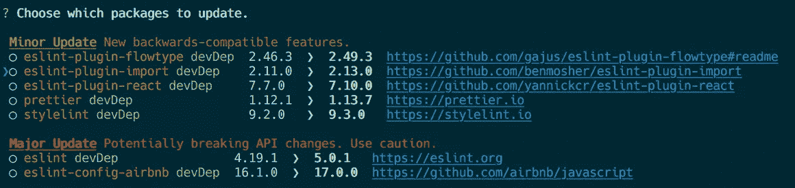
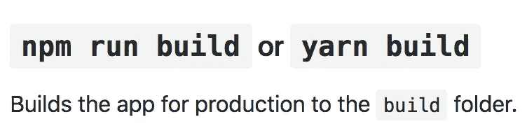
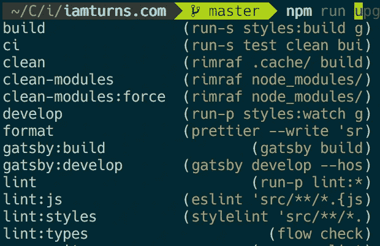

# 2018 年为什么还在用纱？

> 原文：<https://itnext.io/why-are-you-still-using-yarn-in-2018-5803e6216232?source=collection_archive---------2----------------------->


我记得当纱爆炸到现场。

速度超快。每隔`yarn install`就节省几分钟。

这确保了你的`/node_modules`与你旁边好友的`/node_modules`完全匹配。还有服务器上的`/node_modules`。不要再说“这对我有用，\_(ツ)_/”。

而且，表情符号无处不在！🔥🔥🔥

**6 个月过去了……**

npm 在 v5 中史诗般地卷土重来，带来了速度的提高和一致的`/node_modules`。是的，所有这些原因让我们开始转向纱线。

许多开发者现在想知道:

> *“纱线还有必要吗？”*

我想是时候换回老样子了。让我们来看看。

# npm 和纱线一样快。

自己看:

```
# Backup
mv node_modules node_modules_backup
mv package-lock.json package-lock.backup.json
mv yarn.lock yarn.backup.lock

# Test cold npm speed
time npm install# Reset modules
rm -Rf node_modules# Test warm npm speed
time npm install# Test cold yarn speed
time yarn install

# Reset modules
rm -Rf node_modules# Test warm yarn speed
time yarn install# Reset
rm package-lock.json
rm yarn.lock

# Restore
mv node_modules_backup node_modules
mv package-lock.backup.json package-lock.json
mv yarn.backup.lock yarn.lock
```

我跑了三次，速度非常相似。

# 您可以轻松地切换 npm 版本。

Bob 安装了 Yarn v1.1 版，Brenda 安装了 Yarn 1.2 版。当他们安装和删除项目的依赖项时，Yarn 写入了一个`yarn.lock`文件。但是 Yarn v1.1 版和 Yarn 1.2 版的锁文件格式略有不同，这对 Bob 和 Brenda 来说并不好玩。

您可以使用`package.json`中的[引擎](https://yarnpkg.com/lang/en/docs/package-json/#toc-engines)指定哪些纱线版本与您的项目兼容。

但是，如果你需要定期在不同的项目之间切换，每个项目都需要不同的纱线版本，该怎么办呢？

您需要停止使用 brew ( `brew uninstall yarn`)并恢复到 npm 安装。在项目间切换时，运行`npm install yarn@1.1 --global`和`npm install yarn@1.2 --global`。是的，每次切换项目时，都要重新安装完整的 Yarn。真是一场噩梦！

**但是用 npm 超级简单！**

使用 [nvm](https://github.com/creationix/nvm) 或 [n](https://github.com/tj/n) ，一个命令瞬间切换版本。嘣。


# 使用 Lerna 来管理您的工作区。

如果你在[工作空间](https://yarnpkg.com/lang/en/docs/workspaces/)特性中使用 Yarn，考虑使用 [Lerna](https://github.com/lerna/lerna/) 来代替。它做了 Yarn 提供的所有事情和附加功能，例如:管理工作区版本，在每个工作区内运行命令，以及发布工作区。

# 使用 npm-check 以交互方式升级。

`yarn upgrade-interactive`命令棒极了:


流行的 [npm-check](https://github.com/dylang/npm-check) 模块做同样的事情:



并且非常容易设置:

```
npm install npm-check --save-dev
```

向 package.json 添加脚本:

```
{
  "scripts": {
    "upgrade-interactive": "npm-check --update"
  }
}
```

然后用`npm run upgrade-interactive`。

# 纱线变得复杂。

来自 [Jest](https://github.com/facebook/jest) 自述:


使用笑话不需要故事。但它就在这里，推给你。现在我需要把`yarn test`转换成`npm`命令……好的，是`npm test`还是`npm run test`？我不太记得了。这才是自述应该告诉我的！

即使自述文件显示了`yarn`和`npm`命令，它也不必要地增加了噪声。例如，下面是 [create-react-app](https://github.com/facebook/create-react-app) 的自述文件:



纱线给我们带来了什么好处？没有。

对于已经被学习一个新框架搞得不知所措的全新 React 开发人员来说，这很令人困惑。“我应该运行哪个命令？这是什么纱线？我需要它吗？啊！”

我还见过工具和 CI 代码检查`yarn.lock`文件，如果检测到，就运行一组不同的命令。

选择在项目中使用 Yarn 意味着你的开发团队的其他人，包括未来的贡献者，也必须使用 Yarn(来维护`yarn.lock`文件)。

JavaScript 生态系统已经足够复杂了。我们真的也需要纱线吗？

我希望 Yarn 团队将他们的改进贡献给 npm 本身，以简化我们的生活。

# npm 摇滚！

切换回 npm 后，我意识到我的 shell 设置通过扫描 package.json 脚本自动完成了`npm run`命令:



当然，Yarn 最终可能会有这种支持(而且可能已经有了)。但是 npm 拥有年复一年的社区支持和工具的优势。

npm 也带来了一些杀手锏。运行`npm audit`来扫描你的项目漏洞。使用`npx`运行一次性命令(例如:`npx create-react-app`而不是全局安装`create-react-app`)。

# **再给 npm 一次机会。**

它很快。这是久经考验的。它定期更新。它拥有多年的社区支持和工具(如 [nvm](https://github.com/creationix/nvm) 、 [n](https://github.com/tj/n) 和上面的 shell 自动完成)。像 [Lerna](https://github.com/lerna/lerna) 和 [npm-check](https://github.com/dylang/npm-check) 这样的流行模块实现了 Yarn 的额外功能。

如果您正在编写 javascript，那么您已经安装了 npm。简化你的开发工具，再次使用 npm。如果你错过了纱，让我知道为什么在下面的评论！

# JavaScript 是不可能跟上的。

你抓住了每一个机会。滚动…阅读…刷新…略读。你迷失在文章、教程和 GitHub repos 的 42 个浏览器标签中。你可以收藏一把，以后再看(或者，永远不看)。

**势不可挡。要知道的太多了。**

因此，我开发了一个系统，可以轻松地让我了解最新情况。