# 如何攻克猴子代码！无香蕉 API 生成🙊

> 原文：<https://itnext.io/why-are-you-still-writing-apis-or-no-more-monkey-code-82e6af371b0a?source=collection_archive---------3----------------------->


你还在写猴子代码？！？！？！！杰米·霍顿在 [Unsplash](https://unsplash.com/search/photos/monkey?utm_source=unsplash&utm_medium=referral&utm_content=creditCopyText) 上的照片

> 本文是一篇关于使用 **sugar-generate** 的代码生成和自动 api 创建的教程，它是 github 和 [npm](https://www.npmjs.com/package/sugar-generate) 上的免费开源[。](https://github.com/sugarkubes/generators)

我觉得有点傻。多年来，我一直在编写相同的 API 代码和样板文件，我从来没有想到要编写为我编写这些代码的代码。但是现在我已经开始使用代码生成器了，我再也不会回头了。我们已经从汇编语言到 C 语言，再到……Javascript。很明显，未来将是写更少的代码做更多的事情。

我没有深入研究代码生成，但是我的快速搜索把我带到了两个地方:

## 斯瓦格代码根

[https://swagger.io/tools/swagger-codegen/](https://swagger.io/tools/swagger-codegen/)

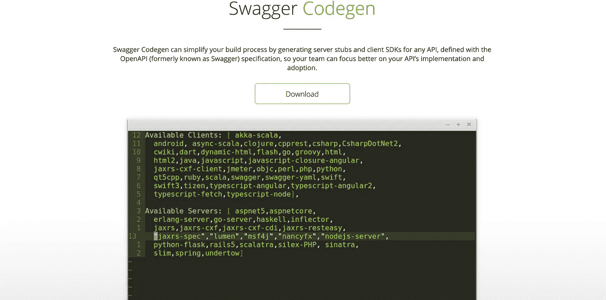

这看起来很有希望！！除非你真的看到它产生了什么。我不想要服务器存根。我想让它接受一个模式并为我生成该死的东西。

## 斯特拉皮

[](https://strapi.io/) [## Strapi -开源 Node.js Headless CMS🚀

### 开源无头 CMS 前端开发者的最爱。管理您的内容。随处分发。

strapi.io](https://strapi.io/) 

斯特拉皮是一个非常酷的选择。这里没有抱怨。我只是对购买这样的大型框架持谨慎态度。大便打到风扇上，不知道去哪里修。

同样，当我试图放入我自己的本地 mongodb 数据库时，应用程序崩溃了，我无法让它恢复。可能是一些简单但仍然令人讨厌的事情。

> 两个选项都很好，显然，很多人觉得这两个模块很有用。我想做点不同的事情。稍微轻松一点的，能让我集中精力工作的。

# 糖生成

让我们从**产糖**开始。这是一个免费的开源 NPM 模块，可以生成 CRUD APIs，所以你不必这么做。

先决条件

*   安装并运行 MongoDB

```
brew install mongodb && sudo mongod --bind_ip_all
```

> 尝试从 docker 连接时， *— bind_ip_all* 将会很重要。

然后安装**产糖**节点模块。

```
npm i -g sugar-generate
```

创建一个模式。模式是 API 的 JSON 表示。下面是一个简单的 API，叫做 Monkey

```
{
  "schema": {
    "first_name": {
      "type": "String",
      "default": ""
    },
    "last_name": {
      "type": "String",
      "default": ""
    },
    "isDead": {
      "type": "Boolean",
      "default": false
    },
    "age": {
      "type": "Number",
      "default": false
    }
  },
  "statics": {}
}
```

我们将继续使用 Monkey 模式，但是这里有一个稍微复杂一点的模式的例子，它是由 **sugar-generate** 支持的

```
{
  "schema": {
    "first_name": {
      "type": "String",
      "default": ""
    },
    "last_name": {
      "type": "String",
      "default": ""
    },
    "email": {
      "type": "String",
      "trim": true,
      "required": true,
      "unique": true,
      "immutable": true
    },
    "password": {
      "type": "String",
      "trim": true,
      "select": false,
      "immutable": true
    },
    "intro": {
      "type": "Boolean",
      "default": false
    },
    "team": {
      "type": "ObjectId",
      "ref": "Team"
    },
    "sub": {
      "one": {
        "type": "String",
        "trim": true,
        "required": true
      },
      "two": {
        "type": "Number",
        "required": true
      }
    },
    "role": {
      "type": "String",
      "enum": ["user", "maker"],
      "default": "user"
    }
  },
  "statics": {
    "statuses": ["created", "under_review", "listed", "deleted"],
    "status": {
      "active": "active",
      "inactive": "inactive",
      "deleted": "deleted"
    }
  }
}
```

实际上，我们使用的是[mongose](https://mongoosejs.com/)，所以模式被设计成模仿 mongose 模式表示。您可以在生成的代码中看到这一点。

```
const database = require('../connection/mongo');
const {
  Schema
} = require('mongoose');
const mongoosePaginate = require('mongoose-paginate-v2');
const schema = new Schema({
  first_name: {
    "type": String,
    "default": ""
  },
  last_name: {
    "type": String,
    "default": ""
  },
  isDead: {
    "type": Boolean,
    "default": false
  },
  age: {
    "type": Number,
    "default": false
  },
}, {
  timestamps: true
});
schema.plugin(mongoosePaginate);
module.exports = database.model("monkey", schema);
```

现在到了有趣的部分。

```
sugar-generate \
--type api \
--name monkey \
--schema /path/to/monkey.json \
--destination /where/you/want/the/code
```

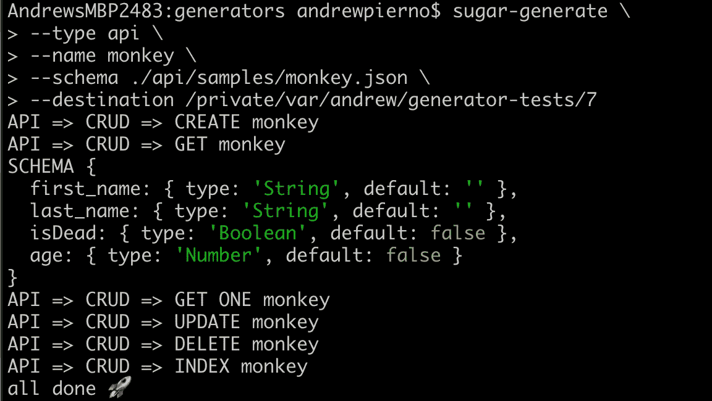

产糖量

现在您已经有了自己生成的 API！让我们来看看输出。

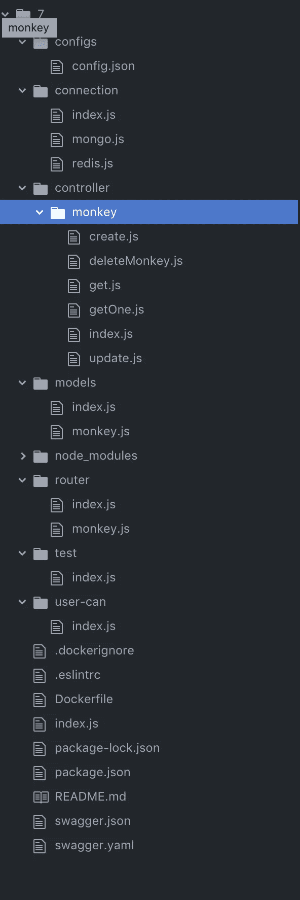

我们有一个简单的配置文件，包含我们的数据库连接、端口和一些我计划在将来添加的其他项目。

我们的连接文件夹保存我们的数据库连接。

我们的控制器拥有我们的单个端点，具有创建、获取、更新和删除功能。

我们的猫鼬模型坐在这里

超级简单路由

你喜欢考试，不是吗？

User-can 是我想在未来实现的一些魔法。这个想法是，一个简单的中间件层将扩展公共功能，比如对人和机器的认证。

其余的废话我相信你很熟悉。这里只有一点需要指出，那就是 swagger.json。

强制性 NPM 安装

```
npm i
```

让我们运行测试套件，以确保生成器正常工作。

```
npm run test
```


看起来不错！让我们启动服务器吧！生成 swagger 文档，并启动服务器

```
npm run docs && npm start
```

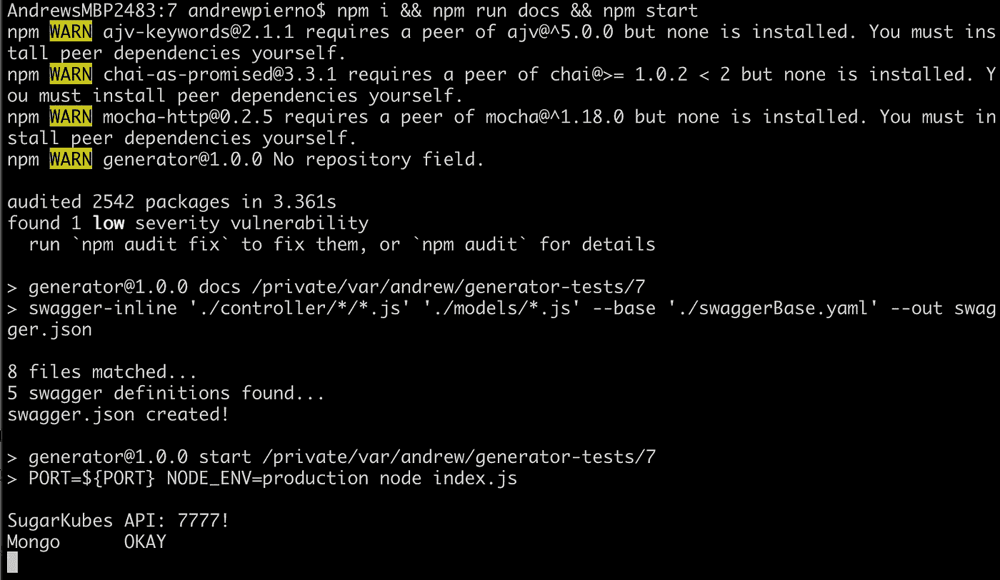

现在导航到 [localhost:7777](http://localhost:7777)

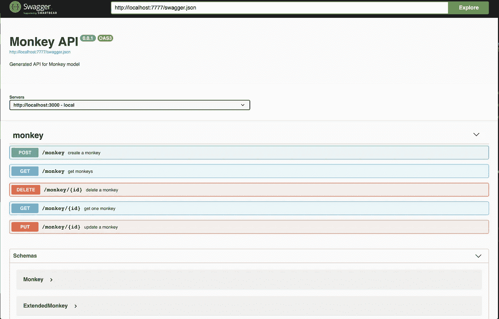

在这里，您已经有了现成的 api。

…部署情况如何？我们也帮你搞定了

## 构建 docker 容器。

我们必须对 configs/config.json 文件做一个小小的修改

```
// in config/config.json 
// change mongoURL to mongodb://<your ip address>:27017/sugardocker build -t monkeys:0.0.1 .
```

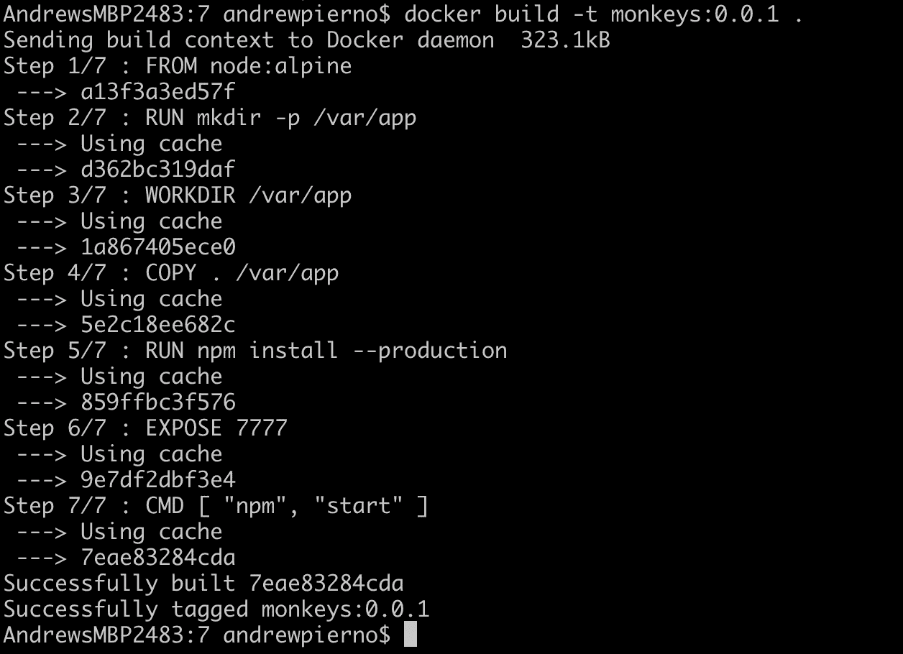

现在运行它！

```
docker run -ti -p 3030:3030 -e PORT=3030 monkeys:0.0.1 
```

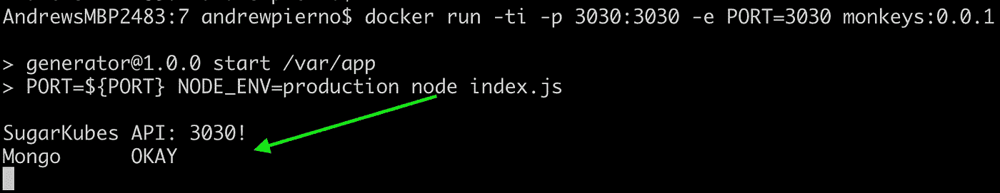

如果你收到“Mongo OKAY”的消息，你就已经连接好了，准备好开始摇滚了。

如果你想在网上找到它，试试谷歌云运行。这是我新喜欢的谷歌服务(无关联)。只需将这个 docker 容器推送到 google，就可以用 SSL 证书让它立即在 web 上运行。它还是一种扩展到零的“无服务器”服务，因此您将拥有无限的可扩展性，一直扩展到零，而无需任何运营工作或维护🤗🤗。

```
docker build -t gcr.io/<your google project id>/monkeys  .
docker push gcr.io/<your google project id>/monkeys
```

现在让我们进入[谷歌控制台云运行服务](https://console.cloud.google.com/run)！

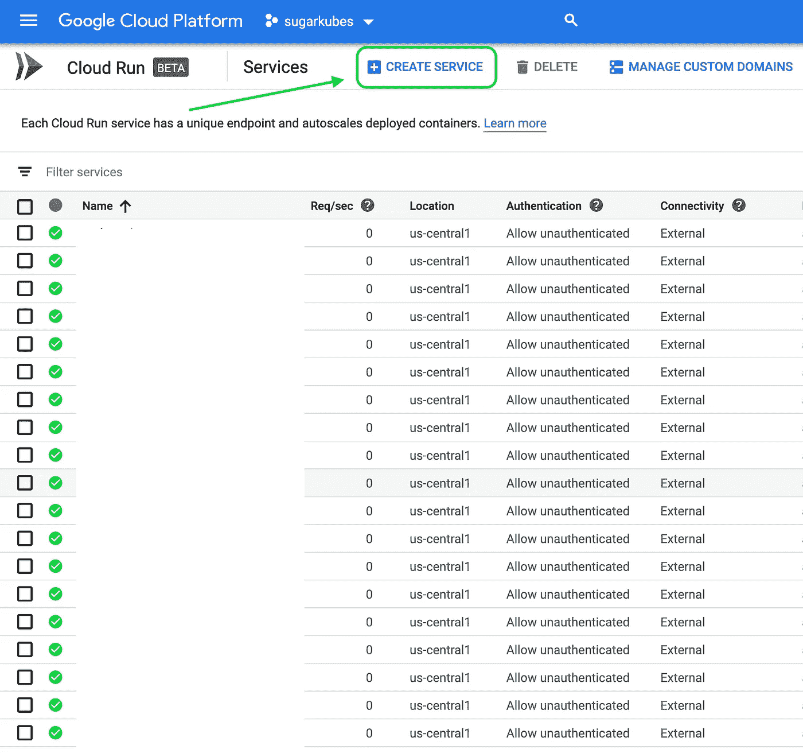

选择创建服务

在下一页中，单击容器图像 URL 中的“选择”按钮

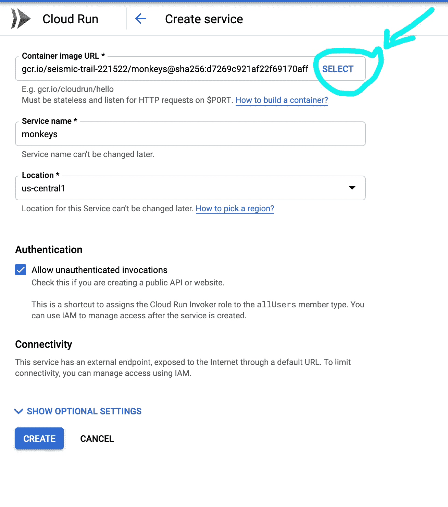

现在，让我们选择我们推送的容器


命名服务并点击创建！

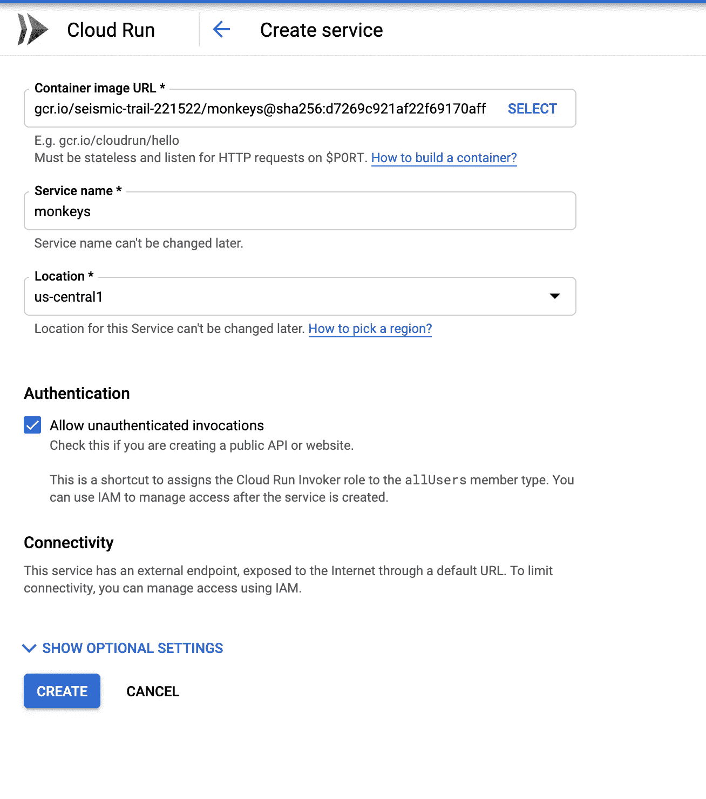

大约 30 秒后，您将通过 ssl 在线部署新的 api

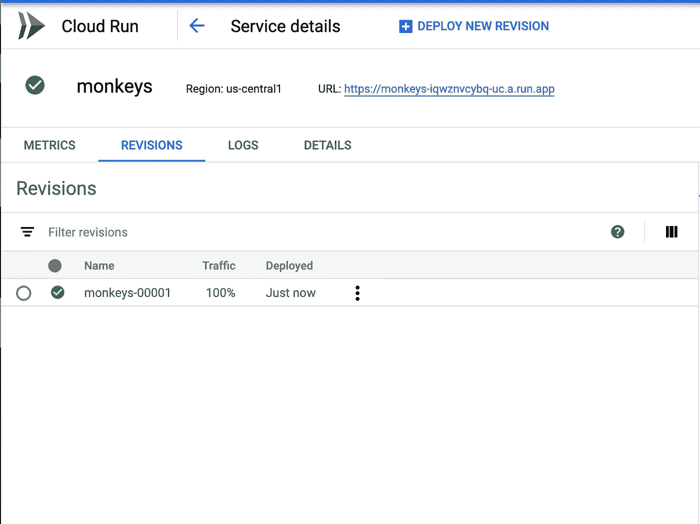

点击新的网址，瞧！您必须将 swagger.json 更改为新地址。进行更改，然后在 swagger ui 中点击“Explore”。

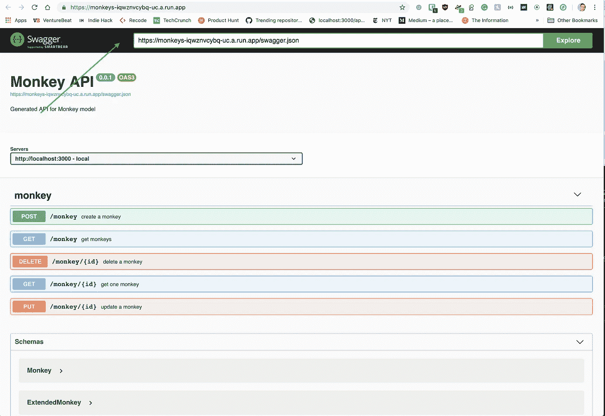

你现在可能明白为什么我感觉有点落后了。我现在不再需要了

*   写猴子代码
*   写愚蠢的样板文件
*   编写 docker 文件
*   写允许加密 crons
*   设置服务器
*   管理服务器
*   凌晨 2 点接到电话，因为服务中断
*   担心成本(它随着使用情况上下波动)
*   因为圣诞负载预期而旋转 30 c5xl 而被吼

我可以在大约一分钟内完成所有这些(一旦你做了几次)

那么有什么问题呢？主要是因为这个项目还很年轻。

这是关于这个项目的更多信息

# 特征🙉

*   生成简单的节点代码
*   使用 Mongodb 和 Mongoose ORM
*   易于构建/部署/维护
*   包括 Dockerfile 文件
*   生成 CRUD API
    —create
    —get(多，带分页；支持搜索、排序、过滤、开箱分页)
    — getOne
    —更新
    —删除

# 它擅长什么🙊

*   生成初始 API
*   面向微服务
    -准备部署(使用 docker = > deploy 构建)

# (目前)它不擅长什么🙈

*   幂等变化(也就是说，它不知道你是否在那里写了代码或者改变了周围的东西)
*   使用修改后的代码
*   填充表连接
*   控制器函数中的自定义操作

我在 [SugarKubes](https://sugarkubes.io) 制作各种有趣的东西。让我知道你正在用 **sugar-generate** 构建什么，以及你想看到什么特性！

拥抱，

美国联合通讯社(Associated Press)