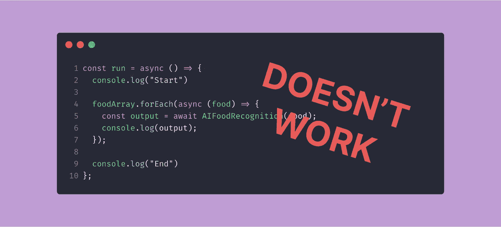
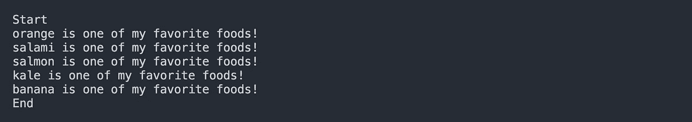
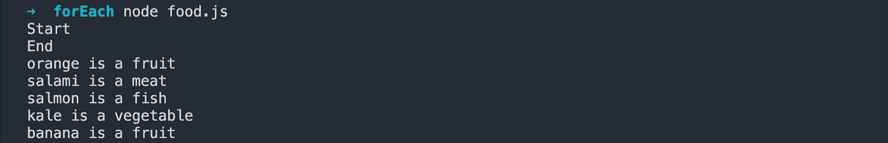
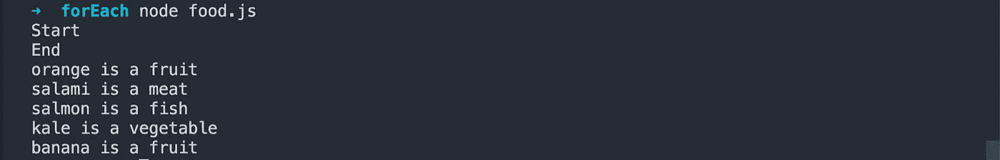
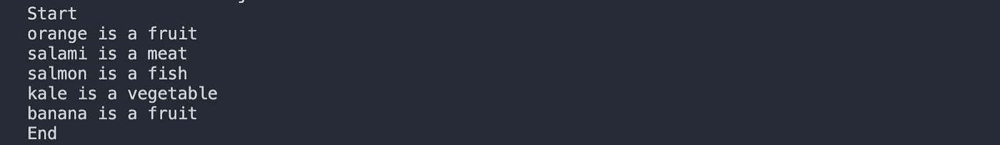
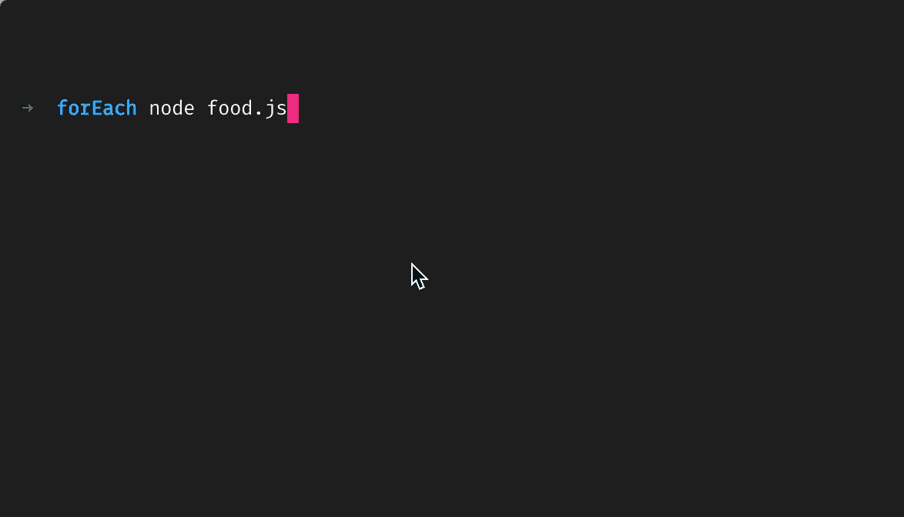
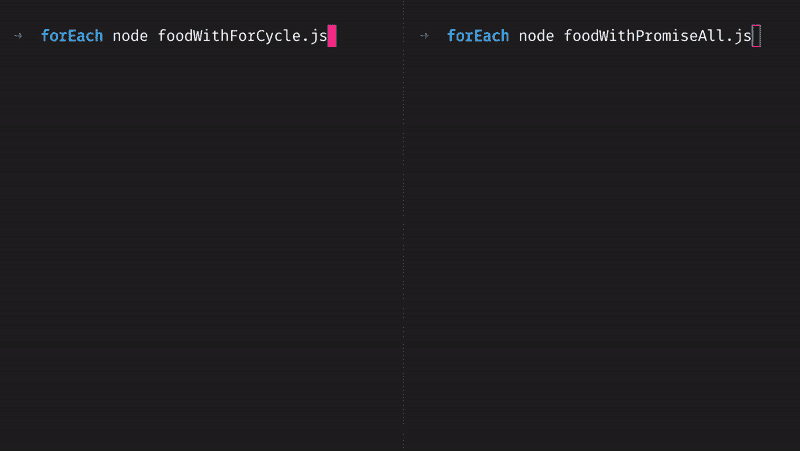

# 为什么 async/await 不在. forEach 循环中工作？

> 原文：<https://itnext.io/why-async-await-in-a-foreach-is-not-working-5f13118f90d?source=collection_archive---------0----------------------->

三种不同的方式让它工作

让我们面对现实:自从引入 async/await 模式以来，我们已经尝试在任何地方使用它。

javascript 回调和承诺的大链时代已经一去不复返(几乎)被遗忘了。解决方案:现在所有的函数都以`async`开头，即使它不包含异步代码...以防万一:)

但是 Javascript 的某些部分还没有准备好使用这种模式。其中一个部分是`.forEach`(不与 async/await 一起使用的其他方法有`.map`、`.filter`和`.reduce`，但我会就这些写另一篇文章)。

**。forEach** 是一个数组方法，**允许在数组**的每个元素上调用一个函数。简单对吗？

这是一个`.forEach`的例子:

如果我将这个脚本保存在 food.js 文件中，然后运行`node food.js`，输出如下:

所以一切都是正确的:对数组的每个元素都调用了该函数，数组的顺序与 console.log 输出的顺序相匹配。耶！✨

## 但是，如果函数比单个 console.log 更复杂，会发生什么呢？

我们在前面部分写的代码很棒，但是我想要更多。我想知道我喜欢的食物的种类(肉、鱼、蔬菜、水果)。

***假设*** 我用 javascript 创建了一个复杂的算法，输入一个食物的名字，它就能返回这个类。很棒，是吧？这是我最好的代码。🚀

该算法使用大量的计算能力和数据库资源，因此它将返回一个承诺。

很明显，我不能在这里与你分享这个难以置信的代码(不，我不会回应任何关于这个算法根本不存在的轻率言论)，所以为了这篇文章，我将使用一个模拟它的假函数。

为了调用这个函数，我将在我的`.forEach`中使用一个`await`。让我们稍微修改一下前面的代码:

因为在全局状态下使用 async await 还不标准，所以我创建了一个包装代码的函数 **run** 。在里面。forEach 函数(现在是一个异步函数)我们用`await`调用 AIFoodRecognition 并打印结果。

很简单，对吧？结果应该以“开始”开始，然后将打印所有我喜欢的食物类，然后将打印“结束”。

让我们来试试:

嗯……和我们预想的不太一样。那是因为。forEach 只调用函数，它不会等待函数结束，每个 AIFoodRecognition 函数预计至少在 500 毫秒后结束，这比主线程完成。每次循环和打印结束。**真令人失望！**

幸运的是，这个问题有一些解决方案。

*   重写。forEach 支持**await/async；**
*   使用 for()循环；
*   使用 Promise.all

让我们从最不方便的开始，即使它看起来是最好的:

# 重写。forEach 支持 await/async

这似乎是一个很好的解决方案！让我们找到代码。对于每个 polyfill，让我们用一个异步函数包装所有东西，然后…获利！💰💰💰

这是一个简单的`.forEach`聚合填充:

让我们将其更改为支持异步/等待:

如您所见，我们在第 1 行的函数之前添加了一个 async，然后在 callback.call 之前，我们将使用 await。我们将用此方法替换 Array.prototype 中的 forEach 方法。

好吧！现在让我们试着在前面的代码中使用它:

再次运行后，输出将是…

哎哟。

这是因为我们忘记了一些重要的事情:现在 forEach 是一个异步函数，所以为了等待它的结束，我们需要在调用它之前使用 await。

如果我们只是在 forEach 前面加上`await`，就像这样

我们得到了正确的结果:

所以我们应该只在已经使用过的地方添加 await。forEach 并将其包装在异步函数中… **不值得。**

此外，覆盖一些默认的类方法也是一种不好的做法，因为将来你可能会忘记这个覆盖，或者其他开发人员可能会跳进项目，花上几个小时或几天的时间试图找到错误，并找到报复你的方法。

让我们试着找到一些其他的解决方案，也许不那么黑客式的。

# 利用我们良好的旧 for()循环

老谋的报复()循环。我们把过去到处都换成新的更好看的。现在我们回来请求原谅。

让我们试着在代码中使用它:

而且…我们第一次尝试就成功了！

## 略好:用于…的

for()循环的一个变体是使用 **for…of** 模式:

但是我认为有比这更好的东西，也许可以帮助我们减少等待时间。

# 使用 Promise.all 来提高性能时间🕐

直到现在，为了结束我们的程序，我们等待了 3 秒钟(foodArray 中的每个元素都是 500 毫秒)。这是因为等待在循环中。但是如果我们在 foodArray 中有 100 个元素呢？还是 1000？等待的时间将是可怕的。

也许有一种方法可以并行进行所有的食物识别，而不是等到每一个完成后再开始下一个？是的，有:它被称为 Promise . all。Promise 的这个方法接受一个数组作为参数，只有当数组内的所有元素都完成时才会返回，返回一个新的结果数组。

我们将对代码进行一些修改，但我向您保证这是值得的:

现在我们有了一个名为 promises 的新数组。因此，我们将添加每个 AIFoodRecognition 函数调用，这样我们可以并行启动每个识别。记住:AIFoodRecognition 返回一个承诺，所以我们仍然不能从这个数组中获取我们的类。为此，我们需要使用带有单个 await 的 **Promise.all** ,这将返回一个新数组，其中包含我们的 promises 数组的每个元素的返回。现在我们只需要循环这个数组来打印结果，我们就完成了！✨

让我们看看 Promise.all 和 for()循环之间的区别(我为这些 gif 设置了 1500 毫秒的延迟，而不是 500 毫秒)

如您所见，Promise.all 方法比 for()循环快得多。因此，如果您不需要前一个周期的输出结果，您应该始终使用 Promise.all 版本在一个周期中运行一些 async/await 代码。

让我知道你的想法，或者如果你有其他方法在循环中使用 await，你可以在 Twitter 上找到我[💛](https://twitter.com/urcoilbisurco)