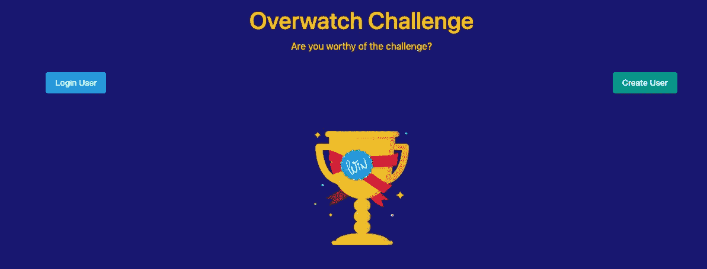
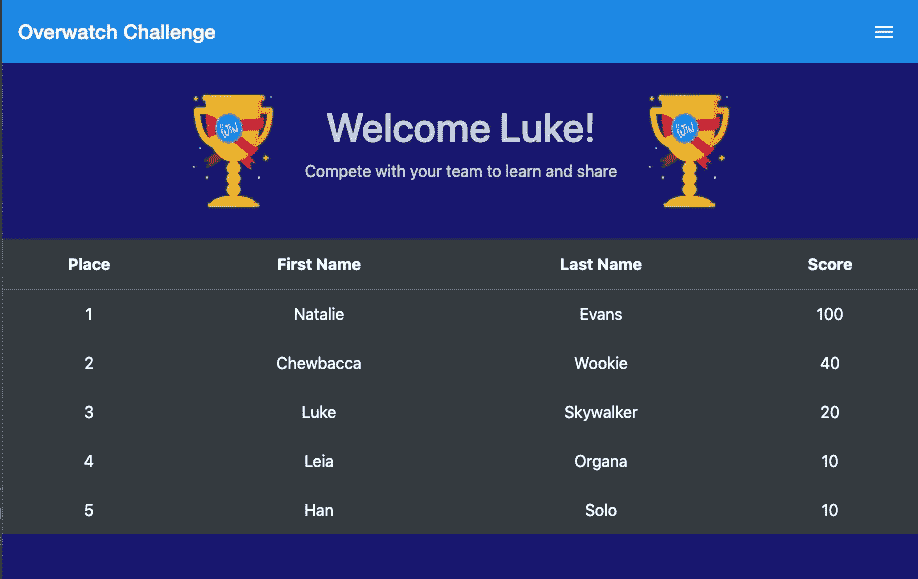
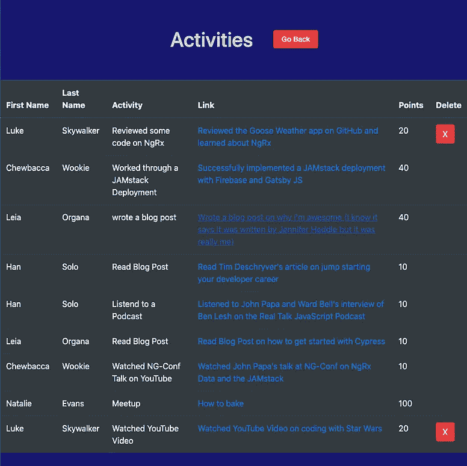

# 为什么用 JAMstack 构建很棒

> 原文：<https://itnext.io/why-building-with-a-jamstack-is-awesome-39696e9ef8d6?source=collection_archive---------4----------------------->

组织良好的 JAMstack ( [source](https://pixabay.com/photos/jam-homemade-croatia-food-sweet-1168054/) )

在今年的 NG-Conf 上，John Papa 做了一个关于 [ngrx-data](https://github.com/johnpapa/angular-ngrx-data) 以及 JAMstack 的演讲。这个演讲强调了很多关于用 JAMstack 构建应用程序的很酷的事情，以及为什么它极大地改善了工程师的开发。所以现在我肯定你在问自己，什么是果酱堆？嗯，它实际上是一个非常流行的架构模式的名称。在这篇文章中，我将定义什么是 JAM stack，并向您介绍我最近是如何使用它来构建一个学习应用程序的。我将展示 JAMstack 极大地改善了开发体验的几个关键领域，并减少了维护应用程序的大量工作。

下面是约翰爸爸的演讲(如果可以，请花一秒钟观看):

在我继续之前，我还想强调一个很棒的媒体帖子——[The jam stack:它很可爱](https://medium.com/memory-leak/the-jamstack-its-pretty-sweet-e0834e4e6bb7)，作者是 [Astasia Myers](https://medium.com/@astasia) 。我将在讨论中引用它，它很好地涵盖了 JAMstack。当你看完我的帖子，如果你有时间，请查看一下。

# 从灯到果酱

让我们看一下 JAMstack 是如何从以前流行的体系结构发展而来的。

大家都记得**灯**栈:

*   L: Linux
*   答:阿帕奇
*   男: MySQL
*   P: PHP

这种架构在几年前非常普遍，是通过托管一台服务器并安装所有这四种技术的实例来建立的。挑战在于，一旦你有了这些设置，你仍然需要用补丁和操作系统升级来维护它们。您通常还会设置某种日志或警报系统，这可能会导致令人头疼的维护问题。

接下来是**的意思是**栈:

*   M: MongoDB
*   E: Express.js
*   **答:**棱角分明
*   N: Node.js

这更好，因为这些技术更加轻量级。此外，如果您注意到平均堆栈几乎都是 JavaScript(当然除了 MongoDB)。这使得开发更容易，并且可能比 LAMP 堆栈实现所需的资源更少。然而，您通常仍然需要一台服务器作为后端和前端。至少，一个运行着数据库存储的前端、后端和 MongoDB 实例的服务器。

现在，这就把我们带到了 **JAMstack** ( [直接引用阿斯塔西亚的帖子](https://medium.com/memory-leak/the-jamstack-its-pretty-sweet-e0834e4e6bb7)):

*   **JavaScript (J):** 完全在客户端运行的 JavaScript 处理请求/响应周期内的任何动态编程(如 Vue.js，React.js)。
*   **API(A):**使用 JavaScript 通过 HTTP 访问的可重用 API 抽象所有服务器端进程或数据库动作(如 Twilio、Stripe)。
*   **标记(M):** 模板化标记应该在部署时预先构建，通常使用内容站点的站点生成器，或者 web 应用的构建工具(例如 Gatsby.js、Webpack)。

有了 JAM stack，我们可以充分利用 JavaScript 和轻量级框架的优势，而不用担心维护问题。基本设置使开发人员能够专注于编写他们的代码，但没有设置服务器、托管等令人头痛的事情。

在听了 John Papa 的演讲和阅读 Astasia 的文章后，我意识到我已经用 Firebase 编写了一年的 JAM stack 应用程序。

Firebase 可以让你开发应用程序，而不需要担心后端和前端，等等。当然，你可以用 Firebase 提供的东西构建一个传统的架构。然而，在构建应用程序时，提供用于身份验证、数据库、文件存储和托管的 API 会让您的生活变得更加轻松。

实际上，我已经写了很多关于 firebase 的文章，并推荐您深入阅读以下两篇文章:

*   [angular fire 库如何让 Firebase 感觉像魔术一样](https://blog.angularindepth.com/how-the-angular-fire-library-makes-firebase-feel-like-magic-1fda375966bb)
*   [Angular devo PS 系列:使用 CircleCI 部署到 Firebase](https://blog.angularindepth.com/deploying-an-angular-site-to-firebase-with-circleci-ed881cb6a2fa)

# 守望挑战，一个果酱栈的例子

现在我已经介绍了 JAM Stack，让我们来讨论一个例子。

最近，我开发了一个角度应用，我称之为**over watch-Challenge**。它是开源的，你可以[在这里](https://github.com/andrewevans02/overwatch-challenge)看看 GitHub 上的代码。这个名字实际上来自我工作的一个开发团队的内部名称，我喜欢它在这个应用程序中的发音。

该应用程序提供了一个学习平台。我想协调我的团队(和我的几个开发朋友)正在做的一些工作的协作和共享…所以我写了个 app！

*   它根据用户每周记录的学习活动给用户打分。
*   这个想法是，每周一次获奖者被认可，然后有一个即兴会议，以突出一些所学到的东西。
*   该应用程序包括[松弛集成](https://slack.com/)以及[会议缩放](https://zoom.us/zoomrooms?zcid=2438)。
*   当用户记录学习活动时，会包含一个超链接，以便以后可以查看这些活动

你知道丘巴卡写代码吗？

这怎么会是果酱堆呢？让我们看看它是如何工作的。

*   首先，整个应用程序由 [Firebase 托管](https://firebase.google.com/docs/hosting)托管。这使得整个过程非常简单，因为 Firebase 有一个很好的 CLI，可以轻松地捆绑和部署您的代码。查看我在 [Firebase 主机上的文章，了解更多细节。](https://rhythmandbinary.com/post/Firebase)
*   使用 CircleCI 完成部署。我连接了我的 GitHub repo，这样任何对 Master 的推送都会触发 CircleCI 中的构建。CircleCI 会通知我构建状态。CircleCI 有一个很棒的控制台，允许在构建时进行调试和日志记录。查看我在 CircleCI 上的[文章，了解更多详情](https://rhythmandbinary.com/post/Circle_Ci)。
*   为了与 Slack 集成，我还使用了 [Firebase 云函数](https://firebase.google.com/docs/functions)。这些实际上只是 Firebase 的 Google Cloud 函数，但它们提供了一种让无服务器函数为我的应用程序工作的好方法。Firebase 云函数非常强大，当值被写入 Firestore 数据库时，我已经围绕触发器构建了我的函数。您也可以将这些功能扩展到[成为带有 Node Express 的完整 API](https://firebase.google.com/docs/functions/http-events)。
*   我还利用 [Firebase 认证](https://firebase.google.com/docs/auth)来控制对应用程序的认证，并利用[云 Firestore 数据库](https://firebase.google.com/docs/firestore)来控制 NoSQL 数据库
*   我正在使用 [AngularFire 库](https://github.com/angular/angularfire2)与认证和 Firestore 进行交互，以便在我的 Angular 组件中注入依赖关系。我应该提到，您可以直接调用 Firebase APIs，但我是 AngularFire 的忠实粉丝，所以我在我的应用程序中使用了它。

最酷的部分是**我只有一个项目。我为此编写的大部分代码都专注于构建 Angular 前端，以及编排对 API 的调用。**我没有传统的后端和前端应用程序，这通常是首选的架构。

我的应用程序的 JAM 堆栈如下:

*   **JavaScript(J)**= Angular Frontend(Typescript 重新编译的 JavaScript)和 Firebase Cloud 函数(Node Express)处理 web 应用的请求响应周期
*   **API(A)**= Angular fire 库在触发数据库事件的 Angular 应用程序和 Firebase 云函数中注入了依赖关系
*   **标记(M)** = Webpack 用于编译 Angular 应用程序包和用于 Firebase 云功能的 Node Express 构建

> 另外，作为一个旁注，我也使用 [MkDocs](https://www.mkdocs.org/) 作为[警戒-挑战用户指南](https://andrewevans0102.github.io/overwatch-challenge/)的静态站点生成器。这与我和 CircleCI 一起构建的 CICD 管道是分开完成的，并不是 JAMstack 讨论的一部分。我想在这里提到它只是作为一个网站生成器的例子。MkDocs 是一个非常棒的开源站点生成器，我强烈推荐。

**我从这个架构中获得了什么优势？**

*   我的应用程序的开发时间大大加快了(大概总共花了 20 个小时)
*   非常低的外部依赖性，因为一切都由 Firebase 服务处理
*   能够专注于为应用程序构建良好的 UI 和体验(不必构建运行的服务器)
*   将应用程序的维护推到 Firebase 控制台上，而不是构建我自己的服务器集

# 结束语

所以我希望我对 JAM stack 的解释和展示已经向您展示了这种架构的好处。我使用 Firebase 构建应用程序已经有一段时间了，现在我才意识到为什么 JAM stack 能够让它们变得有趣且易于维护。如果你有时间的话，我建议你查阅一下 Firebase 文档，然后开发一个 hello world 应用程序。也请查看我提供的链接文章，对所讨论的概念进行更深入的解释。