# 为什么 ValueTask 只能等待一次？

> 原文：<https://itnext.io/why-can-a-valuetask-only-be-awaited-once-31169b324fa4?source=collection_archive---------0----------------------->


如果你一直在关注。你可能也听说过包含了 **ValueTask < T >** 。简而言之:一个 *ValueTask* 本质上是一个可区分的联合，它既能表示同步结果，也能在必要时表示 *Task* 。这对于以下情况很有用:在初始化缓存值时，您的异步方法可能只是异步一次，但对于所有其他调用，它会同步完成，因为它们只读取缓存。

如果你想了解更多，https://dev blogs . Microsoft . com/dotnet/understanding-the-whys-whys-and-whes-of-value task/是对创建者本身的一个很好的总结。

然而，使用 *ValueTask* 会导致一些意想不到的行为。首先，一个*值任务*不能被等待两次。遗憾的是，现有的文档只是以一种非常肤浅的方式进行推理，所以我继续深入研究，因为我不满足于被告知“不要这样做”，而是想了解“为什么”。

我将继续尝试概述整个流程，因此很明显这是一个需求。我还假设您了解状态机构造，否则，请随意阅读这里的内容:[https://Stefan sch . medium . com/what-the-async-keyword-actually-does-bb10 d 54 ce 31 c](https://stefansch.medium.com/what-the-async-keyword-actually-does-bb10d54ce31c)

# **值任务流**

好吧，我们开始吧。首先，请注意 *ValueTasks* 的池行为是根据以下条件启用的:

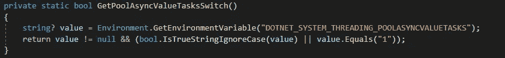

下面是我们想要使用的代码:

```
public async Task Main()
{
    var task = GetValue();
    Console.WriteLine(await task);
    Console.WriteLine(await task);
}int? cachedValue = null;private async ValueTask<int> GetValue()
{
     if (cachedValue is null)
     {
         await Task.Delay(500);
         cachedValue = 5;
     }
      return cachedValue.Value;
}
```

这是一个很常见的使用 *ValueTask* 的例子，我们还添加了等待它两次的反模式。运行这段代码将在第二个*等待*时抛出**InvalidOperationException**，如果启用了池。简单解释一下: *ValueTask* 使用了一个可重复使用的*ivaluetaksource*，它基本上一次只对一次消费有效，之后可能会被另一个 *ValueTask* 重复使用。如果你想知道为什么在常规的*任务*之上添加了*值任务*，唯一的原因是通过尽可能减少分配来提高性能和减少内存消耗。

那么，到底是什么让我们不再等待第二次呢？让我们开始吧:

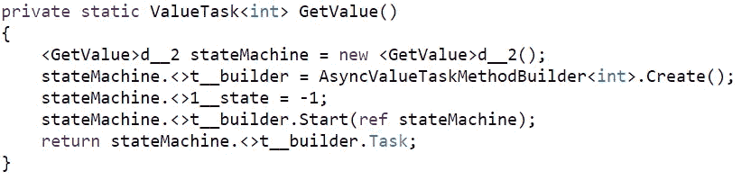

编译器生成了值任务状态机

如果我们看一看我们想要研究的 *GetValue()* 方法的编译器生成的代码，我们实际上可以看到编译器创建了一个*AsyncValueTaskMethodBuilder*，并调用了*。Start()* ，传递为 *GetValue* 方法生成的异步状态机。

*。Start()* 方法在内部做一些不太有趣的事情，但重要的是，它通过调用*来启动状态机。MoveNext()* 。

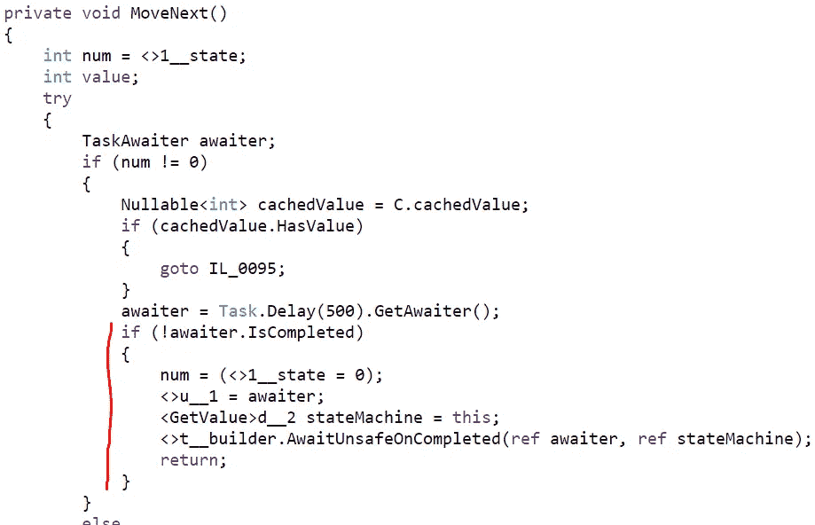

编译器生成的状态机的 MoveNext()方法

我们用 *state == -1* 启动状态机。由于 *cachedValue* 前面没有数据，并且由于延迟，awaiter 没有完成，所以我们进入标记块。重要的部分是对 *AwaitUnsafeOnCompleted* 的调用。

通过。Net 源码，这是值得注意的调用:

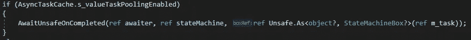

如果启用了池，我们获取我们状态机的 *m_task* 字段，并将其转换为一个 *StateMachineBox* 。一个 *StateMachineBox* 是一个 a 类型，它包装并转发对底层 *IValueTaskSource 的调用。它本质上是任何其他*ivaluetaksource*的包装器，确保默认行为，而不管底层的源是什么。*

```
internal abstract class StateMachineBox : IValueTaskSource<TResult>, IValueTaskSource
```

简而言之，在 *AwaitUnsafeOnCompleted* 方法中，通过所有 *ref* 参数，我们在这里结束:

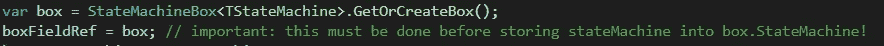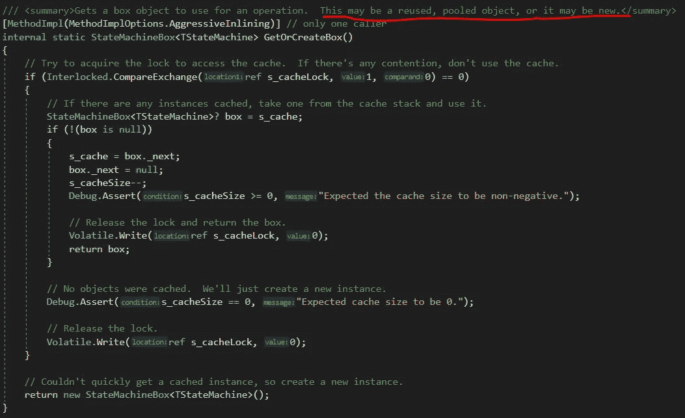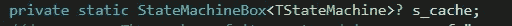

StateMachineBox 以及基础 IValueTaskSource 缓存

这是一个非常重要的部分，因为这是我们实际分配*ivaluetaksource*的地方，稍后由 *ValueTask* 使用！理解这里发生的一切并不重要，但重要的是要认识到我们获取的资源是**缓存和可重用的**。

那是很难接受的。让我们在状态机的 *MoveNext()* 方法中再加几层。我们现在搬出了 *AwaitUnsafeOnCompleted* 方法，而*将*从*中返回。【Start()【方法..*


编译器生成了值任务状态机

现在，唯一剩下要做的事情，就是抓住*。状态机的任务*属性。由于我们没有同步完成，下面的代码将会执行:

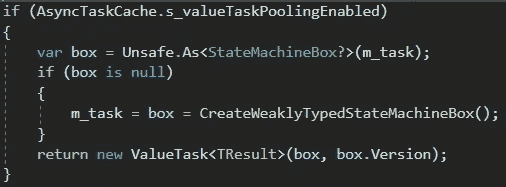

价值任务的生成

这里我们又可以看到 *m_task* 对象了！由于我们之前经历了初始化它的所有麻烦，它现在不是空的，现在将被转发到实际的 *ValueTask* 。特别注意第二个*盒。版本*参数！

*。Version* 属性是*ivaluetaksource*类型的一部分，在以后会很重要。它本质上是一个小令牌，证明你是*ivaluetaksource*的当前“所有者”。

现在，我们已经完成了对 *GetValue()* 方法的分析。现在让我们来看看我们的 *Main()* 方法生成的状态机，它执行无效的消费模式。

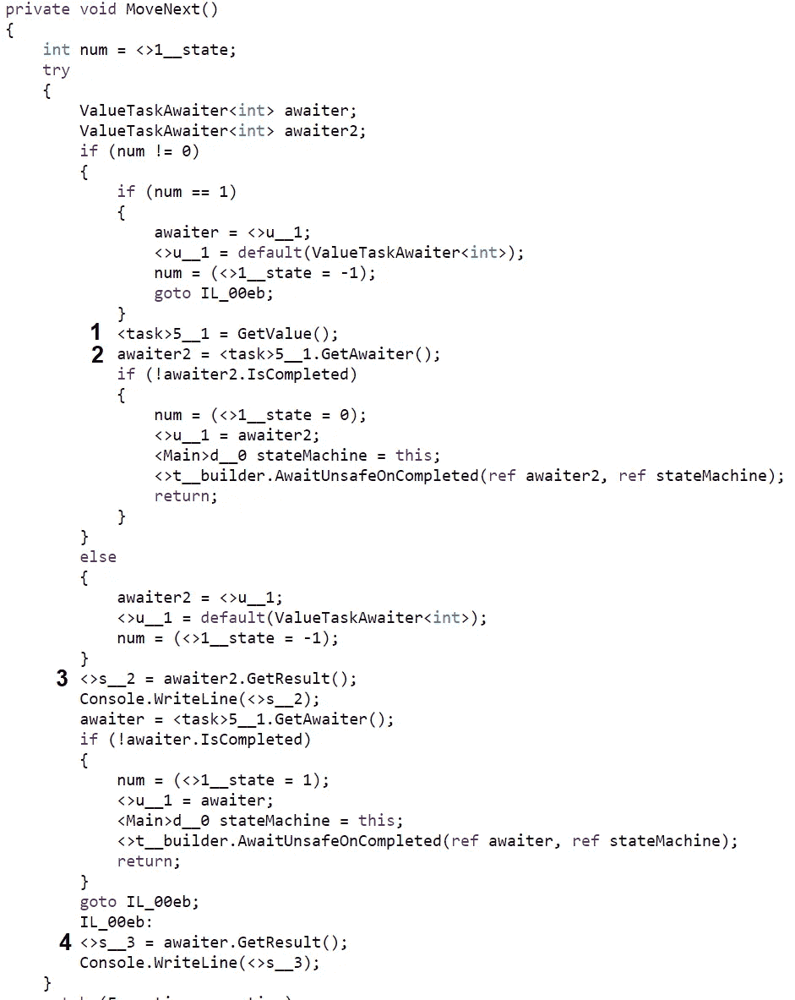

主方法的状态机

这一开始很令人困惑！让我们一步一步地解决它。

1.  我们再次从一个状态 *-1* 开始。 *GetValue()* 被调用，我们获取在该方法中生成的 *ValueTask* 。
2.  我们抓取我们的 *ValueTask* 的 *ValueTaskAwaiter* ，由于我们还没有完成，执行被推迟。 *ValueTaskAwaiter* 通过 *ValueTask* 上的常规 *GetAwaiter()* 方法公开。
3.  在重入时，状态机到达对*的调用。GetResult()* 在现在完成的 waiter 上。

这就是我们要再次休息的地方，再往下一层看看发生了什么。 *ValueTaskAwaiter* 和常规的*任务*waiter 一样，在完成时也会调用其 *OnCompleted* 方法。(注意:它还实现了*ICriticalNotifyCompletion*接口)

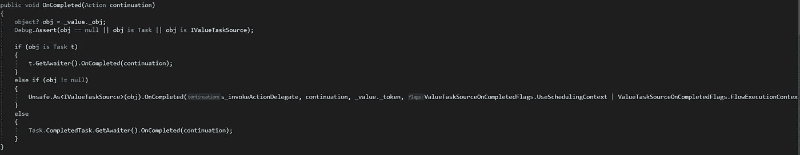

ValueTaskAwaiter 的 on 完成方法

我们可以看到，在这个方法内部，我们也调用*。OnCompleted()* 上的 *obj* 字段，这正是我们传递给 ValueTask 生成的*ivaluetaksource*。后面的具体实现是[*ManualResetValueTaskSourceCore*](https://source.dot.net/Microsoft.Bcl.AsyncInterfaces/R/2ea1d69c971646b9.html)*的一个实例。*对的呼唤。 *OnCompleted()* 隐式执行以下检查:

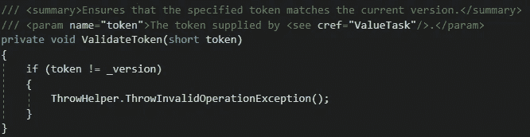

ManualResetValueTaskSourceCore 的 ValidateToken 方法

太好了！我们刚刚解决了另一个谜团！这就是第二个参数，我们传递给我们的 *ValueTask* 的令牌的用途。它基本上是一个*短*令牌，确认您是池化*ivaluetaksource*的当前所有者。如果令牌和源使用的版本不匹配，将引发 InvalidOperationException。就像发生在我们身上的一样，记得吗？

我们越来越接近搞清楚一切了！现在我们知道了源头在哪里，以及最终是什么导致了这个问题。我们还知道源的所有权令牌。

接下来，我们只需要拼图的另一部分——谁负责更改源代码的版本，导致我们的第二次调用失败？

回到步骤 3)在我们的 *Main()* 状态机内。 *GetResult()* 调用将通过多层，再次在*ivaluetaksource-Box*中结束，其中存储了我们的 *ValueTask* 结果。这个调用显然将返回整数*的值*，但是它也调用了 *ReturnOrDropBox()。*现在我们就快成功了。让我们来看看这个方法是做什么的！

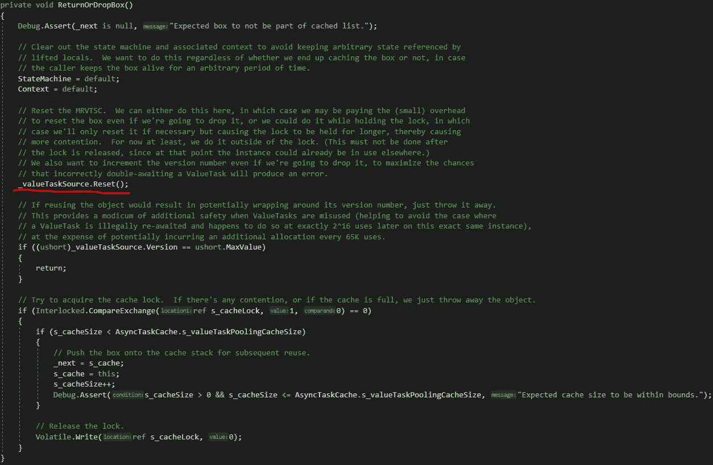

我们的 StateMachineBox 的 ReturnOrDropBox 方法

这听起来很可疑。让我们看看这个调用在这个盒子装饰的*ManualResetValueTaskSourceCore*中做了什么:

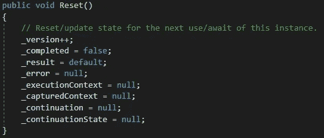

完美！这就是我们一直在寻找的缺失部分！版本增加了，源代码被清理了供下次使用。还记得我说过源代码是以池的方式工作的吗？这是它能够做到这一点的原因。

现在，故事的其余部分就很容易理解了。在第 4 点中，我们已经再次检查了状态机，在同一个 *ValueTask* 上获得了另一个 awaiter，现在我们遇到了异常。

然而，这非常有意义。由于我们正在重用 *ValueTask* ，我们仍然拥有旧的令牌集。然而，由于第一次获取结果时，我们增加了源代码的版本，现在我们有了一个不匹配。

这就是为什么你不想等待*一个*价值任务*两次的原因！*

# 结论

这是大量的信息——您可以自己随意探索 source.dot.net 知识库，有了我刚才提供的信息，事情就会变得清楚了！

不等待两次的整个概念都是 *ValueTask* 目标的结果，即尽可能节省分配。因为池行为也是这样做的，所以它与多个等待直接冲突，因为底层缓存的 *ValueTaskSource* 可能已经被重用了，正如我们已经看到的。