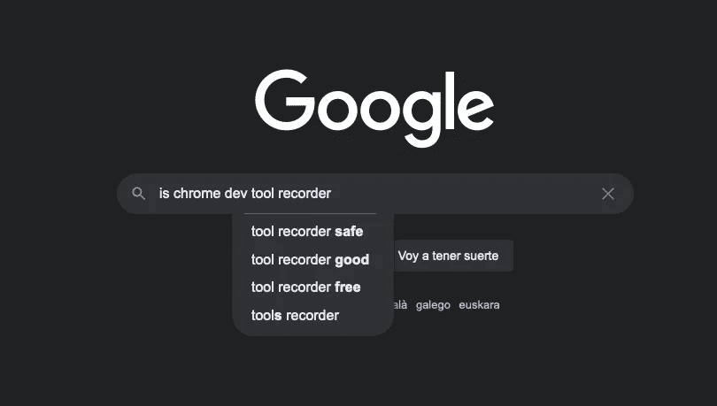
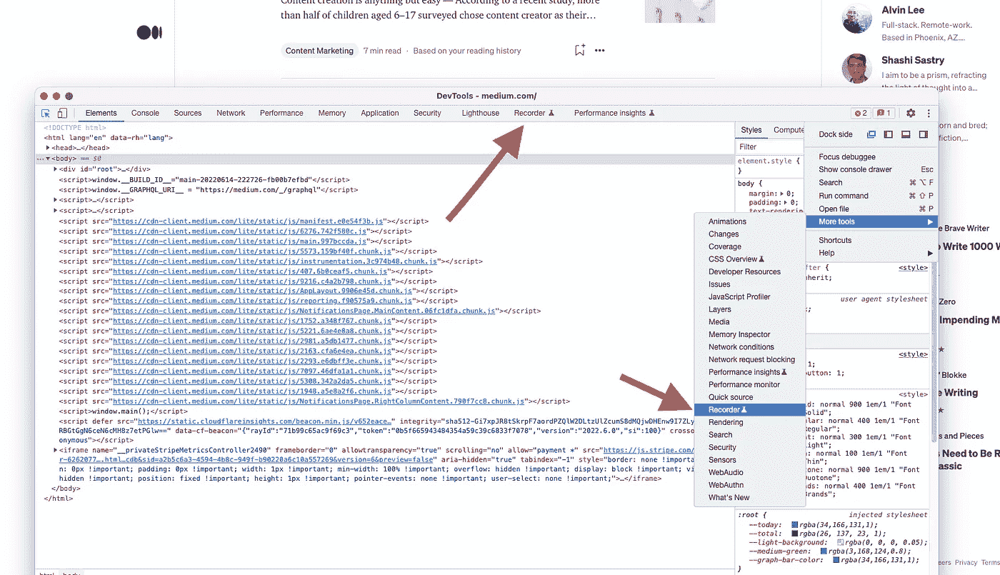
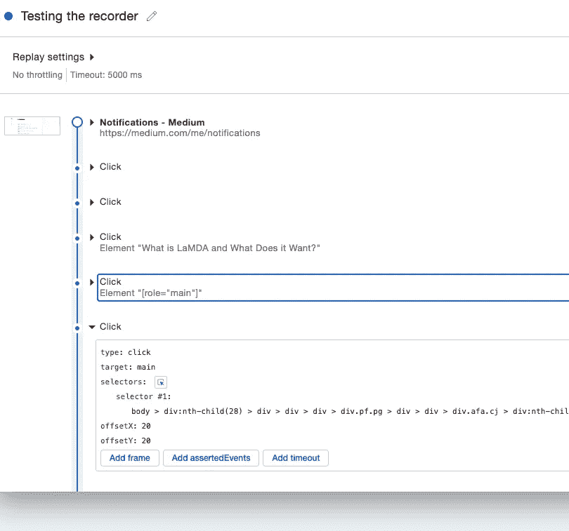
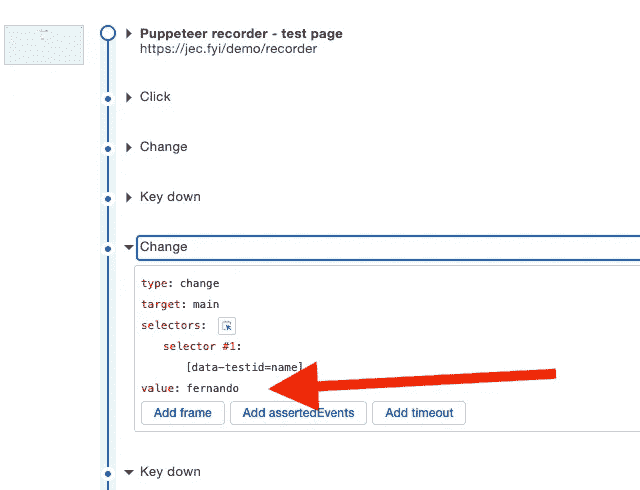

# 为什么 Chrome 的新录像机不是一个很大的特色

> 原文：<https://itnext.io/why-chromes-new-recorder-isn-t-that-big-a-feature-88413a7e2ee1?source=collection_archive---------3----------------------->

## 这可能是第一个开发工具特性，我看不到使用它的真正理由

作者截图

最近，谷歌宣布了 Chrome DevTools 的一项新功能:一个记录器。

据称，你可以在你的网站/应用程序上记录用户的会话，然后你可以重放它，以了解他们如何使用它，以及他们在会话期间做了什么。

是的，在理论上，这听起来很神奇，它是所有会话记录器的前提，但它存在于开发工具中的事实似乎表明它是开发人员的工具。这是至关重要的，因为几乎所有主要的会话重放工具都是为产品或营销人员提供的，他们希望了解用户的另一个方面:他们如何使用应用程序以及他们用它做什么。

虽然开发人员对这些事情感兴趣，但是他们也可以从了解用户正在经历的错误类型以及错误的根本原因中受益。

但是录音机在这些方面没有太大的帮助。

让我们来看看。

# 测试记录器

如果你还没有，打开开发控制台，你会发现记录器要么作为一个新的菜单项(如果你的屏幕分辨率允许)，或通过点击右上角的三个垂直点，然后前往“更多工具”。

见截图供参考:

在哪里可以找到 Chrome 开发工具中的新记录器

一旦你点击它，你会看到记录器用户界面，这是非常基本的，你只能在这个时候创建一个新的记录，要做到这一点，你必须给它一个名称，并可选地，一个 CSS 选择器。正如我们将在几分钟后看到的，这个可选的选择器只有在你有一个动态站点时才有用，比如 Medium 的主页，那里的文章建议经常变化。如果你不指定一个固定的选择器，那么未来的复制将无法工作(我们马上会看到为什么会这样)。

现在，点击记录并开始使用该网站。对于您所做的每一次点击和交互的每一次输入，您会看到时间线增长为如下所示:

你可以看到你得到了一些关于你点击的细节；如果您填写输入字段，您将获得所输入内容的详细信息:

就是这样。你已经录下了你的第一个疗程，恭喜。您现在可以导出或重放它。

现在，这一切都很有趣和美好，直到我们试图用它做一些有用的事情。在我看来，让我们来看看这台录音机做错了什么。

# Chrome 的刻录机怎么了？

我已经使用会话重放工具有一段时间了，让我告诉你，这个记录器远远不是一个。让我们看看它缺少了什么:

## 重放步骤时，不考虑时间

当您记录事件时，它们是按照事件发生的顺序记录的，这是有意义的，但是它们之间的相对时间没有被保存。这意味着当你点击“重放”时，一个可能需要你 5 分钟记录的会话将在几秒钟内完成。

现在，如果你正在记录一些东西以确保它仍然工作，这是很有用的。就像一个视觉测试，但是如果你正在记录一些东西给其他人看(就像有人在你的系统中接受训练)，他们就没那么幸运了。

## 未显示错误

如果您的用户(或者您，就此而言)在执行这些步骤时遇到 JS 错误，会发生什么呢？错误不会被记录在任何地方，所以在再现它时，您不会得到任何出错的指示。

同样，对开发人员没有用，因为错误仍然是隐藏的。

## 重播是在现场进行的

这很有趣，因为如果网站改变了，那么你就不走运了，选择器将不再工作。例如，我在 Medium 的主页上测试这个，几分钟后复制我的录音意味着我不能再使用它们了。主页上的文章不断变化，所以使用的内部选择器再也找不到了。

这个我上面提到过。这是创建新记录时可选选择器字段发挥作用的地方。如果您有可以用作选择器的固定属性，那么请记住这一点。

## 作为一名开发人员，你真的得不到任何有用的见解

开发控制台和开发工具是帮助我们日常工作的有价值的工具。例如，JavaScript 控制台或 Network 选项卡是任何 web 开发人员都需要的基本工具，没有它们，我们就是瞎子。

这些记录中的开发控制台在哪里？为什么我们不把这些信息也记录下来呢？

“网络”选项卡在哪里？如果我们不知道我们的应用程序在做什么，服务器(或者那些讨厌的第三方 API)返回什么，我们怎么能验证任何东西呢？

## 您只能测试您的计算机

如果你在自己的盒子里测试，你就不能真正测试“用户流”。就这么简单，你可能有一个特定的设置，或者一个特定版本的 Chrome，它可以简单地与你的应用程序一起工作，但不会对你的所有用户都是这样，不是吗？

事实上，并不是所有的浏览器都将使用 Chrome，你也不能在 Firefox 中这样做。所以你在这里做的“用户测试”是非常有限和有偏见的。即使你要教你的用户如何记录和导出他们的会话(如果他们不是技术人员，这几乎是不可能的)，你也不能确切地看到他们所看到的；您将看到使用您的设置运行他们的步骤的结果。

# 那你能用这台录音机做什么呢？

我的结论是基于我的测试和上面的发现，而不是他们的新闻稿，因为我觉得那个太乐观了。

在目前的状态下，我认为这个记录唯一有用的地方就是创建一些基本的自动化测试。仅此而已，但话说回来，这些“自动化”测试必须手动运行，因为 Chrome 中没有集成自动化。

即使有，这些测试的输出也不能被合并到发布工作流中。相反，它是你可以手动检查和解释的东西。

那么，您为什么会再次使用这个功能呢？

# 作为一名开发者，如果你正在寻找一个真正的会话重放工具，你能做什么？

如果你需要真正的会话重放，它会给你用户正在做的事情的细节，以及他们得到的错误的类型，那么有一个服务你可以使用: [OpenReplay](https://github.com/openreplay/openreplay) 。

OpenReplay 是开发者为开发者打造的开源会话重放套件。它允许你观察用户在做什么，记录浏览器记录的一切(DOM 事件、控制台错误、网络调用等等)。

最重要的是，虽然你可以使用他们的 [SaaS](https://openreplay.com/) 开始，他们的产品是开源的，能够由你自己托管。这非常重要，因为它提供了两个非常方便的特性:

1.  **如果你自己托管，你可以完全控制你用户的数据**，这意味着安全问题和隐私问题更少。您甚至可以清理捕获的数据，以确保数据库中没有个人详细信息。
2.  通过开源，你既可以自己扩展它，也可以与他们不断增长的社区合作，添加你可能需要的功能或解决你遇到的问题。这使得 OpenReplay 经得起未来的考验，因为它将随着行业的需求并通过与其社区的互动而增长。

如果您正在寻找一个会话重放解决方案，它能为您提供识别生产 bug 所需的所有工具，请尝试一下 [OpenReplay](https://github.com/openreplay/openreplay) 。