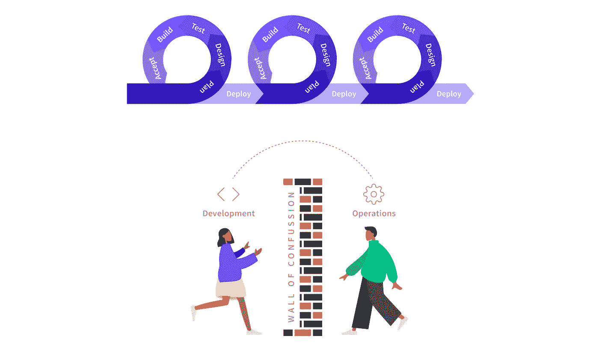

# 为什么是云原生？

> 原文：<https://itnext.io/why-cloud-native-3d1ef7cfa6bc?source=collection_archive---------3----------------------->

## 速度和稳定性、平台和全周期开发

“云原生”技术和实践的出现，如微服务、云计算和 DevOps，使创新组织能够比竞争对手更快地响应和适应市场变化。看看最初的网络“独角兽”、Spotify、网飞和谷歌的成功就知道了。显然，不是每个公司都可以成为独角兽，但从云的早期采用者那里可以学到很多东西。

# 云原生的优势

Spotify 现在著名的“[小队、分会和行会](https://labs.spotify.com/2014/03/27/spotify-engineering-culture-part-1/)”组织模式最终导致他们的应用程序被创建为独立的微服务，这反过来支持了他们所期望的快速变化。通过结合[引人注目的愿景](https://www.slideshare.net/reed2001/culture-1798664/2-Netflix_CultureFreedom_Responsibility2)和云服务的全面采用，网飞在视频流媒体领域的创新超过了现有的市场参与者。谷歌的协作、自动化和[解决运营问题的方法](https://landing.google.com/sre/books/)使用了从软件开发中获得灵感的技术，这使得他们在过去二十年里成为一种全球现象。

显然，强有力的高层领导以及不断改变和适应组织内部文化的意愿对结果有很大影响。最重要的关注点之一是不断努力[持续缩短交付价值的交付周期](https://itrevolution.com/book/accelerate/)。从有想法、编码、发布功能和获得反馈的过程中，这可以被最小化摩擦的驱动力所看到。

*成功采用我们现在称之为“云原生”方法的组织在两个核心领域进行了大量投资:创建自助服务应用平台，以及采用新工具和开发人员工作流。*

从组织的角度来看，这些投资打破了运营和开发团队之间的现有障碍，这些团队传统上是通过票务系统进行协调的。这导致了两个高级角色组的创建，这两个角色组通过使用定义良好的 API、自动化和集中的面对面交互来协作:

*   平台团队和站点可靠性工程师(SRE)拥有平台，不断发展平台功能，并帮助策划运营最佳实践；和
*   “全周期”开发团队拥有组织的产品和服务，并利用平台和新的工作流程向客户交付价值。

尽管有益，但引入这些技术和组织变革并不总是没有痛苦的。不管是好是坏，传统的软件开发生命周期(SDLC)已经被云的到来打乱了。

# 全周期开发:破坏 SDLC

在 SDLC 的传统方法中，工程师们都很专业，并且经常各自为政。运营商建造和管理数据中心。架构师设计系统，绘制方框和箭头，并提供架构治理。开发人员通常针对他们整体应用程序的本地运行实例来编码和测试大量的更改。质量保证(QA)工程师使用一系列门控试运行环境来验证和提升系统。通过 QA 的应用被移交给运营部门进行部署和运行。在此之后，任何问题或异常行为都由运营团队确定，并交还给开发人员。

*敏捷实现了快速创新，但没有完全打破开发/运营障碍*

通过采用云技术，如 [Kubernetes](https://kubernetes.io/) ，运营团队可以自动提供平台，开发人员可以自助部署应用程序。微服务的使用允许专注于产品的开发团队独立工作。相应地，云原生 SDLC 非常不同。开发人员正在执行刚好够用的前期架构设计。开发人员正在针对多个服务编写小的迭代更改，其中一些服务可能在本地运行，而另一些可能在远程运行。开发人员现在正在寻求自动执行 QA 风格的验证，作为编码过程的一部分。开发人员也希望将快速、可控的实验投入生产。这种方法被称为[全周期开发](https://netflixtechblog.com/full-cycle-developers-at-netflix-a08c31f83249)，并在网飞得到推广。

*全周期开发。平台工具*支持的“您构建它，您运行它”

这里有必要停下来理解向“全周期”开发团队转变的两个核心前提。这并没有消除对专业运营、系统管理员或平台团队的需求。然而，这确实需要开发和运营团队提高技能。

全周期开发团队必须培养更多的业务领域专业知识，并且扩展他们对应用程序基本运行时配置的理解。运营团队必须学习新的云技术，并了解这些技术如何与现有解决方案集成到一个有效的平台中。

# 摘要

正如这里所概述的，拥抱云原生技术和开发风格可以为您的组织带来重大好处，可持续地最小化摩擦的数量和想法之间的相应交付时间，并向您的客户交付价值。为了充分获得云原生技术的好处，必须解决关键的组织、文化和技术转变。

在接下来的几周里，我会分享更多关于这些主题的想法，如果你想先睹为快，你可以[下载白皮书“Kubernetes 平台的 4 个基本要素”](https://www.getambassador.io/downloads/whitepaper-4-essential-elements-kubernetes-platform.pdf)。