# 为什么不变性的概念对于初学前端开发的人如此重要？

> 原文：<https://itnext.io/why-concept-of-immutability-is-so-damn-important-for-a-beginner-front-end-developer-8da85b565c8e?source=collection_archive---------1----------------------->

## AKA:JavaScript 中不变性的完整介绍(还有一个关于 socks 的故事)。

写这篇文章的时候是仲秋，这让我想起了即将到来的年底。谁喜欢收到圣诞礼物？

好吧，这很简单。收到礼物很酷，而且永远都是。那么，每年都收到同样的礼物会怎么样呢——例如，袜子？

我敢打赌，你们很多人都认识一个可爱的阿姨，她每年都给你同样的一双袜子。

关于这种礼物的问题是:几年后，你不需要为了知道里面是什么而打开它们。你知道，如果礼物是你的阿姨送的，并且用精致的纸轻轻地包装着，藏在里面的东西肯定是一双闪亮的新袜子。与过去两年、三年或四年前几乎一样。爱你，阿姨。

这里有一个转折:如果下一次你姑姑的礼物真的是用坚固结实的包装送来的——和平时完全不同——会怎么样？或者如果软包装是别人给的呢？你会怎么想？你会再次怀疑里面的内容，或者更确切地说，假设包含的对象是完全不同的东西吗？

现在，让我们把袜子塞进 JavaScript。

## JavaScript 变量类型背后的魔法

在我们深入探讨不变性的概念之前，让我们追根溯源，弄清楚 JavaScript 中关于类型的一些事情。

正如你可能在无数的教程和书籍中读到的，它们被分为两类:

*   原始类型，例如数字、字符串、布尔型
*   引用类型，例如对象、数组、函数

> (事实上，数组和函数也是对象——但是让我们暂时把这个怪癖放在一边，反正 JavaScript 从来就不是一个普通的家伙。)

现在真正重要的问题是:提到的两种变量有什么区别？先说清楚，一步一步来。

首先，让我们给一些变量赋值。例如:

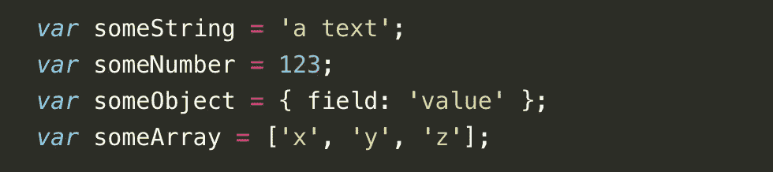

因为宇宙是一个非常动态的概念——编程也是如此——通常我们的目标是将这些值转换成其他值。最好，我们有一个函数为我们做这件事:

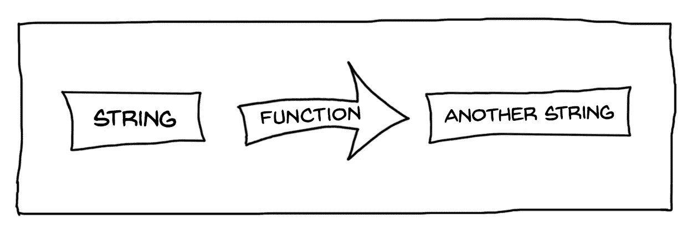

现在，让我们从一个字符串变量开始，试着写一个函数来转换它。我们先从哑吧和幼稚的做法开始:*(警告，前方白痴且明显无效的代码！)*

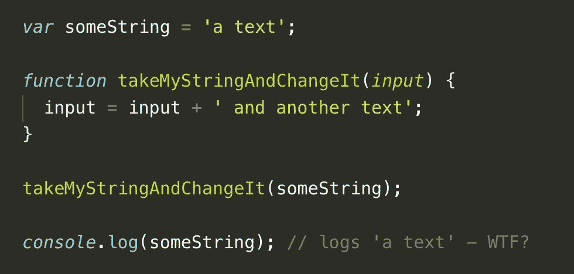

显然，这段代码看起来并不精彩(坦白说，很白痴)。该函数尝试将参数变量的值更改为其他值—但是在调用时，将变量注销到控制台仍然会显示原始值。

能正常工作吗？傻，当然不是。如你所知，我们的函数体在它的参数中收到了变量`someString`的**副本**，所以任何更改都将只针对复制的字符串——原始字符串将保持不变。如果我们真的想实现我们的目标，我们需要从函数中返回一个值。大概是这样的:

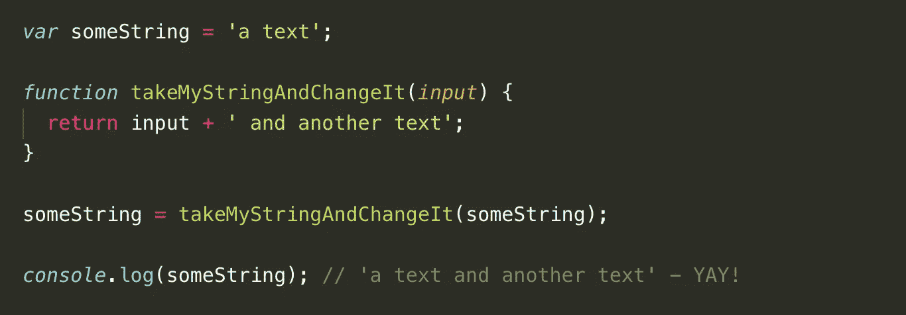

这一个如预期的那样工作——我们的函数设法处理并返回数据，尽管有我们函数的副本。但是 **copy** 这个概念在 JavaScript 中是什么意思呢？

现在，让我们试着对这个对象做同样的事情。类似地，就像我们处理字符串一样，我们将从简单的方法开始。看，据说是愚蠢的代码:

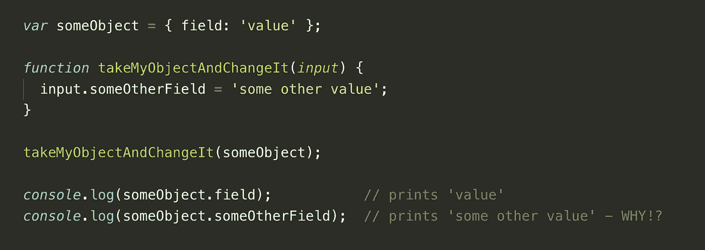

好，我们跑吧。啊哦。成功了吗？

真扫兴。它起作用了——但是意想不到的奇迹般的作用很少是好现象。

让我们来分析一下:如果我们遵循与`string`相同的逻辑，我们会预期对象将被复制。然后，我们所有的更改将在**副本**上执行，而不是在**原件**上执行。相反，我们设法就地修改了对象。为什么会这样？

事实是，我们的函数**复制了** **的参数——但是两个变量名(`someObject`和`input`)都引用了**的同一个对象**。确切地说，两者拥有相同的**引用**——它们与计算机内存中的相同位置相关。我们甚至可以通过简单的分配来模仿这种行为:**

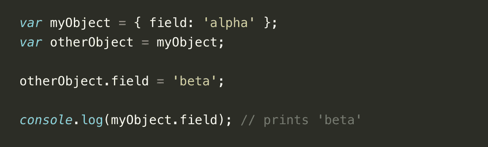

类似地，这里的两个变量都保存了对同一个对象的引用。当使用“`=`”操作符时，我们并不复制对象——我们只是给内存中的位置分配一个地址。如果您想在处理对象分配时更加自信，您可以随时查找对象创建的次数。

这是一个新对象的创建:

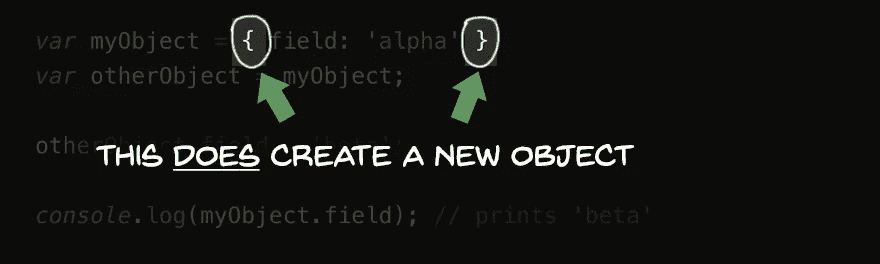

这个**不是**:

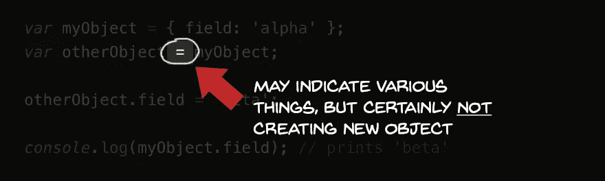

现代人只知道用 JavaScript 创建对象的三种方法:

*   使用花括号`{`和`}`立即创建(就像上面的例子)
*   使用`Object.create()`
*   使用`new`操作器

任何其他操作:赋值、作为参数传递、从函数返回某个东西——将**而不是**以创建一个新对象结束(至少在传统的 JavaScript 中)。

> 请记住，我们在本文中讨论的是对象，但基本上所有这些原则也适用于数组。[毕竟，它们也是物品。](https://jsbin.com/nubeguluni/edit?js)

好吧，那它要去哪里？显然，对相同对象进行赋值引用还有另外一面——而且相当糟糕。

使用上面例子中的逻辑，我们可以创建一个对象，并通过将它的引用赋给另一个变量来记住它。然后，我们可以执行一些修改，并检查原件是否仍然与副本匹配。

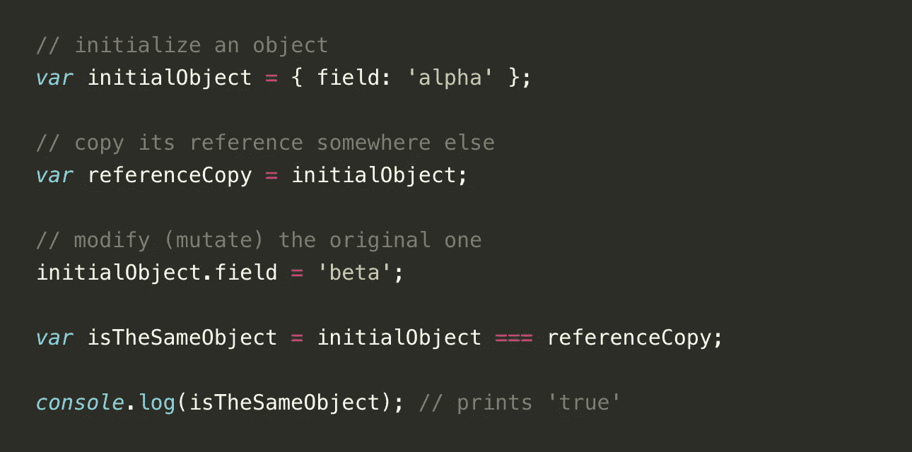

显然，这些物体还是一样的。而且，我们已经把之前的版本(带`alpha`的那个)弄丢了。无论我们做多少修改，无论我们创建多少引用同一个对象的变量——它们都将指向同一个对象，我们将无法察觉任何差异。毕竟，对象只被创建一次——我们只有一组`{`和`}`。

让我们暂时回到我们的圣诞礼物。你可以把一个 JavaScript 对象想象成你阿姨送给你的礼物:保存对象引用的变量是**包装、**对象的字段(及其值)是你礼物的**内容**。问题来了:如果包装总是一样的，你怎么知道里面的东西变了呢？换句话说:如果包装没有变化，如何在不打开包装的情况下检查里面的东西？

尽管听起来很傻，但这是一个非常重要的概念，影响着编程的许多方面。*为什么？*

想象一下*一个对象*被分配给*应用程序中多个地方的多个*变量。它们分散在许多代码文件中，并采取各种形式:函数参数、限定范围的变量，甚至是另一个对象的字段。现在，因为只有*一个对象*，我们代码的多个部分能够改变(突变)它的内容。这听起来不太好，但还不是最灾难性的部分。

更糟糕的是，我们无法跟踪这些变化。由于所有变量共享相同的引用，我们无法通过比较来区分它们。为什么我们需要它？例如，为了刷新用户界面或以某种其他方式对变化做出反应。

让我换一种说法:如果在任何给定的时间点，您想检查对象的内容自创建以来是否发生了更改，那么您注定要失败。您需要遍历它的所有字段，并以某种方式将它们的值与一些记忆的模式进行比较——但是从计算的角度来看，这种方法非常昂贵(记住，对象是可以嵌套的！).当然，您可能会发明一个系统来记录所有执行的更改——但是与我们理论上的单个对象相反，现实世界的应用程序包含多个对象，这些对象具有包含数组或函数的深度嵌套结构。维持这样的历史书写机制将很快成为一场令人不快的噩梦。

是的，JavaScript 的变化过程是艰难的。或者更确切地说，检测它。那么，如果我们 ***禁止一切变化***——或者换句话说，让突变成为非法，会发生什么？

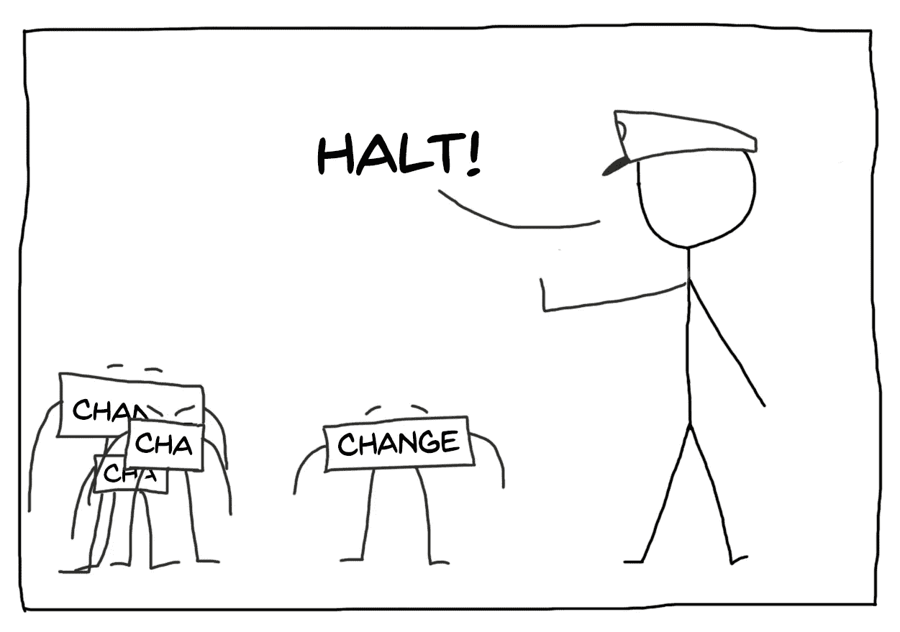

职位:变革预防干事

## 欢迎来到永恒的世界

让我们从基本概念开始:我们想要[非法化](https://www.youtube.com/watch?v=eiyfwZVAzGw&feature=youtu.be&t=10)对象中的所有直接变化。我们还有什么选择？不多——事实证明，只有一条出路:

想象一下在我们的编程游戏中引入一个疯狂的规则:**每次我们想要修改一个对象的内容，我们** **用更新的内容**创建一个新的对象。一直都是。没有借口。

听起来很奇怪？是的。尽管看起来很疯狂，但这可能是非常可行。让我们用这个想法写一个代码，通过创建一个新的对象来“更新”一个对象。假设一个简单的场景:我们需要在一个已经存在的对象中更改一些字段的值:

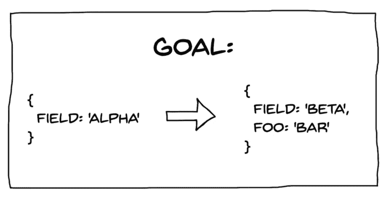

现在，让我们编写将“重新创建”我们的对象的代码，然后更改一些字段:

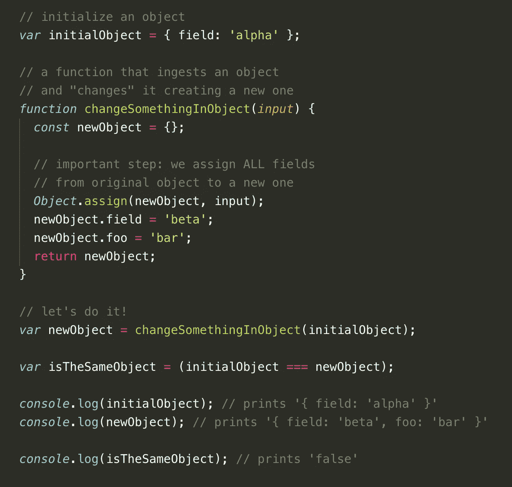

在我们妄下结论之前，让我们试着用`Object.assign`来解释 hassle，并尝试改进它。一般来说，它是一种将一个对象的所有属性(字段)分配给另一个对象的方法——第一个参数是接收对象，下一个参数是提供者。但由于在撰写本文时是 2018 年，我们可以利用[对象传播运算符](https://developer.mozilla.org/en-US/docs/Web/JavaScript/Reference/Operators/Spread_syntax#Spread_in_object_literals)的使用:

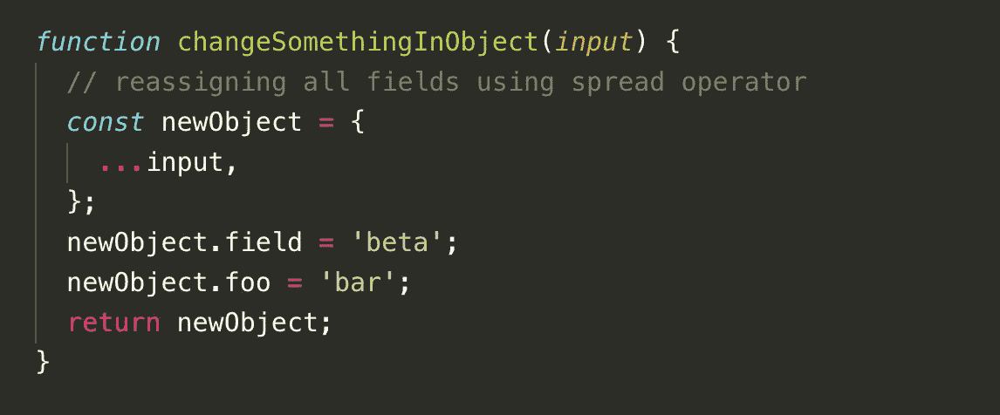

我们可以更进一步—记住，使用这种符号，我们可以通过重新分配现有字段来覆盖它们，如下所示:

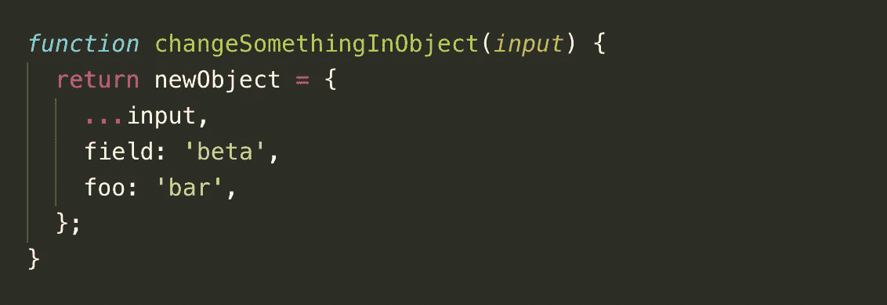

我们的最终代码像以前一样工作，现在看起来像这样:

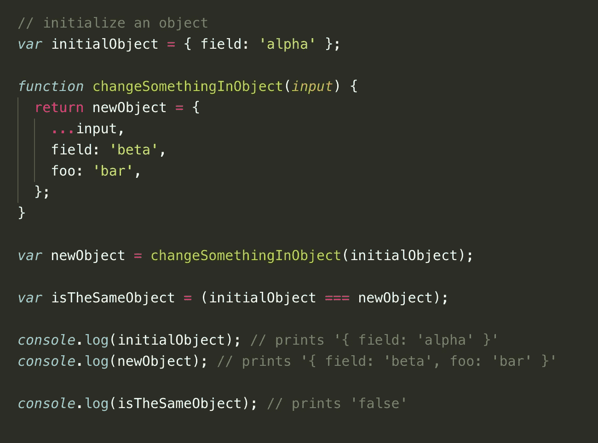

抛开语法不谈，代码是有效的。我们不是直接修改对象，而是创建一个副本并重新分配所有内容——最后，我们只剩下原始未动对象和一个包含更新内容的新对象。

好处在哪里？*有什么好的部分？*

答案就在代码的最后一行。控制台将显示`false`，这意味着对象有不同的引用——如果我们能够区分它们，这表明我们**已经获得了跟踪我们的对象**中的变化的方法。虽然这听起来微不足道，但事实证明这是至关重要的，尤其是在前端(或面向界面的)应用中。为什么？

我们获得了:

*   **预见性。**规则很简单。如果引用不同，则表明已经做了一些更改。如果我们仍然使用旧的引用(我们可以通过使用与`===`的简单比较来确保这一点)，我们可以确定什么都没有改变。明确程序。不多不少。
*   **变更追踪。**想象一下在应用程序的不同模块中使用单个数据对象——或者甚至将它发送到某个第三方库。过了一会儿，你能确定这个对象的内容没有改变吗？你能确定它和之前是同一个物体吗？使用不变性，您可以比较操作前后的引用(`===`)——如果有些事情已经改变，而我们仍然在玩规则，我们可以预期它们会有所不同。
*   **实现反应式接口的容易程度。**我们可以从 UI 内部观察数据对象，并且*仅在数据发生变化时做出反应*,而不是显式地重新呈现 UI 的各个部分(并跟踪应该刷新哪个部分)。我们可以非常快速地检查它，因为它只是一次引用的比较(一次`===`)，而不是遍历所有内部字段的昂贵的迭代。哦，我用了“反应”这个词吗？没错——著名的 [**react**](https://github.com/facebook/react) 库利用了不变性的概念来优化 UI 刷新过程。在 **Vue** 和 **Angular** 中也有类似的用例/机制。
*   **改变历史。假设你需要在应用程序中实现撤销和重做功能。首先想到的是一个可怕的、复杂的系统，它跟踪所有的动作，并有可能在应用程序的数据对象上回放(和重放)它们。使用本文描述的方法，你可以以独立的(不可变的)对象的形式保存和保留任意数量的历史条目，并用它们替换当前状态。需要撤销吗？只需带着整个数据集返回之前的整个对象，瞧，这就完成了。需要重做吗？同样，恢复撤消时保存的状态。太简单了。**
*   **更多的**——可测试性、酷、有单一的真实来源、更性感等等。

一个崭新的充满可能性的闪亮世界就这样出现在我们面前。

但是没有不带刺的玫瑰，可能会有什么缺点呢？

首先想到的可能是内存消耗增加。如果每次有变化时，我们都不断地重新创建我们的对象，我们不是像一只饥饿的獾一样大嚼 RAM 吗？

嗯，没看上去那么糟。显然，JavaScript 执行环境在回收内存方面非常出色。一个名为[垃圾收集器](https://developer.mozilla.org/en-US/docs/Web/JavaScript/Memory_Management)的机制有效地寻找所有不再使用的对象，然后处理它们。因此，在创建了不可变对象的新版本之后——一旦它意识到我们的代码不再需要旧版本，内存就会被快速释放。

还有第二个不用担心内存的原因——它被称为结构共享，这是在不变性世界中需要掌握的另一个重要概念。

我们建立了一个规则:任何时候我们需要**改变**对象的内容，我们必须**创建一个新的**。顺着这个逻辑，我们可以提取另一个语句:只要一个对象**不改变**，那么**就会保留它的旧引用**。为了节省大量内存，我们可以将该语句作为对象的嵌套字段。

考虑以下不可变对象:

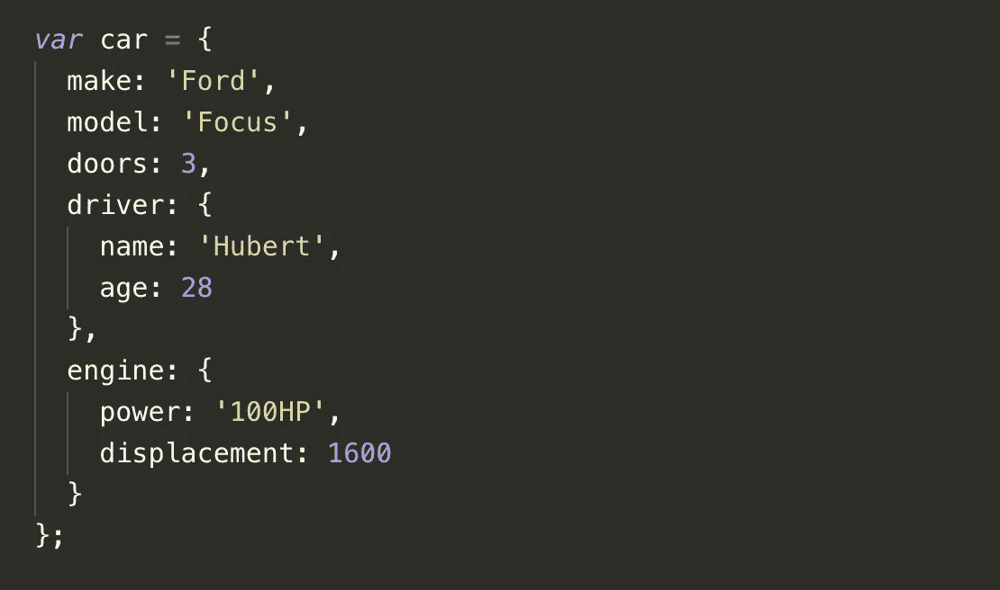

事实上，我有一辆这样的车。

好吧，我们已经有了一个很好的车门，一个司机和一些引擎。干净利落。现在，让我们编写一个函数来修改我们的汽车，并将其从紧凑型车更改为 5 门全尺寸版:

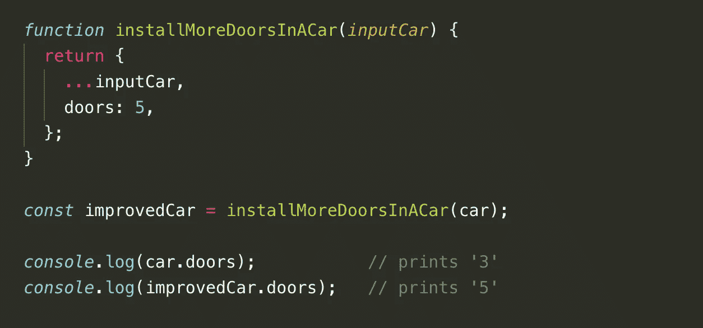

我们的新车(`improvedCar`)有 5 扇门，而老款(`car`)只剩下 3 扇门。当然，调用`car === improvedCar`会产生`false`。但是对比司机呢？

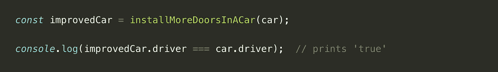

嗯，我们在控制台接收到了`true`。据说，整个`car`都被替换了——但是`driver`对象保持不变。这是为什么呢？ ***因为驱动对象不需要变异。*** 这是一件好事——想象一下我们应用程序中的某个实体正在观察`car.driver`对象，等待发生变化。在这种情况下不会发生这种情况——在比较引用后不会记录任何差异，因为不应该。毕竟，*驱动程序没有任何改动，保持不变。*

如果我们真的想改变任何嵌套字段，我们该怎么做呢？让我们编写一个函数来完成这项工作，但这次我们将尝试调整我们的引擎:

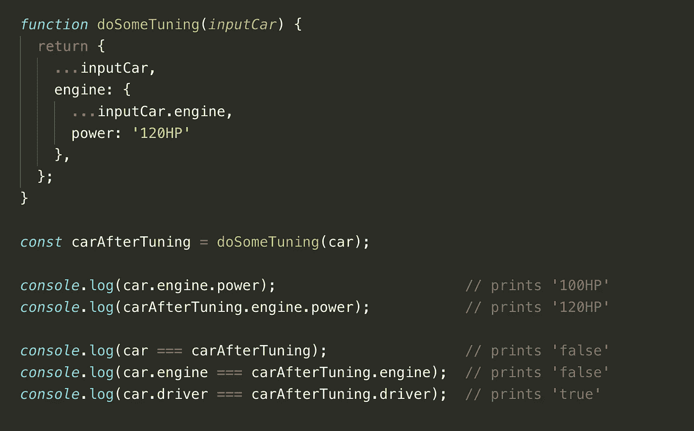

代码开始看起来有点混乱(但不像使用`Object.assign`时那么混乱！).循序渐进:

*   首先，我们将返回一个新对象，它将代表一辆全新的汽车。在下一行中，我们将在那里展开所有的旧车领域。
*   接下来，我们通过提供另一个新的(！)对象。同样，我们在那里传播旧汽车的引擎特性。
*   最后，我们更改所需的字段。

我们最终得到了**新车**，它拥有**新发动机**。

但是如果我们只是换一个引擎，为什么我们需要一个新的汽车对象呢？直截了当地说:因为我们还没有淘汰旧引擎，我们还需要一些车来支持它。

正如我们在控制台中看到的那样，汽车和引擎都不同于它们原来的对应物——一切都在适当的位置，并有适当的名称。就像在一些哲学流派中一样:静止最终导致内心的平静。

这是不可变编程的本质:代码是可预测的。另外，只要我们需要，数据就会自动保留。此外，我们只重新创建被改变的部分，所以内存不会被浪费(当然，它仍然需要深思熟虑的数据结构规划)。

反应式界面框架也利用了这一思想——它们只能观察深层嵌套对象的变化，因此如果“根”对象的另一个子部分被完全修改，它们不需要更新自己。通常，整个应用程序状态(每一段可显示的数据)是一个大的 JavaScript 对象，它被分成嵌套的结构。听说过 **redux** 吗？是的，它利用了这个想法。而且非常酷。

在那里我们可以回答我们的主要问题。

**为什么不变性的概念对初学前端开发的人如此重要？**

> 因为不可变对象教会我们以可预测的方式控制接口和数据流，同时有效地观察变化。

最后值得一提的是处理数组。原理是非常相似的— **如果我们想要改变数组中的任何条目，我们也应该重新创建整个数组。**如果我们想改变一个数组元素的对象，**我们应该重新创建数组和里面的对象。**考虑以下例子:

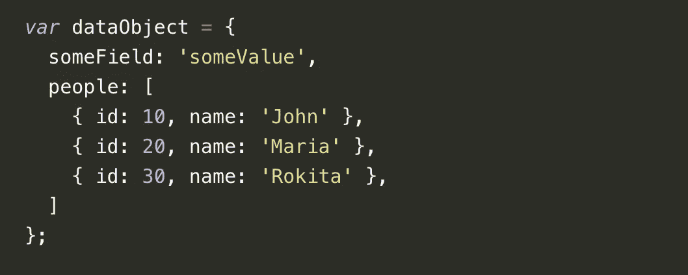

现在，假设我们需要纠正“数据库”中的错误，将 John 的名字改为 Andrew。根据不变性原则，我们应该重新创建`dataObject`、`dataObject.people`和`dataObject.people[0]`实体。让我们将它分成三个步骤，并使用以下代码来完成:

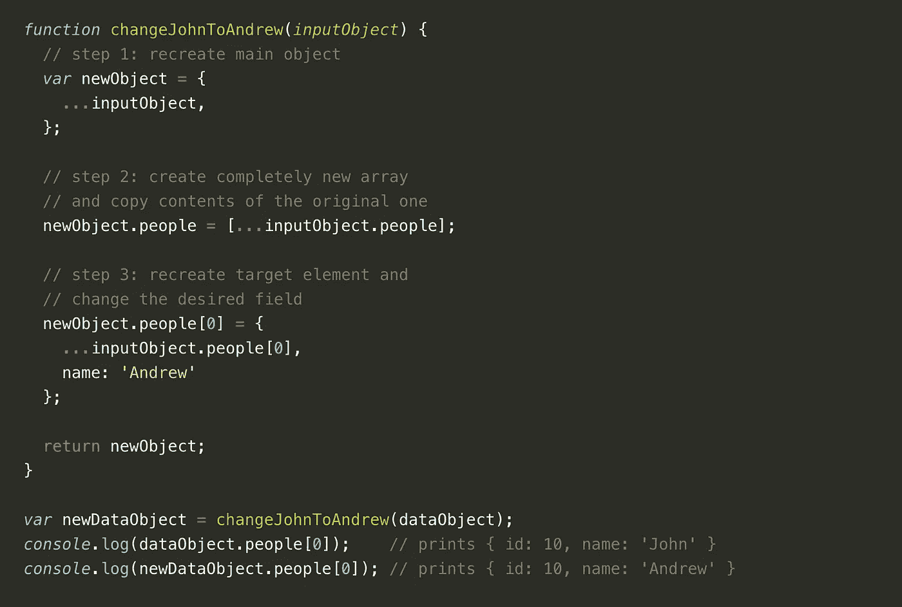

显然，这很有效。我们最终得到了两个对象:约翰的原始对象(`dataObject`)和安德鲁的新对象(`newDataObject`)。如果我们不使用旧对象，它将导致垃圾收集器清理它的内存。请注意，在这个场景中，包含两个剩余人物(`Maria`和`Rokita`)的对象保持不变，在第二步中被简单地复制——没有使用额外的内存。

所以，我们到了。您已经学习了 JavaScript 中不可变编程的基础知识，我们可以就此结束。真的。

叹气，好吧。既然圣诞节就要到了，让我们用额外的东西招待我们吧。

## 加分篇！

如果你想学习如何更快更干净地处理不可变对象，你可以试试`immer`——一个让你在尝试之后不会回头的库。这篇文章将向你介绍它的用法！

好了，我们刚刚到达真正的终点。那么，底线是什么？

在处理数据结构时，不可变方法无疑是一个强大的工具。但它是治疗一切的良方吗？**肯定不是。像往常一样，我强烈反对任何人盲目追随任何一种技术，并试图将它应用到任何地方。**

> 作为开发人员，您的第一个角色是了解各种工具，但第二个角色是知道何时何地应用它们。

有各种各样的问题，在这些问题中不可变的方法会带来麻烦——例如实时、CPU 关键的计算，在这些计算中杀手级性能的优先级高于代码可读性。但是由于我们在这里主要讨论的是前端开发，所以在很多情况下，代码可读性和可预测的开发更加重要。此外，在使用流行的 **react** 或 **redux** 开发应用程序时，你将被强烈鼓励以一种“不变的”方式思考。

如果您仍然感到饥饿，并且希望看到不可变数据结构的运行，请继续关注——很快我们将在一篇专门的文章中尝试创建我们自己的类似 react 的 UI 库。

为什么？因为我们可以。还有，好玩又有教育意义。

今天就到这里，感谢阅读和[保持联系](https://medium.com/@hubert.zub)！