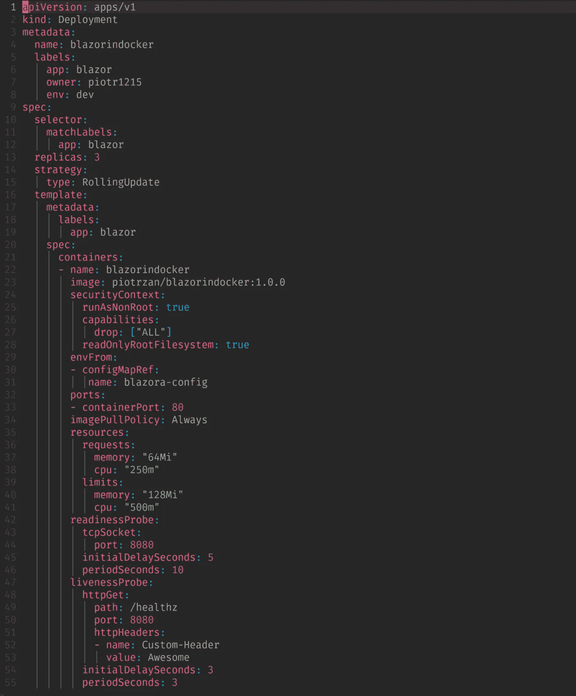
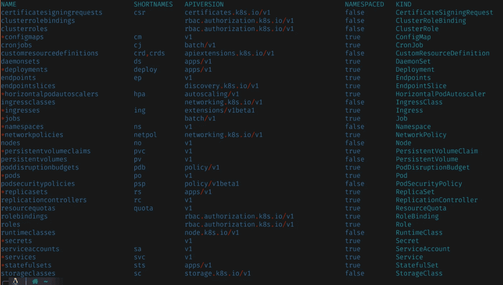
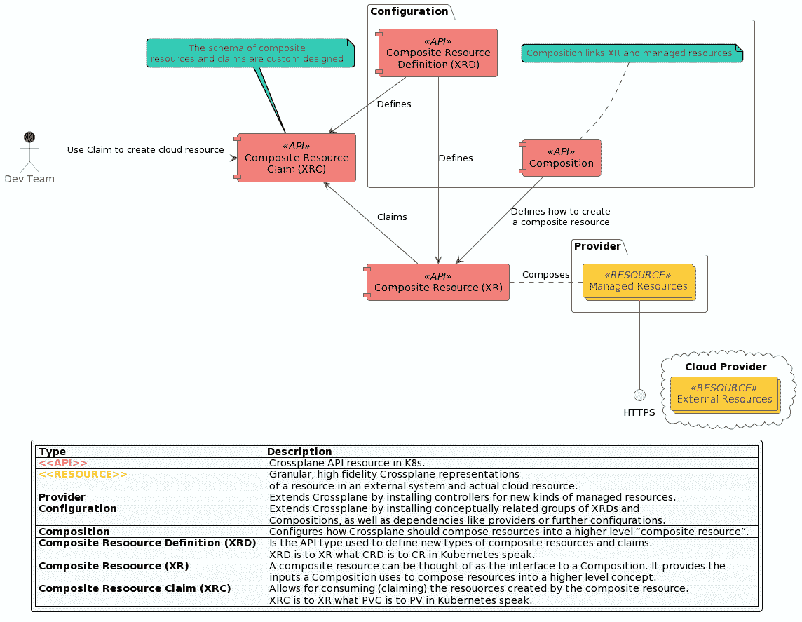

# 为什么开发者这么难找到 Kubernetes？

> 原文：<https://itnext.io/why-do-developers-find-kubernetes-hard-6532e8d6ce7f?source=collection_archive---------0----------------------->


[潘云波](https://unsplash.com/@panyunbo?utm_source=medium&utm_medium=referral)在 [Unsplash](https://unsplash.com?utm_source=medium&utm_medium=referral) 上拍照

## Crossplane Kubernetes 提供商如何提供帮助

这篇文章将对任何对现代复杂软件开发感兴趣的人有所帮助。

对于使用这个[自定步调的 Katacoda 场景](https://www.katacoda.com/decoder/scenarios/crossplane-k8s-provider)的实际演练，请查看这个附带的视频，其中有交叉平面基础知识和 Kubernetes 提供商的指导之旅。

有导游的 Katacoda 场景游览

## 现代发展挑战

开发者需要了解多少 Kubernetes？“左移”是否意味着主要焦点之外的工具和框架的不断扩展的课程；软件开发？

过去的体系结构依赖于开发、运营、安全和其他利益相关方之间的孤岛和复杂的移交流程。现代 DevOps 实践鼓励我们“左移”，拥抱“你建造它，你运行它”的心态。随着孤岛之间的边界变得模糊，移交点变得越来越自动化，开发人员需要学习和了解比以往更多的知识，以完全支持他们所负责的产品的整个生命周期。

开发团队变成了多学科的“小公司”,可以为非常小的项目工作，但是不能扩展到中等规模。我们如何协调开发者对他们创建的软件的完全所有权和其他问题，如操作、安全性和合规性仍然以标准化的方式得到适当解决？

答案是平台团队负责通过创建标准化和可重用的服务来支持开发人员，这些服务使每个人都能轻松地成功完成任务并满足不断增长的需求。这里的重点是平台团队以工具、API、产品和合同的形式提供的可重用服务。

让我们看看 Crossplane Kubernetes Provider 如何帮助开发人员使用足够的 Kubernetes 来完全控制他们的软件，同时建立公司标准。

# Kubernetes 简体

生产级 Kubernetes 资源通常是复杂的 YAML 块，具有与安全性、性能、硬件利用率、可观察性等相关的设置。

而且这只是一个部署资源，还有更多需要担心的。通常，在 Kubernetes 上运行的容器化应用程序需要

*   部署
*   服务
*   服务帐户
*   角色和集群角色
*   角色绑定
*   秘密
*   配置映射
*   网络策略
*   水平吊舱自动定标器

对于有状态的工作负载，这些通常只是无状态的工作流

*   卷
*   持续量索赔
*   存储类别配置
*   有状态集合

因为 Kubernetes 很少独立运行，所以您需要包含多个 CRD(自定义资源定义),这些 CRD 与服务网格、observability tech、安全扫描器等其他产品一起提供。

下面，您可以看到一个采用强化安全设置和其他最佳实践的部署示例。



源作者

这里是 Kubernetes 资源列表，通常用来描述工作负载。标有*的项目是开发人员通常必须与之交互的项目。



源作者

现在想象一下，这些资源将需要乘以应用程序/团队/环境的数量，并且每个都可能有轻微的变化，以说明团队治理、技术堆栈、变更速度等方面的差异。

通过利用 [Kubernetes 提供者](https://github.com/crossplane-contrib/provider-kubernetes)，可以控制正在创建的 Kubernetes 资源。它还为不熟悉 [Kubernetes 资源模型](https://github.com/Kubernetes/design-proposals-archive/blob/main/architecture/resource-management.md)的开发人员隐藏了复杂性。在附带的 Katacoda 场景和 Youtube 视频中，我们部署了一个 Kubernetes 应用程序，包括:

*   部署
*   服务
*   水平吊舱自动缩放器

我们将创建一个简单的组合，只包含重要的字段，比如:

*   要部署到的命名空间
*   带标签的图像

> *定义描述了用于创建复合资源的 API，而组合定义了当直接或通过专用声明创建复合资源时，将创建哪些受管资源。*

我们的组合和定义描述了我们想要创建什么 Kubernetes 对象，但是开发人员应该如何让我们知道应该创建什么？他们需要开吉拉票吗？😶

…不，他们只需要创建一个简单的声明，就像这样

```
apiVersion: acmeplatform.com/v1alpha1
kind: AppClaim
metadata:
  name: platform-demo
  labels:
    app-owner: piotrzan
spec:
  id: acmeplatform
  compositionSelector:
    matchLabels:
      type: frontend
  parameters:
    namespace: devops-team
    image: piotrzan/nginx-demo:green
```

通过应用该声明，我们“在引擎盖下”创建了多个 Kubernetes 资源，而不需要知道它们是什么以及它们是如何创建的。这个问题可以转移到平台团队。

有几个基于组合创建的资源。

我们可以很容易地更新图像，只需在 AppClaim 的参数部分更改图像名称。

删除应用程序和底层资源就像执行 kubectl 命令或设置 GitOps 并将 yaml 文件推送到 git repo 一样简单。

由于 Crossplane 的组成，这种简单性成为可能。

# 交叉平面

通过利用 Kubernetes 提供者，可以控制正在创建的 Kubernetes 资源。它还为不熟悉 Kubernetes 资源模型的开发人员隐藏了复杂性。在这个场景中，我们将部署一个 Kubernetes 应用程序，包括:

> *要了解更多关于 Crossplane 的概述，请查看这个* [*的简短介绍*](https://slides.com/decoder/crossplane) *和非常全面的* [*Crossplane 文档*](https://crossplane.io/docs/v1.6/) *以及我最近的博客，特别是* [*基础设施代码:下一个大转变就在这里*](/infrastructure-as-code-the-next-big-shift-is-here-9215f0bda7ce)

下图解释了交叉平面的组件及其关系。



是什么让 Crossplane 如此特别？首先，它建立在 Kubernetes 之上，并利用了这样一个事实，即 Kubernetes 的真正强大之处在于其强大的 API 模型和控制平面逻辑(控制循环)。它也从作为代码的基础设施转移到作为数据的基础设施。区别在于 IaC 意味着编写代码来描述供应应该如何发生，而 IaD 意味着编写纯数据文件(在 Kubernetes YAML 的情况下)并将它们提交给控制组件(在 Kubernetes 是操作员的情况下)来封装和执行供应逻辑。

关于 Crossplane 最好的部分是它无缝地支持应用程序团队和平台团队之间的协作，通过利用 [Kubernetes 控制](https://containerjournal.com/kubeconcnc/kubernetes-true-superpower-is-its-control-plane/)平面作为每个人相遇的汇聚点。

## 交叉平面 Kubernetes 提供商

Crossplane Kubernetes Provider 帮助我们向左转移，而不会让开发人员承担过多复杂的运营问题。我们的目标是帮助开发人员和应用程序团队专注于可靠和快速地交付特性和修复 bug 等。与此同时，还必须解决安全和操作方面的问题。这些关注点会因团队和项目的不同而不同。

DevOps 意味着降低开发人员和其他功能之间的摩擦。很明显，不同利益相关者之间的沟通是高效协作的关键。然而，很难捕捉到每个讨论的本质和所有的细微差别，并将其作为一种模式推广到其他团队。工具根本不在那里。这随着 Crossplane 及其提出的工作流和理念而改变。现在，可以捕捉每种场景的细微差别和复杂性，并提供一种解决方案，其中定制和标准部件得到很好的平衡，而不会陷入“最小公分母”的陷阱。

> *Crossplane 工作流程和理念帮助我们捕获和整理必要的定制，并随着时间的推移对其进行管理。现在，在开发人员和平台团队之间的会议之后，我们可以创建一个组合，以开发人员(声明)和平台团队(组合)之间的合同的形式将会议的决定进行编码，而不是发送电子邮件或会议记录。*

## 构图的力量

交叉平面的魔力发生在[构图](https://crossplane.io/docs/v1.6/reference/composition.html)中。合成执行 3 个主要任务

*   基于声明或组合资源组合一组托管资源
*   访问提供者 API 所需的引用凭据
*   从声明中提供的值修补/映射到托管资源中的值

下面您可以看到 composition 如何创建部署、服务和水平 pod autoscaler 来响应创建 AppClaim。组合和实际 Kubernetes 资源之间的“粘合剂”是组合资源定义(XRD ),您可以将其视为通过声明使用资源的开发人员和为底层资源或基础设施设计组合的平台工程师或 SRE 之间的一种 API。

这里有两个关键领域，使组成如此强大。

# 对于供应商

指定要创建的 Kubernetes 资源和设置。在这种情况下，我们可以看到组合是如何添加 livenessProbe 和 readinessProbe 以及可能由平台团队定义的资源限制的，因此不会向应用程序开发团队公开。

# 补丁

启用定义(XRD)中提供的字段和托管资源(MR)中的字段之间的映射。

> *blow YAMl 是缩写的，这些文件的复杂性可能很大。这是设计出来的，没有神奇的“去除复杂性”按钮。相反，Crossplane 提供了将复杂性转移到平台团队并为其他团队设计简单的定制 API 的工具。*

```
apiVersion: apiextensions.crossplane.io/v1
kind: Composition
...
spec:
  compositeTypeRef:
    apiVersion: acmeplatform.com/v1alpha1
    kind: App
...
  - name: deployment
    base:
      apiVersion: kubernetes.crossplane.io/v1alpha1
      kind: Object
      spec:
        forProvider:
          manifest:
            apiVersion: apps/v1
            kind: Deployment
            spec:
              template:
                spec:
                  containers:
                  - name: frontend
                    ports:
                    - containerPort: 80
                    livenessProbe:
                      httpGet:
                        path: /
                        port: 80
                    readinessProbe:
                      httpGet:
                        path: /
                        port: 80
                    resources:
                      limits:
                        cpu: 250m
                        memory: 256Mi
                      requests:
                        cpu: 125m
                        memory: 128Mi
    patches:
    - fromFieldPath: spec.id
      toFieldPath: metadata.name
      transforms:
        - type: string
          string:
            fmt: "%s-deployment"
...
  - name: service
    base:
      apiVersion: kubernetes.crossplane.io/v1alpha1
      kind: Object
      spec:
        forProvider:
          manifest:
            apiVersion: v1
            kind: Service
            spec:
              type: ClusterIP
              ports:
              - port: 80
                targetPort: 80
                protocol: TCP
                name: http
    patches:
    - fromFieldPath: spec.id
      toFieldPath: metadata.name
      transforms:
        - type: string
          string:
            fmt: "%s-service"
...
  - name: hpa
    base:
      apiVersion: kubernetes.crossplane.io/v1alpha1
      kind: Object
      spec:
        forProvider:
          manifest:
            apiVersion: autoscaling/v1
            kind: HorizontalPodAutoscaler
            spec:
              minReplicas: 2
              maxReplicas: 6
              scaleTargetRef:
                apiVersion: apps/v1
                kind: Deployment
              targetCPUUtilizationPercentage: 80
    patches:
    - fromFieldPath: spec.id
      toFieldPath: metadata.name
      transforms:
        - type: string
          string:
            fmt: "%s-ingress"
    readinessChecks:
      - type: None
```

## 关键要点

Crossplane 的强大之处在于能够组合包括相邻服务甚至应用程序在内的基础设施，并向消费者公开简单的接口，同时优雅地处理后台的复杂性。

*   可组合的基础设施
*   自助服务
*   自动化程度提高
*   标准化协作
*   通用语言(K8s API)
*   Kubernetes provider 可以成为 helm 更强大的替代产品

## 你自己试试

现在，您已经了解并体验了基本的交叉平面概念，请前往 [Upbound Cloud](https://www.upbound.io/) ，在那里您可以创建一个免费帐户并亲自体验云基础架构的配置！

## 额外资源

*   探索其他供应商，如[头盔供应商](https://github.com/crossplane-contrib/provider-helm)
*   浏览 [Upbound Registry](https://cloud.upbound.io/browse) ，在这里你可以发现并尝试新的提供商和高级作品
*   如果你熟悉 terraform，你会[交叉平面与 terra form](https://blog.crossplane.io/crossplane-vs-terraform/)Nic Cope 的比较非常有用
*   找出什么是真正的 Kubernetes 超级力量
*   看看为什么我相信 Crossplane 是 IaC 的下一个大转变

## 开放社区

围绕 Crossplane 的开源社区非常受欢迎和有帮助，所以如果你有任何关于 Crossplane 的问题，请加入 [slack channel](https://slack.crossplane.io/) 并说👋