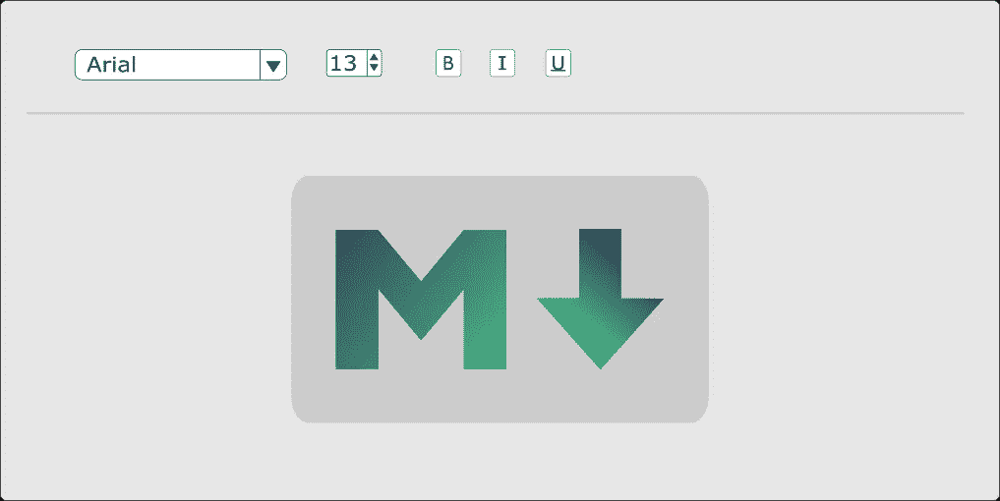
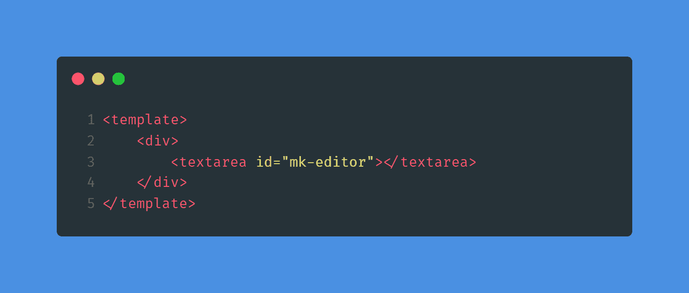
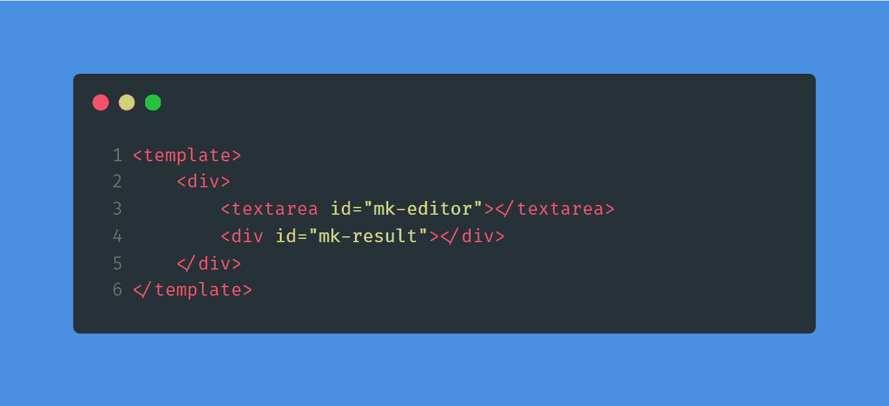
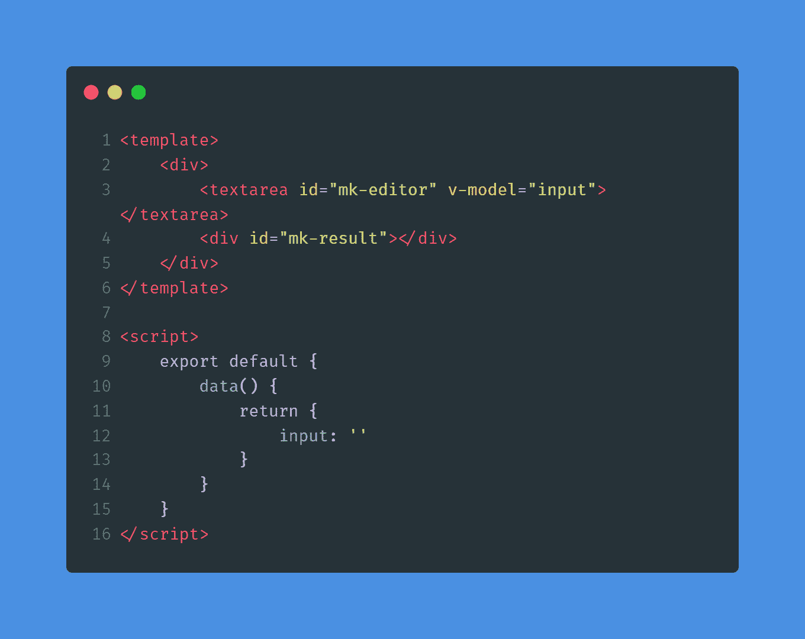
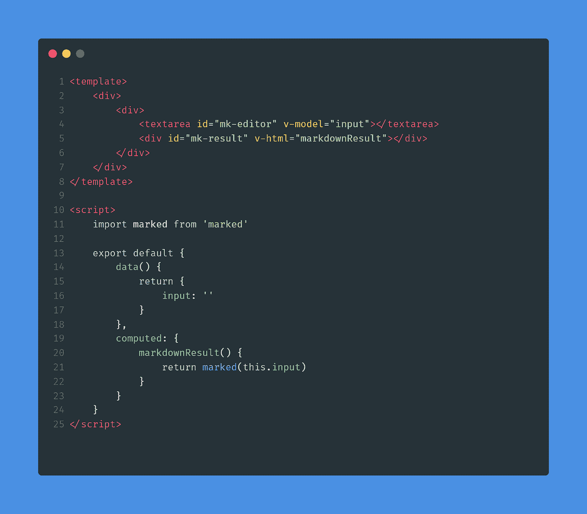
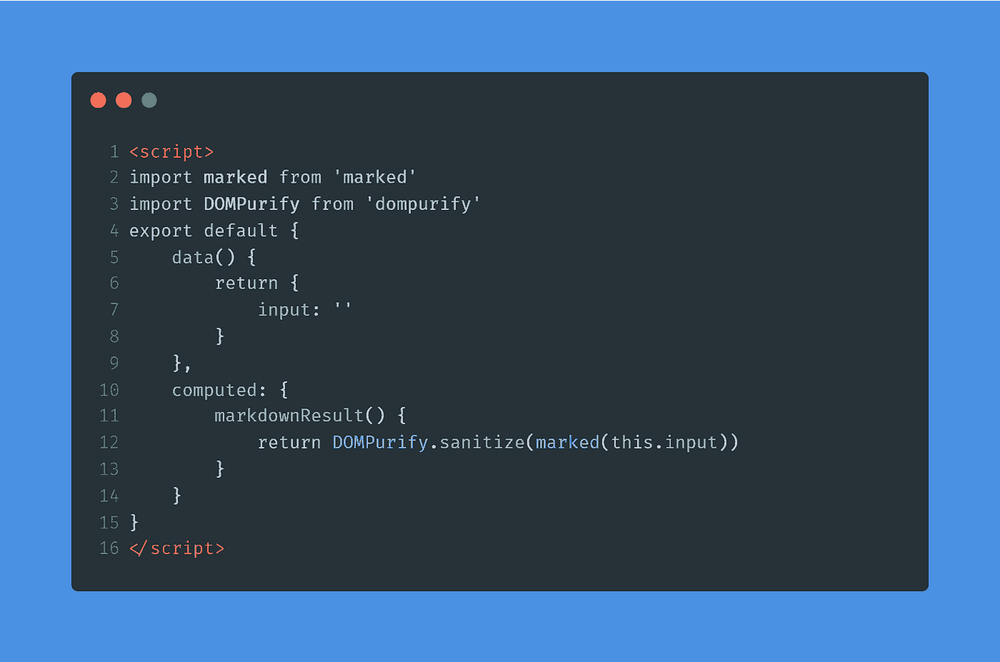
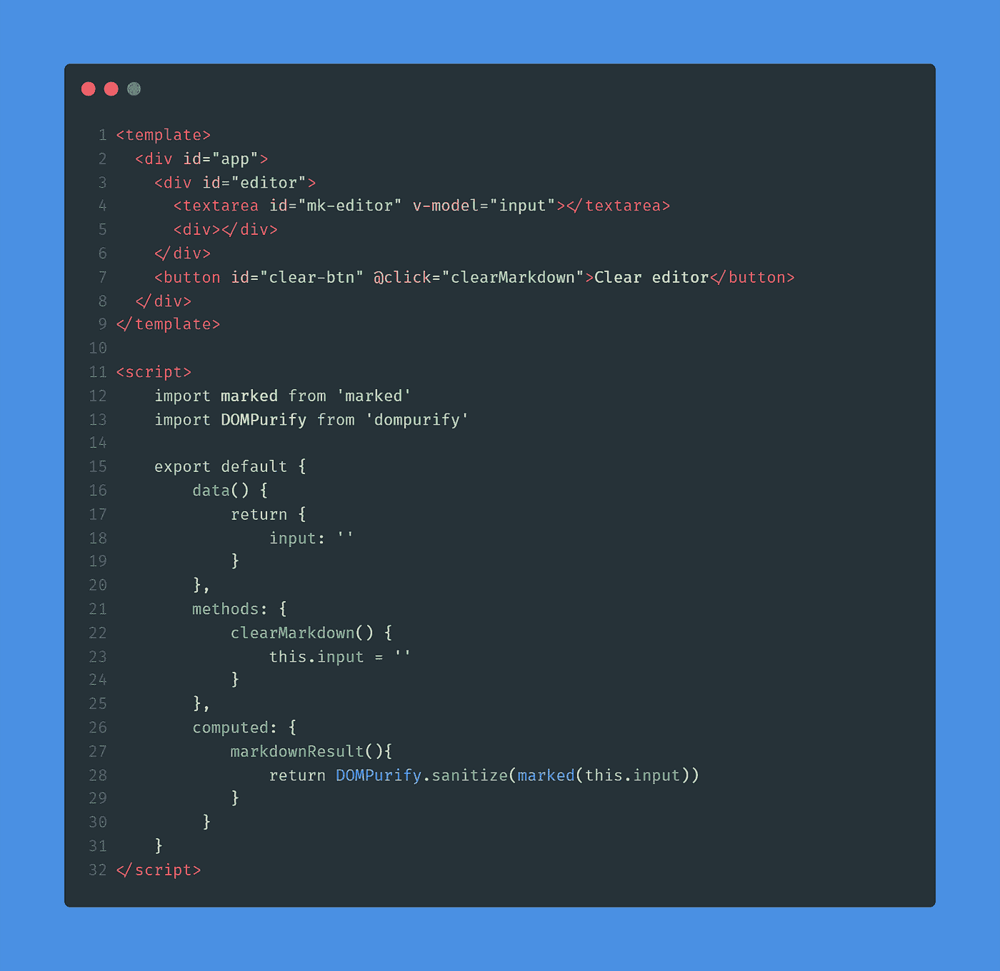
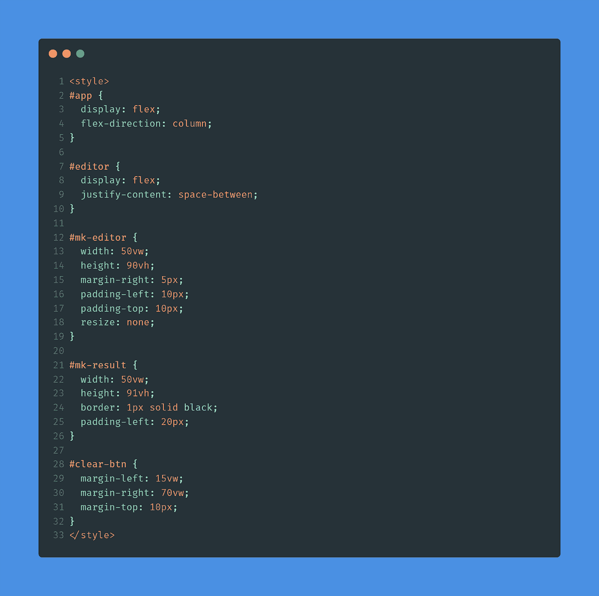

# 为什么 markdown 需要清理？以及如何在 Vue 中做到？

> 原文：<https://itnext.io/why-does-markdown-need-to-be-sanitized-and-how-to-do-it-in-vue-390d70cf9574?source=collection_archive---------5----------------------->

封面图像

Marked 使 markdown 易于使用，尤其是与 Vue 一起使用时。凭借快速的性能和易读的代码，Vue.js 是创建 markdown 编辑器的明智选择。

有了这么多可用的库，创建一个 markdown 编辑器并不困难。但是你会用合适的消毒剂来消毒吗？

下面介绍如何使用 Marked 和 DOMPurify 这样的杀毒软件，用 Vue 制作 markdown 编辑器。

# 为什么这里使用 DOMPurify？

通常，降价编辑器会有一个输入框供你输入一些降价信息。这个降价输入被解析成 HTML，然后显示出来。呈现这个解析的 HTML 可能会为跨站点脚本攻击敞开大门。

跨站点脚本(也称为 XSS)是 web 应用程序中常见的软件漏洞。这是一种攻击，涉及恶意脚本被注入受信任的网站并在不知情的情况下执行。

据[维基百科](https://en.wikipedia.org/wiki/Cross-site_scripting):

> *截至 2007 年，在网站上执行的跨站点脚本大约占* [*赛门铁克*](https://en.wikipedia.org/wiki/NortonLifeLock) *记录的所有安全漏洞的 84%。*

为了避免在输入区域输入这样的恶意脚本并影响我们的 markdown 编辑器应用程序，我们需要净化解析后的 HTML 以确保它可以安全呈现。这就是 DOMPurify 的用武之地。

DOMPurify 是一个用于 HTML、MathML 和 SVG 的 XSS 杀毒软件库。它是用 JavaScript 编写的，可以在所有现代浏览器中运行(Safari (10+)、Opera (15+)、Internet Explorer (10+)、Edge、Firefox 和 Chrome，以及几乎任何使用 Blink 或 WebKit 的浏览器)。它在 IE6 或其他传统浏览器上也不会崩溃。

在给 DOMPurify 解析过的 HTML 之后，它将返回一个带有干净 HTML 的字符串。在标记的文档中提到的消毒剂中，DOMPurify 是推荐的选择。

# 制作编辑器

我们的目标是制作一个简单的可运行的 markdown 编辑器。我已经把所有东西都放在了`App.vue`文件中，并且没有创建任何单独的组件。所以让我们开始吧。

我们的降价编辑需要一个输入:

接下来是一个显示降价的 div:

您可以设置文本区域的样式并使其变大，而不是每次都手动增加其尺寸，以便更容易查看正在键入的内容。我会在使用 Marked 和 DOMPurify 之后再做。

让我们在用 DOMPurify 净化之前将输入传递给 Marked。

# 解析降价输入

来自输入的值需要传递给 Marked。但是首先，我们需要来自 textarea 的值:

这将确保我们在文本区域中输入的任何内容都显示在`input`数据属性中。

现在，我们所要做的就是从一个计算属性返回解析后的 markdown 来显示它:

在这里，使用计算的属性，我们返回解析的 markdown(基本上是一个 HTML 字符串),并使用`v-html`指令在 div 中呈现它。

# 用 DOMPurify 消毒

尽管 DOMPurify 很强大，但我们不需要任何复杂的东西。要整理解析后的 HTML，导入库并使用`sanitize()`方法:

由于我们使用的是计算属性，每次`input`数据属性更新时，`markdownResult()`也会再次执行。我们将 markdown 输入传递给 Marked，后者将其解析为一个 HTML 字符串。然后这个字符串通过 DOMPurify 来确保 HTML 是干净的。

我们的降价编辑器有一个输入区。这里输入的 Markdown 被解析并呈现到它下面的 div 中。我们已经创建了一个简单的 markdown 编辑器。我们来设计一下。

# 样式编辑器

我还添加了一个按钮来清除编辑器中的所有内容:

我不会把它弄得太花哨。将编辑器和 div 分别放在页面的一端就可以了。

如果你不知道— `resize: none`会使文本区无法调整大小。

# 包扎

我们做了一个最小的，干净的 markdown 编辑器。在 DOMPurify 的帮助下，我们还确保了每一点 markdown 渲染都没有恶意脚本。尽管使用 DOMPurify 并不意味着您的 web 应用程序对于跨站点脚本攻击是完全安全的，但是这是一个开始。

进一步阅读的链接:

1.  [一篇关于跨站脚本攻击的文章](https://owasp.org/www-community/attacks/xss/)
2.  通过 JavaScript 注入 HTML 的危险以及如何安全地完成
3.  [维基百科页面](https://en.wikipedia.org/wiki/Cross-site_scripting)关于跨站点脚本
4.  DOMPurify [GitHub 仓库](https://github.com/cure53/DOMPurify)
5.  [官方文件](https://marked.js.org)为标注
6.  标记为[的 GitHub 库](https://github.com/markedjs/marked)

*原载于* [*我的博客*](https://niharraoteblog.netlify.app/vue-markdown-editor) *。*