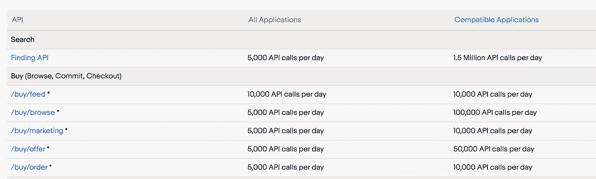
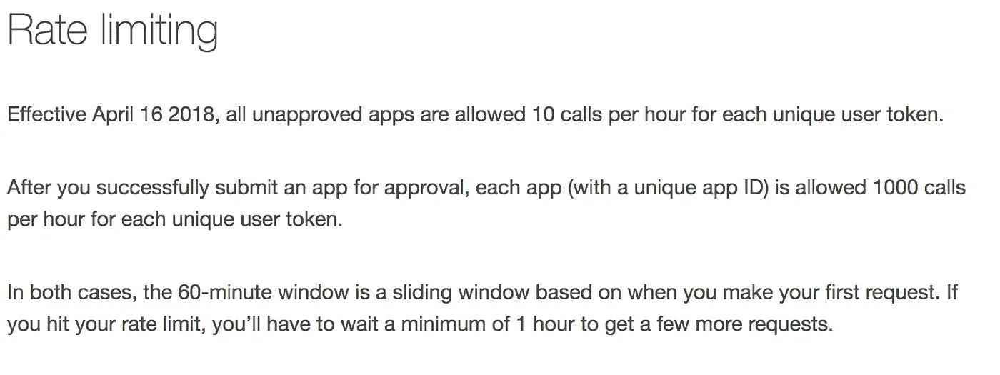

# 为什么每个 API 都需要一个时钟

> 原文：<https://itnext.io/why-every-api-needs-a-clock-84a12a910cb2?source=collection_archive---------6----------------------->


# 为什么每个 API 都需要一个时钟

当范·雅各布森在 1985 年无法上传文档时，他发现网络吞吐量已经停滞在每秒 1 比特。

“问题是我们启动时没有时钟。我们必须建造一个时钟"

时钟将有助于减缓启动过程。这就是[慢启动](https://en.wikipedia.org/wiki/TCP_congestion_control#Slow_start)和其他[拥塞控制算法](https://en.wikipedia.org/wiki/TCP_congestion_control)的由来。

TCP 位调节需要一个时钟。API 有什么不同吗？你的 API 也会变得拥挤吗？

# 好像又回到了 80 年代

当节点重试发送数据包时，它们会在网络上发送更多的位。重试堵塞了管道。解决方案是保护共享资源。在 API 经济中，API 是所有客户的共享资源。一个或几个演员会扼杀你的资源吗？

拥塞控制中的所有位和参与者都是平等的，但并非所有 API 及其调用者都是相同的。有许多属性(不仅仅是 TCP 拥有的位)可以使用。但是在高层次上，有业务需求、运行 API 的基础设施和 API 的调用者。

与 TCP 不同，速率限制的选择是由多种因素决定的，但是基本前提仍然保持不变——使用时钟来计数和限制对共享资源的访问。

慢启动和拥塞控制被编码在 TCP/IP 协议栈中，由每台想上网的计算机运行。但是你能对每个调用你的 API 的用户这么说吗？

今天，您的 API 被各种参与者调用。无论是最终用户、业务流程、脚本、自动化框架、事件机制、来自外部来源或其他来源的通知。你如何确保他们都是好公民，不会降低你的 API？

# API 速率限制—向 API 添加时钟

慢启动时钟用于计算通过网络发送的位数。

但是对于一个 API 来说，应该考虑哪些属性呢？在 L7，你的隐喻管道是什么？是具体的路径/路线吗？是特定的上游吗？

你算什么？你统计过请求的数量吗？或者来自特定位置的请求数量？或者指定给特定管道的请求数量？所有的请求都是平等的吗？当你拥堵的时候，要不要同样对待 GET 和 POST？

# 令牌桶—选择您的令牌并选择您的桶大小

简单的令牌桶算法可用于实现 API 的速率限制。我们将“你算什么”映射到一个令牌。可以从映射到用户的传入 HTTP 报头构建令牌，或者通过在 IP 上执行地理查找来使用位置以识别位置。或者，可以从请求的目的地构建令牌。L7 属性可用于混合和匹配来构建令牌。

桶可以是我们希望每秒、每分钟、每小时等计数的令牌数。使用这两个，我们可以为特定的路由或上游执行(token)/(bucket)。

# 路由通用网关中的速率限制

[途中](https://getenroute.io)提供了在路由级别执行[限速](https://getenroute.io/cookbook/getting-started-advanced-rate-limiting/)的粒度。您可以决定在路由级别向速率限制引擎发送什么令牌。例如，您可以向速率限制引擎发送传入连接的 IP 地址或特定报头，如身份验证报头。

一旦速率限制引擎接收到这些令牌，它可以直接使用这些令牌，也可以连接并构建一个新令牌。然后在这个新令牌的基础上使用 redis 执行计数。

时段粒度可以是秒、分钟或小时。

速率限制引擎的规则允许您指定如何构造令牌和定义存储桶。

# 例子

我们来看几个限速的例子，看看它是如何被记录的，以及它是如何映射到我们的系统的。我们将评估 Ebay 和 Pinterest 是如何实现的。

我们只将这些用例映射到发送到速率限制引擎的令牌。关于如何使用实际代码实现这一点的详细信息，可以在关于途中独立网关和途中 Kubernetes 入口网关的[速率限制的文章中找到。](https://getenroute.io/cookbook/getting-started-advanced-rate-limiting/)

这是 Ebay 为它的一些 API 所做的速率限制的子集。兼容的应用程序是那些已经注册了 Ebay 并拥有 API 密钥的应用程序



发送到速率限制引擎的令牌将是具有与用户相关联的唯一令牌的 HTTP 报头。如果令牌出现在查询字符串中，则可以提取令牌并发送给速率限制引擎。你也可以看看易贝的例子。

以下是 Pinterest 如何描述它对一些 API 的速率限制



这与上面的易贝非常相似。令牌可以是作为查询字符串传递的 HTTP 头或 API 键。易贝使用一天的时间段，而 pinterest 使用一个小时。你也可以看看 pinterest 的工作示例。

工作代码和示例可在关于[途中独立网关和途中 Kubernetes 入口网关的速率限制](https://getenroute.io/cookbook/getting-started-advanced-rate-limiting/)的文章中找到

# 速率限制是 API 的基础

我们认为速率限制是每个 API 都需要的。很多流行的 API 网关(Gloo，大使，孔)，收费的。我们认为限速是应该免费的基本功能。我们也计划最终开源它。

# 沿着你的交通路线在任何地方跑限速

途中通用网关提供了在网络路径的任何地方运行限速[网络功能的能力。通过将服务作为服务的旁站来运行，它可以用来保护服务。或者，对于采用 kubernetes 的组织，可以在 kubernetes 入口为集群内运行的微服务运行它。Enroute 的灵活性还允许在私有云或公共云环境中独立运行速率限制。一个统一的机制来配置所有这些使通用网关易于使用。](https://getenroute.io/blog/gateway-mesh/)

# 上述速率限制的路由通用网关配置

以下步骤涉及到重新创建现实世界的例子:

*   使用 lua 脚本从请求中提取用户令牌，将其作为标头值发送给速率限制引擎读取
*   添加路由操作，以便在请求与该路由匹配时将请求状态发送到速率限制引擎
*   添加速率限制引擎描述符来指定对用户的限制

第一步可以在更详细的文章中找到[这里](https://getenroute.io/cookbook/getting-started-advanced-rate-limiting/)我们展示了下面的限速引擎配置描述符

易趣

当速率限制过滤器与具有以下值的路由相关联时，它将报头`x-app-key`和`remote_address`发送到速率限制引擎。

```
{
    "descriptors": [
        {
            "request_headers": {
                "descriptor_key": "x-app-key",
                "header_name": "x-app-key"
            }
        },
        {
            "remote_address": "{}"
        }
    ]
}
```

速率限制引擎使用`x-app-key`和`remote_address`来构建令牌，进行计数并实施速率限制

```
{
    "descriptors": [
        {
            "descriptors": [
                {
                    "key": "remote_address",
                    "rate_limit": {
                        "requests_per_unit": 5000,
                        "unit": "second"
                    }
                }
            ],
            "key": "x-app-key",
            "value": "x-app-notfound"
        },
        {
            "descriptors": [
                {
                    "key": "remote_address",
                    "rate_limit": {
                        "requests_per_unit": 100000,
                        "unit": "second"
                    }
                }
            ],
            "key": "x-app-key"
        }
    ],
    "domain": "enroute"
}
```

拼趣

这种配置与上面的易贝示例相同。

当速率限制过滤器与具有以下值的路由相关联时，它将报头`x-app-key`和`remote_address`发送到速率限制引擎。

```
{
    "descriptors": [
        {
            "request_headers": {
                "descriptor_key": "x-app-key",
                "header_name": "x-app-key"
            }
        },
        {
            "remote_address": "{}"
        }
    ]
}
```

速率限制引擎使用`x-app-key`和`remote_address`来构建令牌，进行计数并实施速率限制。这也类似于易贝的例子，但有不同的限制。

```
{
    "descriptors": [
        {
            "descriptors": [
                {
                    "key": "remote_address",
                    "rate_limit": {
                        "requests_per_unit": 10,
                        "unit": "hour"
                    }
                }
            ],
            "key": "x-app-key",
            "value": "x-app-notfound"
        },
        {
            "descriptors": [
                {
                    "key": "remote_address",
                    "rate_limit": {
                        "requests_per_unit": 1000,
                        "unit": "hour"
                    }
                }
            ],
            "key": "x-app-key"
        }
    ],
    "domain": "enroute"
}
```

# 结论

我们展示了 API 速率限制对于今天的 API 是多么重要，以及如何在[途中通用网关](https://getenroute.io)上对它们进行编程。根据 API 运行的位置，可以使用独立网关或 Kubernetes Ingress API 网关。

高级速率限制可以在通用 API 网关上运行，没有任何限制或许可。速率限制是运行 API 的基础，在 community edition 中完全免费提供(而其他供应商对此收费)。

Enroute 为 API 提供了一个完整的速率限制解决方案，对速率限制的所有方面进行集中控制。凭借 Enroute 的灵活性，可以在任何环境中实现对 API 速率限制的需求，包括私有云、公共云、kubernetes 入口或网关网格。

如果您有任何反馈，您可以使用[联系人](https://yastack.io/contact2/?no-cache=1)表格联系我们。

*原载于 2020 年 4 月 27 日*[*https://geten route . io*](https://getenroute.io/blog/why-every-api-needs-a-clock/)*。*