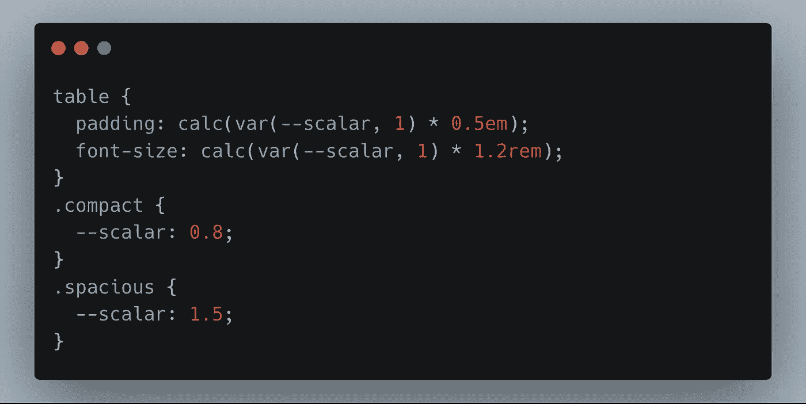
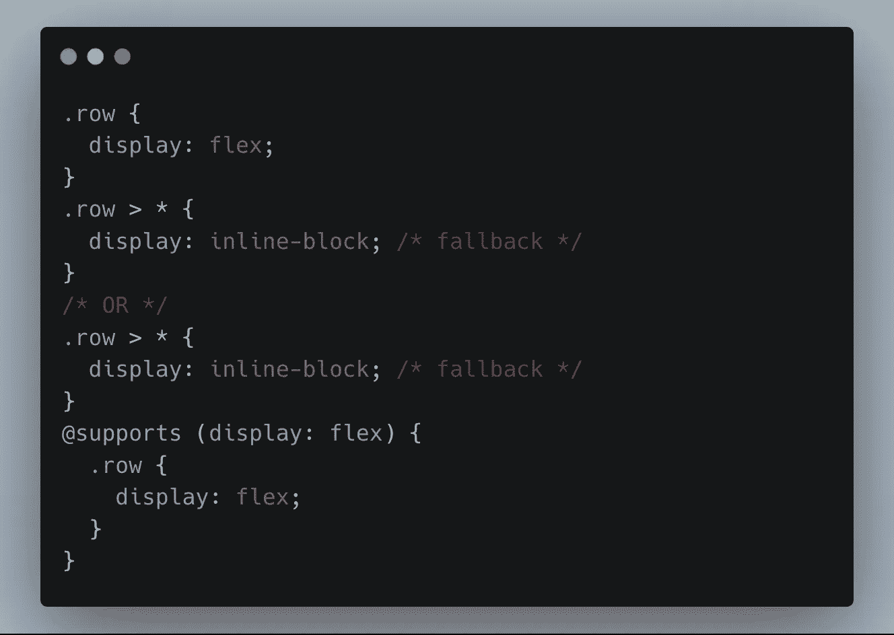
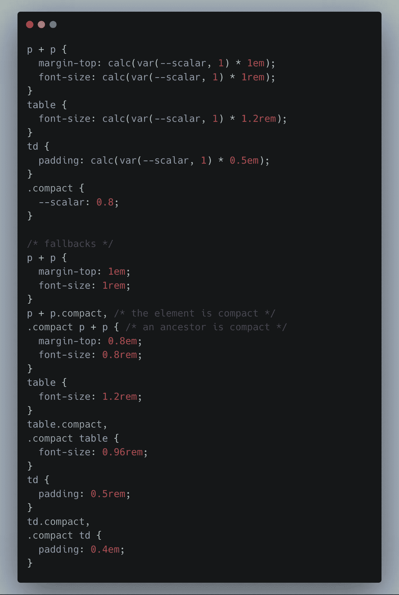

# 为什么我不使用 CSS 变量

> 原文：<https://itnext.io/why-i-dont-use-css-variables-e50a4b792c18?source=collection_archive---------3----------------------->

CSS 变量，官方称为自定义属性，很神奇。我**想**用他们，但是我不会。因为 IE11 不支持他们。而[它永远不会死](https://support.microsoft.com/en-us/help/17454/lifecycle-faq-internet-explorer)。

由于 Windows 10 是 Windows 的[最后一个版本，而 Internet Explorer 升级与操作系统版本捆绑在一起，IE11 在时间上被冻结，每个用户也随之被冻结。如果你，作为一个 web 开发人员，想要接触到大量停留在 IE11 上的用户，你也会被冻僵。](https://www.theverge.com/2015/5/7/8568473/windows-10-last-version-of-windows)

说到使用新 CSS，有两种策略:**渐进增强**，和**优雅退化**。渐进增强是为了“最好拥有”的特性，那些即使不工作也不会破坏任何东西的特性。如果你曾经不得不支持 IE8，那么`box-shadow`就是一个熟悉的例子。你在 IE8 上的网站版本不会有任何方框阴影，但这没关系。该网站仍然可以使用。

对于更基本的功能，如 flexbox 或网格布局，适度降级是可以使用的策略。为此，您需要编写回退样式。这可以通过两次写入相同的属性(第一次用较旧的值，然后用较新的、不太受支持的值)来完成，或者通过使用`@supports` 查询来完成。

> 与您希望测试的一些 CSS 特性相比，`@supports`查询受到的支持[更少，所以要小心您将它用于哪些属性。IE 也不支持`*@supports*` *。*](https://caniuse.com/#search=%40supports)

当使用适度降级策略时，您最终会编写和发布更多的代码:传统的支持良好的代码，以及更新的支持较差的代码。对于许多特性，比如网格或 flex 布局，我觉得这种膨胀是可以接受的。它只存在于几个选择器中，很容易通过关键字搜索找到需要回填的属性。

但是回填 CSS 变量就没那么容易了。

困难来自于它的力量。一个简单的`.compact { --scalar: 0.8; }`声明可以影响整个树中源于带有`compact`类的节点的许多属性。您的退路可以包括编写多个选择器，包括限定的选择器(以元素类型为前缀的类选择器)。考虑下面的例子:

CSS 变量最有用的一个方面是，web 开发人员不需要不停地重写、计算和硬编码值作为幻数和幻色。通过变量集中配置值是 SASS 脱颖而出的原因之一。如果我们必须为 CSS 变量的每个实例编写硬编码值的回退，这个好处就完全没有了。

一旦所有的后备都写好了，用 CSS 变量写的精彩简洁的代码就一文不值了。它不会给应用程序增加任何东西，因为它的工作完全是由后备来完成的。它不会逐渐增强任何东西。在这一点上，它变成了无用的重物。

在我从事的项目不再需要支持 Internet Explorer(任何版本)之前，我不能使用 CSS 变量。

**轻声啜泣**