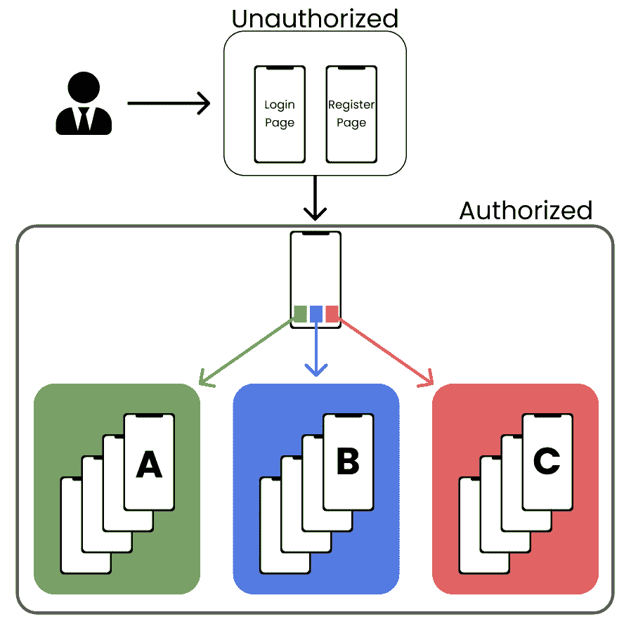
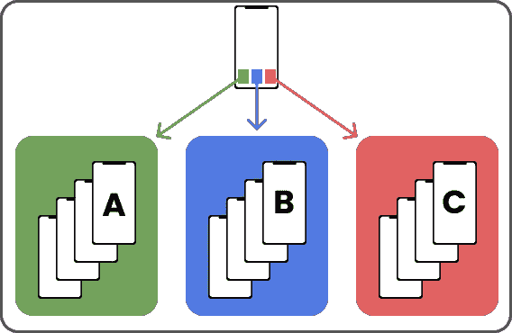
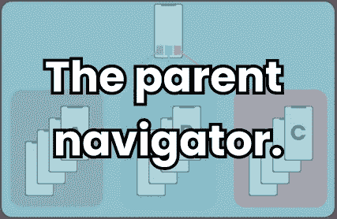
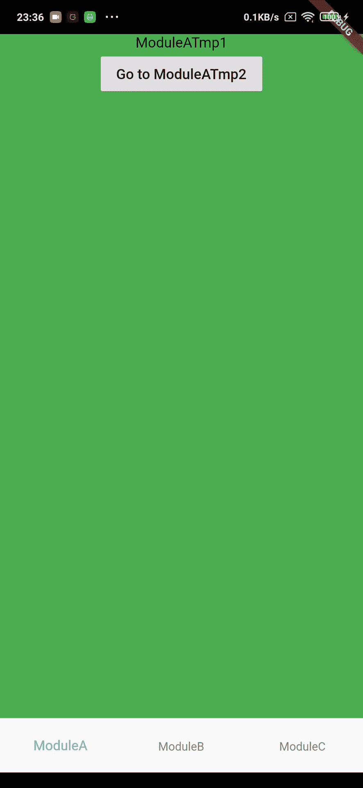

# 为什么我没有在 Flutter 中使用 Navigator 2.0 这是我的模式

> 原文：<https://itnext.io/why-i-m-not-using-navigator-2-0-in-flutter-my-pattern-6a88a8625f6c?source=collection_archive---------2----------------------->


> 在本文中，我将讨论 Navigator 1.X。如果您对 Navigator 2.0 感兴趣，请查找其他文章。

嗨，我是卢克，我是一名软件开发人员。

我最大的颤振项目开始于 2020 年 3 月。回想起来，这是一段不平凡的旅程！从一开始我就担心两件事:

*   如何处理导航
*   依赖注入。在这种情况下，最好的解决方案是什么？

第二个问题用 **get_it** 包很快就解决了，我一直用到了今天，我没有抱怨。我明智地使用它，对应该注射什么有非常严格的政策。

但是第一个…

让我告诉你。这不是一件容易的事。请记住，早在 2020 年初，还没有导航 2.0。

我知道导航肯定是应用程序中最受关注的部分。我花了几天时间挠头，这就是我想出来的。

> 我计划在去年发布这篇文章，但是我的计划被 Flutter Navigator 2.0 的发布打断了。我想:“嗯……现在，没有人会对一个人如何操作他的导航感兴趣。我们有领航员 2.0！”。这个想法在一个 Twitter 帖子中又回来了，因此这个话题重生了。想到我将第一次写一些社区需要的东西，我感觉棒极了。

## 我需要从我的导航中得到什么？

在我看来，每个应用程序需要从导航中得到什么是一个更好的问题。好吧。我们来分解一下基本的 app 流程。



这个非常简化的用户流程。

因此用户可以处于两种状态:**未授权**和**授权。**未经授权，他可以登录、注册、查看隐私政策等。

成功授权后，他会看到一个标准的底部导航栏。在这个可视化表示中，我们有模块 **A** 、 **B** 和 **C** 。

这里的挑战如下:

1.  每个模块都必须有自己导航栈，
2.  您可以在模块之间导航并传递数据。例如:从模块 **A** 中的任意屏幕到模块**b**中的任意屏幕
3.  从模块 **A** 、 **B** 和 **C** 中，您可以导航至登录页面。

看似简单，但并不明显。至少对我来说不是。

Flutter 开箱即用，为我们提供了 *MaterialApp* ，我们可以在其中传递 *route* 参数，它看起来像

我们有一些主页小部件，大概就是上面提到的底部导航栏。每个模块都有几个屏幕，但是在这个设置中，我们只有一个导航栈。(以上要旨只是举例)。

我们没有我们需要的东西。让我们来看看我的解决方案😉

## 模块



对我来说，模块基本上就是屏幕的集合。当我单击底部导航栏中的图标时，我希望看到相应的收藏。

坐下来写一个符合这个描述的类，最后我写了这个。

Out 模块可以有 **initialRoute、**name、**T3、 **routes 的集合。**我的实现还包含一个在导航栏中可见的图标，但这不是必需的。**

这是我们的基类。普罗佩尔模块扩展了我们的基类，看起来像这样:

现在，我们需要一个定制的 navigator 小部件来显示模块的路线集合。我们需要:

## **自定义导航器**

基本上，我们使用了 Flutter 内置的导航部件，并编写了一些逻辑来使其工作:

*   **_onGenerateRoute** :该方法只查找符合从**routes settings 传递的名称的 **WidgetBuilder** 。**
*   这个是偷偷摸摸的…我花了这么多时间让这个定制导航器里的英雄部件工作，这就是我所做的全部。你已经有了😉

还必须提及**导航键**和**观察者。**

> 辅助导航键是让所有这些诡计成功的主要部件。

观察者。如果您想使用 Firebase Analytics 或任何其他自定义导航观察器，您可以将它们作为列表整齐地添加到模块类中。非常方便👌

完事了吗？差不多了。

我们可以创建一个带有底部导航栏的脚手架，然后就到此为止。但它只能满足两个要求:

> 1.每个模块都必须有自己的导航栈，
> 
> 2.从模块 **A** 、 **B** 和 **C** 中，您可以导航至登录页面。

尽管最具挑战性的是:

> 您可以在模块之间导航并传递数据。例如:从模块 **A** 中的任意屏幕到模块**b**中的任意屏幕

我在这方面放弃了几次，但在研究关于国家管理的纷飞材料时，我听到:

> 提升国家地位

只是太多次了😂所以我想到了将一切联系在一起的小部件。包含每个模块的导航键，每个孩子都可以访问。如果我在“您最喜欢的”图表中指向它，它会在这里(用去饱和的青色背景标记):



## **模块导航器**

为了创建这个父导航器，现在称为 **ModuleNavigator，**我们需要编写一个 InheritedWidget，为我们的每个模块生成一个导航键，然后使用我们之前编写的 **CustomNavigator 构建所有内容。**

首先，我想这样声明:

我在实现上做得有点过火，但它完成了我的应用程序中需要的一切。请仔细阅读，并根据您的需要调整图案😉

这里发生了什么:

在 initState 方法之外，生成导航键。

```
_navigationKeys = List<GlobalKey<NavigatorState>>.generate(widget.modules.length,
      (i) => GlobalKey<NavigatorState>(),
    );
```

然后，我们构建模块小部件，在其中传递生成的导航器键。

现在我们把一切都结合在一起了！我们使用 IndexedStack 来显示我们想要的模块。这给了我们不破坏每个模块状态和导航栈的能力。

这里我还自动生成了 **BottomNavigationBarItem** ，它带有我在模块类中定义的图标。

这个带有 onWillPop 方法的 WillPopScope 小部件可以防止应用程序意外关闭。致电:

```
_navigationKeys[_currentModule].currentState.maybePop();
```

我们覆盖它的行为，并将其重定向到当前模块。

最后，我们如何从其他模块中导航到不同的模块？

现在很简单了。我们的 ModuleNavigator 是一个 InheritedWidget。

我们可以给它添加一个方法:

我们正在设置当前模块

```
setState(() {    
    _currentModule = module;    
});
```

并通过调用以下命令导航到当前选择的模块的路线:

```
_navigationKeys[module].currentState.pushNamedAndRemoveUntil(routeName, (route) {      return route.settings.name == routeName ? false : true;    }, arguments: arguments);
```

我使用**pushnamedremoveuntil**，因为我们不想两次导航到同一个屏幕。这就是为什么我们要将它从 _currentModule 导航堆栈中删除，并推出新路线。

## 完成了！



如果你正在阅读这篇文章，你真的对颤振导航感兴趣。或者，也许你正在寻找[这个 github 回购与工作的例子](https://github.com/lukeurban/flutter_navigator)😉

这是我个人在 Flutter 中导航的方法。它检查了我所有需要的框，我觉得没有什么不好的方法来处理你的导航。我也想知道这种方法是否会成为一个好的颤振包。如果你认为可以，请告诉我！

如果你喜欢我的模式，请给我写一封邮件，这样我就可以看看它是否对你有价值！这对我意义重大！

再次感谢阅读！如果您有任何问题，请在 [Twitter](https://twitter.com/ThatLukeUrban) 或 [Instagram](https://www.instagram.com/thatlukeurban/) 上问我。你可以跟着我去那里，也可以跟着我去这里！

*让代码与你同在！*

卢克(男子名)

我关于颤振的其他文章:

*   [Flutter 不再是一个跨平台的框架，它不仅仅是一个平台。](/flutter-is-no-longer-a-cross-platform-framework-b53c87b14c39)
*   [doyouevenfutter？[EP.1]滚动到列表中的元素](https://blog.usejournal.com/doyouevenflutter-ep-1-b6f05c90b506)
*   [doyouevenfutter？[EP.2] API 枚举映射](https://luke-urban.medium.com/doyouevenflutter-ep-2-api-enum-mapping-888d2e72902c)
*   [doyouevenfutter[EP . 3]创建自定义图标字体](https://luke-urban.medium.com/doyouevenflutter-ep-3-creating-custom-icon-font-d892c4a2f21c)
*   [doyouevenfutter[EP . 4]在 2021 年用这个 Flutter VSCode 设置提高你的编码效率](https://luke-urban.medium.com/doyouevenflutter-ep-4-boost-your-coding-productivity-with-this-flutter-vscode-setup-in-2021-60637f05a5c2)