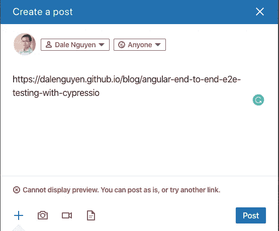
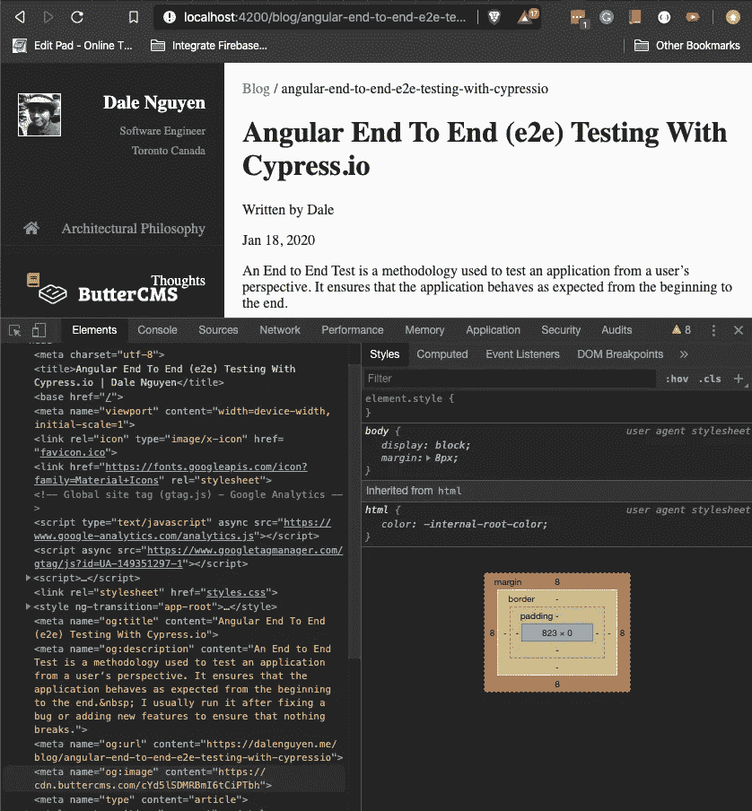
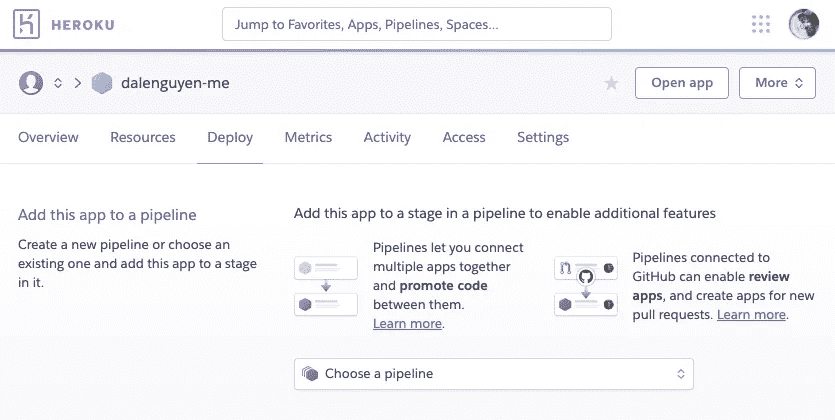
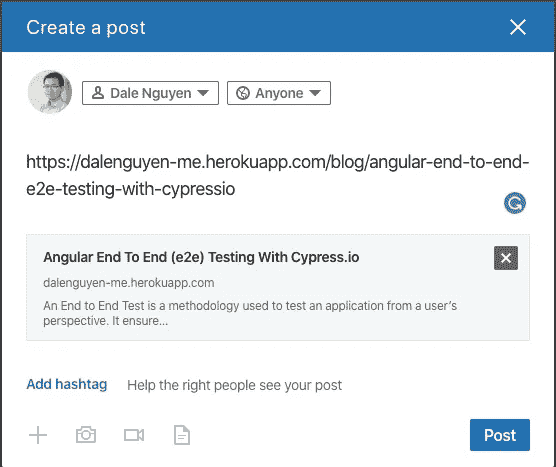

# 为什么我把我的网站从 Github 页面转移到 Heroku——这是有代价的

> 原文：<https://itnext.io/why-i-moved-my-website-from-github-pages-to-heroku-with-a-cost-afdbf8f6f2cb?source=collection_archive---------4----------------------->



# 问题是

你可能知道也可能不知道，我用 Angular 框架把[我的个人网站建成了一个单页面应用程序(SPA)](http://dalenguyen.me/blog/create-your-website-for-free-with-github-pages-angular) ，托管在 Github 页面上。一切都很好，直到我在个人网站上集成了博客功能。搜索引擎优化(SEO)和社交媒体预览变得越来越糟糕。

我的帖子无法被索引或预览，因为 Html 上除了***<app-root></app-root>***标签之外什么都没有。内容和元标签还没有准备好。

# 解决方案

服务器端渲染(SSR)来拯救。它是这样工作的:

1.  客户端向服务器发送请求
2.  服务器动态生成 HTML
3.  客户端获得一个带有 meta 标签和内容的静态 HTML 页面

问题是我需要一个服务器来处理 Github 页面目前无法支持的请求。所以我必须找到另一个供应商。像 Firebase，Heroku，OpenShift Online，Digital Ocean 这样的 Nodejs 主机选择很少

目前 Heroku 对我来说是个不错的选择。

# 成本

*   我的应用程序将在 30 分钟不活动后进入睡眠状态。
*   我只有 1000 小时/月免费(验证帐户)
*   我没有 SSL，除非每月支付 7 美元(爱好包)

# 实施

*注意:如果你正在使用纱线，你应该切换到 npm。*

对于 Angular，有一个支持 SSR 的包名为 [Angular Universal](https://angular.io/guide/universal) 。

```
ng add @nguniversal/express-engine --clientProject your-project-name
```

为了更新 SEO 元标签，我使用了@angular/platform-browser 的元和标题服务。你可以从 [my Github](https://github.com/dalenguyen/dalenguyen.github.io/blob/dev/src/app/blog/post/post.component.ts) 查看实现。



在您让它工作之后，是时候部署到 Heroku 平台了。

# 创建新的 Heroku 应用程序



# 登录 Heroku

```
╰─ heroku loginheroku: Press any key to open up the browser to login or q to exit:Opening browser to https://cli-auth.heroku.com/...Logging in... doneLogged in as xxx@dalenguyen.me
```

# 将项目添加到 Heroku

```
╰─ heroku git:remote -a dalenguyen-meset git remote heroku to [https://git.heroku.com/dalenguyen-me.git](https://git.heroku.com/dalenguyen-me.git)
```

我把项目从 dev 推到 Heroku。因为我的主分支是针对 Github 页面的。

```
╰─ git push heroku dev:masterEnumerating objects: 704, done.Counting objects: 100% (704/704), done.Delta compression using up to 8 threadsCompressing objects: 100% (550/550), done.…
```

# 检查 Heroku 应用程序上的搜索引擎优化标签



# 参考文献

以下是检查网站搜索引擎优化标签的链接:

[https://developers.facebook.com/tools/debug/sharing/](https://developers.facebook.com/tools/debug/sharing/)

[https://www.linkedin.com/post-inspector/inspect/](https://www.linkedin.com/post-inspector/inspect/)