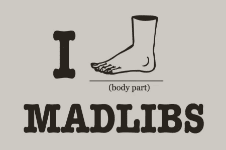

# 为什么我要从小胡子/车把转向 ES6 模板文字

> 原文：<https://itnext.io/why-i-moved-to-es6-template-strings-from-mustache-handlebars-573f6f2c713b?source=collection_archive---------2----------------------->

## JavaScript 有新的更好的特性，这使得一些库变得多余


在 [Unsplash](https://unsplash.com?utm_source=medium&utm_medium=referral) 上 [Stas Ovsky](https://unsplash.com/@technobulka?utm_source=medium&utm_medium=referral) 拍摄的照片

> “在软件可以重用之前，它首先必须是可用的。”——[拉尔夫·约翰逊](https://en.wikipedia.org/wiki/Ralph_Johnson_(computer_scientist))(计算机科学家)

你知道游戏 [Mad Libs](http://www.madlibs.com/history/) 吗？疯狂图书馆网页上的关键词和短语都被删掉了。玩家用名词、形容词或身体部位等指令填空。模板引擎，像[手柄](https://handlebarsjs.com/)和[小胡子](https://mustache.github.io/)，使用代码来填充空白，很像 Mad Libs 所做的。



艾琳·史蒂文森·奥康纳

给定数据:

```
{
  greeting: 'Hello',
  name: 'Josh'
}
```

使用小胡子/车把模板:

```
<p>**{{**greeting**}}** **{{**name**}}**</p>
```

输出将是:

```
<p>Hello Josh</p>
```

模板引擎为我们填补了空白。在这种情况下，空白的就是写在花括号`{{ }}`之间的内容。当模板要求`{{greeting}}`时，就像疯狂的 Libs 要求(问候)。

两个模板引擎都以相似的方式处理向页面添加模板。

**车把:**

```
var data = { greeting: 'Hello', name: 'Josh' };
var template = '<p>{{greeting}} {{name}}</p>';var compileTemplate = Handlebars.compile(template);
var output = compileTemplate(data);
element.innerHTML = output;// output = <p>Hello Josh</p>
```

**小胡子:**

```
var data = { greeting: 'Hello', name: 'Josh' };
var template = '<p>{{greeting}} {{name}}</p>';

var output = Mustache.render(template, data);
element.innerHTML = output;// output = <p>Hello Josh</p>
```

模板通常存储在页面上的一个`<script>`标签中，并在编译时被代码引用。

```
<script id="scriptTemplate">
  <p>{{greeting}} {{name}}</p>
</script>...var template = document.getElementById('scriptTemplate');
var compileTemplate = Handlebars.compile(template);
```

添加`<script>`标签作为模板会使 [DOM](https://developer.mozilla.org/en-US/docs/Web/API/Document_Object_Model/Introduction) 变得混乱。一个页面可以有多个模板，但不能全部使用。


照片由[斯蒂夫·约翰森](https://unsplash.com/@steve_j?utm_source=medium&utm_medium=referral)在 [Unsplash](https://unsplash.com?utm_source=medium&utm_medium=referral) 上拍摄

有了 ES6(如果你喜欢也可以是 ES2015)，我们可以用[模板文字](https://developer.mozilla.org/en-US/docs/Web/JavaScript/Reference/Template_literals)创建模板字符串。模板文字是字符串，我们可以在其中注入变量和函数。它们允许我们不用加号`+`来连接字符串和变量。这些字符串使用反勾```代替单引号或双引号。

**变量串联:**

```
var name = "Josh";
var string = "Hello " **+ name**;// output = <p>Hello Josh</p>
```

**带变量的模板文字:**

```
let name = "Josh";
let string = `Hello **${name}**`;// output = <p>Hello Josh</p>
```

这里的区别是在变量名周围使用了美元符号和花括号`${}`，没有加号`${variableName}`。这使得字符串和变量一起使用更具可读性。

**行串联:**

```
var string = "The quick brown fox " +
             "jumps over " +
             "the lazy dog";
```

**模板文字行:**

```
let string = `The quick brown fox
              jumps over
              the lazy dog`;
```

现在我们开始看到模板字面量看起来很像模板引擎。让我们看看那会是什么样子:

```
let data = { greeting: 'Hello', name: 'Josh' };
let template = `<p>${data.greeting} {data.name}</p>`;
element.innerHTML = template;// output = <p>Hello Josh</p>
```

模板文字将对象数据添加到字符串中供我们使用。我们可以使用变量和对象来通知字符串中的数据。花括号之间的所有内容都被求值，从数字到条件到函数。

**数学:**

```
let number = `${2 * 5}`;// output = 10
```

**三元条件:**

```
let time = 'night';
let string = `Good ${time === 'night' ? 'evening' : 'day'}, Josh`;// output = Good evening, Josh
```

把这些放在一起，我们可以构建函数来处理重复的内容，比如数组。

**功能**:

迅速升级

所有现代浏览器都非常支持模板文字。在 IE 10 & 11 的情况下，我们将不得不使用 JavaScript 预处理器，如[巴贝尔](https://babeljs.io/)。巴别塔很容易在您的项目中建立使用 NPM 脚本。巴别塔的教程在他们的网站和其他地方。我已经成功地为用 ES6 编写的文件创建了一个文件夹，并为生成的文件创建了另一个文件夹。一个简单的 NPM 脚本可以是:`"build": babel ./src -d ./dist"`其中“src”是源文件夹，“dist”是生成的文件夹。

更新的原生 JavaScript 支持消除了对库的依赖，这意味着页面上加载的脚本少了一个。如果您准备在项目中使用 ES6，合并模板文字是很容易的。

如果你正在使用模板文字，以及你可能发现的任何成功或陷阱，请在下面告诉我。

Joshua Studley 是 Kelley Blue Book 的高级 UI 工程师，拥有 15 年以上的工作经验。他曾与医疗软件和汽车媒体领域的领先互动公司合作。Josh 还在 UCI 编码训练营教授全栈 web 开发。不建网站的时候，他就在建网站。说真的。