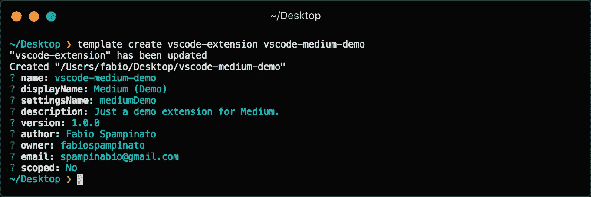
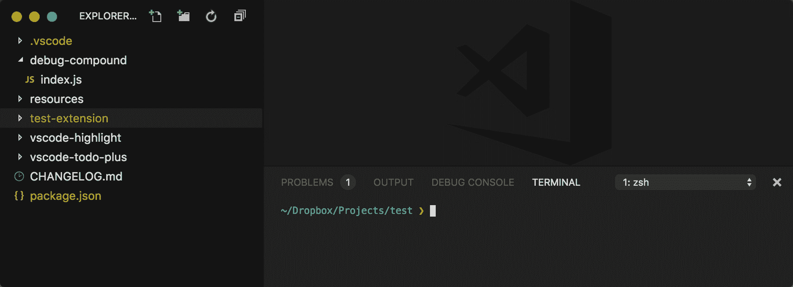
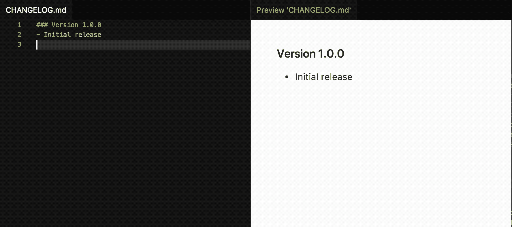
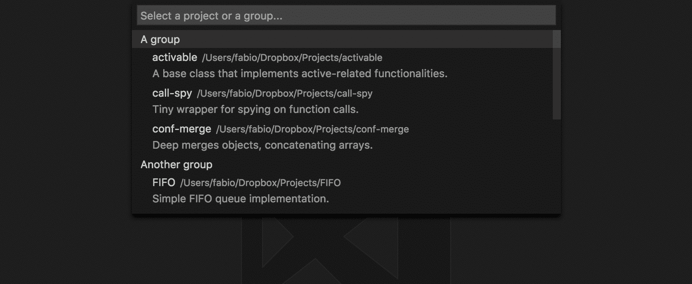
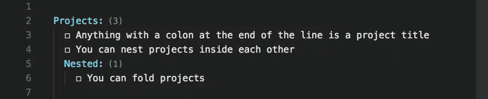
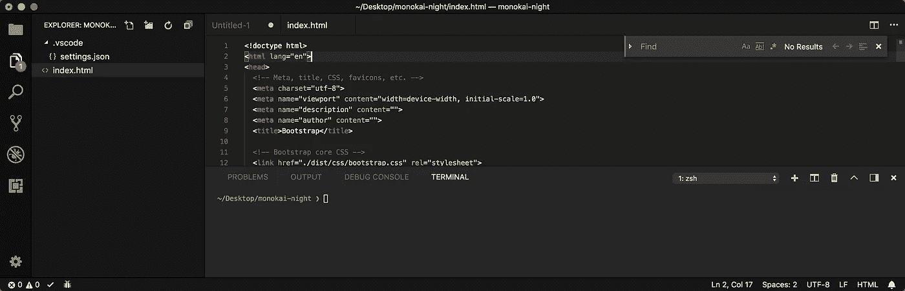
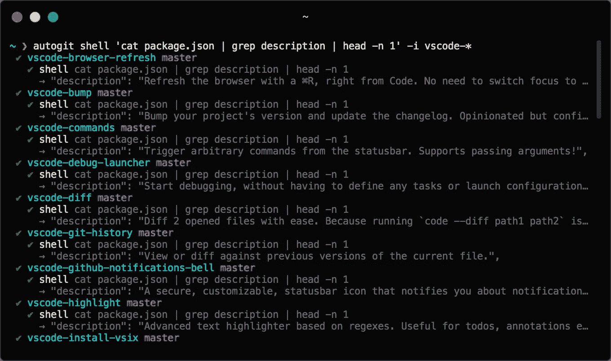
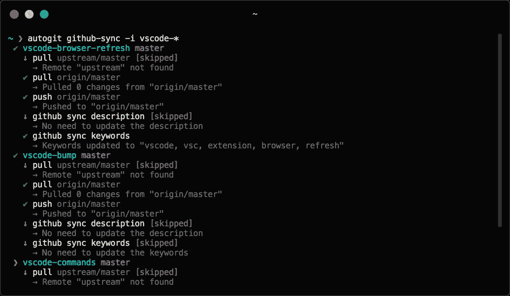
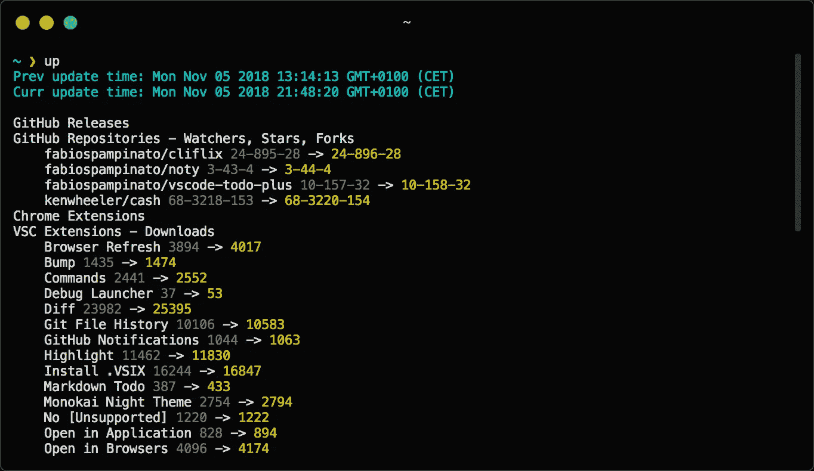
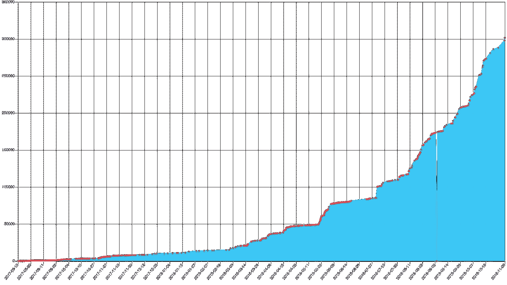

# 为什么我写了 33 个 VSCode 扩展，以及我如何管理它们

> 原文：<https://itnext.io/why-i-wrote-33-vscode-extensions-and-how-i-manage-them-cb61df05e154?source=collection_archive---------0----------------------->

他们说有好图片的帖子会吸引更多的浏览者…

嘿，你好👋我是[法比奥](https://github.com/fabiospampinato)，一个自学成才的开发者，热衷于开源和授权给人们。我也喜欢制作自己的工具，所以很自然地，我最终为我花了很多时间的一个程序写了很多扩展:VSCode。

我想和大家分享一下我在开发和管理 VSCode 扩展时的工作流程，以及我创建的所有扩展。

我将提到我创建的许多工具和扩展，其中大部分是不为人知的，所以无论您是想开始开发扩展，还是想寻找很酷的新扩展，或者只是有许多存储库需要管理，我保证您都会在这里找到一些有趣的东西！

# 编写扩展

我喜欢生产力和自动化，所以我启动新项目的方式非常精简。

## 工具

我写了[模板](https://github.com/fabiospampinato/template)用于快速启动新项目，非常简单:

1.  它接受一个文件夹作为输入(“模板”)。
2.  它用把手处理所有文件，要求你替换它找到的每个占位符(即`{{name}}`)。
3.  它输出一个所有占位符都被替换的新文件夹。

我看了一下 yeoman ，但是对我的用例来说，它似乎过于复杂。我用过 [khaos](https://github.com/segmentio/khaos) ，但是它没有维护，也不会自动更新模板，我不能每次想用的时候都被要求手动更新。

## 模板

然后，我使用我的[模板-vscode-extension](https://github.com/fabiospampinato/template-vscode-extension) 模板开始一个新的 vscode 扩展。

现在我有了一个类似 Hello World 的扩展。该模板包括许多我经常使用的帮助函数:它支持从`.vscode`文件夹中加载自定义配置文件，它自动注册命令，它可以根据活动文件推断当前根目录等。

如果我能回到过去，我可能会把所有这些助手功能放入一个独立的`vscode-utils`包中，而不是在我所有的扩展中复制它们，不幸的是，我从一开始就不知道我会做 10 个扩展，现在更新所有的扩展需要相当多的时间。

如果你正在考虑制作 VSCode 扩展，我建议你制作自己的模板，也许可以从我的模板开始。

## 证明文件

当我开发扩展时，我总是让[文档](https://code.visualstudio.com/docs/extensionAPI/vscode-api)打开。这是一个很长的页面，如果你不知道你需要的 API 已经存在的话，要找到它并不容易，但是快速阅读一下，你很快就会熟悉它，总的来说，我对可用的 API 很满意。

您还会想要阅读关于“扩展性参考”的整篇文章。

## 扩展ˌ扩张

信不信由你，我做的一些扩展实际上帮助我开发了其他的扩展，稍后会有更多的介绍。

# 我的分机

正如我说过的，我喜欢生产力，所以我的大多数扩展都是与生产力相关的。我尽量不要重复太多的工作，并且在确保功能能够很好地相互协作的同时，保持功能在扩展之间的良好分离。

不管是好是坏，我发现做扩展很有趣，而且不缺少可以自动化的东西，这就是为什么在第一个扩展之后，我做了第二个，第三个…第三十三个！

查看每个扩展的页面以获得更详细的信息和截图。

## 用于制作扩展的扩展

#1 [调试启动器](https://marketplace.visualstudio.com/items?itemName=fabiospampinato.vscode-debug-launcher):开始调试(即使是单个文件！)，而无需定义任何任务或启动配置，甚至可以从终端进行。我不想让我的存储库被重复的启动配置和任务弄得乱七八糟(谁会使用任务呢？).从终端启动调试器应该[真的](https://github.com/Microsoft/vscode/issues/10979#issuecomment-434541942)包含在 VSCode 本身中。

从终端启动调试器

#2 [状态栏调试器](https://marketplace.visualstudio.com/items?itemName=fabiospampinato.vscode-statusbar-debugger):给状态栏添加一个调试器，比默认的浮动调试器更少干扰。因为默认工具栏只是[吸](https://github.com/Microsoft/vscode/issues/9093)。如果他们[公开更多的状态](https://github.com/Microsoft/vscode/issues/30810)这个扩展会更好。

#3 [安装。VSIX](https://marketplace.visualstudio.com/items?itemName=fabiospampinato.vscode-install-vsix) :右键点击，从浏览器安装`.vsix`扩展。因为安装`.vsix` [也很烂](https://github.com/Microsoft/vscode/issues/31079#issuecomment-324947324)。

#4 [Bump](https://marketplace.visualstudio.com/items?itemName=fabiospampinato.vscode-bump) : Bump 你的项目版本，更新变更日志。固执己见但可配置。每个值得尊敬的扩展都需要一个 changelog，但这并不意味着你必须手工编写一个。这个扩展是我的最爱之一，我可能会用它做一个`CLI`版本，将来我希望它也为我做 GitHub 版本。

冲击使用

#5 [优化图像](https://marketplace.visualstudio.com/items?itemName=fabiospampinato.vscode-optimize-images):使用你最喜欢的应用程序优化你项目中的一个或所有图像。只需一个命令，你就完成了。

## 管理项目

#6 [项目+](https://marketplace.visualstudio.com/items?itemName=fabiospampinato.vscode-projects-plus) :管理项目的扩展。功能丰富，可定制，自动找到你的项目。项目管理器是最常用的扩展，但是我有超过一百个存储库，我需要合适的工具来管理它们，其中之一就是无限嵌套组。

项目+可定制的快速选择

## 管理待办事项

#7 [待办事项+](https://marketplace.visualstudio.com/items?itemName=fabiospampinato.vscode-todo-plus) :轻松管理待办事项列表。功能强大，易于使用和定制。如果您不需要对`TODO`文件进行语法高亮显示，并且您可能想要内置基本高亮显示，那么您可能想要查看 [Todo 树](https://marketplace.visualstudio.com/items?itemName=Gruntfuggly.todo-tree)，这非常好。

Todo+语法突出显示和项目级统计

#8 [高亮显示](https://marketplace.visualstudio.com/items?itemName=fabiospampinato.vscode-highlight):基于正则表达式的高级文本荧光笔。对于待办事项、注释等非常有用。大多数人只是用[来高亮](https://marketplace.visualstudio.com/items?itemName=wayou.vscode-todo-highlight)，但是我的更通用，功能更强大，可能也更快。

#9 [降价待办事项](https://marketplace.visualstudio.com/items?itemName=fabiospampinato.vscode-markdown-todo):轻松管理降价文件中的待办事项列表。没什么特别的，但是做了一些你知道并且喜欢的 Todo+的快捷方式，基本上可以在 Markdown 文件中工作。

#10 [项目+待办事项+](https://marketplace.visualstudio.com/items?itemName=fabiospampinato.vscode-projects-plus-todo-plus) :鸟瞰你的项目，查看你所有的待办事项文件聚合成一个。如果您使用 Projects+管理项目，使用 Todo+管理待办事项，现在您可以将所有(或部分)项目的待办事项汇总到一个文件中。

## 打开于…

在不同的应用程序/网站之间快速切换对我来说很重要，这就是为什么我做了许多`Open in...`扩展。

#11 [在应用](https://marketplace.visualstudio.com/items?itemName=fabiospampinato.vscode-open-in-application)中打开:在默认应用或你想要的应用中打开任意文件。一个广义的`Open in...`扩展。

#12 [在浏览器中打开](https://marketplace.visualstudio.com/items?itemName=fabiospampinato.vscode-open-in-browsers):增加了一些命令，可以在你喜欢的任何浏览器中打开当前文件或项目，甚至可以同时打开所有文件或项目。

#13 [在代码](https://marketplace.visualstudio.com/items?itemName=fabiospampinato.vscode-open-in-code)中打开:轻松在代码和代码内部人员之间切换。

#14 [在 Finder 中打开](https://marketplace.visualstudio.com/items?itemName=fabiospampinato.vscode-open-in-finder):增加了一些在 Finder 中打开当前文件或项目的命令。

#15 [在 GitHub 中打开](https://marketplace.visualstudio.com/items?itemName=fabiospampinato.vscode-open-in-github):在 github.com 中打开当前项目或文件。有很多其他的扩展，但是当我尝试它们的时候，它们都被我不需要的或者不起作用的东西塞满了。

#16 [在 GitTower](https://marketplace.visualstudio.com/items?itemName=fabiospampinato.vscode-open-in-gittower) 中打开:增加一个在 [GitTower](https://www.git-tower.com/) 中打开当前项目的命令。

#17 [在市场](https://marketplace.visualstudio.com/items?itemName=fabiospampinato.vscode-open-in-marketplace)中打开:增加一个在[市场](https://marketplace.visualstudio.com/)中打开当前项目的命令。

#18 [在 node_modules](https://marketplace.visualstudio.com/items?itemName=fabiospampinato.vscode-open-in-node-modules) 中打开:在`node_modules`中打开当前选择或任意字符串。当您想更深入地研究您正在使用的模块时，这很有用。

#19 [在 npmjs.com 打开 NPM](https://marketplace.visualstudio.com/items?itemName=fabiospampinato.vscode-open-in-npm) :打开当前选择，项目，或任意字符串。有助于快速查看自述文件。

#20 [在船上打开](https://marketplace.visualstudio.com/items?itemName=fabiospampinato.vscode-open-in-ship):增加一个在船上打开当前项目的命令。不幸的是，船已被否决，它不再工作。我现在在 [Noty](https://github.com/fabiospampinato/noty) 中有一个专门的标签来管理即将到来的问题。

#21 [在终端](https://marketplace.visualstudio.com/items?itemName=fabiospampinato.vscode-open-in-terminal)中打开:增加了一些在终端中打开当前项目的命令。

#22 [在传输中打开](https://marketplace.visualstudio.com/items?itemName=fabiospampinato.vscode-open-in-transmit):增加了几个在[传输](https://panic.com/transmit/)中打开当前文件或项目的命令。

## **杂项**

#23 [浏览器刷新](https://marketplace.visualstudio.com/items?itemName=fabiospampinato.vscode-browser-refresh):用⌘R 刷新浏览器，直接从代码开始。不需要切换焦点到它。当你不能使用热重装，并且如果你不想让`browser-sync`在不必要的时候刷新页面[时，这很有用。](https://github.com/BrowserSync/browser-sync/issues/1527)

#24 [命令](https://marketplace.visualstudio.com/items?itemName=fabiospampinato.vscode-commands):从状态栏触发任意命令。支持传递参数！

通过命令定义的自定义命令

#25 [Diff](https://marketplace.visualstudio.com/items?itemName=fabiospampinato.vscode-diff) : Diff 2 轻松打开文件。因为跑`code — diff path1 path2`太慢了。

#26 [Git 文件历史](https://marketplace.visualstudio.com/items?itemName=fabiospampinato.vscode-git-history):查看当前文件的先前版本或与之进行比较。有很多其他的扩展，但是当我尝试它们的时候，它们都被我不需要的或者不起作用的东西塞满了。

#27 [GitHub 通知](https://marketplace.visualstudio.com/items?itemName=fabiospampinato.vscode-github-notifications-bell):一个安全的、可定制的状态栏图标，通知你关于 GitHub 的通知。

#28 [莫诺凯之夜主题](https://marketplace.visualstudio.com/items?itemName=fabiospampinato.vscode-monokai-night):一个完整、黑暗、简约的莫诺凯风格主题。我试过的主题没有一个看起来合适，我必须自己做。

莫诺凯之夜主题

#29 [No【不支持】](https://marketplace.visualstudio.com/items?itemName=fabiospampinato.vscode-no-unsupported):从标题栏移除“【不支持】”的扩展。这是不赞成现在，我建议[修复 VSCode 校验和](https://marketplace.visualstudio.com/items?itemName=lehni.vscode-fix-checksums)代替。不幸的是，经过一些[讨论](https://github.com/Microsoft/vscode/issues/30556)，和一些[更多的讨论](https://github.com/Microsoft/vscode/issues/56929)，后缀“[不支持]”就在那里，准备激怒我们。

#30 [打开多个文件](https://marketplace.visualstudio.com/items?itemName=fabiospampinato.vscode-open-multiple-files):一次打开一个文件夹中的所有文件，可以选择按 glob 过滤。

#31 [搜索—打开所有结果](https://marketplace.visualstudio.com/items?itemName=fabiospampinato.vscode-search-open-all-results):用一个命令一次打开所有搜索结果。

#32 [终端管理器](https://marketplace.visualstudio.com/items?itemName=fabiospampinato.vscode-terminals):一个扩展，用于一次设置多个终端，或者只是运行一些命令。这实际上是我第一次延期！如果你使用终端，你应该看看这个，它非常棒。

#33 [传输](https://marketplace.visualstudio.com/items?itemName=fabiospampinato.vscode-transmit):增加了一些与传输交互的命令。

唷！那花了一段时间。有趣的琐事:我想我有一个在市场上发布了最多扩展的账户，仅次于微软，至少如果有人发布了更多的扩展，我还没有找到他/她。**勘误:** [格雷格](https://marketplace.visualstudio.com/publishers/GregTrevellick)比我多做了 2 次延期，我得回去工作了！

# 管理扩展

管理多个存储库可能是一个挑战，以下是我的做法。

## 重复提交

迟早你会想要在你所有的存储库中改变一些东西，这意味着在多个存储库中做基本相同的提交，这很快就会变得令人厌烦。

为了自动化这类任务，我制作了 [autogit](https://github.com/fabiospampinato/autogit) ，这是一个跨多个存储库执行命令的工具。

通过 autogit 执行的 shell 命令示例

我一直在寻找它的用途，就在最近，我用它对我所有的扩展库进行了如下更改:

*   与`webpack`捆绑:我看到启动时间提高了大约 80%。
*   忽略`package-lock.json`:这只是我的提交历史中的噪音，在这里阅读 [Sindre Sorhus](https://medium.com/u/37166cebf99b?source=post_page-----cb61df05e154--------------------------------) 忽略它的理由[。](https://github.com/sindresorhus/ama/issues/479#issuecomment-310661514)
*   更新`tsconfig.json`以输出现代代码:我经常使用的异步函数，当目标版本是`<= es5`时，会被转换成缓慢的代码，由于 VSCode 附带了 Node.js 的现代版本，所以没有必要这样做。
*   移除 [TSLint](https://github.com/palantir/tslint) :我注意到我基本上忽略了它的输出，所以我移除了对林挺的支持。
*   在自述文件中使用高分辨率标志:在自述文件中使用高分辨率标志，而不是我之前使用的 128x128 标志，有助于更好的自述文件，不幸的是，我没有特别好的标志，但这是另一个故事:)

你可以看到仅仅做这 5 个改变，但是跨越 33 个存储库，增加得很快。

## 用 GitHub 同步描述和关键词

这是一个人不需要做的事情，但是如果有一个工具可以帮你做这件事就好了。幸运的是 [autogit](https://github.com/fabiospampinato/autogit) 和[auto git-command-github-sync](https://github.com/fabiospampinato/autogit-command-github-sync)命令也可以做到这一点:

通过 autogit 同步

我还制作了[auto git-command-github-publish](https://github.com/fabiospampinato/autogit-command-github-publish)来自动创建 GitHub 库。

## 报告

在做了最初的几个扩展后不久，我开始对知道他们获得了多少新的下载感兴趣。你可以在一个页面上查看你所有的扩展，例如，你可以找到我的，但是如果你不记得上次你查看时你的扩展下载了多少次，这并不能真正解决问题。这就是为什么我做了 [rssa](https://github.com/fabiospampinato/rssa) ，一个告诉你什么时候事情发生变化的工具。你可以用它监控几乎所有可以通过 URL 到达的东西。

自定义 rssa 输出

有图表不是很好吗？我还没有发布这个工具，但是利用 rssa 的历史我们可以生成图表，这里有一个 [Todo+](https://marketplace.visualstudio.com/items?itemName=fabiospampinato.vscode-todo-plus) 下载数量的图表:

Todo+下载

请注意，当发布新的更新时，下载量有时会急剧增加:更新被算作下载量😅任何人都可以通过推送许多更新来获得一百万次下载的扩展，这是市场的[问题之一。](https://github.com/Microsoft/vscode/issues/42890)

# 谢谢

太棒了，你坚持到了最后！谢谢你的倾听，我希望你能在这里找到有用的东西。

如何开发 VSCode 扩展？你用的是什么分机？