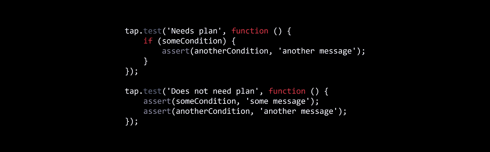

# 我为什么要编写 JS 测试运行程序

> 原文：<https://itnext.io/why-i-wrote-a-js-test-runner-c1d50c3597f?source=collection_archive---------9----------------------->

最近，充实我们项目测试的任务被丢给了我。概念证明是使用 [Jest](https://facebook.github.io/jest/) 编写的。将它们交给我的开发人员指出了 Jest 文档中的一个有趣的小引用:“有太多不同的匹配器要记住它们，所以本文将只尝试介绍最有用的那些”。你可能会想，匹配器到底是什么？他们是这些有趣的小助手，让你做类似`expect(sum(1, 1)).toBe(2)`的事情。这真的很有帮助，因为在 Javascript 中没有办法检查两个变量是否相等，就像`sum(1, 1) === 2`。或者如果你想在条件不满足时抛出一个错误，你不能像`assert(sum(1, 1) === 2, 'sum is broken again')`那样做。撇开讽刺不谈，对于一些更复杂的`expect`方法，如`toMatchObject`、`toThrow,`或`rejects`，还有一个争论。但是这些可以作为实用程序提供，而不是让测试运行的唯一方法。鉴于我不喜欢那里的哲学，我转向了[摩卡](https://mochajs.org/)。

*就像他们* `*expect.yourCodeToBeWrittenInPseudoEnglish(true)*` *。*

我以前用过摩卡，记得我喜欢它。它还声称支持[动态生成测试](https://mochajs.org/#dynamically-generating-tests)，这是我在 Jest 文档中找不到的。然而，我想基于异步获取的数据编写动态测试。这个简单的测试案例演示了异步生成测试并不是很好:

Mocha 无法异步生成动态测试

如果您尝试运行它，Mocha 将报告没有测试。有一些变通办法，就像[这个问题的答案](https://stackoverflow.com/a/35793665)中详述的那样，但是它们不是很干净。我想要更好的东西。

在网上搜索之后，我找到了这篇我非常喜欢的文章。我同意滥用全局变量和共享状态是 Mocha、Jasmine、Jest 和其他人的大问题。我特别喜欢这句话“测试断言应该非常简单，完全没有魔法”。这篇文章还向我介绍了我以前不熟悉的[测试任何东西协议](https://testanything.org/) (TAP)。文章认为你应该使用[胶带](https://github.com/substack/tape)包装。通读磁带上的文档，我注意到的第一件事是，如果我想要对承诺的支持，我需要使用一个名为[蓝色磁带](https://github.com/spion/blue-tape)的衍生产品。Blue Tape README 有一些示例伪代码，所以我修改了它，以便它可以运行，然后测试它。正如你在这里看到的，结果并不令人兴奋。这是他们的*一个*例子中的代码，它甚至不能正确运行。这告诉了我关于图书馆我需要知道的一切。

此时，我正准备放弃使用摩卡咖啡。但是进一步搜索，我偶然发现了[节点点击](http://www.node-tap.org/)。我直接找到了 Node-Tap 文档，而不是找到它的推荐。这使得它看起来像是一个未使用的包，是某人作为周末项目构建的，然后一眼就放弃了。不过，我读得越多，就越兴奋。这终于是我要找的包裹了！作者列出了他对测试库的一些看法，我认为其中大部分都很有见地。第一个足够深刻，值得在这里重复:

> 测试文件应该是可以直接运行的“普通”程序。

这真的引起了我的共鸣。这意味着你的测试不应该有让新开发人员困惑的全局变量。这意味着如果你想使用 for 循环添加测试用例，你可以。这意味着如果你想把测试用例放在一个`setTimeout`回调中，你可以。如果你在工作中写测试，那就意味着你以写代码为生。如果你以写代码为生，那么你可能可以处理写测试代码。

我急切地安装了 node-tap，并编写了我的第一个测试用例。但正如 node-tap 作者所指出的“tutti i gusti，sono gusti”(没有对味道的解释)。这个一揽子计划坚持了它的承诺，但是仍然有一些我不喜欢的地方。看一下下面的代码:

你能发现问题吗？对于那些没有看到它的人来说，问题是`[plan](http://www.node-tap.org/api/#tplannumber)`或`[end](http://www.node-tap.org/api/#tend)`从来没有被调用过，所以测试会失败，因为它是“未完成的”。如果你确实发现了问题，那么你可能已经被其他测试框架灌输了。想象一下，你是一个经验丰富的开发人员，但是你从来没有见过测试。查看代码，你可以看到函数`tap.test`被传递了一个字符串和一个函数，这可能是某种回调。查看回调，可以发现断言不会抛出错误。因此，您可以推断，如果断言抛出错误，测试很可能会失败。同样，您会推断，既然 assert 不会抛出，那么测试很可能会通过。但事实并非如此。相反，我们有一个框架，它的行为与一般人的直觉相反。

我已经可以听到人们大声抗议:但是`plan`帮助我避免误报！看看下面两个测试案例:

需要和不需要计划的测试用例

第一个测试用例需要一个`plan`。如果不需要计划并且`someCondition`和`anotherCondition`都为假，那么测试将通过，即使你可能已经预料到它会在任何时候失败`anotherCondition`为假。但是如果你把它重构为第二个测试，那么你就不会有这个问题。此外，可能应该有两个测试用例，一个断言`someCondition`为真，另一个断言为假。作为一个公开的挑战，我要求你想出一个测试用例不能被重构的例子，以消除对`plan`的需求。

在这一点上，我彻底泄气了。但是，正如我之前所说，如果你能写代码，那么你就能写测试代码。如果你能为测试编写代码，那么你就能为测试运行人员编写代码。所以我决定为 Javascript 编写一个测试运行程序。结果是[拔罐](https://www.npmjs.com/package/cupping)。

这是一个小而简单的库，试图举例说明我认为重要的原则，同时避免前面提到的其他测试库的缺陷。继续安装它，试用它，并让我知道你的想法。它可能不适合每个人，但我希望至少有一些人在使用它时会愉快地恢复精神。