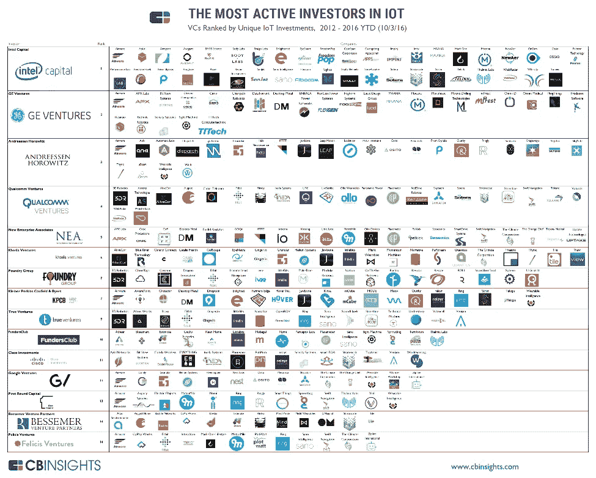
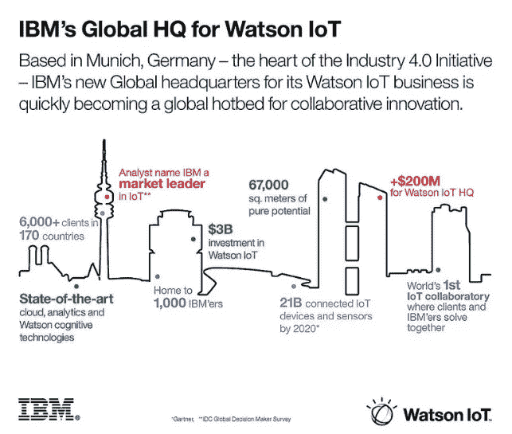

# 为什么 IBM Watson 是首批动手操作物联网的例子之一

> 原文：<https://itnext.io/why-ibm-watson-is-one-of-the-first-hands-on-iot-examples-18f67d36e514?source=collection_archive---------3----------------------->

请不要只是另一份物联网出版物，它预测到 20xx 年将有多少物联网设备。今天的数字是两倍、三倍甚至四倍真的重要吗？几十名研究人员在世界各地传播不同的数据，每天都有多篇关于智能烤面包机、咖啡机、恒温器、手表和其他智能设备的文章发表。也许都是“不错的设备”,但绝对没有改变生活的东西。物联网宣传会兑现它的[承诺](https://www.linkit.nl/knowledge-base/233/Internet_of_Things_gadget_of_serieuze_kans_voor_de_zakelijke_markt)吗？

## **物联网投资**

事实上，像英特尔、GE Ventures 和思科这样的跨国公司正在物联网上投资[大笔资金，这表明它会的。今年早些时候，英特尔](https://www.cbinsights.com/blog/iot-most-active-investor-infographic/)[宣布](https://www.linkit.nl/knowledge-base/108/Intel_restructures_as_IoT_dominates_the_market)将专注于数据中心和物联网等领域。这是该公司在 2015 年进行投资后合乎逻辑的一步，例如投资 3D 人体扫描传感器制造商 BodyLabs 和生物传感器开发商 Sano Intelligence。最活跃的投资者的其他投资是在[无人机技术](http://3dr.com/)、[能源管理解决方案](http://www.panpwr.com/)，以及 [Fitbit](https://www.fitbit.com/nl) 等健康指标。

## **IBM 沃森物联网平台**

IBM 也在物联网上下了大赌注。去年，该公司宣布将在未来四年投资 30 亿美元，将沃森认知计算引入物联网。一个全新的物联网部门在纽约市[硅巷](http://www.siliconvalley.com/2015/03/31/ibm-to-invest-3-billion-in-internet-of-things-unit/)的中心成立，上周该公司宣布将向其位于慕尼黑的全球沃森物联网总部[投资超过 2 亿美元](https://www.youtube.com/watch?v=tCKxL6rIiO0&feature=youtu.be)，该总部于今年早些时候开业，在知识库的[之前的一篇文章](https://www.linkit.nl/knowledge-base/36/IBM_opens_Watson_IoT_Head_Quarter_in_Munich_Germany)中有所描述。投资必须围绕[区块链](https://www.linkit.nl/knowledge-base/61/The_Blockchain_is_the_next_big_thing_says_Dutch_bank_ABN_Amro_executive)、[安全](https://www.linkit.nl/knowledge-base/96/Does_the_Internet_of_Things_threaten_our_security_and_privacy)和[自然语言](https://www.linkit.nl/knowledge-base/234/Machine_learning_neural_networks_and_algorithms)实现开创性的认知物联网能力。慕尼黑是 1000 名 IBM 研究人员、工程师、开发人员和商业专家的家园，他们与客户和合作伙伴一起工作，推动汽车、电子、制造、医疗和保险行业的协同创新

缓慢但肯定的是，世界各地的公司将继续通过 IBM Watson 展示真实的业务成果。新项目包括:

*   [全球领先的汽车和工业供应商之一 Shaeffler](https://www.youtube.com/watch?v=nx4dygJY_7U&cm_mc_uid=50614804835414745231612&cm_mc_sid_50200000=1477313691) 与 IBM 签署了一份多年战略[合作伙伴](http://www.schaeffler.nl/content.schaeffler.nl/nl/press/press-releases/press-details.jsp?id=75989376)协议，在 IBM Watson 的帮助下，通过从物联网愿景和概念验证转向战略部署来推动真正的转型
*   [总部位于荷兰的工业无人驾驶飞机系统设计和生产商 Aerialtronics](https://www.youtube.com/watch?v=BWDfP_udMA0&feature=youtu.be&cm_mc_uid=50614804835414745231612&cm_mc_sid_50200000=1477319203) 宣布推出首款商用无人机，该无人机采用 IBM Cloud 上的 [IBM Watson](http://www.aerialtronics.com/2016/10/aerialtronics-commercial-drones-give-ibm-watson-internet-things-birds-eye-view-2/) 物联网平台，具备认知计算能力。
*   [Thomas Jefferson 大学医院有限公司](http://www.jefferson.edu/index.html?cm_mc_uid=50614804835414745231612&cm_mc_sid_50200000=1477319203)拥有三处设施和 900 多张急症病床，正与 IBM 合作推出由 IBM Watson IoT 支持的[认知医院病房](https://www.youtube.com/watch?v=VWCL72V4zEw&feature=youtu.be)，该病房可增强患者体验，并有助于带来更深层次的个性化、敏捷和响应性护理。

## **物联网投资的优势**

正如本文之前所述，新投资必须在区块链和安全领域带来好处:

*   沃森物联网和区块链:通过 IBM 沃森物联网平台将物联网与区块链连接起来的新能力。企业可以在安全、私有的区块链中共享物联网数据，以降低在人员和货物网络中开展业务的成本和复杂性。
*   安全解决方案和服务:通过一套新的物联网安全解决方案和服务，帮助公司主动识别潜在风险，保护他们的设备免受危害。它们包括对整个物联网环境中可能暴露的可见性、即时通知的警报以及针对各个客户环境定制的自动响应。

基于投入物联网的数十亿美元，你几乎无法想象它不会兑现承诺。仅 IBM 一家就已经在 170 个国家拥有超过 6000 个客户项目、超过 1400 个合作伙伴和超过 750 项物联网专利。继续关注他们在区块链和安全领域的新业务和发展将是非常有趣的。在不久的将来，LINKIT 知识库将为您带来所有主题，敬请关注！