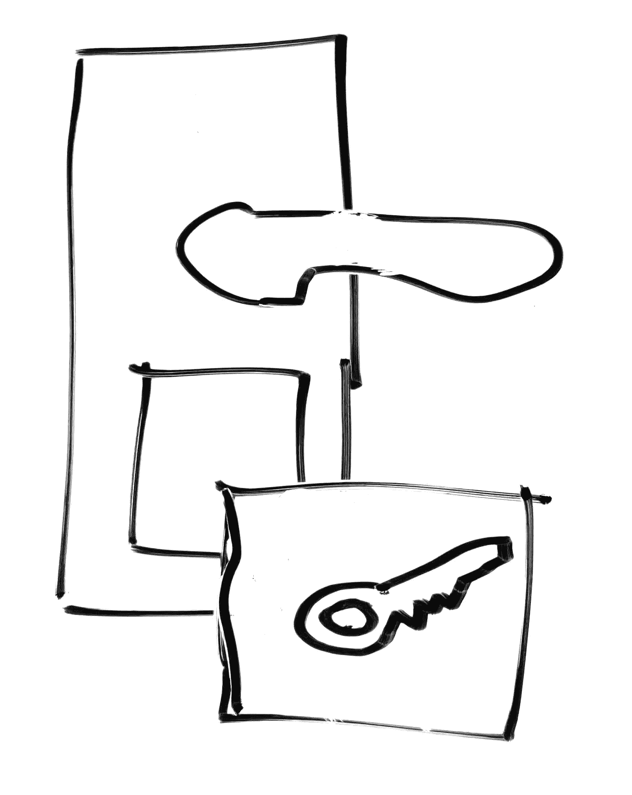
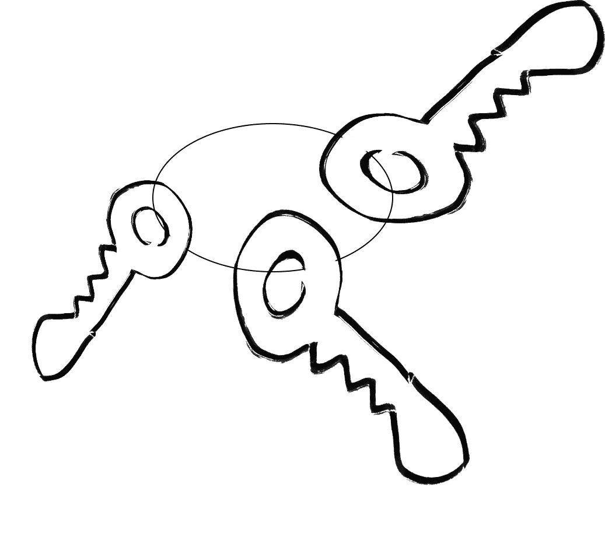
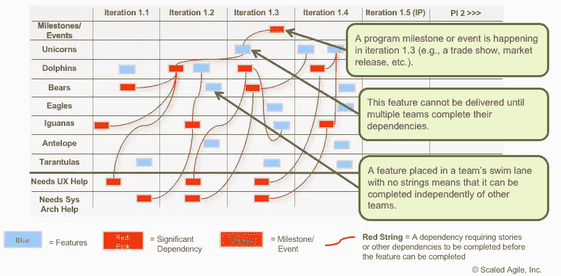
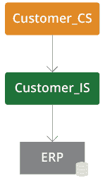

# 为什么集成会出错；不完整的名单

> 原文：<https://itnext.io/why-integrations-go-wrong-an-incomplete-list-c9c67a85c580?source=collection_archive---------2----------------------->

当我与客户谈论集成时，焦点通常是事物的技术方面。OutSystems 能和 X 技术集成吗？答案几乎总是“是的，而且实际上很容易。”

然而，集成几乎总是项目延迟的主要原因之一。那怎么可能呢？

嗯，关于集成的困难部分不是构建集成，而是围绕它的组织方面。因此，请允许我向您介绍集成出错的原因以及如何避免出错的不完整列表。

1.  **我们准备好了，但他们没有**

当地报纸关于这一现象的文章中描述的劳芬堡大桥:[https://www.thelocal.de/20100903/29599/](https://www.thelocal.de/20100903/29599/)

劳芬堡大桥跨越国界和水域:一边在瑞士，一边在德国。是两国从自己这边建的，中间连起来的。他们同意测量，并开始测量海平面。只是，德国测量的海平面比瑞士高 27 厘米。他们在计算中对此进行了补偿…在错误的方向上。最后，德国方面被降低到完成桥梁，导致不可避免的延误。

在很多方面，你的融入是通往另一个国家的桥梁。首先，你需要确保你们都同意在哪里见面，海平面有多高。此外，虽然集成可以在外部系统端快速完成，但另一端通常很难达到同样的速度。因此，在您的项目规划中考虑到有时您需要等待几个月的时间来准备好集成的另一方面是很重要的。(即使在技术上可以快速执行，也可能存在导致延迟的规划或组织障碍。)
如果是这种情况，请确保提前足够的时间向其他团队请求变更，并确保就良好的规范达成一致。
产品增量会议是非常有用的组织工具，可以及早发现这种情况，并提前调整计划。

**2。城堡的钥匙**

集成允许其他技术访问您的数据库并向其中写入信息，反之亦然。这是你不想给任何人的特权。解决方案:添加身份验证。下一个！

不完全是。身份验证有多种形式，它们都有优缺点。让我们来看看其中的一些。

*基于用户的认证。* 当组织对用户使用集中式身份验证方法时，通常需要使用已登录用户的凭证来获取/授予对集成服务的访问权限。
毕竟，我们现在可以限制一些用户的访问权限，同时给予其他用户更多的访问权限。我们可以看到谁做了什么，无论他们是直接登录还是使用集成来访问/更新信息。

但是，没有灵丹妙药，所以这里有一些缺点:
在某些情况下——例如在 BPT 的服务器上异步运行时——您没有用户可以使用，那么在这种情况下如何进行身份验证呢？
此外，一些技术不支持基于用户的 API 认证。
我还发现相当多的组织不愿意使用基于用户的身份认证方法和按(服务)用户收费的技术，以降低成本。

*系统用户、服务令牌和 lot* 当我们不基于用户进行身份验证时，我们倾向于基于静态值进行身份验证。不管它们是过期了，还是分成多个部分，还是需要握手，最终许多技术都归结为一两条关键信息，可以打开所有的门。这方面的变化如此之多，以至于很难明确地捕捉到它们，所以让我们只关注所有这些变化对存储的影响。

让我们假设任何能够访问您的存储令牌的人都可以自由地访问它所保护的 API。当然，一个好的系统要比这更健壮，但是为了简单起见，让我们假设当一个人设法窃取了这段信息时，你的整个 API 就被破坏了。让我们围绕这一假设来构建我们的存储安全要求。

存储秘密/令牌/密码的第一个地方是安全保险库，这是一项专门用于这一明确目的的技术。这应该是各种技术栈之外的一个工具，这样所有利用这个密钥的不同技术都可以从同一个地方获取它。您使用安全保险库是因为您希望将这些信息存储在尽可能小的地方，并且您存储这些信息的地方需要进行抛光以保护这些信息。根据您的部署位置，您可能有权访问 Azure Key Vault、AWS KMS 或 AWS S3 冰川，或者本地的密钥管理/HSM 工具。

然而，并不是每个人的床下都有这样的技术。因此，如果您无法利用这样的安全库，我们也可以在外部系统上存储这样的凭证。在这种情况下，我们建议对项目进行加密，并将它们存储在数据库或站点属性中。加密最好由 CryptoAPI 来完成，CryptoAPI 是一个允许你根据私有平台加密密钥来加密和解密数据的工具。这个密钥可以在服务器上的一个. txt 文件中找到，但是不能被人访问。

Integration Builder 以一种巧妙的方式利用了这种技术，将加密的凭证存储在一个数据库表中，该表不能从 Service Studio 访问。这样，Integration Builder 还允许凭证持有者通过向导输入 API 的凭证，而不必向开发团队提供秘密信息。(Integration Builder 非常简洁:-))

TLDR:锁上门是个好主意。拥有记录谁在使用它们的密钥就更好了。如果你的钥匙可以被任何人使用，不要把它们到处乱放。

**3。不同的节奏**

假设我们已经建立了联系，存储了凭证，并且我们的系统和谐相处。但是当烈火国进攻时，一切都变了！

也就是说:我们的现代 IT 链趋向于发展，因此我们和目标系统都需要不断地调整我们的架构。从理论上讲，这应该不会导致任何问题，因为集成与标准化接口一起工作，写在永远不会改变的合同中。如果他们真的改变了，这种改变将受到大量的协调。
在实践中，合同并不总是像它们应该的那样一成不变，变化也不总是被宣布。更不用说我们在工具链中更换整个工具的时候，这意味着所有的合同都是无效的。变化是世界运转的动力。我们可以这样准备:

外管局网站建议的 PI 规划冲刺。更多信息:[https://www.scaledagileframework.com/pi-planning/](https://www.scaledagileframework.com/pi-planning/)

3.1 计划增量！
引出红线，因为这正是产品增量计划会议的真正目的。
产品增量规划会议是指每季度召开一次的会议。工作可能交叉的每个人都在那里，我们弄清楚我们未来的功能和其他变化可能如何影响集成技术。传统上，我们用红线表示跨团队的工作项之间的依赖关系，并固定在所涉及的功能上。这是我们识别影响的方式，也是我们需要组织工作来减轻影响的方式。产品增量的最佳特性是，它们有助于解决团队以不同的步调工作的情况，只要他们都以相同的 PI 步调工作。有时，与所有利益相关方组织良好的同地会议可以解决任何计划委员会工具都无法解决的问题。

我们网站上显示的集成服务:[https://success . out systems . com/Support/Enterprise _ Customers/Maintenance _ and _ Operations/Designing _ the _ Architecture _ of _ Your _ out systems _ Applications/05 _ Integration _ Patterns _ for _ Core _ Services _ Abstraction](https://success.outsystems.com/Support/Enterprise_Customers/Maintenance_and_Operations/Designing_the_Architecture_of_Your_OutSystems_Applications/05_Integration_Patterns_for_Core_Services_Abstraction)

*3.2 信任，但添加集成服务* PI 规划会议可以让您意识到影响您的集成系统即将发生的变化。然而，这并不能让你轻松实现这种改变。这就是我们有建筑的原因！
更具体地说，集成服务模式有助于减少外部变化对您的环境的影响。

它是这样工作的:你与一个承诺他们不会改变合同的外部团体整合。双重承诺，我发誓去死。在这一点上，你信任他们，但是*为了确保*你通过在上面添加一个小层，将这种外部集成从你的内部消耗中分离出来。通过这种方式，如果外部方更改了合同，您只需将其固定在您添加到它上面的层中。这样，您只需实施一次更改。

参数名称已更改？在集成服务中映射它。
数据类型改变了？*将其映射到集成服务中。*集成中实施的新验证？在集成服务中预先验证它们。需要重新连接到一个完全不同的系统？构建新的集成，并在集成服务中进行映射。有了集成服务，其他人不需要知道实际集成中的变化。
(顺便说一句:这正是 Integration Builder 的工作方式。正如我所说的，Integration Builder 非常简洁！)

这种模式限制了外部环境变化对您平台的影响。它给了你在混乱世界中控制的方法。在某些方面，集成服务是正念的 IT 等价物；它允许你与外界互动，同时减少你无法控制的变化的影响。

我们都应该努力在我们的生活中实现整合服务。

合十礼！