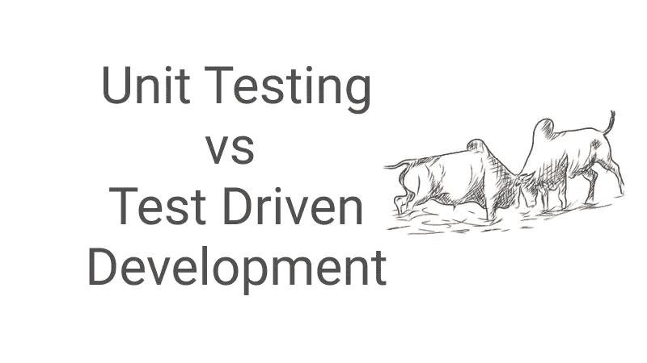

# 为什么程序员应该选择编写单元测试或者甚至遵循 TDD

> 原文：<https://itnext.io/why-programmers-should-opt-in-in-writing-unit-tests-or-even-following-tdd-db9d2c7d87d9?source=collection_archive---------1----------------------->

单元测试的核心价值经常不被理解，此外，当谈到测试驱动开发(TDD)时，有些人可能不知道如果你承诺提前编写单元测试，你会得到什么。

## 单元测试很有价值，因为它们:

*   **必然引导你走向更好的架构/设计。** 为了能够对某个类进行单元测试，你必须以一种可测试的方式编写代码，即避免静态依赖，使用依赖注入……除此之外，单元测试迫使你实际使用你正在创建的类，如果类太大并且包含不止一个责任，单元测试就会惩罚你。通过这种痛苦，您可以将您的设计变得更加内聚和松散耦合。
*   **为重构和代码的小改动提供快速的自动化回归。**
    一组自动化的回归测试增加了你对修改/维护代码的信心。事实上，你真的不应该重构代码，除非它被单元测试所覆盖。
*   记录系统的小部分是如何工作的。
    为什么考试规格这么大？因为他们不会说谎。如果编写得当，测试要么通过，要么失败。测试明确规定了在特定的环境下应该发生什么。一个好的命名约定和测试结构在这里真的很有帮助。
*   **便于调试。** 当一个测试失败时，只需要调试最新的变化。在更高级别的测试中，需要扫描几天/几周内所做的更改。

使用简单的单元测试方法，你可以在代码写完之后再写测试，而使用 TDD，你可以以相反的顺序写测试。这意味着你可以不做 TDD 而做单元测试，然而，你不能不使用单元测试而做 TDD。反过来，这意味着 TDD 方法至少提供了与常规单元测试方法相同的好处，但是它还必须在其上添加一些有益的东西，对吗？

## 您可能希望遵循 TDD 作为这种方法:

*   **确保你事先完全理解你正在实施的东西，并且你“做对了”。如果你意识到你不知道一个测试应该测试什么，这意味着你需要问更多的问题，明确需求。**
*   保持代码简洁并符合 YAGNI 标准。
    通过利用 TDD，你可以绝对肯定你不会编写任何不必要的代码，因为你只会编写通过测试的代码，所以在这个意义上，TDD 可以防止 [YAGNI](https://martinfowler.com/bliki/Yagni.html) 代码片段。

 [## 单元测试的艺术:C#中的例子

### 单元测试的艺术:以 Amazon.com 的 C#为例。*符合条件的优惠可享受免费*运输。的…

www.amazon.com](https://www.amazon.com/Art-Unit-Testing-examples/dp/1617290890)  [## 为什么要进行单元测试？

### 证明代码正确允许信心十足地重构 API 设计(TDD)可执行 API 文档供开发人员使用

www.digitaltapestry.net](https://www.digitaltapestry.net/testify/manual/WhyUnitTest.html)  [## 清洁编码器博客

### 当你第一次学习测试驱动开发时，这听起来简单而容易。如果你像我一样在 1999 年学会了，那…

blog.cleancoder.com](https://blog.cleancoder.com/uncle-bob/2014/12/17/TheCyclesOfTDD.html)