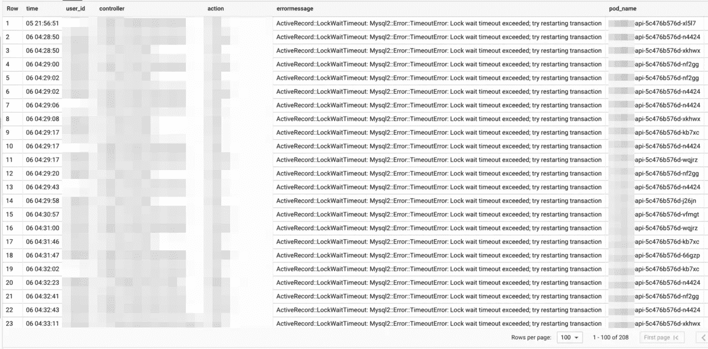
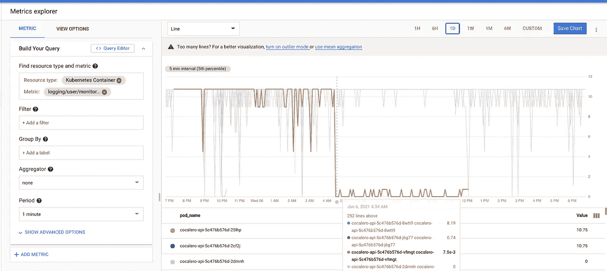
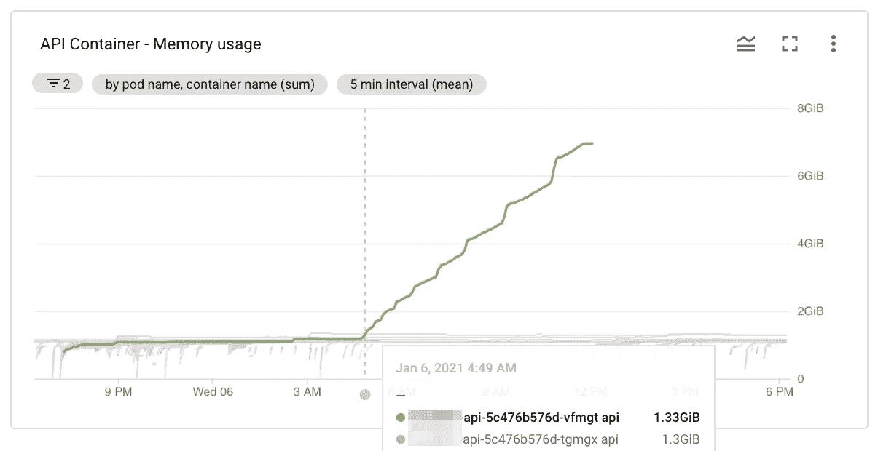
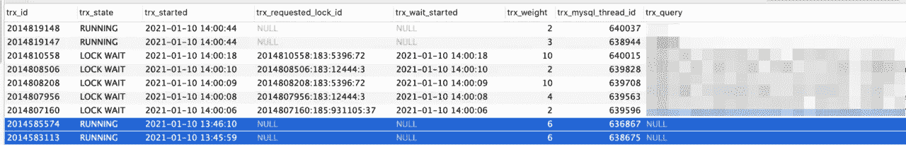
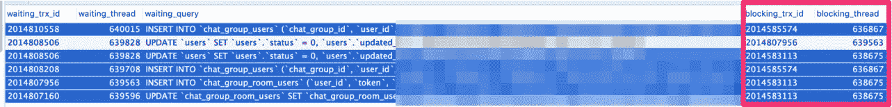
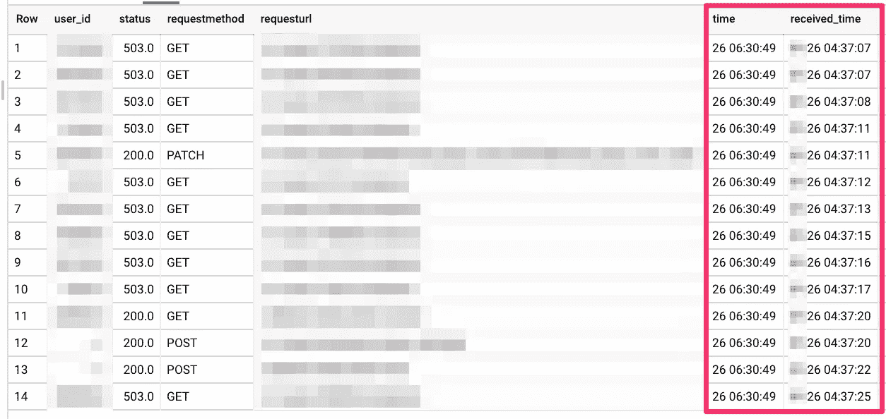

# 为什么 puma workers 经常挂起，以及我们如何通过发现 Ruby v2.5.8 和 v2.6.6 的 bug 来修复

> 原文：<https://itnext.io/why-puma-workers-constantly-hung-and-how-we-fixed-by-discovering-the-bug-of-ruby-v2-5-8-and-v2-6-6-7fa0fd0a1958?source=collection_archive---------1----------------------->

在[生产](https://paralleljp.studio.site/)中运行 Rails puma 服务器时，我们看到了这样一个事件，即**的一些老工人进程突然被卡住了**，而不管请求的数量或趋势有没有变化。

我找到了根本原因，向上游汇报了。这个问题在 Ruby 2.6.0 中仍然存在，并且可以追溯到 Ruby 2.5.0。如果你只是想要一个 bug 的概要，请看 [ruby-lang#17669](https://bugs.ruby-lang.org/issues/17669) 。

# 发生了什么

有一天，我们注意到许多特定用户长期遭受的`ActiveRecord::LockWaitTimeout`异常。与此同时，我们的一个 puma 工作人员报告说没有可用线程的容量，他们的内存逐渐无限膨胀。

这是我们这段时间的数据:



锁等待超时导致的应用程序错误日志



Puma.stats 中无休止的低线程[pool _ capacity](https://github.com/puma/puma/blob/0bdfe297906ba110583dc597e33c6a79c22e9798/docs/stats.md#explanation-of-stats)



应用程序容器的内存使用膨胀

最初，我们不确定这些不良观察结果是否相互关联，是否由严重的根本原因引发。在交通拥挤的情况下，每个问题本身实际上都是不可避免的。因此，我们让事情运行了一段时间，并小心谨慎地加强了。

# 立即回应

首先，为了防止内存溢出，我通过一个从 k8s 服务分离的操作从负载均衡器中删除了这个应用程序容器。**由于到来的请求没有到达，内存增长也结束了。**到目前为止，一切顺利。

```
❯❯❯ kubectl edit pod api-5c476b576d-vfmgt
spec:
  template:
    metadata:
      labels:
-       app: api
+       app: api-issue-memoryleak
```

另一方面，`ActiveRecord::LockWaitTimeout`异常仍在继续。这些问题迫切需要解决，因为对于那些在我们解决之前无法使用我们主要功能的特定用户来说，这是一个至关重要的问题。

然后，**我删除了这个有问题的工作进程和线程运行的容器**。很快，例外停止了，一切都变好了😌。

```
❯❯❯ kubectl delete pod api-5c476b576d-vfmgt
```

# 观察

在立即修复之后，没有什么重要的东西来研究这是如何发生的，因为我们失去了查看信息快照的机会，比如我们的数据库的事务锁和 puma worker 进程的核心转储。顺便提一下，我们的 puma 服务器依赖 MySQL 5.7 作为主数据库。

我决定下次类似的问题再次出现时，把它们放在一边。

*   提前准备充分测试的指令帮助我尽可能快地执行，没有延迟地修复这个部分中断。虽然您可以找到关于如何查看事务、其持有的锁以及被锁阻塞的其他事务的可靠 web 资源，[我在生成核心转储和调试运行在 GKE 集群上的进程](https://yoheimuta.medium.com/debugging-gke-unprivileged-containers-with-gdb-and-nsenter-3760b50eb03a)时遇到了麻烦。

然后，我们等待另一次的再次发生，很快就发生了。一开始，我就可以通过参考`information_schema.innodb_trx`表来检测长时间运行的事务。

*   `SELECT * FROM information_schema.innodb_trx`



[该表提供了当前在](https://dev.mysql.com/doc/refman/5.7/en/information-schema-innodb-trx-table.html) `[InnoDB.](https://dev.mysql.com/doc/refman/5.7/en/information-schema-innodb-trx-table.html)`内执行的每个交易的信息

注意，它显示了 14 分钟前开始的两个状态为`RUNNING`的事务。我注意到每个`trx_query`都是空的。该列表示事务正在执行的 SQL 语句。这意味着在 MySQL 已经按时返回结果后，一些 Ruby 代码没有提交这些事务。

最重要的是，您需要将`information_schema.innodb_lock_waits`表连接在一起，以判断它们是否阻塞了试图获得相同锁的其他事务。

*   `[INNODB_LOCK_WAITS](https://dev.mysql.com/doc/refman/5.7/en/information-schema-innodb-lock-waits-table.html)`表包含每个阻塞的`InnoDB`事务的一行或多行，指示它请求的锁和阻塞该请求的任何锁。

```
SELECT
  r.trx_id waiting_trx_id,
  r.trx_mysql_thread_id waiting_thread,
  r.trx_query waiting_query,
  b.trx_id blocking_trx_id,
  b.trx_mysql_thread_id blocking_thread,
  b.trx_query blocking_query
FROM       information_schema.innodb_lock_waits w
INNER JOIN information_schema.innodb_trx b
  ON b.trx_id = w.blocking_trx_id
INNER JOIN information_schema.innodb_trx r
  ON r.trx_id = w.requesting_trx_id;
```



[该表提供了关于哪些事务正在等待以及哪些事务正在阻塞它们的信息。](https://dev.mysql.com/doc/refman/5.7/en/innodb-information-schema-examples.html)

结果使我确信**这两个事务阻塞了其他四个事务，并触发了** `**ActiveRecord::LockWaitTimeout**` **异常**。您可以看到`blocking_trx_id`的值与长时间运行的事务的值相匹配。

此外，puma 在接收到`TERM`信号后写入的访问日志中有一些请求具有异常长的延迟，表现为被卡住。



这 14 个请求持续了 1 小时 50 分钟😲

从前面的观察中考虑所有的事情，我得出结论**Rails 请求的意外阻塞是根本问题**。一路上发出的 MySQL 事务也在拖延并阻塞另一个事务，直到工作线程被终止。

# 彪马螺纹悬挂的位置

为了揭开根本原因的神秘面纱，深入研究一个核心转储，找出线程卡住的地方。以下是如何在 GKE 生成核心转储。

*   首先，我通过 ssh 登录到运行 puma 的计算引擎实例。

```
❯❯❯ gcloud beta compute ssh --zone "asia-northeast1-a" "gke-cluster-n1-standard-8-po-a0cea807-5327" --project "hogehoge"
```

*   然后，`[nsenter](https://man7.org/linux/man-pages/man1/nsenter.1.html)`允许您在显示的工作进程(3866) `ps`命令的 PID 指定的 Pod 名称空间中执行`gdb`。在容器中运行`gdb`需要输入目标进程的挂载、网络和 PID 名称空间。

```
$ ps auxf
$ sudo nsenter --mount --net --pid --target 3866 bash
```

*   `[gcore](https://man7.org/linux/man-pages/man1/gcore.1.html)`生成运行程序的核心文件(PID: 23)。

```
bash-5.0# apk add gdb
bash-5.0# gcore 23
```

*   最后，我将核心文件从容器复制/下载到我的本地。

```
❯❯❯ kubectl cp api-5dcb4b66f8-99nft:/api/core.23 ~/react/tmp/core.23
```

现在，要从核心转储中获取线程回溯，请运行以下命令:

```
bash-5.0# apk add musl-dbg gdb curl
bash-5.0# gdb -silent -nw /usr/local/bin/ruby core.23(gdb) info threads
  Id   Target Id                  Frame
...
  6    LWP 32 "puma 001"          __cp_end () at src/thread/x86_64/syscall_cp.s:29
  7    LWP 33 "puma 002"          __cp_end () at src/thread/x86_64/syscall_cp.s:29
  8    LWP 35 "puma 003"          __cp_end () at src/thread/x86_64/syscall_cp.s:29
  9    LWP 36 "puma 004"          __cp_end () at src/thread/x86_64/syscall_cp.s:29
  10   LWP 37 "puma 005"          __cp_end () at src/thread/x86_64/syscall_cp.s:29
  11   LWP 39 "puma 006"          __cp_end () at src/thread/x86_64/syscall_cp.s:29
  12   LWP 40 "puma 007"          __cp_end () at src/thread/x86_64/syscall_cp.s:29
  13   LWP 41 "puma 008"          __cp_end () at src/thread/x86_64/syscall_cp.s:29
  14   LWP 42 "puma 009"          __cp_end () at src/thread/x86_64/syscall_cp.s:29
  15   LWP 43 "puma 010"          __cp_end () at src/thread/x86_64/syscall_cp.s:29
  16   LWP 44 "puma 011"          __cp_end () at src/thread/x86_64/syscall_cp.s:29
  17   LWP 45 "puma 012"          __cp_end () at src/thread/x86_64/syscall_cp.s:29
  18   LWP 46 "puma 013"          __cp_end () at src/thread/x86_64/syscall_cp.s:29
  19   LWP 47 "puma 014"          __cp_end () at src/thread/x86_64/syscall_cp.s:29
  20   LWP 48 "puma 015"          __cp_end () at src/thread/x86_64/syscall_cp.s:29
...
```

我们看到 15 个 puma 线程处理请求。这是第一条线索:

注意这是一个 **C 级回溯**。虽然这种回溯有助于猜测类似死锁问题的情况，但它似乎没有多少信息来定位根本问题。我们在 C 级回溯中找不到任何东西的事实表明，Ruby 代码层可能就是原因。

所以，让我们得到一个 **Ruby 级别的回溯**。在此之前，我们需要建立一个`**gdbinit**`文件来定义一些在 Ruby 官方库中维护的有用函数。

```
bash-5.0# apk add curl
bash-5.0# curl -o .gdbinit https://raw.githubusercontent.com/ruby/ruby/ruby_2_5/.gdbinit
bash-5.0# mv .gdbinit /root/
```

调用`**rb_ps**`转储一个 Ruby 级别的回溯，无论是附加到一个活动进程还是核心文件。

```
(gdb) rb_ps
$1 = (rb_vm_t *) 0x7ff149353700
...
* #<Thread:0x56327568dfa0 rb_thread_t:0x56327646b020 native_thread:0x7fd3700dfb20>
147:0x7fd3739ca020 <rb_mutex_lock at thread_sync.c:326>:in `lock'
146:/usr/local/lib/ruby/2.5.0/monitor.rb:192:in `mon_enter'
145:/usr/local/lib/ruby/2.5.0/monitor.rb:233:in `block in mon_synchronize'
144:0x7fd3739c7df0 <rb_thread_s_handle_interrupt at vm_core.h:1622>:in `handle_interrupt'
143:/usr/local/lib/ruby/2.5.0/monitor.rb:233:in `mon_synchronize'
142:/usr/local/lib/ruby/2.5.0/logger.rb:688:in `write'
141:/usr/local/lib/ruby/2.5.0/logger.rb:471:in `add'
140:/cocalero-api/vendor/bundle/ruby/2.5.0/gems/activesupport-6.0.1/lib/active_support/logger_thread_safe_level.rb:53:in `add'
139:/usr/local/lib/ruby/2.5.0/logger.rb:527:in `info'
138:/cocalero-api/vendor/bundle/ruby/2.5.0/gems/activesupport-6.0.1/lib/active_support/log_subscriber.rb:119:in `info'
137:/cocalero-api/vendor/bundle/ruby/2.5.0/gems/activejob-6.0.1/lib/active_job/logging.rb:57:in `enqueue'
...
```

现在，我们发现了根本问题:**所有挂起的线程都在等待具有完全相同回溯的监视器/互斥锁**。

[https://github . com/ruby/ruby/blob/ruby _ 2 _ 5/lib/monitor . Rb # L192](https://github.com/ruby/ruby/blob/ruby_2_5/lib/monitor.rb#L192)

出于某种原因，这把锁从未打开过。我预计线程列表会有一个持有锁的有问题的线程，但实际上，我找不到它。总之，gdb 向我们展示了线程挂起的位置，但不是导致这种情况的确切线程**。**

# 如何缓解这个问题

根据 Ruby 级回溯，**在 MySQL 事务期间调用** `**Rails.logger**` **可以触发** `**ActiveRecord::LockWaitTimeout**` **异常**，因为被阻塞的线程持有 MySQL 锁。方法`write`建立在`Monitor#synchronize`之上，用于保护输出设备周围的竞争条件。

[https://github . com/ruby/ruby/blob/ruby _ 2 _ 5/lib/logger . Rb # L688](https://github.com/ruby/ruby/blob/ruby_2_5/lib/logger.rb#L688)

然后，我们将 Sidekiq 作业作为事务中的 ActiveRecord 回调入队，这个入队实际上需要一个日志记录动作。基本上，在事务期间执行额外的 I/O 是不安全的操作。

我们修复了在提交数据库事务后对作业进行排队，以缓解目前的问题。

```
- after_destroy :delete_session, :enqueue_notification_job
+ after_destroy :delete_session
+ after_destroy_commit :enqueue_notification_job
```

现在，这种缓解可以防止像`ActiveRecord::LockWaitTimeout`异常这样的严重错误🎉。一些 puma 工作人员仍然苦于没有可用的线程。但是这给了我更多的时间去深入调查。

# 根本原因是什么

我曾怀疑`[Timeout.timeout](https://ruby-doc.org/stdlib-2.5.1/libdoc/timeout/rdoc/Timeout.html)`是一种棘手的机制，可能会打破必须首先保持一致的内部状态。实际上，这个事件是从我们向`Timeout.timeout`引入额外呼叫的那天开始的。

*   注意`Timeout.timeout`产生了一个专门运行给定块的新线程，如果它在固定的时间内没有完成，通过发送一个异常来强制终止它。
*   [正如许多资源所警告的那样](https://adamhooper.medium.com/in-ruby-dont-use-timeout-77d9d4e5a001)，这种行为本质上有可能破坏应用程序级别的状态。然而，Ruby 提供了一种实现必须互斥的临界区的方法。就是我们在回溯中提到的[监视器类](https://ruby-doc.org/stdlib-2.5.3/libdoc/monitor/rdoc/Monitor.html)。通常，几乎所有可靠的库都依赖于这个类，并适当地保护它们的不变量。然而，我们遇到了一个死锁/竞争条件问题，因此这是我们当时试图解决的棘手问题。

```
require 'monitor'

lock = Monitor.new
lock.synchronize do
  **# exclusive access**
end
```

虽然我确信延长超时时间或停止通话等简单的解决方法可以解决这个问题，但我发现这并不有趣，因此我花了足够的时间进行调查，作为一次学习经历。

也就是说，回溯暗示了一种可能性，即**一个获取互斥体的线程突然被终止，因为它没有在超时**内完成。的确，`Timeout::Error` exception 有一个回溯来显示该块被强制停止的位置。添加一行以打印新的错误日志:

```
rescue Timeout::Error => e
+  Rails.logger.error("timeout occured.\n#{e.message}\n#{e.backtrace.join("\n")}")
end
```

下面是`e.backtrace`的节选:

```
timeout occured.
/usr/local/lib/ruby/2.5.0/monitor.rb:233:in `handle_interrupt' 
/usr/local/lib/ruby/2.5.0/monitor.rb:233:in `mon_synchronize' /usr/local/lib/ruby/2.5.0/logger.rb:688:in `write' /usr/local/lib/ruby/2.5.0/logger.rb:471:in `add' /cocalero-api/vendor/bundle/ruby/2.5.0/gems/activesupport-6.0.1/lib/active_support/logger_thread_safe_level.rb:53:in `add' /usr/local/lib/ruby/2.5.0/logger.rb:527:in `info'
```

终于，我们找到了根本原因。**如果** `**Timeout::Error**` **在** `**begin**` **块之前线程正在执行时被引发，**

monitor.rb:233:在“句柄 _ 中断”中

**它破坏了监视器的状态并导致死锁，尽管源代码注释否认了这一点。**表示线程在执行`mon_enter`后有可能不调用`mon_exit`。这违反了确保线程解锁它之前自己锁定的监视器的不变量。

这是繁殖的方法:

可复制脚本

结果

我还确认了在对 Ruby 的`monitor.rb`文件应用了下面的补丁后，它再也不会重现了。

修补程序来修复此问题

# 如何避免这个 bug

将您的 Ruby 版本升级到 2.7.2 或 3.0.0 可以彻底解决这个问题，因为在这些版本中，监视器是用 C 语言重新实现的。

否则，当`Timeout::Error`异常发生时，您可以通过简单的方式手动解锁显示器。但它可能过于特殊，无法在生产中采用。下面是示例代码:

```
rescue Timeout::Error => e
  logdev = Rails.logger.instance_variable_get(:@logdev)
  if logdev.mon_owned?
    logdev.mon_exit
  end
end
```

# 包扎

Ruby v2.5.8 和 v2.6.6 有一个 bug 导致了由`Timeout.timeout`触发的死锁。v2.6 的上游目前还没定(2021–04–04)。

我通过收集核心转储、阅读 Ruby 和我们的应用程序中的源代码，以及使用`GDB`分析回溯来识别这个 bug。