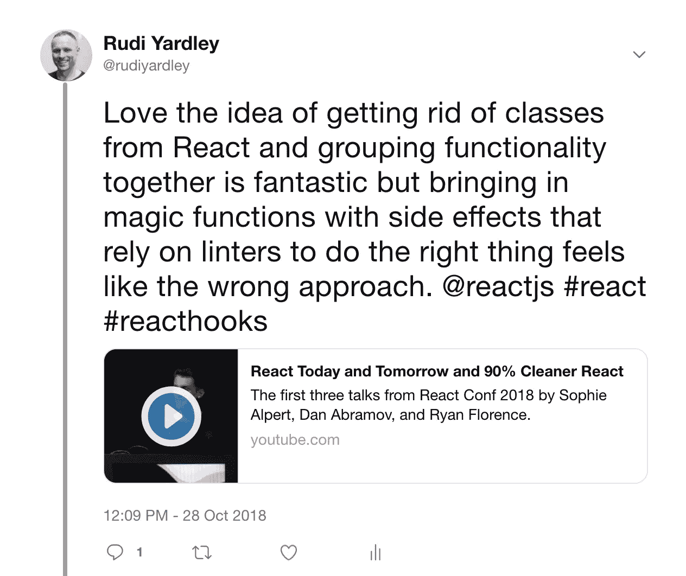

# 为什么 React 的新 Hooks API 是一个游戏改变者

> 原文：<https://itnext.io/why-reacts-hooks-api-is-a-game-changer-8731c2b0a8c?source=collection_archive---------0----------------------->

## 最后，我们在 React 中去掉了第二速率编码模式

> React 的新 [Hooks API](https://reactjs.org/hooks) 允许我们最终分享行为，而没有任何之前困扰社区的内在问题

https://www.flickr.com/photos/elevationmann/[摄影](https://www.flickr.com/photos/elevationmann/)

# 组件间共享行为

从早期开始，我就一直使用 React 进行开发，在此期间，影响者和核心团队都曾多次尝试改进开发人员用来创建软件的 API 和模式。我们面临的最大挑战之一是如何在组件之间整齐地共享行为，以实现重用，甚至只是关注点的分离。到目前为止提出的每一个解决方案都有一些相关的问题。

幸运的是，React 刚刚发布了一个[他们的新 API](https://reactjs.org/docs/hooks-intro.html) ，用于在 React 组件中共享行为，解决了我们过去遇到的许多问题。

看起来是这样的:

https://reactjs.org 提供的新钩子 API 的例子

首先让我们来看看我们是如何走到这一步的…

## 混合和魔术方法

React 第一次发布时，ES5 中没有类，所以 React 附带了自己的类创建方法，包括将一个对象中的一堆方法合并到您创建的组件中的能力。

旧 mixin API 的一个例子

不幸的是，这导致了你在经典继承中发现的类似问题；主要是间接从神奇的未记录的方法中出现，并在组件上使用。开发人员不知道什么功能对他们可用，更重要的是什么不可用。

这种[味道是如此糟糕](https://reactjs.org/blog/2016/07/13/mixins-considered-harmful.html)React 团队决定[完全移除 mixin](https://medium.com/@dan_abramov/mixins-are-dead-long-live-higher-order-components-94a0d2f9e750)当他们引入一个新的基于 ES6 类的 API 时。

## 情况有所好转，但仍有问题

最近在组件之间共享功能的尝试，即[高阶组件](https://reactjs.org/docs/higher-order-components.html)和[渲染道具](https://reactjs.org/docs/render-props.html)，也因为几个原因在 API 级别上有所欠缺。

## 高阶分量仍然会导致间接性

高阶组件(或 hoc)试图将[高阶函数](https://en.wikipedia.org/wiki/Higher-order_function)的函数编程概念应用于反应组件。其思想是，通过将组件包装在提供行为的外部组件中，组成原始组件，并将行为的结果作为新的道具传递给原始组件，来改变组件。这与高阶函数通过闭包传递数据的方式类似。

高阶元件示例由 https://reactjs.org[提供](https://reactjs.org)

高阶组件的伟大之处在于，您可以看到数据作为道具进入组件。它不再像混血儿一样神奇。

然而，还有一些问题。高阶元件的主要问题包括:

*   它们设置起来很复杂。
*   您无法区分来自特设的数据和传递给组件的数据。
*   特设是组件的外部，但组件仍然依赖于特设。拆除悬挂夹具，如果该部件依赖于 HOCs 数据，它将不会总是工作。
*   当行为组件包含渲染组件时，你最终会得到巨大的渲染树。

## 渲染道具和末日金字塔

渲染道具是一个相对较新的趋势，它为 hoc 可能导致的一些依赖性和间接性问题提供了答案。它们是通过使一个组件接受一个它将用来呈现其子组件的函数属性来创建的。这允许组件为其子组件提供闭包以及一些行为和新数据。

然而，它们可能被滥用。请看这个(事件虽然做作，不幸却相当典型)阿波罗反应的例子:

一个渲染道具末日金字塔的例子！

如果你曾经和我一起工作过，你可能知道我对使用渲染道具的犹豫。我认为它在某些情况下可能是一种有用的模式，但是它有几个主要问题:

*   它声明了错误的层次结构。末日金字塔。
*   鼓励将内联函数传递给子组件，如果不检查，可能会导致性能问题。
*   创建混乱的闭包结构，它实际上应该是内联的。
*   导致非常冗长的组件 JSX

## 事实上，类生命周期方法也很糟糕

自诞生以来，React 就包含了各种生命周期方法，供开发人员根据 React 中呈现的组件生命周期内的特定执行时间来挂起代码。能够支持这种异步行为是 React 组件一开始就被建模为类的原因。这个模型很简单，它提供了一种直观的方式将行为代码附加到组件上。

然而，这种方法存在一些问题。实际上，与特定功能相关的代码最终会分散在类的各种生命周期方法中，并且通常紧挨着不相关行为的代码。无论您是否使用 hoc 或渲染道具组件，这通常都会发生。此外，通过使用类，您不可避免地需要使用 JavaScript `this`对象，这意味着您需要理解并注意在将处理程序传递给子组件时绑定它们。

React 14 引入了无状态的功能组件来解决这个问题，但是它们没有提供访问生命周期方法的途径，这使得它们只能用在不会发展成需要复杂行为的组件上

# 进入 React“钩子”API

在 [ReactConf 2018](https://conf.reactjs.org/) 上，React 团队公布了他们新的 [hooks API](https://reactjs.org/docs/hooks-intro.html) 。React 的新 API 试图通过淘汰 hoc 和渲染道具来解决这些问题。新的 API 允许真正的状态驱动行为共享，同时还:

*   提供了一种访问状态托管道具的方法，并能够轻松地准确跟踪该状态的来源。
*   返回内存化函数，避免下游纯组件的性能损失
*   不是创造一个死亡金字塔
*   不碰道具。你在 JSX 传递给组件的就是你在道具中得到的。
*   没有创造任何神奇的行为方法。
*   这导致了更简单的 JSX，它更关心组件的呈现，而不太关心行为。
*   消除分层包装组件的性能开销。
*   允许将自定义行为捆绑到它们自己的函数中，这些函数可以由库导出。

## 钩子 API 的例子

以下是如何创建自定义挂钩的示例:

示例礼貌[https://reactjs.org](https://reactjs.org)

## 新的 API 有几个小缺点

使用 hooks API 的主要缺点是所有的“hooks”方法**必须在每次组件渲染**时以相同的顺序运行。

这意味着[你不能在 if 块中调用钩子函数，或者在你的功能组件中调用循环。](https://reactjs.org/docs/hooks-rules.html)

事实上，当我第一次听到这个消息时，我有点担心。我不喜欢我必须遵守的潜规则。我认为这意味着刚接触 API 的人会很难理解为什么他们的代码不能工作。

> 在思考了这个问题并通读了一些文档后，我想我开始理解为什么 React 团队走上了这条路。

React 团队表示，他们将提供一套林挺插件来支持我们。然而，并不是每个人都使用 linters，尽管在运行时检测一点代码是否在条件中是不可能的，但我认为他们最终至少会尝试包含一些友好的运行时错误。所以这是一种耻辱。也许随着时间的推移，React 团队会想出聪明的方法来防止代码库出错，以及防止新开发人员加入 API。在思考了这个问题并通读了一些文档后，我想我开始理解为什么 React 团队走上了这条路。可选的语法实现将涉及更多的样板文件，公平地说，这个解决方案实际上相当巧妙。

## 结论

hooks API 中提出的思想对 React 开发人员来说是一个福音。最后，我们有一个相对自由的 API 来开发 React 组件。我们不再需要担心从功能组件到类的重构，并且可以共享行为而不会混淆间接性。

我期待看到像 ApolloClient 和 Redux 这样的库开发自己的 hooks API 组件来实现行为。

有关更多信息，您可以查看他们在 [React 网站](https://reactjs.org/hooks)上的文章，并观看下面的发布演示:

*这篇文章是一篇活的文档，如果你想投稿或者在这里看到任何不准确的地方，请联系我。*

*你可以在 Twitter 上以*[*@ Rudi Yardley*](https://twitter.com/rudiyardley)*关注 rudiyardley 或者在 Github 上以*[*@*ryardley](https://github.com/ryardley)