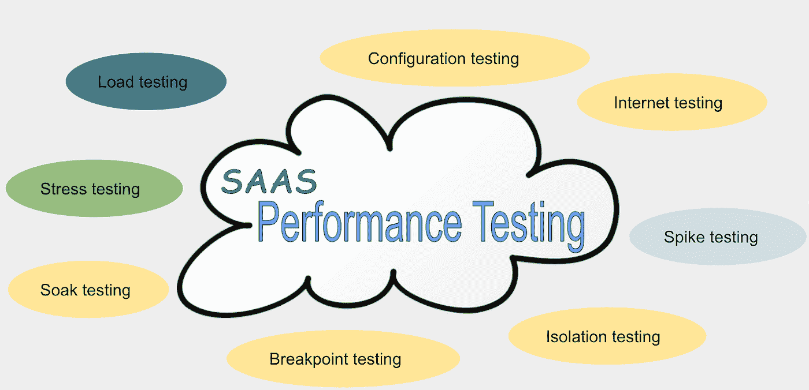
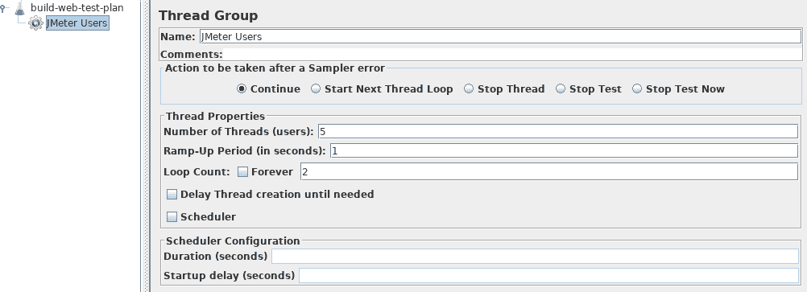
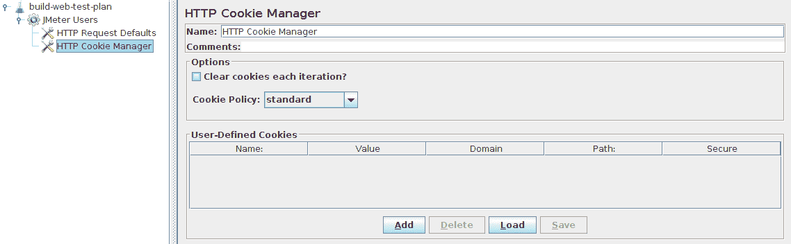
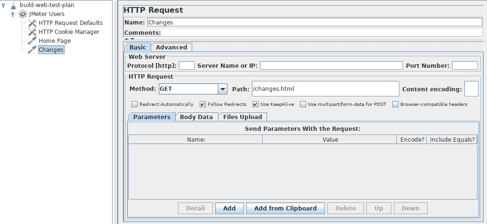
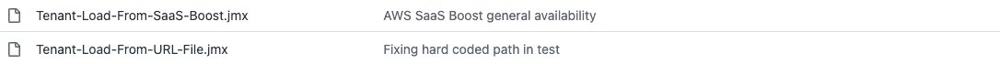
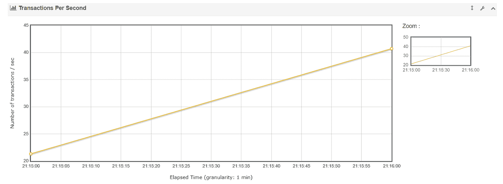

# 为什么 SaaS 产品应该进行全面的性能测试

> 原文：<https://itnext.io/why-saas-products-should-conduct-thorough-performance-testing-9a618e14257a?source=collection_archive---------3----------------------->


[来源](https://unsplash.com/photos/Pnm-9vBEQhk)不溅

软件即服务(SaaS)是三种最广泛存在的云服务模式之一，逐渐将传统软件逐出市场。SaaS 的现收现付商业模式简单明了，适应性强，性价比高，吸引了越来越多的用户。

然而，随着 SaaS 的发展，更多的问题出现了。2020 年 12 月的一次事故是由世界上最受欢迎的 SaaS 服务之一谷歌用户的中断引起的。该事件导致全球许多网站瘫痪，包括 Youtube、Gmail 等。，甚至还撞上了[纽约时报](https://www.nytimes.com/2020/12/14/business/google-down-worldwide.html)。

再来看看除了谷歌用户之外的其他问题。在谷歌宕机前不久，AWS 刚刚经历了由 Kinesis 数据流引起的 24 小时宕机，这也影响了许多用户。​

这些事件，无论大小，都会侵蚀用户的信任，阻止他们全力投资 SaaS。毫无疑问，一个可靠的 SaaS 不仅应该是强大和多功能的，而且应该是稳定和值得信赖的。这就是为什么我们应该在应用 SaaS 之前进行彻底的[性能压力测试](http://www.blazemeter.com/blog/performance-testing-vs-load-testing-vs-stress-testing)。​

根据[维基百科](https://en.wikipedia.org/wiki/Software_performance_testing)，“一般来说，性能测试是一种测试实践，用于确定系统在特定工作负载下的响应能力和稳定性。”



按作者

彻底的性能测试需要八种典型的测试类型，每一种都可以帮助我们检测内部和外部的潜在问题，帮助我们最终构建更强大的软件。

**性能压力测试显示 SaaS 的“上限”。**

负载测试通常用于测试软件的极限，使您能够了解功能或 API 的 TPS/QPS，以及在该极限下的资源使用情况，因此我们可以制定计划，以防止当数量接近极限时系统崩溃。

**性能压力测试提高了 SaaS 的稳定性。**

该软件通常在低压下表现完美，但我们想知道它在高压下的反应。这就是压力测试和浸泡测试的目的。

了解软件在极端条件下的运行状态、运行时间、资源消耗，有助于提高系统稳定性和可靠性，有针对性地减少停机时间和概率。

**性能压力测试确保新功能不会影响现有系统。**

当我们完成功能的迭代时，我们不确定这些功能集成到整体软件后是否会造成负面影响。像“这个设计合理吗？”这样的问题、‘什么是 TPS/QRS？’、“使用了多少 CPU/MEM？”，以及“该功能是否被隔离以避免影响现有功能？”会浮现在脑海里。隔离测试是为了确保添加的新特性不会影响现有系统。

**性能压力测试增加了系统的整体可用性。**

外部因素也会影响软件的工作方式。数据更改、网络中断等。这些都可能是系统崩溃的一个因素。这就是互联网测试和配置测试可以提供帮助的地方，尤其是如果它们是在生产环境和高度相似的金丝雀环境下执行的话。

# 如何进行性能压力测试？

性能测试不应该只是偶尔或一次性地进行。相反，它应该通过自动化测试来完成，并集成到 CI/CD 中。基于各种模块进行性能测试，然后进行监控和警报。​

当然，如何进行性能测试取决于语言。JMeter + Maven 是在 Java 中创建 SaaS 时最常用的性能测试技术。JMeter 是性能测试的优秀工具，当与 Maven(使用最广泛的 Java 打包工具)结合使用时，我们能够将性能测试无缝集成到任何 CI/CD 流程中。


按作者

## JMeter + Maven

JMeter 是一个全功能的压力测试工具，支持在线、点对点、FTP、LDAP、远程和其他测试技术。它可用于所有类型的 SaaS 服务。​

在本文中，我们以最常见的 web API 测试为例。首先，我们需要配置用户(线程)。​



配置 cookies、HTTP 端口、请求类型、参数等。​



在配置完成之后，我们可以将测试计划导出到一个`jmx`文件(XML 格式)中，并将其放在 Maven 项目的资源下。​



接下来，最简单的方法是使用 [Maven JMeter 插件](https://cwiki.apache.org/confluence/display/jmeter/JMeterMavenPlugin)来运行测试。

```
<build>
    <pluginManagement>
        <plugins>
            <plugin>
                <groupId>com.lazerycode.jmeter</groupId>
                <artifactId>jmeter-maven-plugin</artifactId>
                <version>2.8.5</version>
                <executions>
                    <execution>
                        <id>jmeter-tests</id>
                        <goals>
                            <goal>jmeter</goal>
                        </goals>
                    </execution>
                    <execution>
                        <id>jmeter-check-results</id>
                        <goals>
                            <goal>results</goal>
                        </goals>
                    </execution>
                </executions>
            </plugin>
        </plugins>
    </pluginManagement>
</build>
```

然后执行`mvn clean verify`得到测试结果。当然，如果你想要一个特定的 HTML 测试报告，我们可以利用 xml-maven-plugin 来转换它。

最后，我们将在网站上看到具体的统计数据，如 TPS。



如果项目不使用 Maven，我们也可以使用 JMeter CLI 来执行测试，并编写在 CI/CD 期间运行的 shell 脚本。举个例子，

```
jmeter -n -t "Tenant-Load-From-SaaS-Boost.jmx" -JAPI_URL=0123456789.execute-api.us-west-2.amazonaws.com -JSAAS_BOOST_USER=admin -JSAAS_BOOST_PASSWORD=your_password
```

然后，您可以在命令行中获得文本输出。这个例子来自于 aws 提供的 [aws-saas-boost](https://github.com/awslabs/aws-saas-boost) 项目。​

# 结论

性能测试是有效交付 SaaS 的重要组成部分。每次性能测试的执行，以及随后的监控和警报，决定了 SaaS 的稳定性和可靠性，而不考虑功能的数量或实现它所使用的语言。

要准确理解软件的性能指标，对未来做出逻辑规划，性能压力测试也要以生产数据为基础。测试所有影响软件性能的内部和外部组件，并尽可能模拟客户在生产环境中的实际操作。